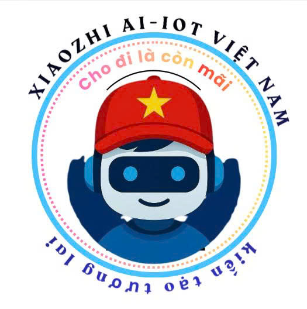
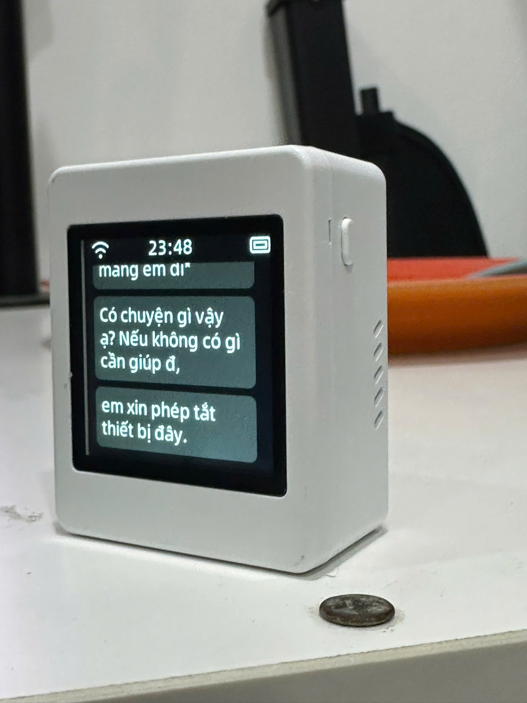
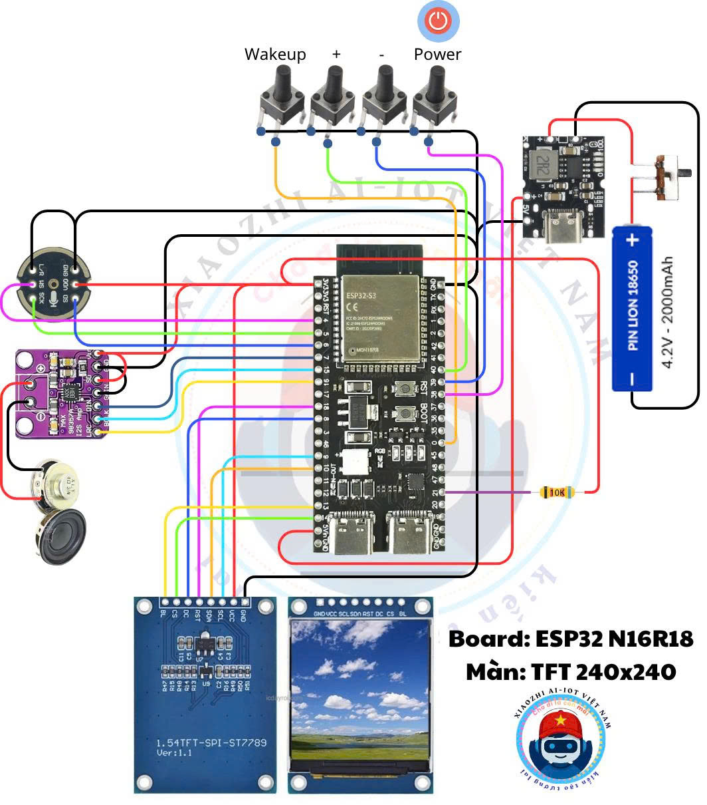
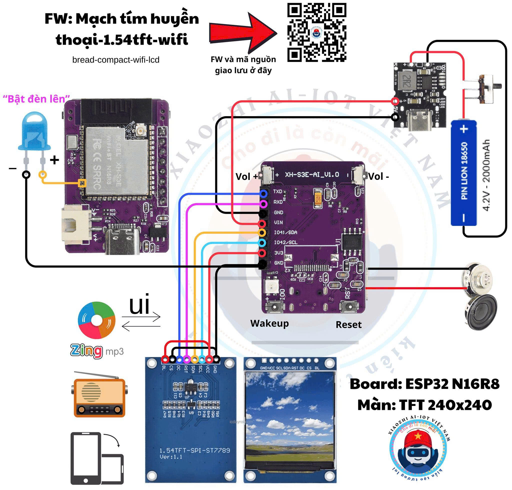
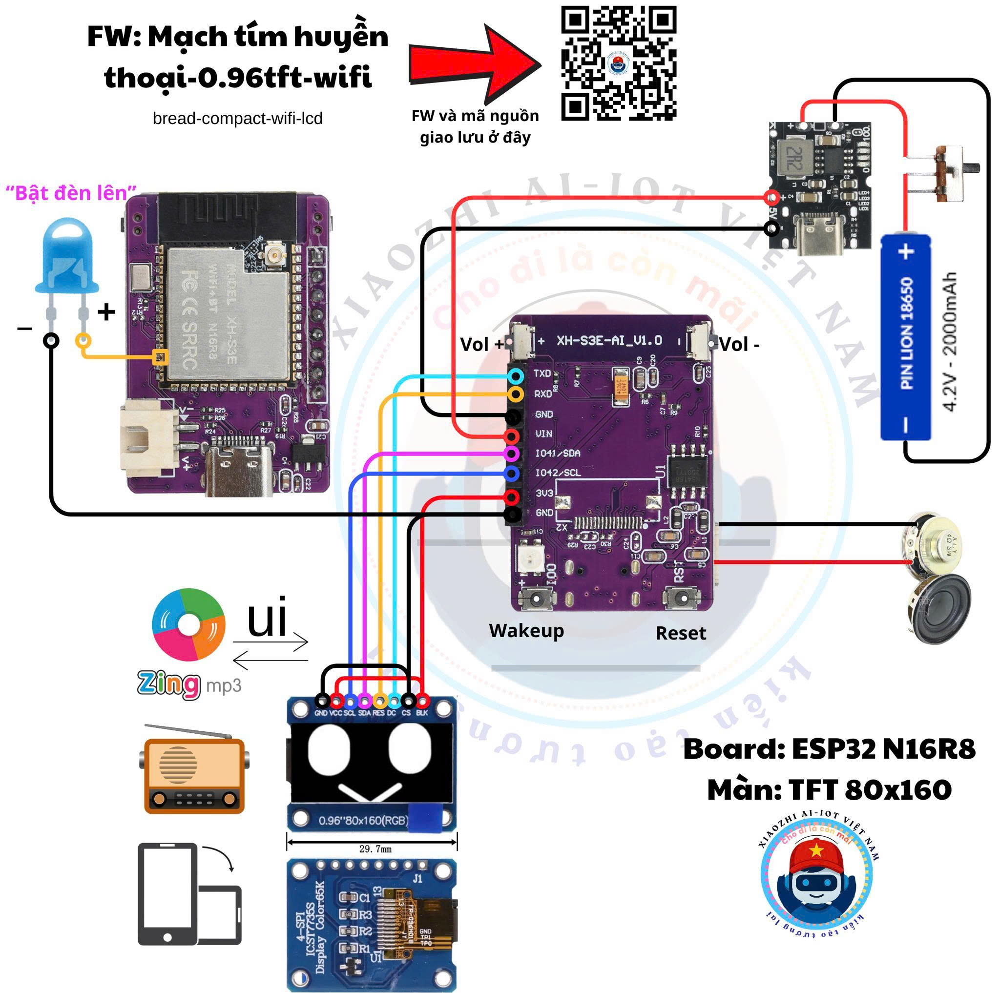
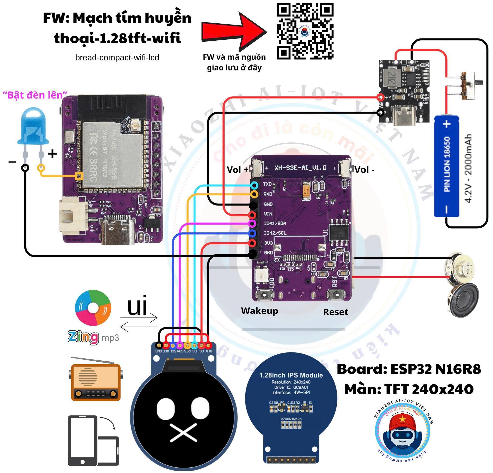

# Xiaozhi ESP32 - Phiên bản Việt Nam

<div style="display: flex; justify-content: space-between;>

**Chatbot AI Giọng Nói Tiếng Việt Trên Nền Tảng ESP32**
  <a href="docs/images/01_avata.jpg" target="_blank" title="Xingzhi Cube 1.54tft Board">
    
  </a>
</div>

---

## 🌐 Cộng Đồng & Hỗ Trợ

Tham gia cộng đồng Xiaozhi AI-IoT Vietnam để nhận hỗ trợ, chia sẻ kinh nghiệm và cập nhật tính năng mới:

| Nền tảng | Link | Mô tả |
|----------|------|-------|
| 📱 **Zalo** | [Tham gia nhóm](https://zalo.me/g/fsyuiz890) | Nhóm hỗ trợ chính thức |
| 📘 **Facebook** | [Tham gia nhóm](https://www.facebook.com/share/1BhraxqFBb/?mibextid=wwXIfr) | Cộng đồng Facebook |
| 🎥 **YouTube** | [Xem hướng dẫn](https://youtu.be/g7Lh-LpxElU) | Video build chi tiết |
| 🔧 **Web Flasher** | [Nạp ROM Online](https://tienhuyiot.github.io/esp_web_flasher/) | Nạp firmware không cần cài đặt |

---

## 📖 Giới Thiệu

**Xiaozhi ESP32 Vietnam** là phiên bản tùy chỉnh của dự án Xiaozhi AI Chatbot, được phát triển đặc biệt cho cộng đồng Việt Nam với nhiều tính năng bổ sung và tối ưu hóa cho thị trường Việt.

Dự án sử dụng chip ESP32 kết hợp với các mô hình AI lớn (Qwen, DeepSeek) để tạo ra một chatbot tương tác bằng giọng nói thông minh, hỗ trợ điều khiển IoT thông qua giao thức MCP.

### 🎯 Dự Án Gốc

Dự án này được fork và phát triển từ [xiaozhi-esp32](https://github.com/78/xiaozhi-esp32) của tác giả Xiage.

---

## ✨ Tính Năng Đã Phát Triển

### 🎵 Giải Trí & Âm Nhạc

#### Nghe Nhạc Việt Nam
- Phát nhạc từ server music với khả năng cấu hình linh hoạt
- **Không cần build lại ROM** khi thay đổi link server music
- Hỗ trợ streaming chất lượng cao

#### Radio Việt Nam & Quốc Tế
- 📻 Radio VOV (Đài Tiếng nói Việt Nam)
- 🌍 Kênh radio tiếng Anh
- Thêm nhiều kênh radio khác

#### Hiển Thị Phổ Nhạc
- 📊 Hiển thị phổ âm thanh trực quan trên màn hình **LCD**
- 📊 Hiển thị phổ âm thanh trên màn hình **OLED**
- Giao diện trực quan, đẹp mắt khi phát nhạc và Radio

### 🔄 Cập Nhật & Triển Khai

#### Hệ Thống OTA
- Cập nhật firmware qua mạng (Over-The-Air)
- Link OTA: [https://ota-server.xiaozhi-ota.workers.dev/ota/](https://ota-server.xiaozhi-ota.workers.dev/ota/)
- Không cần kết nối dây, cập nhật từ xa

#### Nạp ROM Dễ Dàng
- Nạp ROM trực tiếp qua trình duyệt web
- Link Web Flasher: [https://tienhuyiot.github.io/esp_web_flasher/](https://tienhuyiot.github.io/esp_web_flasher/)
- Không cần cài đặt driver hay công cụ phức tạp

### 🤖 Hỗ Trợ Phần Cứng:

#### Xingzhi Cube:
<div style="display: flex; justify-content: space-between;">
  <a href="docs/images/02_Xingzhi_Cube.jpg" target="_blank" title="Xingzhi Cube 1.54tft Board">
    
  </a>
</div>

#### Tự lắp theo sơ đồ kết nối: 
<div style="display: flex; justify-content: space-between;">
  <a href="docs/images/03_diy_01.jpg" target="_blank" title="Sơ đồ kết nối mạch ĐEN">
    
  </a>
  <a href="docs/images/03_diy_02.jpg" target="_blank" title="Sơ đồ kết nối mạch TÍM">
    
  </a>
  <a href="docs/images/03_diy_03.jpg" target="_blank" title="Sơ đồ kết nối mạch TÍM">
    
  </a>
  <a href="docs/images/03_diy_04.jpg" target="_blank" title="Sơ đồ kết nối mạch TÍM">
    
  </a>
</div>

#### Otto Robot Board
- Hỗ trợ new partition để build firmware cho board Otto Robot
- Tích hợp điều khiển động cơ servo
- Phù hợp cho các dự án robot giáo dục

---

## 🚀 Tính Năng Đang Phát Triển

Các tính năng sau đây đang được phát triển tích cực và sẽ được phát hành trong các phiên bản tương lai:

### 🎵 Đa Phương Tiện Nâng Cao

| Tính năng | Mô tả | Trạng thái |
|-----------|-------|------------|
| 💾 **Play music from SD card** | Phát nhạc trực tiếp từ thẻ nhớ SD | 🔨 Đang phát triển |
| 🎬 **Play video from SD** | Phát video từ thẻ nhớ SD trên màn hình LCD | 🔨 Đang phát triển |
| 🔊 **Phát nhạc qua Bluetooth** | Kết nối và phát nhạc qua loa Bluetooth | 🔨 Đang phát triển |

### 💰 Tích Hợp Thanh Toán & Tiện Ích Tin Tức

| Tính năng | Mô tả | Trạng thái |
|-----------|-------|------------|
| 💳 **QR Code Ngân Hàng** | Hiển thị mã QR thanh toán ngân hàng Việt Nam | 📋 Kế hoạch |
| 📈 **Giá Vàng** | Cập nhật giá vàng trong nước theo thời gian thực | 📋 Kế hoạch |
| 📊 **Giá Chứng Khoán** | Hiển thị giá cổ phiếu VN-Index, HNX-Index | 📋 Kế hoạch |
| 📰 **Tin Tức Tài Chính** | Cập nhật tin tức kinh tế Việt Nam | 📋 Kế hoạch |

### 📱 Kết Nối Di Động

| Tính năng | Mô tả | Trạng thái |
|-----------|-------|------------|
| 🍎 **ANCS Bluetooth iPhone** | Kết nối iPhone nhận thông báo chỉ đường, tin nhắn | 🔨 Đang phát triển |
| 📲 **Thông Báo Cuộc Gọi** | Hiển thị thông tin người gọi từ điện thoại | 📋 Kế hoạch |

### ⚙️ Hệ Thống & Cấu Hình

| Tính năng | Mô tả | Trạng thái |
|-----------|-------|------------|
| 🌐 **OTA qua Webserver Nhúng** | Cập nhật firmware qua webserver tích hợp trong chip | 🔨 Đang phát triển |
| 🔧 **Web Server Cấu Hình GPIO** | Giao diện web để cấu hình chân GPIO | 🔨 Đang phát triển |
| 🎚️ **Tăng Mic Gain với UI** | Điều chỉnh độ nhạy microphone qua giao diện | 🔨 Đang phát triển |
| 🔄 **Update V1 lên V2** | Hỗ trợ nâng cấp từ phiên bản V1 lên V2 | 📋 Kế hoạch |
| 🖥️ **Hỗ Trợ Màn Hình Mới** | Build firmware cho các loại màn hình mới | 🔨 Đang phát triển |

### ⏰ Tiện Ích Thông Minh

| Tính năng | Mô tả | Trạng thái |
|-----------|-------|------------|
| ⏰ **Hẹn Giờ Báo Thức** | Thiết lập và quản lý nhiều báo thức | 🔨 Đang phát triển |
| 🎙️ **Chủ Động Wakeup & thông báo** | Tự động kích hoạt và gửi văn bản theo lịch | 📋 Kế hoạch |

### 🏭 Tự Động Hóa Công Nghiệp

| Tính năng | Mô tả | Trạng thái |
|-----------|-------|------------|
| 🏭 **ModBus RTU** | Giao thức ModBus RTU để điều khiển thiết bị công nghiệp | 📋 Kế hoạch |
| 🌐 **ModBus TCP/IP** | Giao thức ModBus TCP/IP qua mạng Ethernet/WiFi | 📋 Kế hoạch |

**Chú thích trạng thái:**
- 🔨 Đang phát triển: Đang được code và test
- 📋 Kế hoạch: Đã lên kế hoạch, chưa bắt đầu phát triển

---

## 🎯 Tính Năng Cốt Lõi (Từ Dự Án Gốc)

### Kết Nối & Mạng
- ✅ Wi-Fi
- ✅ ML307 Cat.1 4G
- ✅ Websocket hoặc MQTT+UDP
- ✅ OPUS audio codec

### AI & Giọng Nói
- ✅ Wake word offline với [ESP-SR](https://github.com/espressif/esp-sr)
- ✅ ASR + LLM + TTS streaming
- ✅ Nhận dạng giọng nói với [3D Speaker](https://github.com/modelscope/3D-Speaker)
- ✅ Đa ngôn ngữ (Tiếng Trung, Tiếng Anh, Tiếng Nhật)

### Hiển Thị & Phần Cứng
- ✅ Màn hình OLED / LCD
- ✅ Hiển thị biểu cảm
- ✅ Quản lý pin
- ✅ ESP32-C3, ESP32-S3, ESP32-P4

### Điều Khiển IoT
- ✅ MCP phía thiết bị (âm lượng, LED, motor, GPIO)
- ✅ MCP đám mây (nhà thông minh, desktop, email)
- ✅ Tùy chỉnh wake word, font, biểu cảm

---

## 🛠️ Bắt Đầu Nhanh

### Cho Người Dùng Cuối

1. **Nạp Firmware Online**
   - Truy cập: [https://tienhuyiot.github.io/esp_web_flasher/](https://tienhuyiot.github.io/esp_web_flasher/)
   - Kết nối ESP32 qua USB
   - Chọn firmware và nhấn Flash

2. **Cấu Hình WiFi**
   - Bật thiết bị
   - Kết nối vào WiFi của ESP32
   - Cấu hình WiFi nhà bạn

3. **Sử Dụng**
   - Nói "Sophia" để đánh thức
   - Bắt đầu trò chuyện

### Cho Nhà Phát Triển

#### Yêu Cầu
- **IDE**: VSCode hoặc Cursor
- **Plugin**: ESP-IDF v5.4+
- **Hệ điều hành**: Linux (khuyến nghị) hoặc Windows
- **Code Style**: Google C++ Style Guide

#### Build Từ Source

```bash
# Clone repository
git clone https://github.com/TienHuyIoT/xiaozhi-esp32_vietnam.git
cd xiaozhi-esp32_vietnam

# Checkout nhánh develop_vn
git checkout develop_vn

# Cài đặt ESP-IDF dependencies
# (Theo hướng dẫn của ESP-IDF)

# Build
idf.py build

# Flash
idf.py -p COM_PORT flash monitor
```

---

## 📚 Tài Liệu

### Tài Liệu Người Dùng
- 🎥 [Video Hướng Dẫn Build](https://youtu.be/g7Lh-LpxElU)
- 📖 [Hướng Dẫn Nạp Firmware](https://ccnphfhqs21z.feishu.cn/wiki/Zpz4wXBtdimBrLk25WdcXzxcnNS)

### Tài Liệu Kỹ Thuật
- [Hướng dẫn bo mạch tùy chỉnh](docs/custom-board.md)
- [Giao thức MCP - Hướng dẫn sử dụng](docs/mcp-usage.md)
- [Giao thức MCP - Quy trình tương tác](docs/mcp-protocol.md)
- [Tài liệu MQTT + UDP](docs/mqtt-udp.md)
- [Tài liệu WebSocket](docs/websocket.md)

---

## 🤝 Đóng Góp

Chúng tôi rất hoan nghênh mọi đóng góp! Vui lòng:

1. Fork repository này
2. Tạo branch mới (`git checkout -b feature/TenTinhNang`)
3. Commit thay đổi (`git commit -m 'Thêm tính năng mới'`)
4. Push lên branch (`git push origin feature/TenTinhNang`)
5. Tạo Pull Request

### Quy Tắc Đóng Góp
- Tuân thủ Google C++ Style Guide
- Viết commit message rõ ràng bằng tiếng Việt hoặc tiếng Anh
- Test kỹ trước khi tạo PR

---

## 📄 Giấy Phép

Dự án này được phát hành dưới giấy phép **MIT License**, kế thừa từ dự án gốc xiaozhi-esp32.

Bạn có thể:
- ✅ Sử dụng miễn phí cho mục đích cá nhân
- ✅ Sử dụng cho mục đích thương mại
- ✅ Chỉnh sửa và phân phối lại

---

## 🙏 Cảm Ơn

### Dự Án Gốc
- [xiaozhi-esp32](https://github.com/78/xiaozhi-esp32) - Dự án gốc bởi Xiage

### Thư Viện & Framework
- [ESP-IDF](https://github.com/espressif/esp-idf) - Espressif IoT Development Framework
- [ESP-SR](https://github.com/espressif/esp-sr) - Speech Recognition Framework
- [3D Speaker](https://github.com/modelscope/3D-Speaker) - Speaker Recognition

### Cộng Đồng
- Cảm ơn tất cả các thành viên trong nhóm Zalo và Facebook
- Cảm ơn những người đã đóng góp code và ý tưởng

---

## 📞 Liên Hệ

- 📱 **Zalo Group**: [https://zalo.me/g/fsyuiz890](https://zalo.me/g/fsyuiz890)
- 📘 **Facebook Group**: [https://www.facebook.com/share/1BhraxqFBb/](https://www.facebook.com/share/1BhraxqFBb/)
- 💻 **GitHub Issues**: [Tạo issue mới](https://github.com/TienHuyIoT/xiaozhi-esp32_vietnam/issues)

---

<div align="center">

**Made with ❤️ by Vietnam AI-IoT Community**

⭐ Nếu project này hữu ích, hãy cho chúng tôi một star nhé! ⭐

</div>