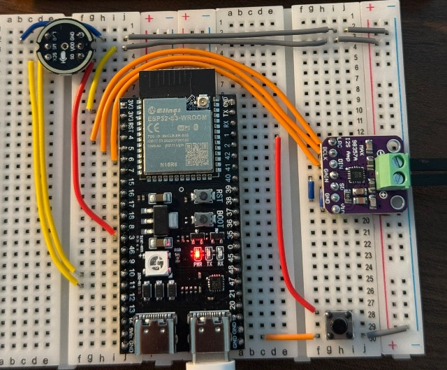

# 小智 AI 聊天机器人

BiliBili 视频介绍 [【ESP32+SenseVoice+Qwen72B打造你的AI聊天伴侣！】](https://www.bilibili.com/video/BV11msTenEH3/?share_source=copy_web&vd_source=ee1aafe19d6e60cf22e60a93881faeba)

学习交流 QQ 群：946599635

## 硬件部分

### DIY 所需硬件

- 开发板：ESP32-S3-DevKitC-1
- 麦克风：INMP441
- 功放：MAX98357
- 喇叭：8Ω 3W
- 400 孔面包板 2 块
- 导线若干


### GPIO 接线指引

以下是默认接线方案，如果你的接线跟默认不一样，请在项目配置中同步修改。



注意，MAX98357 的 GND 和 VIN 接线隐藏在元件下方。INMP441 的 VDD 和 GND 不能接反，否则会烧毁麦克风。

#### MAX98357 功放

```
LRC -> GPIO 4
BCLK -> GPIO 5
DIN -> GPIO 6
GAIN -> GND（如果音量太大，请将 GAIN 接到 3.3V）
SD -> 3.3V
GND -> GND
VIN -> 3.3V 或 5V（如果你的喇叭需要 5V，应该将 VIN 接到 5V）
```

#### INMP441 麦克风

```
L/R -> GND
WS -> GPIO 10
SCK -> GPIO 11
SD -> GPIO 3
VDD -> 3.3V
GND -> GND
```

## 固件部分

### 免开发环境烧录

新手第一次操作建议先不要搭建开发环境，直接使用免开发环境烧录的固件。

点击 [这里](https://github.com/78/xiaozhi-esp32/releases) 下载最新版固件。

固件使用的是作者友情提供的测试服，目前开放免费使用，请勿用于商业用途。

### 搭建开发环境

- Cursor 或 VSCode
- 安装 ESP-IDF 插件，选择 SDK 版本 5.3 或以上
- Ubuntu 比 Windows 更好，编译速度快，也免去驱动问题的困扰

### 配置项目与编译固件

- 目前只支持 ESP32 S3，Flash 至少 8MB, PSRAM 至少 2MB（注意：默认配置只兼容 8MB PSRAM，如果你使用 2MB PSRAM，需要修改配置，否则无法识别）
- 配置 OTA Version URL 为 `https://api.tenclass.net/xiaozhi/ota/`
- 配置 WebSocket URL 为 `wss://api.tenclass.net/xiaozhi/v1/`
- 配置 WebSocket Access Token 为 `test-token`
- 如果 INMP441 和 MAX98357 接线跟默认配置不一样，需要修改 GPIO 配置
- 配置完成后，编译固件


## 配置 Wi-Fi

按照上述接线，烧录固件，设备上电后，开发板上的 RGB 会闪烁蓝灯（部分开发板需要焊接 RGB 灯的开关才会亮），进入配网状态。

打开手机 Wi-Fi，连接上设备热点 `Xiaozhi-xxxx` 后，使用浏览器访问 `http://192.168.4.1`，进入配网页面。

选择你的路由器 WiFi，输入密码，点击连接，设备会在 3 秒后自动重启，之后设备会自动连接到路由器。

## 测试设备是否连接成功

设备连接上路由器后，闪烁一下绿灯。此时，喊一声“你好，小智”，设备会先亮蓝灯（表示连接服务器），然后再亮绿灯，播放语音。

如果没有亮蓝灯，说明麦克风有问题，请检查接线是否正确。

如果没有亮绿灯，或者蓝灯常亮，说明设备没有连接到服务器，请检查 WiFi 连接是否正常。

如果设备已经连接 Wi-Fi，但是没有声音，请检查是否接线正确。

在 v0.2.1 版本之后的固件，也可以按下连接 GPIO 1 的按钮（低电平有效），进行录音测试。

## 配置设备

如果上述步骤测试成功，设备会播报你的设备 ID，你需要到 [小智测试服的控制面板](https://xiaozhi.tenclass.net/) 页面，添加设备。

详细的使用说明以及测试服的注意事项，请参考 [小智测试服的帮助说明](https://xiaozhi.tenclass.net/help)。


