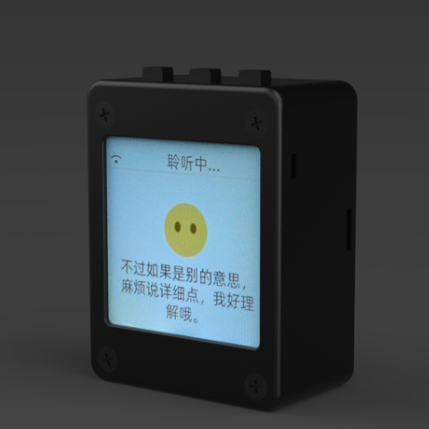
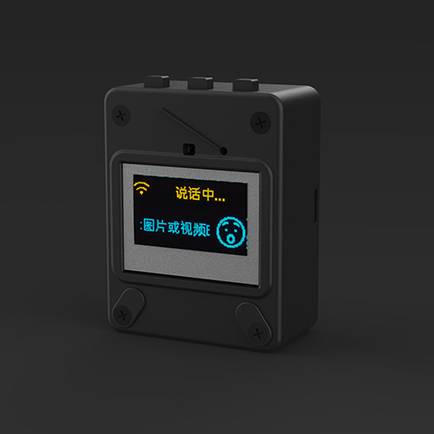

# 小智 AI 聊天机器人 （XiaoZhi AI Chatbot）

（中文 | [English](README_en.md) | [日本語](README_ja.md)）

这是虾哥的第一个硬件作品。

👉 [ESP32+SenseVoice+Qwen72B打造你的AI聊天伴侣！【bilibili】](https://www.bilibili.com/video/BV11msTenEH3/)

👉 [给小智装上 DeepSeek 的聪明大脑【bilibili】](https://www.bilibili.com/video/BV1GQP6eNEFG/)

👉 [手工打造你的 AI 女友，新手入门教程【bilibili】](https://www.bilibili.com/video/BV1XnmFYLEJN/)

## 项目目的

本项目是一个开源项目，以 MIT 许可证发布，允许任何人免费使用，并可以用于商业用途。

我们希望通过这个项目，能够帮助更多人入门 AI 硬件开发，了解如何将当下飞速发展的大语言模型应用到实际的硬件设备中。无论你是对 AI 感兴趣的学生，还是想要探索新技术的开发者，都可以通过这个项目获得宝贵的学习经验。

欢迎所有人参与到项目的开发和改进中来。如果你有任何想法或建议，请随时提出 Issue 或加入群聊。

学习交流 QQ 群：376893254

## 已实现功能

- Wi-Fi / ML307 Cat.1 4G
- BOOT 键唤醒和打断，支持点击和长按两种触发方式
- 离线语音唤醒 [ESP-SR](https://github.com/espressif/esp-sr)
- 流式语音对话（WebSocket 或 UDP 协议）
- 支持国语、粤语、英语、日语、韩语 5 种语言识别 [SenseVoice](https://github.com/FunAudioLLM/SenseVoice)
- 声纹识别，识别是谁在喊 AI 的名字 [3D Speaker](https://github.com/modelscope/3D-Speaker)
- 大模型 TTS（火山引擎 或 CosyVoice）
- 大模型 LLM（Qwen, DeepSeek, Doubao）
- 可配置的提示词和音色（自定义角色）
- 短期记忆，每轮对话后自我总结
- OLED / LCD 显示屏，显示信号强弱或对话内容
- 支持 LCD 显示图片表情
- 支持多语言（中文、英文）

## 硬件部分

### 面包板手工制作实践

详见飞书文档教程：

👉 [《小智 AI 聊天机器人百科全书》](https://ccnphfhqs21z.feishu.cn/wiki/F5krwD16viZoF0kKkvDcrZNYnhb?from=from_copylink)

面包板效果图如下：

### 已支持的开源硬件

- <a href="https://oshwhub.com/li-chuang-kai-fa-ban/li-chuang-shi-zhan-pai-esp32-s3-kai-fa-ban" target="_blank" title="立创·实战派 ESP32-S3 开发板">立创·实战派 ESP32-S3 开发板</a>
- <a href="https://github.com/espressif/esp-box" target="_blank" title="乐鑫 ESP32-S3-BOX3">乐鑫 ESP32-S3-BOX3</a>
- <a href="https://docs.m5stack.com/zh_CN/core/CoreS3" target="_blank" title="M5Stack CoreS3">M5Stack CoreS3</a>
- <a href="https://docs.m5stack.com/en/atom/Atomic%20Echo%20Base" target="_blank" title="AtomS3R + Echo Base">AtomS3R + Echo Base</a>
- <a href="https://docs.m5stack.com/en/core/ATOM%20Matrix" target="_blank" title="AtomMatrix + Echo Base">AtomMatrix + Echo Base</a>
- <a href="https://gf.bilibili.com/item/detail/1108782064" target="_blank" title="神奇按钮 2.4">神奇按钮 2.4</a>
- <a href="https://www.waveshare.net/shop/ESP32-S3-Touch-AMOLED-1.8.htm" target="_blank" title="微雪电子 ESP32-S3-Touch-AMOLED-1.8">微雪电子 ESP32-S3-Touch-AMOLED-1.8</a>
- <a href="https://github.com/Xinyuan-LilyGO/T-Circle-S3" target="_blank" title="LILYGO T-Circle-S3">LILYGO T-Circle-S3</a>
- <a href="https://oshwhub.com/tenclass01/xmini_c3" target="_blank" title="虾哥 Mini C3">虾哥 Mini C3</a>
- <a href="https://oshwhub.com/movecall/moji-xiaozhi-ai-derivative-editi" target="_blank" title="Movecall Moji ESP32S3">Moji 小智AI衍生版</a>
- <a href="https://oshwhub.com/movecall/cuican-ai-pendant-lights-up-y" target="_blank" title="Movecall CuiCan ESP32S3">璀璨·AI吊坠</a>
- <a href="https://github.com/WMnologo/xingzhi-ai" target="_blank" title="无名科技Nologo-星智-1.54">无名科技Nologo-星智-1.54TFT</a>
- <a href="https://github.com/WMnologo/xingzhi-ai" target="_blank" title="无名科技Nologo-星智-0.96">无名科技Nologo-星智-0.96TFT</a>
- <a href="https://www.seeedstudio.com/SenseCAP-Watcher-W1-A-p-5979.html" target="_blank" title="SenseCAP Watcher">SenseCAP Watcher</a>

  
  
  
  
  
  
  
  
  
  
  
  
  

## 固件部分

### 免开发环境烧录

新手第一次操作建议先不要搭建开发环境，直接使用免开发环境烧录的固件。

固件默认接入 [xiaozhi.me](https://xiaozhi.me) 官方服务器，目前个人用户注册账号可以免费使用 Qwen 实时模型。

👉 [Flash烧录固件（无IDF开发环境）](https://ccnphfhqs21z.feishu.cn/wiki/Zpz4wXBtdimBrLk25WdcXzxcnNS) 

### 开发环境

- Cursor 或 VSCode
- 安装 ESP-IDF 插件，选择 SDK 版本 5.3 或以上
- Linux 比 Windows 更好，编译速度快，也免去驱动问题的困扰
- 使用 Google C++ 代码风格，提交代码时请确保符合规范

## 智能体配置

如果你已经拥有一个小智 AI 聊天机器人设备，可以登录 [xiaozhi.me](https://xiaozhi.me) 控制台进行配置。

👉 [后台操作视频教程（旧版界面）](https://www.bilibili.com/video/BV1jUCUY2EKM/)

## 技术原理与私有化部署

👉 [一份详细的 WebSocket 通信协议文档](docs/websocket.md)

在个人电脑上部署服务器，可以参考另一位作者同样以 MIT 许可证开源的项目 [xiaozhi-esp32-server](https://github.com/xinnan-tech/xiaozhi-esp32-server)

## Star History

<a href="https://star-history.com/#78/xiaozhi-esp32&Date">
 <picture>
   <source media="(prefers-color-scheme: dark)" srcset="https://api.star-history.com/svg?repos=78/xiaozhi-esp32&type=Date&theme=dark" />
   <source media="(prefers-color-scheme: light)" srcset="https://api.star-history.com/svg?repos=78/xiaozhi-esp32&type=Date" />
   
 </picture>
</a>
