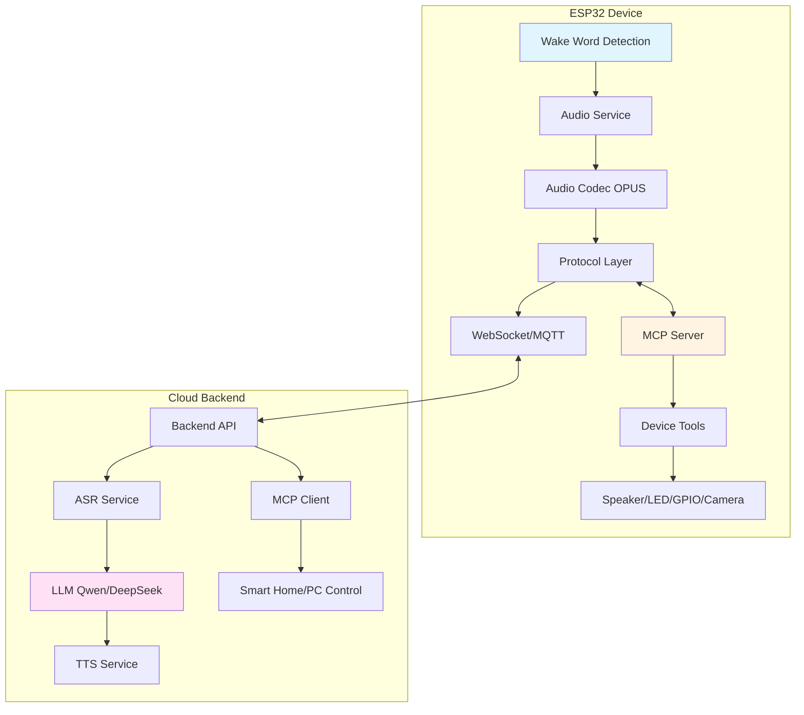

# XiaoZhi ESP32 - MCP-based AI Voice Assistant

[](https://opensource.org/licenses/MIT)
[](https://github.com/espressif/esp-idf)
[](https://www.espressif.com/en/products/socs)

[English](#) | [中文](README_zh.md) | [日本語](README_ja.md)

## 📖 Overview

XiaoZhi ESP32 is an advanced, open-source AI voice assistant firmware for ESP32 microcontrollers. It leverages the **Model Context Protocol (MCP)** to enable seamless integration with large language models (LLMs) like Qwen and DeepSeek, providing intelligent voice interaction capabilities with multi-device control.

The project implements a complete voice interaction pipeline featuring:
- **Offline wake word detection** using ESP-SR
- **Streaming ASR (Automatic Speech Recognition)**
- **LLM-powered conversation** via MCP protocol
- **Real-time TTS (Text-to-Speech)** with OPUS audio codec
- **Multi-device control** through MCP tools (IoT devices, smart home, PC automation)

### 🎯 Key Features

- **Voice Interaction**
  - Offline wake word detection with customizable wake words
  - Streaming audio processing with OPUS codec
  - Voice Activity Detection (VAD)
  - Speaker recognition (identifies different users)
  - Multi-language support (Chinese, English, Japanese)

- **MCP Protocol Integration**
  - Device-side MCP server for hardware control (Speaker, LED, Servo, GPIO, Camera)
  - Cloud-side MCP client for extended AI capabilities
  - JSON-RPC 2.0 based communication
  - Dynamic tool discovery and invocation

- **Connectivity**
  - Wi-Fi support
  - 4G LTE support via ML307 Cat.1 module
  - Dual protocol support: WebSocket or MQTT+UDP
  - OTA (Over-The-Air) firmware updates

- **Display & UI**
  - OLED/LCD display support
  - Emoji and custom font rendering
  - Battery status display
  - Power management

- **Hardware Support**
  - **93+ supported development boards** (ESP32-C3, ESP32-S3, ESP32-P4, ESP32-C5, ESP32-C6)
  - Breadboard-friendly DIY designs
  - Commercial boards (M5Stack, LilyGo, Waveshare, ESP-BOX, etc.)

## 🏗️ Architecture



### Component Overview

| Component | Description |
|-----------|-------------|
| **Application** | Main event loop, state machine, device lifecycle management |
| **Audio Service** | Wake word detection, VAD, audio capture/playback, codec management |
| **MCP Server** | Device-side MCP protocol implementation, tool registration and execution |
| **Protocol Layer** | WebSocket/MQTT communication, session management, audio streaming |
| **Display** | LVGL-based UI rendering, emoji support, status display |
| **Board Support** | Hardware abstraction layer for 93+ boards |

## 🛠️ Hardware Requirements

### Minimum Requirements

- **MCU**: ESP32-S3 / ESP32-C3 / ESP32-P4 / ESP32-C5 / ESP32-C6
- **Flash**: 16MB recommended (8MB minimum)
- **PSRAM**: 8MB (for ESP32-S3/P4)
- **Microphone**: I2S/ADC compatible
- **Speaker**: I2S DAC or PWM

### Recommended Development Boards

- [LiChuang ESP32-S3 Development Board](https://oshwhub.com/li-chuang-kai-fa-ban/li-chuang-shi-zhan-pai-esp32-s3-kai-fa-ban)
- [Espressif ESP32-S3-BOX3](https://github.com/espressif/esp-box)
- [M5Stack CoreS3](https://docs.m5stack.com/zh_CN/core/CoreS3)
- [M5Stack AtomS3R + Echo Base](https://docs.m5stack.com/en/atom/Atomic%20Echo%20Base)
- [Waveshare ESP32-S3-Touch-AMOLED-1.8](https://www.waveshare.net/shop/ESP32-S3-Touch-AMOLED-1.8.htm)
- [LILYGO T-Circle-S3](https://github.com/Xinyuan-LilyGO/T-Circle-S3)
- [SenseCAP Watcher](https://www.seeedstudio.com/SenseCAP-Watcher-W1-A-p-5979.html)

See the [full hardware list](https://ccnphfhqs21z.feishu.cn/wiki/F5krwD16viZoF0kKkvDcrZNYnhb) for all 93+ supported boards.

## 🚀 Getting Started

### Prerequisites

- **ESP-IDF**: Version 5.5.2 or higher
- **IDE**: Visual Studio Code or Cursor with ESP-IDF extension
- **Python**: 3.8+ (for build scripts)
- **Operating System**: Linux (recommended) or Windows

### Quick Start (Beginners)

For users without development experience, use pre-built firmware:

1. **Download Firmware**: Get the latest release from [GitHub Releases](https://github.com/78/xiaozhi-esp32/releases)
2. **Flash Tool**: Use [ESP Flash Download Tool](https://www.espressif.com/en/support/download/other-tools)
3. **Follow Guide**: [Beginner's Firmware Flashing Guide](https://ccnphfhqs21z.feishu.cn/wiki/Zpz4wXBtdimBrLk25WdcXzxcnNS)
4. **Register Account**: Create account at [xiaozhi.me](https://xiaozhi.me) for free Qwen API access

### Development Setup

#### 1. Clone Repository

```bash
git clone https://github.com/78/xiaozhi-esp32.git
cd xiaozhi-esp32
```

#### 2. Install ESP-IDF

```bash
# Install ESP-IDF 5.5.2 or higher
# Follow official guide: https://docs.espressif.com/projects/esp-idf/en/latest/esp32/get-started/
```

#### 3. Configure Project

```bash
# Set target chip (example: ESP32-S3)
idf.py set-target esp32s3

# Configure board and features
idf.py menuconfig
# Navigate to: Component config → XiaoZhi Configuration
```

#### 4. Build and Flash

```bash
# Build firmware
idf.py build

# Flash to device
idf.py -p COM3 flash monitor  # Windows
idf.py -p /dev/ttyUSB0 flash monitor  # Linux
```

### Configuration

#### Board Selection

The project uses Kconfig for board selection:

```bash
idf.py menuconfig
# → Component config → Board Configuration → Select your board
```

#### Network Configuration

**Wi-Fi**: Configure via web portal (device creates AP on first boot)

**4G LTE**: Requires ML307 module, auto-configured for supported boards

#### Server Configuration

**Official Server** (default): Connects to xiaozhi.me
- Free Qwen real-time model access
- Web-based configuration console
- OTA updates

**Self-hosted Server**: See [Related Projects](#-related-projects) for server implementations

## 📚 Documentation

### Developer Guides

- [Custom Board Guide](docs/custom-board.md) - Create custom hardware configurations
- [MCP Protocol Documentation](docs/mcp-protocol.md) - Device-side MCP implementation details
- [MCP Usage Guide](docs/mcp-usage.md) - Control IoT devices via MCP
- [WebSocket Protocol](docs/websocket.md) - WebSocket communication specification
- [MQTT+UDP Protocol](docs/mqtt-udp.md) - Hybrid protocol documentation
- [BluFi Configuration](docs/blufi.md) - Bluetooth provisioning
- [Code Style Guide](docs/code_style.md) - Google C++ style guidelines

### Video Tutorials

- [XiaoZhi AI Chatbot Encyclopedia (Feishu)](https://ccnphfhqs21z.feishu.cn/wiki/F5krwD16viZoF0kKkvDcrZNYnhb)
- [AI with Camera Demo (Bilibili)](https://www.bilibili.com/video/BV1bpjgzKEhd/)
- [Beginner's Guide (Bilibili)](https://www.bilibili.com/video/BV1XnmFYLEJN/)
- [Backend Configuration Tutorial (Bilibili)](https://www.bilibili.com/video/BV1jUCUY2EKM/)

## 🔧 MCP Protocol

The Model Context Protocol enables the ESP32 device to act as an MCP server, exposing hardware capabilities as "tools" that can be discovered and invoked by LLMs.

### MCP Tools Example

```cpp
// Device exposes tools like:
- self.audio_speaker.set_volume(volume: int)
- self.led.set_color(r: int, g: int, b: int)
- self.camera.capture_image()
- self.gpio.set_pin(pin: int, value: bool)
```

### Communication Flow

1. **Device Hello**: ESP32 announces MCP support
2. **Initialize**: Backend sends capabilities (vision API, etc.)
3. **Tool Discovery**: Backend requests tool list via `tools/list`
4. **Tool Invocation**: Backend calls tools via `tools/call`
5. **Response**: Device executes and returns results

See [MCP Protocol Documentation](docs/mcp-protocol.md) for detailed specifications.

## 🎨 Customization

### Custom Assets

Use the [Custom Assets Generator](https://github.com/78/xiaozhi-assets-generator) to customize:
- Wake words
- Fonts
- Emojis
- Chat backgrounds

### Adding Custom Boards

1. Create board directory: `main/boards/your-board/`
2. Define hardware configuration (audio, display, buttons)
3. Register in Kconfig
4. See [Custom Board Guide](docs/custom-board.md)

## 📦 Project Structure

```
xiaozhi-esp32/
├── main/
│   ├── application.cc          # Main application logic
│   ├── mcp_server.cc           # MCP protocol server
│   ├── audio/                  # Audio service, codecs, wake words
│   ├── display/                # LVGL UI, emoji rendering
│   ├── protocols/              # WebSocket, MQTT implementations
│   ├── boards/                 # 93+ board configurations
│   ├── led/                    # LED control
│   └── assets/                 # Fonts, images, sounds
├── docs/                       # Documentation
├── partitions/                 # Partition tables (v1, v2)
├── scripts/                    # Build tools, converters
└── CMakeLists.txt              # Build configuration
```

## 🔄 Version Information

**Current Version**: v2.2.2

### Version 2.x Changes

- New partition table (incompatible with v1)
- Enhanced MCP protocol support
- Improved audio processing
- 93+ board support
- LVGL 9.2.2 integration

**Upgrading from v1**: Manual flash required (OTA not supported v1→v2)

**v1 Maintenance**: Version 1.9.2 maintained until February 2026
```bash
git checkout v1  # Switch to v1 branch
```

## 🌐 Related Projects

### Server Implementations

- [xinnan-tech/xiaozhi-esp32-server](https://github.com/xinnan-tech/xiaozhi-esp32-server) - Python server
- [joey-zhou/xiaozhi-esp32-server-java](https://github.com/joey-zhou/xiaozhi-esp32-server-java) - Java server
- [AnimeAIChat/xiaozhi-server-go](https://github.com/AnimeAIChat/xiaozhi-server-go) - Go server
- [hackers365/xiaozhi-esp32-server-golang](https://github.com/hackers365/xiaozhi-esp32-server-golang) - Go server

### Alternative Clients

- [huangjunsen0406/py-xiaozhi](https://github.com/huangjunsen0406/py-xiaozhi) - Python client
- [TOM88812/xiaozhi-android-client](https://github.com/TOM88812/xiaozhi-android-client) - Android client
- [100askTeam/xiaozhi-linux](http://github.com/100askTeam/xiaozhi-linux) - Linux client
- [78/xiaozhi-sf32](https://github.com/78/xiaozhi-sf32) - Bluetooth chip firmware
- [QuecPython/solution-xiaozhiAI](https://github.com/QuecPython/solution-xiaozhiAI) - QuecPython firmware

### Tools

- [78/xiaozhi-assets-generator](https://github.com/78/xiaozhi-assets-generator) - Custom assets generator

## 🤝 Contributing

Contributions are welcome! Please follow these guidelines:

1. **Code Style**: Follow Google C++ style (enforced by `.clang-format`)
2. **Testing**: Test on actual hardware before submitting
3. **Documentation**: Update docs for new features
4. **Pull Requests**: Provide clear descriptions and test results

## 📄 License

This project is licensed under the **MIT License** - see the [LICENSE](LICENSE) file for details.

Copyright (c) 2025 Shenzhen Xinzhi Future Technology Co., Ltd.

## 💬 Community & Support

- **Discord**: [Join our Discord](https://discord.gg/bXqgAfRm)
- **QQ Group**: 994694848
- **Issues**: [GitHub Issues](https://github.com/78/xiaozhi-esp32/issues)
- **Documentation**: [Feishu Wiki](https://ccnphfhqs21z.feishu.cn/wiki/F5krwD16viZoF0kKkvDcrZNYnhb)

## 🌟 Star History

[](https://star-history.com/#78/xiaozhi-esp32&Date)

## 🙏 Acknowledgments

- Espressif Systems for ESP-IDF and hardware
- LVGL for UI framework
- All contributors and community members
- Open-source projects that made this possible

---

**Made with ❤️ by the XiaoZhi community**
