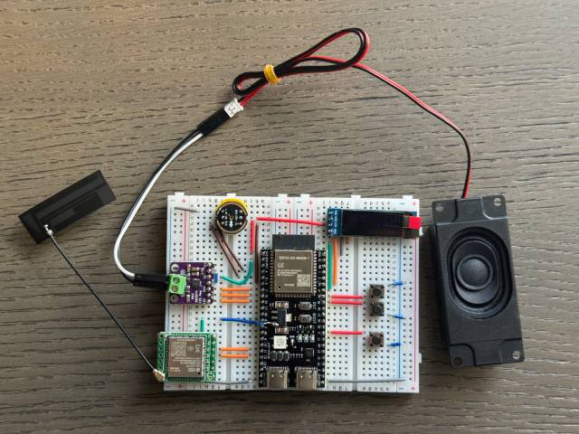
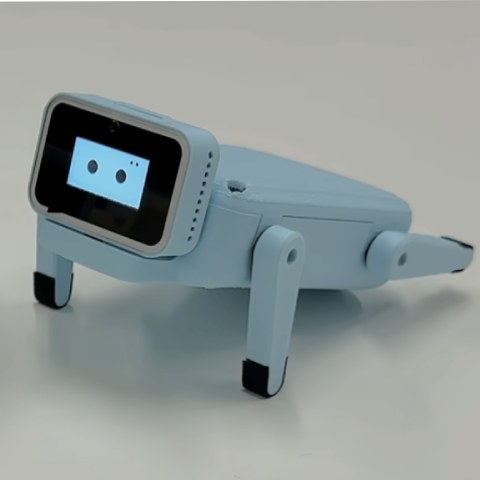

# An MCP-based Chatbot

(English | [中文](README_zh.md) | [日本語](README_ja.md))

## Introduction

👉 [Human: Give AI a camera vs AI: Instantly finds out the owner hasn't washed hair for three days【bilibili】](https://www.bilibili.com/video/BV1bpjgzKEhd/)

👉 [Handcraft your AI girlfriend, beginner's guide【bilibili】](https://www.bilibili.com/video/BV1XnmFYLEJN/)

As a voice interaction entry, the XiaoZhi AI chatbot leverages the AI capabilities of large models like Qwen / DeepSeek, and achieves multi-terminal control via the MCP protocol.

## Recent Updates

- The mainline now targets ESP-IDF v6.0 or later, with v6.0.2 as the preferred stable SDK. The complete 157-variant release matrix has been validated on ESP-IDF v6.0.1.
- MQTT and BluFi cryptographic code has migrated to PSA Crypto. IDF 6 component splits and third-party dependency compatibility have also been addressed.
- Audio pipeline concurrency, MQTT/UDP packet validation, and release-matrix selection have been hardened.
- ESP-IDF v5.5 is retained only for legacy hardware paths, including pre-v3 ESP32-P4 silicon. See the [ESP-IDF 6.0 Migration Guide](docs/esp-idf-6-migration.md) for full compatibility and board-validation details.

### Features Implemented

- Wi-Fi, wired Ethernet, USB RNDIS, and ML307/EC801E or NT26 Cat.1 4G networking; supported boards can switch between Wi-Fi and 4G
- Offline voice wake-up with [ESP-SR](https://github.com/espressif/esp-sr), including customizable wake words
- Two communication transports: [WebSocket](docs/websocket.md) and [MQTT + UDP](docs/mqtt-udp.md)
- Opus audio streaming with conventional streaming ASR + LLM + TTS pipelines and Realtime end-to-end voice models; AEC-capable hardware supports realtime full-duplex interaction
- Speaker recognition, identifies the current speaker [3D Speaker](https://github.com/modelscope/3D-Speaker)
- OLED / LCD displays with emoji and rich expression support, plus camera vision input on supported boards
- Battery display and power management
- 38 interface languages, with localized voice prompts where available and English fallback
- ESP32, ESP32-C3, ESP32-C5, ESP32-C6, ESP32-S3, and ESP32-P4 chip platforms
- Wi-Fi provisioning through hotspot, acoustic signaling, or BluFi
- Device-side MCP for device control (Speaker, LED, Servo, GPIO, etc.)
- Cloud-side MCP to extend large model capabilities (smart home control, PC desktop operation, knowledge search, email, etc.)
- Customizable wake words, fonts, emojis, and chat backgrounds with online web-based editing ([Custom Assets Generator](https://github.com/78/xiaozhi-assets-generator))

## Hardware

### Breadboard DIY Practice

See the Feishu document tutorial:

👉 ["XiaoZhi AI Chatbot Encyclopedia"](https://ccnphfhqs21z.feishu.cn/wiki/F5krwD16viZoF0kKkvDcrZNYnhb?from=from_copylink)

Breadboard demo:

### Supports 137 Board Directories and 157 Release Variants (Partial List)

- <a href="https://oshwhub.com/li-chuang-kai-fa-ban/li-chuang-shi-zhan-pai-esp32-s3-kai-fa-ban" target="_blank" title="LiChuang ESP32-S3 Development Board">LiChuang ESP32-S3 Development Board</a>
- <a href="https://github.com/espressif/esp-box" target="_blank" title="Espressif ESP32-S3-BOX3">Espressif ESP32-S3-BOX3</a>
- <a href="https://docs.m5stack.com/zh_CN/core/CoreS3" target="_blank" title="M5Stack CoreS3">M5Stack CoreS3</a>
- <a href="https://docs.m5stack.com/en/atom/Atomic%20Echo%20Base" target="_blank" title="AtomS3R + Echo Base">M5Stack AtomS3R + Echo Base</a>
- <a href="https://gf.bilibili.com/item/detail/1108782064" target="_blank" title="Magic Button 2.4">Magic Button 2.4</a>
- <a href="https://www.waveshare.net/shop/ESP32-S3-Touch-AMOLED-1.8.htm" target="_blank" title="Waveshare ESP32-S3-Touch-AMOLED-1.8">Waveshare ESP32-S3-Touch-AMOLED-1.8</a>
- <a href="https://github.com/Xinyuan-LilyGO/T-Circle-S3" target="_blank" title="LILYGO T-Circle-S3">LILYGO T-Circle-S3</a>
- <a href="https://oshwhub.com/tenclass01/xmini_c3" target="_blank" title="XiaGe Mini C3">XiaGe Mini C3</a>
- <a href="https://oshwhub.com/movecall/cuican-ai-pendant-lights-up-y" target="_blank" title="Movecall CuiCan ESP32S3">CuiCan AI Pendant</a>
- <a href="https://github.com/WMnologo/xingzhi-ai" target="_blank" title="WMnologo-Xingzhi-1.54">WMnologo-Xingzhi-1.54TFT</a>
- <a href="https://www.seeedstudio.com/SenseCAP-Watcher-W1-A-p-5979.html" target="_blank" title="SenseCAP Watcher">SenseCAP Watcher</a>
- <a href="https://www.bilibili.com/video/BV1BHJtz6E2S/" target="_blank" title="ESP-HI Low Cost Robot Dog">ESP-HI Low Cost Robot Dog</a>

  
  
  
  
  
  
  
  
  
  
  
  

## Software

### Firmware Flashing

For beginners, it is recommended to use the firmware that can be flashed without setting up a development environment.

The firmware connects to the official [xiaozhi.me](https://xiaozhi.me) server by default. Personal users can register an account to use the Qwen real-time model for free.

👉 [Beginner's Firmware Flashing Guide](https://ccnphfhqs21z.feishu.cn/wiki/Zpz4wXBtdimBrLk25WdcXzxcnNS)

### Development Environment

- Cursor or VSCode
- Install the ESP-IDF plugin. [ESP-IDF v6.0.2](https://github.com/espressif/esp-idf/releases/tag/v6.0.2) is preferred; use a stable v6.0 or later release. ESP-IDF v5.5.2 is retained only for legacy board compatibility
- Linux is better than Windows for faster compilation and fewer driver issues
- This project uses Google C++ code style, please ensure compliance when submitting code

### Developer Documentation

- [ESP-IDF 6.0 Migration Guide](docs/esp-idf-6-migration.md) - SDK compatibility, component changes, legacy hardware support, and board validation status
- [Custom Board Guide](docs/custom-board.md) - Learn how to create custom boards for XiaoZhi AI
- [MCP Protocol IoT Control Usage](docs/mcp-usage.md) - Learn how to control IoT devices via MCP protocol
- [MCP Protocol Interaction Flow](docs/mcp-protocol.md) - Device-side MCP protocol implementation
- [MQTT + UDP Hybrid Communication Protocol Document](docs/mqtt-udp.md)
- [A detailed WebSocket communication protocol document](docs/websocket.md)

## Large Model Configuration

If you already have a XiaoZhi AI chatbot device and have connected to the official server, you can log in to the [xiaozhi.me](https://xiaozhi.me) console for configuration.

👉 [Backend Operation Video Tutorial (Old Interface)](https://www.bilibili.com/video/BV1jUCUY2EKM/)

## Related Open Source Projects

For server deployment on personal computers, refer to the following open-source projects:

- [xinnan-tech/xiaozhi-esp32-server](https://github.com/xinnan-tech/xiaozhi-esp32-server) Python server
- [joey-zhou/xiaozhi-esp32-server-java](https://github.com/joey-zhou/xiaozhi-esp32-server-java) Java server
- [AnimeAIChat/xiaozhi-server-go](https://github.com/AnimeAIChat/xiaozhi-server-go) Golang server
- [hackers365/xiaozhi-esp32-server-golang](https://github.com/hackers365/xiaozhi-esp32-server-golang) Golang server

Other client projects using the XiaoZhi communication protocol:

- [huangjunsen0406/py-xiaozhi](https://github.com/huangjunsen0406/py-xiaozhi) Python client
- [TOM88812/xiaozhi-android-client](https://github.com/TOM88812/xiaozhi-android-client) Android client
- [100askTeam/xiaozhi-linux](http://github.com/100askTeam/xiaozhi-linux) Linux client by 100ask
- [78/xiaozhi-sf32](https://github.com/78/xiaozhi-sf32) Bluetooth chip firmware by Sichuan
- [QuecPython/solution-xiaozhiAI](https://github.com/QuecPython/solution-xiaozhiAI) QuecPython firmware by Quectel

Custom Assets Tools:

- [78/xiaozhi-assets-generator](https://github.com/78/xiaozhi-assets-generator) Custom Assets Generator (Wake words, fonts, emojis, backgrounds)

## About the Project

This is an open-source ESP32 project, released under the MIT license, allowing anyone to use it for free, including for commercial purposes.

We hope this project helps everyone understand AI hardware development and apply rapidly evolving large language models to real hardware devices.

If you have any ideas or suggestions, please feel free to raise Issues or join our [Discord](https://discord.gg/C759fGMBcZ) or QQ group: 1095994019

## Star History

<a href="https://star-history.com/#78/xiaozhi-esp32&Date">
 <picture>
   <source media="(prefers-color-scheme: dark)" srcset="https://api.star-history.com/svg?repos=78/xiaozhi-esp32&type=Date&theme=dark" />
   <source media="(prefers-color-scheme: light)" srcset="https://api.star-history.com/svg?repos=78/xiaozhi-esp32&type=Date" />
   
 </picture>
</a>
