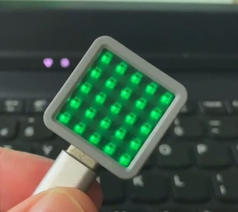

# XiaoZhi AI Chatbot

([中文](README.md) | English | [日本語](README_ja.md))

This is Terrence's first hardware project.

👉 [Build your AI chat companion with ESP32+SenseVoice+Qwen72B!【bilibili】](https://www.bilibili.com/video/BV11msTenEH3/)

👉 [Equipping XiaoZhi with DeepSeek's smart brain【bilibili】](https://www.bilibili.com/video/BV1GQP6eNEFG/)

👉 [Build your own AI companion, a beginner's guide【bilibili】](https://www.bilibili.com/video/BV1XnmFYLEJN/)

## Project Purpose

This is an open-source project released under the MIT license, allowing anyone to use it freely, including for commercial purposes.

Through this project, we aim to help more people get started with AI hardware development and understand how to implement rapidly evolving large language models in actual hardware devices. Whether you're a student interested in AI or a developer exploring new technologies, this project offers valuable learning experiences.

Everyone is welcome to participate in the project's development and improvement. If you have any ideas or suggestions, please feel free to raise an Issue or join the chat group.

Learning & Discussion QQ Group: 376893254

## Implemented Features

- Wi-Fi / ML307 Cat.1 4G
- BOOT button wake-up and interruption, supporting both click and long-press triggers
- Offline voice wake-up [ESP-SR](https://github.com/espressif/esp-sr)
- Streaming voice dialogue (WebSocket or UDP protocol)
- Support for 5 languages: Mandarin, Cantonese, English, Japanese, Korean [SenseVoice](https://github.com/FunAudioLLM/SenseVoice)
- Voice print recognition to identify who's calling AI's name [3D Speaker](https://github.com/modelscope/3D-Speaker)
- Large model TTS (Volcano Engine or CosyVoice)
- Large Language Models (Qwen, DeepSeek, Doubao)
- Configurable prompts and voice tones (custom characters)
- Short-term memory, self-summarizing after each conversation round
- OLED / LCD display showing signal strength or conversation content
- Support for LCD image expressions
- Multi-language support (Chinese, English)

## Hardware Section

### Breadboard DIY Practice

See the Feishu document tutorial:

👉 [XiaoZhi AI Chatbot Encyclopedia](https://ccnphfhqs21z.feishu.cn/wiki/F5krwD16viZoF0kKkvDcrZNYnhb?from=from_copylink)

Breadboard demonstration:

### Supported Open Source Hardware

- <a href="https://oshwhub.com/li-chuang-kai-fa-ban/li-chuang-shi-zhan-pai-esp32-s3-kai-fa-ban" target="_blank" title="LiChuang ESP32-S3 Development Board">LiChuang ESP32-S3 Development Board</a>
- <a href="https://github.com/espressif/esp-box" target="_blank" title="Espressif ESP32-S3-BOX3">Espressif ESP32-S3-BOX3</a>
- <a href="https://docs.m5stack.com/zh_CN/core/CoreS3" target="_blank" title="M5Stack CoreS3">M5Stack CoreS3</a>
- <a href="https://docs.m5stack.com/en/atom/Atomic%20Echo%20Base" target="_blank" title="AtomS3R + Echo Base">AtomS3R + Echo Base</a>
- <a href="https://docs.m5stack.com/en/core/ATOM%20Matrix" target="_blank" title="AtomMatrix + Echo Base">AtomMatrix + Echo Base</a>
- <a href="https://gf.bilibili.com/item/detail/1108782064" target="_blank" title="Magic Button 2.4">Magic Button 2.4</a>
- <a href="https://www.waveshare.net/shop/ESP32-S3-Touch-AMOLED-1.8.htm" target="_blank" title="Waveshare ESP32-S3-Touch-AMOLED-1.8">Waveshare ESP32-S3-Touch-AMOLED-1.8</a>
- <a href="https://github.com/Xinyuan-LilyGO/T-Circle-S3" target="_blank" title="LILYGO T-Circle-S3">LILYGO T-Circle-S3</a>
- <a href="https://oshwhub.com/tenclass01/xmini_c3" target="_blank" title="XiaGe Mini C3">XiaGe Mini C3</a>
- <a href="https://oshwhub.com/movecall/moji-xiaozhi-ai-derivative-editi" target="_blank" title="Movecall Moji ESP32S3">Moji XiaoZhi AI Derivative Version</a>
- <a href="https://oshwhub.com/movecall/cuican-ai-pendant-lights-up-y" target="_blank" title="Movecall CuiCan ESP32S3">CuiCan AI pendant</a>
- <a href="https://www.seeedstudio.com/SenseCAP-Watcher-W1-A-p-5979.html" target="_blank" title="SenseCAP Watcher">SenseCAP Watcher</a>

  
  
  
  
    
  
  
  
  
  
  
  

## Firmware Section

### Flashing Without Development Environment

For beginners, it's recommended to first use the firmware that can be flashed without setting up a development environment.

The firmware connects to the official [xiaozhi.me](https://xiaozhi.me) server by default. Currently, personal users can register an account to use the Qwen real-time model for free.

👉 [Flash Firmware Guide (No IDF Environment)](https://ccnphfhqs21z.feishu.cn/wiki/Zpz4wXBtdimBrLk25WdcXzxcnNS)

### Development Environment

- Cursor or VSCode
- Install ESP-IDF plugin, select SDK version 5.3 or above
- Linux is preferred over Windows for faster compilation and fewer driver issues
- Use Google C++ code style, ensure compliance when submitting code

## AI Agent Configuration

If you already have a XiaoZhi AI chatbot device, you can configure it through the [xiaozhi.me](https://xiaozhi.me) console.

👉 [Backend Operation Tutorial (Old Interface)](https://www.bilibili.com/video/BV1jUCUY2EKM/)

## Technical Principles and Private Deployment

👉 [Detailed WebSocket Communication Protocol Documentation](docs/websocket.md)

For server deployment on personal computers, refer to another MIT-licensed project [xiaozhi-esp32-server](https://github.com/xinnan-tech/xiaozhi-esp32-server)

## Star History

<a href="https://star-history.com/#78/xiaozhi-esp32&Date">
 <picture>
   <source media="(prefers-color-scheme: dark)" srcset="https://api.star-history.com/svg?repos=78/xiaozhi-esp32&type=Date&theme=dark" />
   <source media="(prefers-color-scheme: light)" srcset="https://api.star-history.com/svg?repos=78/xiaozhi-esp32&type=Date" />
   
 </picture>
</a> 
