# シャオジー AI チャットボット

([中文](README.md) | [English](README_en.md) | 日本語)

これは シャーガー（Terrence）の最初のハードウェア作品です。

👉 [ESP32+SenseVoice+Qwen72Bで AI チャット仲間を作ろう！【bilibili】](https://www.bilibili.com/video/BV11msTenEH3/)

👉 [シャオジーに DeepSeek のスマートな頭脳を搭載【bilibili】](https://www.bilibili.com/video/BV1GQP6eNEFG/)

👉 [自分だけの AI パートナーを作る、初心者向けガイド【bilibili】](https://www.bilibili.com/video/BV1XnmFYLEJN/)

## プロジェクトの目的

このプロジェクトは MIT ライセンスの下で公開されているオープンソースプロジェクトで、商用利用を含め、誰でも自由に使用することができます。

このプロジェクトを通じて、より多くの人々が AI ハードウェア開発を始め、急速に進化している大規模言語モデルを実際のハードウェアデバイスに実装する方法を理解できるようになることを目指しています。AI に興味のある学生でも、新しい技術を探求する開発者でも、このプロジェクトから貴重な学習経験を得ることができます。

プロジェクトの開発と改善には誰でも参加できます。アイデアや提案がありましたら、Issue を立てるかチャットグループにご参加ください。

学習・交流 QQ グループ：376893254

## 実装済みの機能

- Wi-Fi / ML307 Cat.1 4G
- BOOT ボタンによる起動と中断、クリックと長押しの2種類のトリガーに対応
- オフライン音声起動 [ESP-SR](https://github.com/espressif/esp-sr)
- ストリーミング音声対話（WebSocket または UDP プロトコル）
- 5言語対応：標準中国語、広東語、英語、日本語、韓国語 [SenseVoice](https://github.com/FunAudioLLM/SenseVoice)
- 話者認識、AI の名前を呼んでいる人を識別 [3D Speaker](https://github.com/modelscope/3D-Speaker)
- 大規模モデル TTS（Volcano Engine または CosyVoice）
- 大規模言語モデル（Qwen, DeepSeek, Doubao）
- 設定可能なプロンプトと音声トーン（カスタムキャラクター）
- 短期記憶、各会話ラウンド後の自己要約
- OLED / LCD ディスプレイ、信号強度や会話内容を表示
- LCD での画像表情表示に対応
- 多言語対応（中国語、英語）

## ハードウェア部分

### ブレッドボード DIY 実践

Feishu ドキュメントチュートリアルをご覧ください：

👉 [シャオジー AI チャットボット百科事典](https://ccnphfhqs21z.feishu.cn/wiki/F5krwD16viZoF0kKkvDcrZNYnhb?from=from_copylink)

ブレッドボードのデモ：

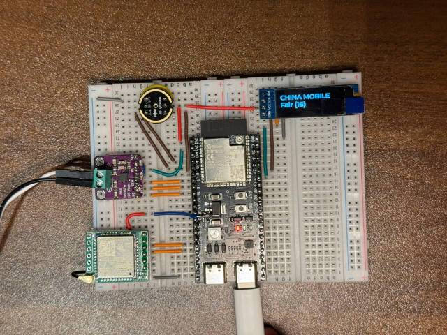

### サポートされているオープンソースハードウェア

- <a href="https://oshwhub.com/li-chuang-kai-fa-ban/li-chuang-shi-zhan-pai-esp32-s3-kai-fa-ban" target="_blank" title="LiChuang ESP32-S3 開発ボード">LiChuang ESP32-S3 開発ボード</a>
- <a href="https://github.com/espressif/esp-box" target="_blank" title="Espressif ESP32-S3-BOX3">Espressif ESP32-S3-BOX3</a>
- <a href="https://docs.m5stack.com/zh_CN/core/CoreS3" target="_blank" title="M5Stack CoreS3">M5Stack CoreS3</a>
- <a href="https://docs.m5stack.com/en/atom/Atomic%20Echo%20Base" target="_blank" title="AtomS3R + Echo Base">AtomS3R + Echo Base</a>
- <a href="https://docs.m5stack.com/en/core/ATOM%20Matrix" target="_blank" title="AtomMatrix + Echo Base">AtomMatrix + Echo Base</a>
- <a href="https://gf.bilibili.com/item/detail/1108782064" target="_blank" title="マジックボタン 2.4">マジックボタン 2.4</a>
- <a href="https://www.waveshare.net/shop/ESP32-S3-Touch-AMOLED-1.8.htm" target="_blank" title="Waveshare ESP32-S3-Touch-AMOLED-1.8">Waveshare ESP32-S3-Touch-AMOLED-1.8</a>
- <a href="https://github.com/Xinyuan-LilyGO/T-Circle-S3" target="_blank" title="LILYGO T-Circle-S3">LILYGO T-Circle-S3</a>
- <a href="https://oshwhub.com/tenclass01/xmini_c3" target="_blank" title="XiaGe Mini C3">XiaGe Mini C3</a>
- <a href="https://oshwhub.com/movecall/moji-xiaozhi-ai-derivative-editi" target="_blank" title="Movecall Moji ESP32S3">Moji シャオジー AI 派生版</a>
- <a href="https://oshwhub.com/movecall/cuican-ai-pendant-lights-up-y" target="_blank" title="Movecall CuiCan ESP32S3">Cuican AI ペンダント</a>
- <a href="https://www.seeedstudio.com/SenseCAP-Watcher-W1-A-p-5979.html" target="_blank" title="SenseCAP Watcher">SenseCAP Watcher</a>

  <a href="docs/v1/lichuang-s3.jpg" target="_blank" title="LiChuang ESP32-S3 開発ボード">
    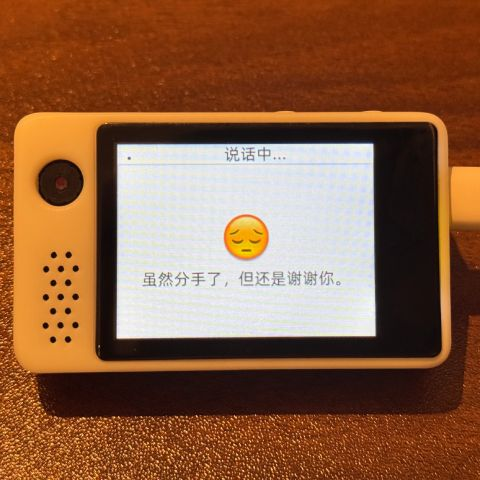
  </a>
  <a href="docs/v1/espbox3.jpg" target="_blank" title="Espressif ESP32-S3-BOX3">
    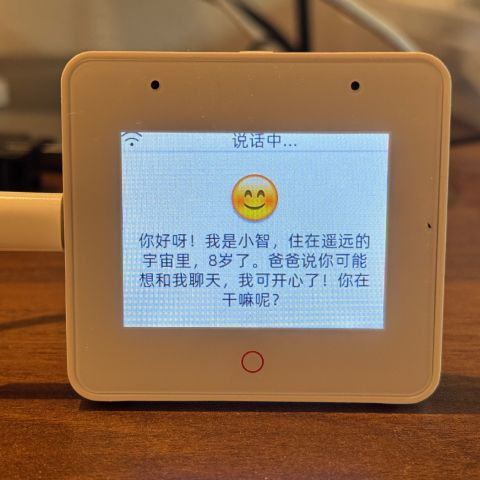
  </a>
  <a href="docs/v1/m5cores3.jpg" target="_blank" title="M5Stack CoreS3">
    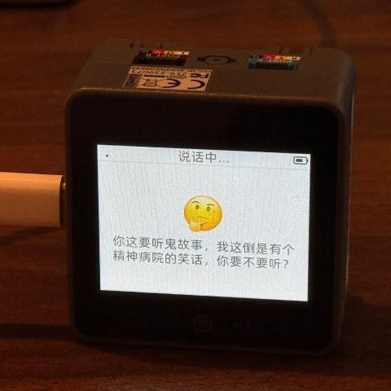
  </a>
  <a href="docs/v1/atoms3r.jpg" target="_blank" title="AtomS3R + Echo Base">
    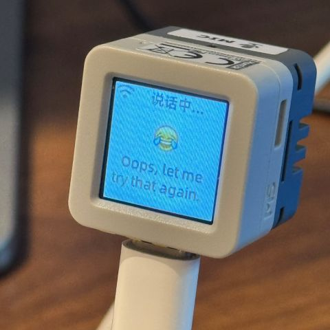
  </a>
  <a href="docs/v1/magiclick.jpg" target="_blank" title="MagiClick 2.4">
    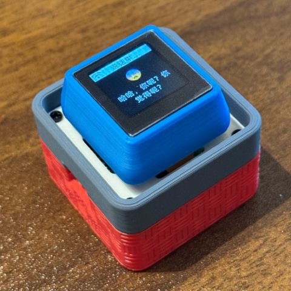
  </a>
  <a href="docs/v1/waveshare.jpg" target="_blank" title="Waveshare ESP32-S3-Touch-AMOLED-1.8">
    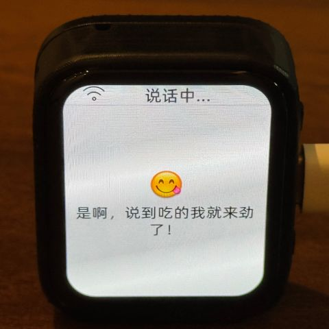
  </a>
  <a href="docs/lilygo-t-circle-s3.jpg" target="_blank" title="LILYGO T-Circle-S3">
    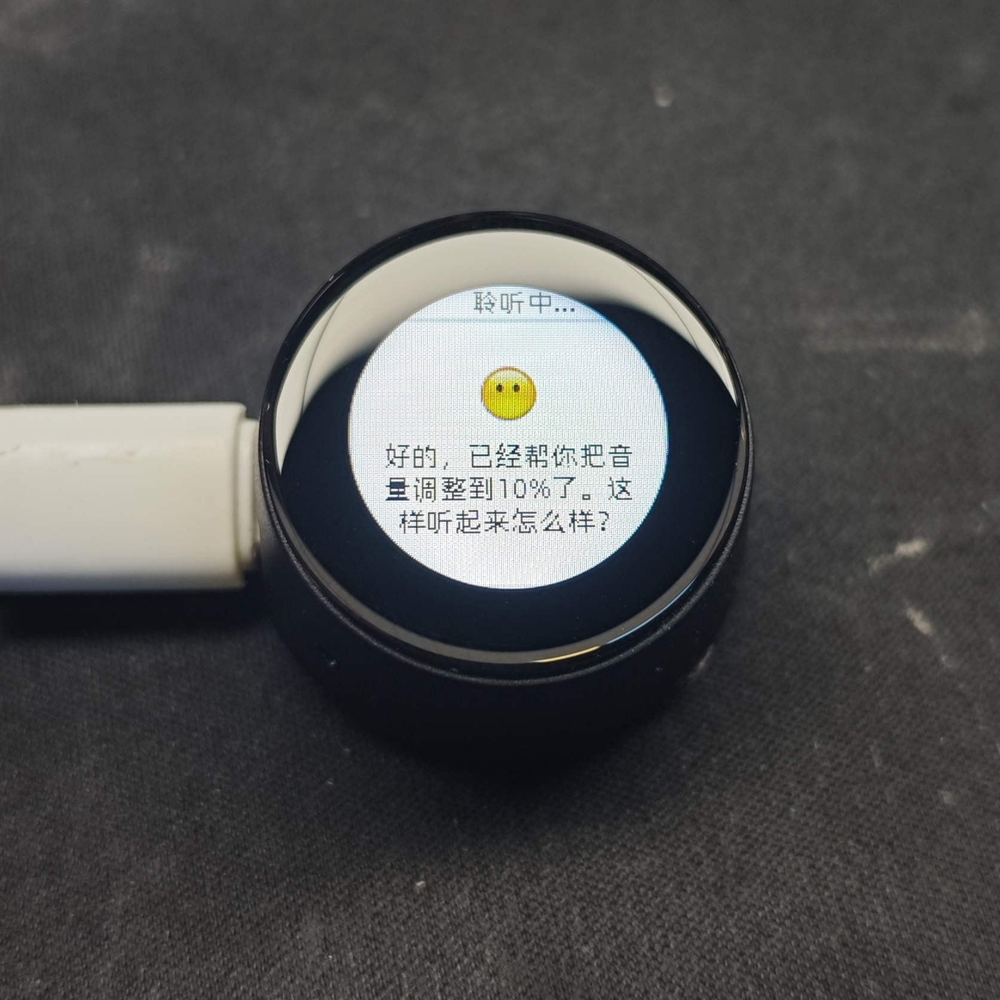
  </a>
  <a href="docs/xmini-c3.jpg" target="_blank" title="Xmini C3">
    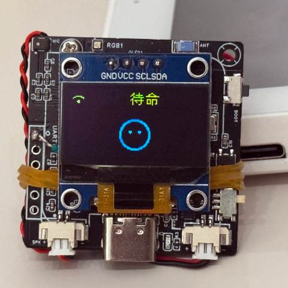
  </a>
  <a href="docs/v1/movecall-moji-esp32s3.jpg" target="_blank" title="Moji">
    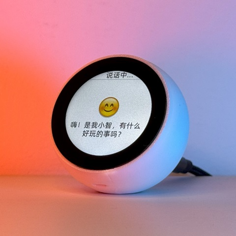
  </a>
  
  <a href="docs/v1/sensecap_watcher.jpg" target="_blank" title="SenseCAP Watcher">
    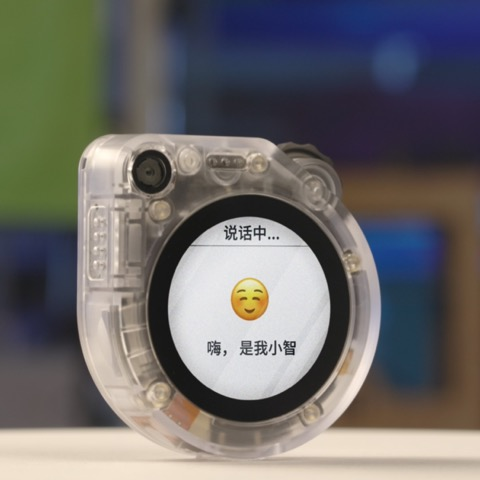
  </a>

## ファームウェア部分

### 開発環境なしのフラッシュ

初心者の方は、まず開発環境のセットアップなしでフラッシュできるファームウェアを使用することをお勧めします。

ファームウェアはデフォルトで公式 [xiaozhi.me](https://xiaozhi.me) サーバーに接続します。現在、個人ユーザーはアカウントを登録することで、Qwen リアルタイムモデルを無料で使用できます。

👉 [フラッシュファームウェアガイド（IDF環境なし）](https://ccnphfhqs21z.feishu.cn/wiki/Zpz4wXBtdimBrLk25WdcXzxcnNS)

### 開発環境

- Cursor または VSCode
- ESP-IDF プラグインをインストール、SDK バージョン 5.3 以上を選択
- Linux は Windows より好ましい（コンパイルが速く、ドライバーの問題も少ない）
- Google C++ コードスタイルを使用、コード提出時にはコンプライアンスを確認

## AI エージェント設定

シャオジー AI チャットボットデバイスをお持ちの場合は、[xiaozhi.me](https://xiaozhi.me) コンソールで設定できます。

👉 [バックエンド操作チュートリアル（旧インターフェース）](https://www.bilibili.com/video/BV1jUCUY2EKM/)

## 技術原理とプライベートデプロイメント

👉 [詳細な WebSocket 通信プロトコルドキュメント](docs/websocket.md)

個人のコンピュータでのサーバーデプロイメントについては、同じく MIT ライセンスで公開されている別のプロジェクト [xiaozhi-esp32-server](https://github.com/xinnan-tech/xiaozhi-esp32-server) を参照してください。

## スター履歴

<a href="https://star-history.com/#78/xiaozhi-esp32&Date">
 <picture>
   <source media="(prefers-color-scheme: dark)" srcset="https://api.star-history.com/svg?repos=78/xiaozhi-esp32&type=Date&theme=dark" />
   <source media="(prefers-color-scheme: light)" srcset="https://api.star-history.com/svg?repos=78/xiaozhi-esp32&type=Date" />
   
 </picture>
</a> 
