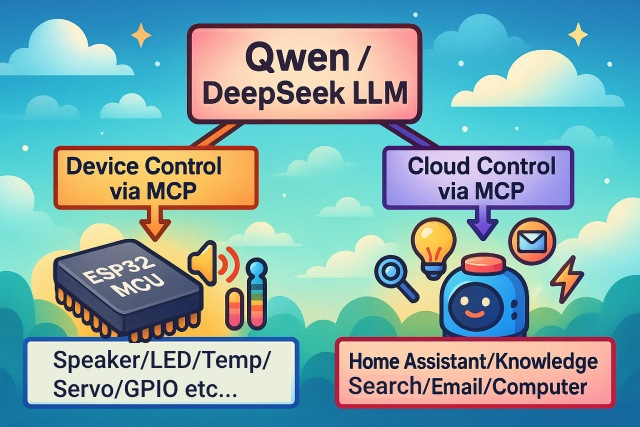
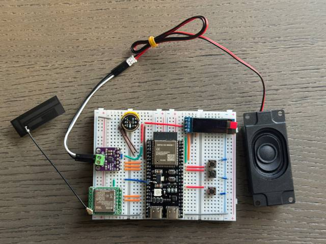
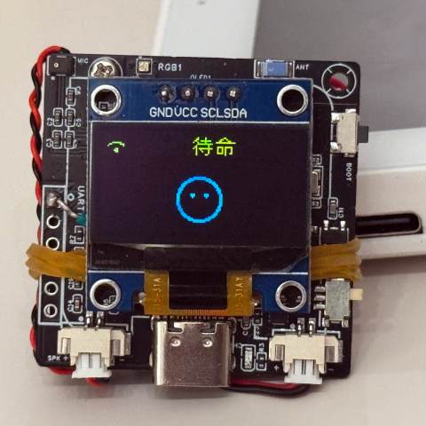
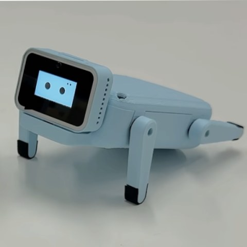

# MCP ベースのチャットボット

（日本語 | [中文](README.md) | [English](README_en.md)）

## 動画

👉 [人間：AIにカメラを装着 vs AI：その場で飼い主が3日間髪を洗っていないことを発見【bilibili】](https://www.bilibili.com/video/BV1bpjgzKEhd/)

👉 [手作りでAIガールフレンドを作る、初心者入門チュートリアル【bilibili】](https://www.bilibili.com/video/BV1XnmFYLEJN/)

## イントロダクション

これはエビ兄さんがオープンソースで公開しているESP32プロジェクトで、MITライセンスのもと、誰でも無料で、商用利用も可能です。

このプロジェクトを通じて、AIハードウェア開発を理解し、急速に進化する大規模言語モデルを実際のハードウェアデバイスに応用できるようになることを目指しています。

ご意見やご提案があれば、いつでもIssueを提出するか、QQグループ：1011329060 にご参加ください。

### MCPであらゆるものを制御

シャオジーAIチャットボットは音声インタラクションの入口として、Qwen / DeepSeekなどの大規模モデルのAI能力を活用し、MCPプロトコルを通じてマルチエンド制御を実現します。

### 実装済み機能

- Wi-Fi / ML307 Cat.1 4G
- オフライン音声ウェイクアップ [ESP-SR](https://github.com/espressif/esp-sr)
- 2種類の通信プロトコルに対応（[Websocket](docs/websocket.md) または MQTT+UDP）
- OPUSオーディオコーデックを採用
- ストリーミングASR + LLM + TTSアーキテクチャに基づく音声インタラクション
- 話者認識、現在話している人を識別 [3D Speaker](https://github.com/modelscope/3D-Speaker)
- OLED / LCDディスプレイ、表情表示対応
- バッテリー表示と電源管理
- 多言語対応（中国語、英語、日本語）
- ESP32-C3、ESP32-S3、ESP32-P4チッププラットフォーム対応
- デバイス側MCPによるデバイス制御（音量・明るさ調整、アクション制御など）
- クラウド側MCPで大規模モデル能力を拡張（スマートホーム制御、PCデスクトップ操作、知識検索、メール送受信など）

## ハードウェア

### ブレッドボード手作り実践

Feishuドキュメントチュートリアルをご覧ください：

👉 [「シャオジーAIチャットボット百科事典」](https://ccnphfhqs21z.feishu.cn/wiki/F5krwD16viZoF0kKkvDcrZNYnhb?from=from_copylink)

ブレッドボードのデモ：

### 70種類以上のオープンソースハードウェアに対応（一部のみ表示）

- <a href="https://oshwhub.com/li-chuang-kai-fa-ban/li-chuang-shi-zhan-pai-esp32-s3-kai-fa-ban" target="_blank" title="立創・実戦派 ESP32-S3 開発ボード">立創・実戦派 ESP32-S3 開発ボード</a>
- <a href="https://github.com/espressif/esp-box" target="_blank" title="楽鑫 ESP32-S3-BOX3">楽鑫 ESP32-S3-BOX3</a>
- <a href="https://docs.m5stack.com/zh_CN/core/CoreS3" target="_blank" title="M5Stack CoreS3">M5Stack CoreS3</a>
- <a href="https://docs.m5stack.com/en/atom/Atomic%20Echo%20Base" target="_blank" title="AtomS3R + Echo Base">M5Stack AtomS3R + Echo Base</a>
- <a href="https://gf.bilibili.com/item/detail/1108782064" target="_blank" title="マジックボタン2.4">マジックボタン2.4</a>
- <a href="https://www.waveshare.net/shop/ESP32-S3-Touch-AMOLED-1.8.htm" target="_blank" title="微雪電子 ESP32-S3-Touch-AMOLED-1.8">微雪電子 ESP32-S3-Touch-AMOLED-1.8</a>
- <a href="https://github.com/Xinyuan-LilyGO/T-Circle-S3" target="_blank" title="LILYGO T-Circle-S3">LILYGO T-Circle-S3</a>
- <a href="https://oshwhub.com/tenclass01/xmini_c3" target="_blank" title="エビ兄さん Mini C3">エビ兄さん Mini C3</a>
- <a href="https://oshwhub.com/movecall/cuican-ai-pendant-lights-up-y" target="_blank" title="Movecall CuiCan ESP32S3">CuiCan AIペンダント</a>
- <a href="https://github.com/WMnologo/xingzhi-ai" target="_blank" title="無名科技Nologo-星智-1.54">無名科技Nologo-星智-1.54TFT</a>
- <a href="https://www.seeedstudio.com/SenseCAP-Watcher-W1-A-p-5979.html" target="_blank" title="SenseCAP Watcher">SenseCAP Watcher</a>
- <a href="https://www.bilibili.com/video/BV1BHJtz6E2S/" target="_blank" title="ESP-HI 超低コストロボット犬">ESP-HI 超低コストロボット犬</a>

  
  
  
  
  
  
  
  
  
  
  
  

## ソフトウェア

### ファームウェア書き込み

初心者の方は、まず開発環境を構築せずに書き込み可能なファームウェアを使用することをおすすめします。

ファームウェアはデフォルトで公式 [xiaozhi.me](https://xiaozhi.me) サーバーに接続します。個人ユーザーはアカウント登録でQwenリアルタイムモデルを無料で利用できます。

👉 [初心者向けファームウェア書き込みガイド](https://ccnphfhqs21z.feishu.cn/wiki/Zpz4wXBtdimBrLk25WdcXzxcnNS)

### 開発環境

- Cursor または VSCode
- ESP-IDFプラグインをインストールし、SDKバージョン5.4以上を選択
- LinuxはWindowsよりも優れており、コンパイルが速く、ドライバの問題も少ない
- 本プロジェクトはGoogle C++コードスタイルを採用、コード提出時は準拠を確認してください

### 開発者ドキュメント

- [カスタム開発ボードガイド](main/boards/README.md) - シャオジーAI用のカスタム開発ボード作成方法
- [MCPプロトコルIoT制御使用法](docs/mcp-usage.md) - MCPプロトコルでIoTデバイスを制御する方法
- [MCPプロトコルインタラクションフロー](docs/mcp-protocol.md) - デバイス側MCPプロトコルの実装方法
- [詳細なWebSocket通信プロトコルドキュメント](docs/websocket.md)

## 大規模モデル設定

すでにシャオジーAIチャットボットデバイスをお持ちで、公式サーバーに接続済みの場合は、[xiaozhi.me](https://xiaozhi.me) コンソールで設定できます。

👉 [バックエンド操作ビデオチュートリアル（旧インターフェース）](https://www.bilibili.com/video/BV1jUCUY2EKM/)

## 関連オープンソースプロジェクト

個人PCでサーバーをデプロイする場合は、以下のオープンソースプロジェクトを参照してください：

- [xinnan-tech/xiaozhi-esp32-server](https://github.com/xinnan-tech/xiaozhi-esp32-server) Pythonサーバー
- [joey-zhou/xiaozhi-esp32-server-java](https://github.com/joey-zhou/xiaozhi-esp32-server-java) Javaサーバー
- [AnimeAIChat/xiaozhi-server-go](https://github.com/AnimeAIChat/xiaozhi-server-go) Golangサーバー

シャオジー通信プロトコルを利用した他のクライアントプロジェクト：

- [huangjunsen0406/py-xiaozhi](https://github.com/huangjunsen0406/py-xiaozhi) Pythonクライアント
- [TOM88812/xiaozhi-android-client](https://github.com/TOM88812/xiaozhi-android-client) Androidクライアント

## スター履歴

<a href="https://star-history.com/#78/xiaozhi-esp32&Date">
 <picture>
   <source media="(prefers-color-scheme: dark)" srcset="https://api.star-history.com/svg?repos=78/xiaozhi-esp32&type=Date&theme=dark" />
   <source media="(prefers-color-scheme: light)" srcset="https://api.star-history.com/svg?repos=78/xiaozhi-esp32&type=Date" />
   
 </picture>
</a> 
