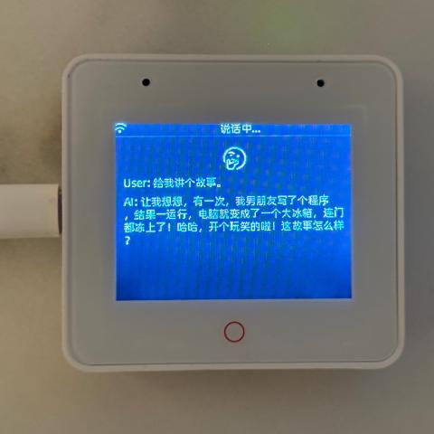

# XiaoZhi AI チャットボット

（[中文](README.md) | [English](README_en.md) | 日本語）

これはテレンスの最初のハードウェアプロジェクトです。

👉 [ESP32+SenseVoice+Qwen72BでAIチャットコンパニオンを作ろう！【bilibili】](https://www.bilibili.com/video/BV11msTenEH3/?share_source=copy_web&vd_source=ee1aafe19d6e60cf22e60a93881faeba)

👉 [AIコンパニオンをDIYする - 初心者向けチュートリアル【bilibili】](https://www.bilibili.com/video/BV1XnmFYLEJN/)

## プロジェクトの目的

このプロジェクトはEspressifのESP-IDFに基づいて開発されています。

このプロジェクトは主に教育目的のためのオープンソースプロジェクトです。このプロジェクトを通じて、より多くの人々がAIハードウェア開発を始め、急速に進化する大規模言語モデルを実際のハードウェアデバイスに統合する方法を理解する手助けをすることを目指しています。AIに興味のある学生や新しい技術を探求したい開発者にとって、このプロジェクトは貴重な学習体験を提供します。

プロジェクトの開発と改善に参加することを歓迎します。アイデアや提案があれば、Issueを提起するか、チャットグループに参加してください。

学習・ディスカッションQQグループ: 946599635

## 実装された機能

- Wi-Fi / ML307 Cat.1 4G
- BOOTボタンのウェイクアップと割り込み、クリックと長押しの両方のトリガーをサポート
- オフライン音声ウェイクアップ [ESP-SR](https://github.com/espressif/esp-sr)
- ストリーミング音声対話（WebSocketまたはUDPプロトコル）
- 5つの言語をサポート：標準中国語、広東語、英語、日本語、韓国語 [SenseVoice](https://github.com/FunAudioLLM/SenseVoice)
- 音声認識でAIの名前を呼んでいる人を識別 [3D Speaker](https://github.com/modelscope/3D-Speaker)
- 大規模モデルTTS（VolcengineまたはCosyVoice）
- 大規模言語モデル（Qwen2.5 72BまたはDoubao API）
- カスタマイズ可能なプロンプトと音声トーン（カスタムキャラクター）
- 短期記憶、各対話ラウンド後の自己要約
- 信号強度や対話内容を表示するOLED / LCDディスプレイ

## ハードウェアセクション

### ブレッドボードの練習

詳細なチュートリアルについては、Feishuドキュメントを参照してください：

👉 [XiaoZhi AI チャットボット百事典](https://ccnphfhqs21z.feishu.cn/wiki/F5krwD16viZoF0kKkvDcrZNYnhb?from=from_copylink)

以下にブレッドボードのセットアップを示します：

### サポートされているオープンソースハードウェア

- <a href="https://oshwhub.com/li-chuang-kai-fa-ban/li-chuang-shi-zhan-pai-esp32-s3-kai-fa-ban" target="_blank" title="LiChuang ESP32-S3 開発ボード">LiChuang ESP32-S3 開発ボード</a>
- <a href="https://github.com/espressif/esp-box" target="_blank" title="Espressif ESP32-S3-BOX3">Espressif ESP32-S3-BOX3</a>
- <a href="https://docs.m5stack.com/zh_CN/core/CoreS3" target="_blank" title="M5Stack CoreS3">M5Stack CoreS3</a>
- <a href="https://docs.m5stack.com/en/atom/Atomic%20Echo%20Base" target="_blank" title="AtomS3R + Echo Base">AtomS3R + Echo Base</a>
- MagiClick 2.4
- <a href="https://oshwhub.com/tenclass01/xmini_c3" target="_blank" title="Xmini C3">Xmini C3</a>
- <a href="https://www.waveshare.com/esp32-s3-touch-amoled-1.8.htm" target="_blank" title="Waveshare ESP32-S3-Touch-AMOLED-1.8">Waveshare ESP32-S3-Touch-AMOLED-1.8</a>

  
  
  
  
  
  

## ファームウェアセクション

### 開発環境なしでのフラッシュ

初心者には、最初に開発環境を設定せずにファームウェアをフラッシュすることをお勧めします。ファームウェアは著者が提供するテストサーバーを使用しており、現在無料で使用できます（商業目的では使用しないでください）。

👉 [開発環境なしでのフラッシュガイド](https://ccnphfhqs21z.feishu.cn/wiki/Zpz4wXBtdimBrLk25WdcXzxcnNS)

### 開発環境

- CursorまたはVSCode
- ESP-IDFプラグインをインストールし、SDKバージョン5.3以上を選択
- LinuxはWindowsよりも優れており、コンパイルが速く、ドライバの問題も少ない

## AIキャラクターの設定

すでにXiaoZhi AIチャットボットをお持ちの場合は、👉 [バックエンド操作ビデオチュートリアル](https://www.bilibili.com/video/BV1jUCUY2EKM/)を参照してください。

詳細な使用方法とテストサーバーの注意事項については、👉 [XiaoZhiテストサーバーヘルプガイド](https://xiaozhi.me/help)を参照してください。

## Star History

<a href="https://star-history.com/#78/xiaozhi-esp32&Date">
 <picture>
   <source media="(prefers-color-scheme: dark)" srcset="https://api.star-history.com/svg?repos=78/xiaozhi-esp32&type=Date&theme=dark" />
   <source media="(prefers-color-scheme: light)" srcset="https://api.star-history.com/svg?repos=78/xiaozhi-esp32&type=Date" />
   
 </picture>
</a> 
