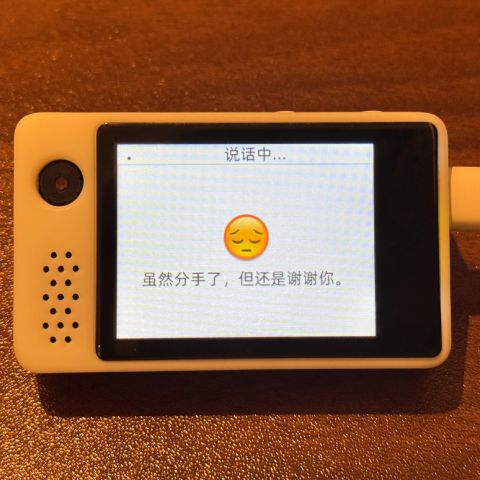
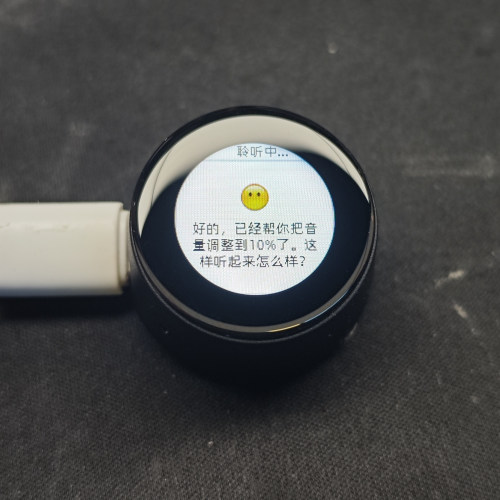

# Um Chatbot baseado em MCP

([中文](README_cn.md) | [English](README.md) | [日本語](README_ja.md)| [Português](README_pt.md))

## Introdução

👉 [Humano: Instale uma câmera para IA vs IA: foi descoberto no local que o proprietário não lavava o cabelo há três dias [bilibili]](https://www.bilibili.com/video/BV1bpjgzKEhd/)

👉 [Crie sua namorada IA ​​manualmente, tutorial introdutório para iniciantes [bilibili]](https://www.bilibili.com/video/BV1XnmFYLEJN/)

Como um portal de interação por voz, o chatbot Xiaozhi AI usa os recursos de IA de grandes modelos como Qwen/DeepSeek para obter controle multiterminal por meio do protocolo MCP.

### Notas de versão

A versão v2 atual é incompatível com a tabela de partição da versão v1, portanto a atualização OTA de v1 para v2 não pode ser executada. Para obter uma descrição da tabela de partições, consulte [partitions/v2/README.md](partitions/v2/README.md).

Todo o hardware que usa v1 pode ser atualizado para v2 atualizando manualmente o firmware.

A versão estável da v1 é 1.9.2. Você pode mudar para a versão v1 através do `git checkout v1`. Esta agência continuará a ser mantida até fevereiro de 2026.

### Função implementada

- Wi-Fi / ML307 Cat.1 4G
- Ativação por voz offline [ESP-SR](https://github.com/espressif/esp-sr)
- Suporta dois protocolos de comunicação ([Websocket](docs/websocket.md) ou MQTT+UDP)
- Usando o codec de áudio OPUS
- Interação de voz baseada em arquitetura de streaming ASR + LLM + TTS
- Reconhecimento de impressão de voz, identificando a identidade do locutor atual [3D Speaker](https://github.com/modelscope/3D-Speaker)
- Tela OLED/LCD, suporta exibição de expressão
- Exibição da bateria e gerenciamento de energia
- Suporta vários idiomas (chinês, inglês, japonês)
- Suporta plataformas de chips ESP32-C3, ESP32-S3, ESP32-P4
- Controle de dispositivos (volume, iluminação, motor, GPIO, etc.) através do MCP do lado do dispositivo
- 通过云端 MCP 扩展大模型能力（智能家居控制、PC桌面操作、知识搜索、邮件收发等）
- Personalize palavras de ativação, fontes, emoticons e planos de fundo de bate-papo, suporte para modificação on-line na web ([Gerador de ativos personalizados](https://github.com/78/xiaozhi-assets-generator))

## Hardware

### Prática artesanal de tábua de pão

Para obter detalhes, consulte o tutorial de documentação do Feishu:

👉 ["Enciclopédia Xiaozhi AI Chatbot"](https://ccnphfhqs21z.feishu.cn/wiki/F5krwD16viZoF0kKkvDcrZNYnhb?from=from_copylink)

A renderização da placa de ensaio é a seguinte:

### Suporta mais de 70 hardwares de código aberto (apenas parte mostrada)

- <a href="https://oshwhub.com/li-chuang-kai-fa-ban/li-chuang-shi-zhan-pai-esp32-s3-kai-fa-ban" target="_blank" title="Placa de desenvolvimento Lichuang·Jianzhanpai ESP32-S3">Placa de desenvolvimento Lichuang·Jianzhanpai ESP32-S3</a>
- <a href="https://github.com/espressif/esp-box" target="_blank" title="Espressif Systems ESP32-S3-BOX3">Espressif Systems ESP32-S3-BOX3</a>
- <a href="https://docs.m5stack.com/zh_CN/core/CoreS3" target="_blank" title="M5Stack CoreS3">M5Stack CoreS3</a>
- <a href="https://docs.m5stack.com/en/atom/Atomic%20Echo%20Base" target="_blank" title="AtomS3R + Echo Base">M5Stack AtomS3R + Echo Base</a>
- <a href="https://gf.bilibili.com/item/detail/1108782064" target="_blank" title="神奇按钮 2.4">神奇按钮 2.4</a>
- <a href="https://www.waveshare.net/shop/ESP32-S3-Touch-AMOLED-1.8.htm" target="_blank" title="Weixue Electronics ESP32-S3-Touch-AMOLED-1.8">Weixue Electronics ESP32-S3-Touch-AMOLED-1.8</a>
- <a href="https://github.com/Xinyuan-LilyGO/T-Circle-S3" target="_blank" title="LILYGO T-Circle-S3">LILYGO T-Circle-S3</a>
- <a href="https://oshwhub.com/tenclass01/xmini_c3" target="_blank" title="Xia Ge Mini C3">Xia Ge Mini C3</a>
- <a href="https://oshwhub.com/movecall/cuican-ai-pendant-lights-up-y" target="_blank" title="Movecall CuiCan ESP32S3">Pingente de IA brilhante</a>
- <a href="https://github.com/WMnologo/xingzhi-ai" target="_blank" title="无名科技Nologo-Xingzhi-1.54">无名科技 Nologo-Xingzhi-1.54TFT</a>
- <a href="https://www.seeedstudio.com/SenseCAP-Watcher-W1-A-p-5979.html" target="_blank" title="SenseCAP Watcher">SenseCAP Watcher</a>
- <a href="https://www.bilibili.com/video/BV1BHJtz6E2S/" target="_blank" title="Cão-robô de custo ultrabaixo ESP-HI">Cão-robô de custo ultrabaixo ESP-HI</a>

  
  
  
  
  
  
  
  
  
  
  
  

## Software

### Queima de firmware

Recomenda-se que os novatos não configurem um ambiente de desenvolvimento pela primeira vez, mas usem diretamente o firmware que não precisa ser gravado em um ambiente de desenvolvimento.

O firmware está conectado ao servidor oficial [xiaozhi.me](https://xiaozhi.me) por padrão. Usuários individuais que registram uma conta podem usar modelos em tempo real Qwen gratuitamente.

👉 [Tutorial de gravação de firmware para iniciantes](https://ccnphfhqs21z.feishu.cn/wiki/Zpz4wXBtdimBrLk25WdcXzxcnNS)

### Ambiente de desenvolvimento

- Cursor ou VSCode
- Instale o plug-in ESP-IDF e selecione SDK versão 5.4 ou superior
- Linux é melhor que Windows, a velocidade de compilação é rápida e evita problemas de driver
- Este projeto usa o estilo de codificação Google C++, certifique-se de que ele esteja em conformidade com as especificações ao enviar o código

### Documentação do desenvolvedor

- [Guia da placa de desenvolvimento personalizada](docs/custom-board_pt.md) - Aprenda como criar uma placa de desenvolvimento personalizada para Xiaozhi AI
- [Instruções de uso de controle de IoT do protocolo MCP](docs/mcp-usage_pt.md) - Aprenda como controlar dispositivos IoT por meio do protocolo MCP
- [Processo de interação do protocolo MCP](docs/mcp-protocol_pt.md) - Método de implementação do protocolo MCP do lado do dispositivo
- [documento do protocolo de comunicação híbrida MQTT + UDP](docs/mqtt-udp_pt.md)
- [Um documento detalhado do protocolo de comunicação WebSocket](docs/websocket_pt.md)

## Configuração de modelo grande

Se você já possui um dispositivo chatbot Xiaozhi AI e se conectou ao servidor oficial, você pode fazer login no console [xiaozhi.me](https://xiaozhi.me) para configurá-lo.

👉 [Tutorial em vídeo de operação de back-end (interface da versão antiga)](https://www.bilibili.com/video/BV1jUCUY2EKM/)

## Projetos de código aberto relacionados

Para implantar um servidor em um computador pessoal, você pode consultar os seguintes projetos de código aberto de terceiros:

- [xinnan-tech/xiaozhi-esp32-server](https://github.com/xinnan-tech/xiaozhi-esp32-server) Servidor Python
- [joey-zhou/xiaozhi-esp32-server-java](https://github.com/joey-zhou/xiaozhi-esp32-server-java) Servidor Java
- [AnimeAIChat/xiaozhi-server-go](https://github.com/AnimeAIChat/xiaozhi-server-go) Servidor Golang

Projetos de clientes de terceiros usando protocolo de comunicação Xiaozhi:

- [huangjunsen0406/py-xiaozhi](https://github.com/huangjunsen0406/py-xiaozhi) Cliente Python
- [TOM88812/xiaozhi-android-client](https://github.com/TOM88812/xiaozhi-android-client) Cliente Android
- [100askTeam/xiaozhi-linux](http://github.com/100askTeam/xiaozhi-linux) Cliente Linux fornecido pela Baiwen Technology
- [78/xiaozhi-sf32](https://github.com/78/xiaozhi-sf32) Firmware do chip Bluetooth da Sich Technology
- [QuecPython/solution-xiaozhiAI](https://github.com/QuecPython/solution-xiaozhiAI) Firmware QuecPython fornecido pela Quectel

## Sobre o projeto

Este é um projeto ESP32 de código aberto do Brother Xi, lançado sob a licença do MIT, permitindo que qualquer pessoa o use, modifique ou use para fins comerciais gratuitamente.

Esperamos que, por meio deste projeto, possamos ajudar todos a compreender o desenvolvimento de hardware de IA e aplicar os grandes modelos de linguagem em rápido desenvolvimento a dispositivos de hardware reais.

Se você tiver alguma idéia ou sugestão, sinta-se à vontade para levantar questões ou junte-se ao grupo QQ: 1011329060

## Star History

<a href="https://star-history.com/#78/xiaozhi-esp32&Date">
 <picture>
   <source media="(prefers-color-scheme: dark)" srcset="https://api.star-history.com/svg?repos=78/xiaozhi-esp32&type=Date&theme=dark" />
   <source media="(prefers-color-scheme: light)" srcset="https://api.star-history.com/svg?repos=78/xiaozhi-esp32&type=Date" />
   
 </picture>
</a>
