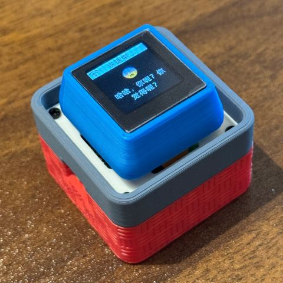

#Um chatbot baseado em MCP
(Chinês | Inglês | Japonês )
##introduzir
👉Humanos : Instalando câmeras em IA vs. IA: Descobrindo na hora que seu dono não lavou o cabelo por três dias [bilibili]
👉Crie sua própria namorada de IA: um guia para iniciantes [bilibili]
O chatbot Xiaozhi AI funciona como um portal de interação por voz, aproveitando os recursos de IA de grandes modelos como Qwen e DeepSeek para alcançar o controle de múltiplos terminais por meio do protocolo MCP.

<<<<<<< HEAD
(English | [中文](README_cn.md) | [日本語](README_ja.md))

## Introduction

👉 [Human: Give AI a camera vs AI: Instantly finds out the owner hasn't washed hair for three days【bilibili】](https://www.bilibili.com/video/BV1bpjgzKEhd/)

👉 [Handcraft your AI girlfriend, beginner's guide【bilibili】](https://www.bilibili.com/video/BV1XnmFYLEJN/)

As a voice interaction entry, the XiaoZhi AI chatbot leverages the AI capabilities of large models like Qwen / DeepSeek, and achieves multi-terminal control via the MCP protocol.

## Version Notes

The current v2 version is incompatible with the v1 partition table, so it is not possible to upgrade from v1 to v2 via OTA. For partition table details, see [partitions/v2/README.md](partitions/v2/README.md).

All hardware running v1 can be upgraded to v2 by manually flashing the firmware.

The stable version of v1 is 1.9.2. You can switch to v1 by running `git checkout v1`. The v1 branch will be maintained until February 2026.

### Features Implemented

- Wi-Fi / ML307 Cat.1 4G
- Offline voice wake-up [ESP-SR](https://github.com/espressif/esp-sr)
- Supports two communication protocols ([Websocket](docs/websocket.md) or MQTT+UDP)
- Uses OPUS audio codec
- Voice interaction based on streaming ASR + LLM + TTS architecture
- Speaker recognition, identifies the current speaker [3D Speaker](https://github.com/modelscope/3D-Speaker)
- OLED / LCD display, supports emoji display
- Battery display and power management
- Multi-language support (Chinese, English, Japanese)
- Supports ESP32-C3, ESP32-S3, ESP32-P4 chip platforms
- Device-side MCP for device control (Speaker, LED, Servo, GPIO, etc.)
- Cloud-side MCP to extend large model capabilities (smart home control, PC desktop operation, knowledge search, email, etc.)
- Customizable wake words, fonts, emojis, and chat backgrounds with online web-based editing ([Custom Assets Generator](https://github.com/78/xiaozhi-assets-generator))

## Hardware

### Breadboard DIY Practice

See the Feishu document tutorial:

👉 ["XiaoZhi AI Chatbot Encyclopedia"](https://ccnphfhqs21z.feishu.cn/wiki/F5krwD16viZoF0kKkvDcrZNYnhb?from=from_copylink)

Breadboard demo:

### Supports 70+ Open Source Hardware (Partial List)

- <a href="https://oshwhub.com/li-chuang-kai-fa-ban/li-chuang-shi-zhan-pai-esp32-s3-kai-fa-ban" target="_blank" title="LiChuang ESP32-S3 Development Board">LiChuang ESP32-S3 Development Board</a>
- <a href="https://github.com/espressif/esp-box" target="_blank" title="Espressif ESP32-S3-BOX3">Espressif ESP32-S3-BOX3</a>
- <a href="https://docs.m5stack.com/zh_CN/core/CoreS3" target="_blank" title="M5Stack CoreS3">M5Stack CoreS3</a>
- <a href="https://docs.m5stack.com/en/atom/Atomic%20Echo%20Base" target="_blank" title="AtomS3R + Echo Base">M5Stack AtomS3R + Echo Base</a>
- <a href="https://gf.bilibili.com/item/detail/1108782064" target="_blank" title="Magic Button 2.4">Magic Button 2.4</a>
- <a href="https://www.waveshare.net/shop/ESP32-S3-Touch-AMOLED-1.8.htm" target="_blank" title="Waveshare ESP32-S3-Touch-AMOLED-1.8">Waveshare ESP32-S3-Touch-AMOLED-1.8</a>
- <a href="https://github.com/Xinyuan-LilyGO/T-Circle-S3" target="_blank" title="LILYGO T-Circle-S3">LILYGO T-Circle-S3</a>
- <a href="https://oshwhub.com/tenclass01/xmini_c3" target="_blank" title="XiaGe Mini C3">XiaGe Mini C3</a>
- <a href="https://oshwhub.com/movecall/cuican-ai-pendant-lights-up-y" target="_blank" title="Movecall CuiCan ESP32S3">CuiCan AI Pendant</a>
- <a href="https://github.com/WMnologo/xingzhi-ai" target="_blank" title="WMnologo-Xingzhi-1.54">WMnologo-Xingzhi-1.54TFT</a>
- <a href="https://www.seeedstudio.com/SenseCAP-Watcher-W1-A-p-5979.html" target="_blank" title="SenseCAP Watcher">SenseCAP Watcher</a>
- <a href="https://www.bilibili.com/video/BV1BHJtz6E2S/" target="_blank" title="ESP-HI Low Cost Robot Dog">ESP-HI Low Cost Robot Dog</a>

  
  
  
  
  
  
  
  
  
  
  
  

## Software

### Firmware Flashing

For beginners, it is recommended to use the firmware that can be flashed without setting up a development environment.

The firmware connects to the official [xiaozhi.me](https://xiaozhi.me) server by default. Personal users can register an account to use the Qwen real-time model for free.

👉 [Beginner's Firmware Flashing Guide](https://ccnphfhqs21z.feishu.cn/wiki/Zpz4wXBtdimBrLk25WdcXzxcnNS)

### Development Environment

- Cursor or VSCode
- Install ESP-IDF plugin, select SDK version 5.4 or above
- Linux is better than Windows for faster compilation and fewer driver issues
- This project uses Google C++ code style, please ensure compliance when submitting code

### Developer Documentation

- [Custom Board Guide](docs/custom-board.md) - Learn how to create custom boards for XiaoZhi AI
- [MCP Protocol IoT Control Usage](docs/mcp-usage.md) - Learn how to control IoT devices via MCP protocol
- [MCP Protocol Interaction Flow](docs/mcp-protocol.md) - Device-side MCP protocol implementation
- [MQTT + UDP Hybrid Communication Protocol Document](docs/mqtt-udp.md)
- [A detailed WebSocket communication protocol document](docs/websocket.md)

## Large Model Configuration

If you already have a XiaoZhi AI chatbot device and have connected to the official server, you can log in to the [xiaozhi.me](https://xiaozhi.me) console for configuration.

👉 [Backend Operation Video Tutorial (Old Interface)](https://www.bilibili.com/video/BV1jUCUY2EKM/)

## Related Open Source Projects

For server deployment on personal computers, refer to the following open-source projects:

- [xinnan-tech/xiaozhi-esp32-server](https://github.com/xinnan-tech/xiaozhi-esp32-server) Python server
- [joey-zhou/xiaozhi-esp32-server-java](https://github.com/joey-zhou/xiaozhi-esp32-server-java) Java server
- [AnimeAIChat/xiaozhi-server-go](https://github.com/AnimeAIChat/xiaozhi-server-go) Golang server

Other client projects using the XiaoZhi communication protocol:

- [huangjunsen0406/py-xiaozhi](https://github.com/huangjunsen0406/py-xiaozhi) Python client
- [TOM88812/xiaozhi-android-client](https://github.com/TOM88812/xiaozhi-android-client) Android client
- [100askTeam/xiaozhi-linux](http://github.com/100askTeam/xiaozhi-linux) Linux client by 100ask
- [78/xiaozhi-sf32](https://github.com/78/xiaozhi-sf32) Bluetooth chip firmware by Sichuan
- [QuecPython/solution-xiaozhiAI](https://github.com/QuecPython/solution-xiaozhiAI) QuecPython firmware by Quectel

Custom Assets Tools:

- [78/xiaozhi-assets-generator](https://github.com/78/xiaozhi-assets-generator) Custom Assets Generator (Wake words, fonts, emojis, backgrounds)

## About the Project

This is an open-source ESP32 project, released under the MIT license, allowing anyone to use it for free, including for commercial purposes.

We hope this project helps everyone understand AI hardware development and apply rapidly evolving large language models to real hardware devices.

If you have any ideas or suggestions, please feel free to raise Issues or join the QQ group: 1011329060

## Star History

<a href="https://star-history.com/#78/xiaozhi-esp32&Date">
 <picture>
   <source media="(prefers-color-scheme: dark)" srcset="https://api.star-history.com/svg?repos=78/xiaozhi-esp32&type=Date&theme=dark" />
   <source media="(prefers-color-scheme: light)" srcset="https://api.star-history.com/svg?repos=78/xiaozhi-esp32&type=Date" />
   
 </picture>
</a> 
=======
##Notas da versão
A versão atual v2 é incompatível com a tabela de partições da versão v1; portanto, não é possível atualizar da v1 para a v2 via OTA. Consulte partitions/v2/README.md para obter detalhes sobre a tabela de partições .
Todos os dispositivos que utilizam a versão v1 podem ser atualizados para a versão v2 através da atualização manual do firmware.
A versão estável da v1 é a 1.9.2. Você pode git checkout v1alternar para a versão v1 usando o comando. Esta ramificação será mantida até fevereiro de 2026.
##Funcionalidades implementadas
    • Wi-Fi / ML307 Cat.1 4G
    • Despertar por voz offline ESP-SR
    • Suporta dois protocolos de comunicação ( Websocket ou MQTT+UDP)
    • Utilizando o codec de áudio OPUS
    • Interação por voz baseada em arquitetura de streaming ASR + LLM + TTS
    • Reconhecimento de impressão vocal, identificando a identidade do falante atual ( Alto-falante 3D)
    • Tela OLED/LCD, compatível com exibição de expressões faciais.
    • Indicador de nível de bateria e gerenciamento de energia
    • Suporta vários idiomas (chinês, inglês, japonês)
    • Compatível com as plataformas de chip ESP32-C3, ESP32-S3 e ESP32-P4.
    • O controle do dispositivo (volume, luzes, motores, GPIO, etc.) é realizado através do MCP (Multi-Controller Protocol) do lado do dispositivo.
    • Amplie as capacidades de modelos de grande porte através de MCP baseado em nuvem (controle de casa inteligente, operação de desktop de PC, pesquisa de conhecimento, envio e recebimento de e-mails, etc.).
    • Personalize palavras de ativação, fontes, emoticons e planos de fundo do chat; a edição online é suportada na web ( gerador de recursos personalizados ).
hardware
Prática de construção com placa de ensaio
Consulte o tutorial de documentação do Lark para obter detalhes:
👉 "Enciclopédia Xiaozhi AI Chatbot"
O projeto da placa de ensaio é mostrado abaixo:

Compatível com mais de 70 dispositivos de hardware de código aberto (apenas uma parte deles é mostrada).
    • Placa de Desenvolvimento LCSC ESP32-S3 - Aplicação Prática
    • Espressif ESP32-S3-BOX3
    • M5Stack CoreS3
    • M5Stack AtomS3R + Echo Base
    • Botão Mágico 2.4
    • Micro-ondas ESP32-S3-Touch-AMOLED-1.8
    • LILYGO T-Circle-S3
    • Camarão Bro Mini C3
    • Pingente de IA brilhante
    • Tecnologia Nologo - Star Intelligence - TFT de 1,54"
    • Observador SenseCAP
    • ESP-HI Cão Robô de Custo Ultrabaixo
           
software
Gravação de firmware
Para iniciantes, recomenda-se não configurar um ambiente de desenvolvimento na primeira vez, mas usar diretamente o firmware que não requer um ambiente de desenvolvimento para ser gravado.
O firmware está conectado ao servidor oficial xiaozhi.me por padrão , e os usuários individuais podem registrar uma conta para usar o modelo em tempo real Qwen gratuitamente.
👉Guia para Iniciantes em Atualização de Firmware
Ambiente de desenvolvimento
    • Cursor ou VSCode
    • Instale o plugin ESP-IDF, selecionando a versão 5.4 ou superior do SDK.
    • O Linux é melhor que o Windows; ele compila mais rápido e evita problemas com drivers.
    • Este projeto utiliza o estilo de codificação C++ do Google; certifique-se de que seu código esteja em conformidade com as diretrizes de estilo ao enviá-lo.
Documentação do desenvolvedor
    • Guia de Placa de Desenvolvimento Personalizada - Aprenda como criar uma placa de desenvolvimento personalizada para Xiaozhi AI
    • Instruções de uso do protocolo MCP para controle de IoT - Aprenda a controlar dispositivos IoT usando o protocolo MCP.
    • Fluxo de interação do protocolo MCP - Implementação do protocolo MCP no dispositivo
    • Documento do Protocolo de Comunicação Híbrida MQTT + UDP
    • Um documento detalhado sobre o protocolo de comunicação WebSocket.
Configuração de modelo grande
Se você já possui um dispositivo chatbot Xiaozhi AI e o conectou ao servidor oficial, pode acessar o console xiaozhi.me para configurá-lo.
👉Tutorial em vídeo sobre operação do backend (interface antiga)
Projetos de código aberto relacionados
Para implantar um servidor em um computador pessoal, você pode consultar os seguintes projetos de código aberto de terceiros:
    • Servidor Python xinnan-tech/xiaozhi-esp32-server
    • joey-zhou/xiaozhi-esp32-server-java Servidor Java
    • Servidor Golang AnimeAIChat/xiaozhi-server-go
Projetos de clientes terceirizados que utilizam o protocolo de comunicação Xiaozhi:
    • cliente Python huangjunsen0406/py-xiaozhi
    • TOM88812/xiaozhi-android-client Cliente Android
    • Cliente Linux fornecido por 100askTeam/xiaozhi-linux.
    • Firmware do chip Bluetooth 78/xiaozhi-sf32 da Siche Technology
    • QuecPython/solution-xiaozhiAI Quectel fornece firmware QuecPython
Sobre o projeto
Este é um projeto ESP32 de código aberto desenvolvido por Xia Ge, lançado sob a licença MIT, permitindo que qualquer pessoa o utilize, modifique ou use para fins comerciais gratuitamente.
Esperamos que, por meio deste projeto, possamos ajudar a todos a compreender o desenvolvimento de hardware de IA e a aplicar os modelos de linguagem de grande escala, que estão em rápida evolução, a dispositivos de hardware reais.
Se tiver alguma ideia ou sugestão, não hesite em levantar questões ou juntar-se ao grupo do QQ: 1011329060
História das Estrelas
 
>>>>>>> 17a72f85309f74d4520abe26650ba3095e5aab74
