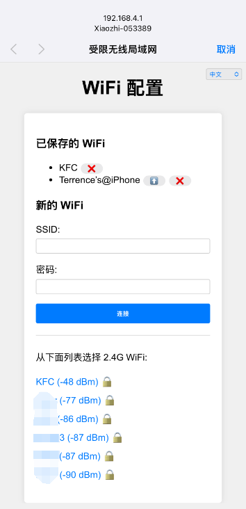

# ESP32 WiFi Connect

This component helps with WiFi connection for the device.

It first tries to connect to a WiFi network using the credentials stored in the flash. If this fails, it starts an access point and a web server to allow the user to connect to a WiFi network.

The URL to access the web server is `http://192.168.4.1`.

Here is a screenshot of the web server:



## Changelog: v2.3.0

- Add support for language request.

## Changelog: v2.2.0

- Add support for ESP32 SmartConfig(ESPTouch v2)

## Changelog: v2.1.0

- Improve WiFi connection logic.

## Changelog: v2.0.0

- Add support for multiple WiFi SSID management.
- Auto switch to the best WiFi network.
- Captive portal for WiFi configuration.
- Support for multiple languages (English, Chinese).

## Configuration

The WiFi credentials are stored in the flash under the "wifi" namespace.

The keys are "ssid", "ssid1", "ssid2" ... "ssid9", "password", "password1", "password2" ... "password9".

## Usage

```cpp
// Initialize the default event loop
ESP_ERROR_CHECK(esp_event_loop_create_default());

// Initialize NVS flash for WiFi configuration
esp_err_t ret = nvs_flash_init();
if (ret == ESP_ERR_NVS_NO_FREE_PAGES || ret == ESP_ERR_NVS_NEW_VERSION_FOUND) {
    ESP_ERROR_CHECK(nvs_flash_erase());
    ret = nvs_flash_init();
}
ESP_ERROR_CHECK(ret);

// Get the WiFi configuration
auto& ssid_list = SsidManager::GetInstance().GetSsidList();
if (ssid_list.empty()) {
    // Start the WiFi configuration AP
    auto& ap = WifiConfigurationAp::GetInstance();
    ap.SetSsidPrefix("ESP32");
    ap.Start();
    return;
}

// Otherwise, connect to the WiFi network
WifiStation::GetInstance().Start();
```

