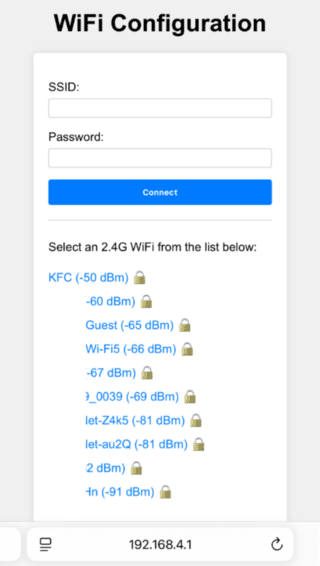

# ESP32 WiFi Connect

This component helps with WiFi connection for the device.

It first tries to connect to a WiFi network using the credentials stored in the flash. If this fails, it starts an access point and a web server to allow the user to connect to a WiFi network.

The URL to access the web server is `http://192.168.4.1`.

Here is a screenshot of the web server:



## Configuration

The WiFi credentials are stored in the flash under the "wifi" namespace. The keys are "ssid" and "password".

## Usage

```cpp
// Initialize the default event loop
ESP_ERROR_CHECK(esp_event_loop_create_default());

// Initialize NVS flash for WiFi configuration
esp_err_t ret = nvs_flash_init();
if (ret == ESP_ERR_NVS_NO_FREE_PAGES || ret == ESP_ERR_NVS_NEW_VERSION_FOUND) {
    ESP_ERROR_CHECK(nvs_flash_erase());
    ret = nvs_flash_init();
}
ESP_ERROR_CHECK(ret);

// Get the WiFi configuration
nvs_handle_t nvs_handle;
ret = nvs_open("wifi", NVS_READONLY, &nvs_handle);

// If the WiFi configuration is not found, launch the WiFi configuration AP
if (ret != ESP_OK) {
    // Blink blue LED to indicate that the device is in configuration mode
    auto& builtin_led = BuiltinLed::GetInstance();
    builtin_led.SetBlue();
    builtin_led.Blink(1000, 500);

    // Start the WiFi configuration AP
    WifiConfigurationAp::GetInstance().Start("ESP32");
    return;
}
nvs_close(nvs_handle);
    
// Otherwise, connect to the WiFi network
WifiStation::GetInstance().Start();
```

