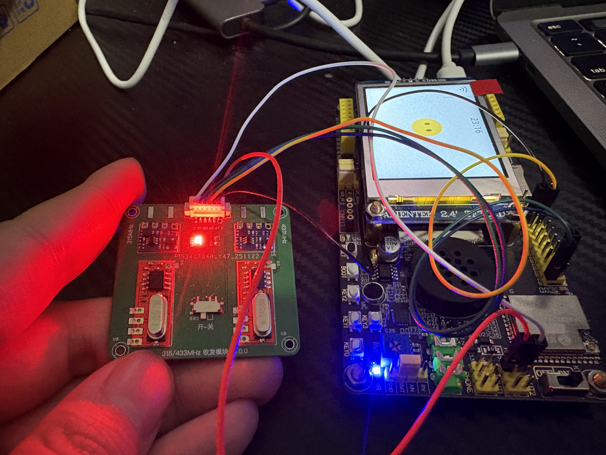

# PR: 集成 RF 射频模块支持，实现 AI 对话控制射频功能

## 概述

本次 PR 为 xiaozhi-esp32 项目添加 RF 射频模块支持，支持通过 AI 对话控制 315MHz 和 433MHz 射频信号收发。已发布独立组件库 `esp32-rf-module`，并在立创开源广场开源硬件拓展板设计。

## ⚠️ 重要说明

**本次 PR 仅包含 RF 射频模块相关代码的集成。**

由于开发环境限制，项目中可能存在其他部分的编译报错问题，但这些问题与本次 RF 模块集成无关。本次提交专注于 RF 模块功能的完整实现，其他编译问题将在后续 PR 中单独处理。

## 功能特性

- ✅ 支持 315MHz 和 433MHz 双频段 RF 信号收发
- ✅ 信号捕获和重放功能
- ✅ 信号持久化存储（NVS Flash，最多10个信号）
- ✅ MCP 工具集成，支持 AI 对话控制
- ✅ 可配置的板子集成框架，其他板子只需简单配置即可启用

## 相关资源

- **硬件设计**：[立创开源广场 - ESP32 RF 拓展模块](https://u.lceda.cn/account/user/projects/index/detail?project=14f6a9072add4fdd9f9f65be7babce14)
- **组件库**：[ESP Component Registry - esp32-rf-module v0.1.6](https://components.espressif.com/components/zhoushoujianwork/esp32-rf-module/versions/0.1.5/readme)
- **验证状态**：✅ 代码和硬件功能已验证

## 硬件连接



硬件连接说明：
- RF 模块通过 6P 接口连接到 ESP32 开发板
- 支持 315MHz 和 433MHz 双频段收发
- 模块包含独立的发送和接收电路

## 技术实现

### 1. 组件依赖集成

在 `main/idf_component.yml` 中添加了 RF 模块组件依赖：

```yaml
zhoushoujianwork/esp32-rf-module:
  version: ^0.1.6
  rules:
    - if: target in [esp32s3, esp32c3, esp32c5, esp32c6]
```

### 2. Kconfig 配置选项

在 `main/Kconfig.projbuild` 中添加了 `BOARD_HAS_RF_PINS` 配置选项：

```kconfig
config BOARD_HAS_RF_PINS
    bool "Board has RF module pins configured"
    default n
    help
        Enable this if the board has RF module pins (RF_TX_315_PIN, RF_RX_315_PIN, etc.) 
        defined in its config.h file.
```

### 3. Board 基类框架

在 `main/boards/common/board.h` 和 `board.cc` 中添加了：

- `RFModule* rf_module_` - RF 模块实例
- `InitializeRFModule()` - 初始化方法（在板子构造函数中调用）
- `GetRFPinConfig()` - 虚方法，板子可重写以提供自定义引脚配置
- `GetRFModule()` - 获取 RF 模块实例
- 自动注册 MCP 工具，支持 AI 对话控制

### 4. CMakeLists.txt 条件依赖

在 `main/CMakeLists.txt` 中添加了条件依赖逻辑：

```cmake
if(CONFIG_BOARD_HAS_RF_PINS)
    find_component_by_pattern("zhoushoujianwork__esp32-rf-module" RF_MODULE_COMPONENT RF_MODULE_COMPONENT_PATH)
    if(RF_MODULE_COMPONENT)
        list(APPEND COMPONENT_REQUIRES ${RF_MODULE_COMPONENT})
    endif()
endif()
```

### 5. ATK DNESP32S3 板子示例实现

在 `main/boards/atk-dnesp32s3/` 中实现了完整的示例：

- **config.h**: 定义了 RF 引脚配置
  ```c
  #define RF_TX_315_PIN  GPIO_NUM_19
  #define RF_RX_315_PIN  GPIO_NUM_20
  #define RF_TX_433_PIN  GPIO_NUM_17
  #define RF_RX_433_PIN  GPIO_NUM_18
  ```

- **atk_dnesp32s3.cc**: 
  - 在构造函数中调用 `InitializeRFModule()`
  - 重写 `GetRFPinConfig()` 方法

## 使用方法

### 对于其他板子开发者

只需三步即可为任意板子添加 RF 功能：

1. **在板子的 `config.h` 中定义 RF 引脚**：
   ```c
   #define RF_TX_315_PIN  GPIO_NUM_XX
   #define RF_RX_315_PIN  GPIO_NUM_XX
   #define RF_TX_433_PIN  GPIO_NUM_XX
   #define RF_RX_433_PIN  GPIO_NUM_XX
   ```

2. **在板子构造函数中调用初始化**：
   ```cpp
   YourBoard() {
       // ... 其他初始化代码 ...
   #if CONFIG_BOARD_HAS_RF_PINS
       InitializeRFModule();
   #endif
   }
   ```

3. **在 menuconfig 中启用**：
   ```
   Component config → Xiaozhi Assistant → Board has RF module pins configured
   ```

### AI 对话控制示例

启用后，用户可以通过自然语言与 AI 对话控制 RF 模块：

- "帮我发送一个433MHz信号，地址A1B2C3，按键01"
- "复制一下这个遥控器的信号"
- "列出所有保存的信号"
- "发送第3个信号"
- "清理所有保存的信号"

## MCP 工具列表

RF 模块提供以下 MCP 工具（通过 `RegisterRFMcpTools()` 自动注册）：

1. `self.rf.send` - 发送 RF 信号
2. `self.rf.receive` - 接收 RF 信号（阻塞等待）
3. `self.rf.replay` - 重播最后接收的信号
4. `self.rf.capture` - 捕捉模式
5. `self.rf.list_signals` - 列出所有保存的信号
6. `self.rf.send_by_index` - 按索引发送信号
7. `self.rf.clear_signals` - 清理保存的信号
8. `self.rf.get_status` - 获取模块状态
9. `self.rf.set_config` - 配置模块参数

## 运行日志示例

以下是实际运行时的关键日志，展示了 RF 模块的完整功能：

### 初始化阶段

```
I (493) Board: Initializing RF module...
I (493) gpio: GPIO[18]| InputEn: 1| OutputEn: 0| OpenDrain: 0| Pullup: 1| Pulldown: 0| Intr:3 
I (503) gpio: GPIO[20]| InputEn: 1| OutputEn: 0| OpenDrain: 0| Pullup: 1| Pulldown: 0| Intr:3 
I (513) RFModule: [闪存] Flash storage enabled: enabled=1, handle=4
I (523) RFModule: [闪存] 已加载信号: 281D8800 (433MHz, 共6个信号)
I (533) RFModule: RF module initialized: TX433=17, RX433=18, TX315=19, RX315=20
I (543) Board: RF module initialized: TX433=17, RX433=18, TX315=19, RX315=20
```

### MCP 工具注册

```
I (553) MCP: Add tool: self.rf.send
I (553) MCP: Add tool: self.rf.receive
I (553) MCP: Add tool: self.rf.get_status
I (563) MCP: Add tool: self.rf.capture
I (563) MCP: Add tool: self.rf.replay
I (563) MCP: Add tool: self.rf.list_signals
I (573) MCP: Add tool: self.rf.send_by_index
I (573) MCP: Add tool: self.rf.clear_signals
I (573) MCP: Add tool: self.rf.set_config
```

### 信号接收和重播

```
I (23173) RF_MCP: [接收] 开始等待RF信号，超时时间: 10000ms
I (25083) RFModule: [433MHz接收] 检测到可用信号
I (25083) RFModule: [433MHz接收] 原始值:0x281D81, 位长:23, 协议:1, 脉冲:252μs
I (25083) RFModule: [433MHz接收] ✓ 信号接收成功: 281D8100 (24位:0x281D81, 协议:1, 脉冲:252μs, 位长:23)
I (25193) RFModule: [闪存] 信号已保存到索引 6 (共7个信号)
I (25193) RF_MCP: [接收] ✓ 接收到信号: 281D8100 (433MHz, 协议:1, 脉冲:252μs, 等待时间:2018ms)

I (25663) RF_MCP: [重播] 使用捕捉的信号: 281D8100 (433MHz)
I (25673) RFModule: [433MHz发送] 开始发送信号: 281D8100 (24位:0x281D81, 协议:1, 脉冲:320μs, 重复:3次)
I (25843) RFModule: [433MHz发送] ✓ 发送完成: 281D8100 (24位:0x281D81, 协议:1, 脉冲:320μs, 重复:3次, 耗时:153ms)
```

### 信号列表查询

```
I (36553) RF_MCP: [列表] 闪存中保存了 7 个信号
I (36553) RF_MCP: [列表] 信号[7]: 281D8100 (433MHz, 协议:1, 脉冲:252μs)
I (36563) RF_MCP: [列表] 信号[6]: 281D8800 (433MHz, 协议:1, 脉冲:255μs)
I (36573) RF_MCP: [列表] 信号[5]: 79FB9600 (315MHz, 协议:1, 脉冲:326μs)
I (36573) RF_MCP: [列表] 信号[4]: 79FB9200 (315MHz, 协议:1, 脉冲:329μs)
I (36583) RF_MCP: [列表] 信号[3]: 79FB9400 (315MHz, 协议:1, 脉冲:327μs)
I (36593) RF_MCP: [列表] 信号[2]: 79FB9C00 (315MHz, 协议:1, 脉冲:328μs)
I (36593) RF_MCP: [列表] 信号[1]: 79FB9800 (315MHz, 协议:1, 脉冲:327μs)
```

### 按索引发送信号

```
I (59543) RF_MCP: [按索引发送] 发送信号[5]: 79FB9600 (315MHz, 协议:1, 脉冲:326μs)
I (59553) RF_MCP: [按索引发送] 频率已改为: 315MHz
I (59553) RFModule: [315MHz发送] 开始发送信号: 79FB9600 (24位:0x79FB96, 协议:1, 脉冲:320μs, 重复:3次)
I (59723) RFModule: [315MHz发送] ✓ 发送完成: 79FB9600 (24位:0x79FB96, 协议:1, 脉冲:320μs, 重复:3次, 耗时:153ms)
```

## 硬件接口

外部拓展模块采用 6P 引脚接口：

| 引脚编号 | 名称 | 说明 |
|---------|------|------|
| 1 | G | 地线 |
| 2 | 3T | 315MHz 发送 |
| 3 | 3R | 315MHz 接收 |
| 4 | 4R | 433MHz 接收 |
| 5 | 4T | 433MHz 发送 |
| 6 | V | 电源 (3.3V) |

## 修改文件清单

- `main/CMakeLists.txt` - 添加 RF 模块条件依赖
- `main/Kconfig.projbuild` - 添加 `BOARD_HAS_RF_PINS` 配置选项
- `main/boards/common/board.h` - 添加 RF 模块框架接口
- `main/boards/common/board.cc` - 实现 RF 模块初始化和 MCP 工具注册
- `main/boards/atk-dnesp32s3/atk_dnesp32s3.cc` - ATK 板子示例实现
- `main/boards/atk-dnesp32s3/config.h` - ATK 板子 RF 引脚配置
- `main/idf_component.yml` - 添加 esp32-rf-module 组件依赖

## 测试验证

- ✅ 代码编译通过（RF 模块相关部分）
- ✅ ATK DNESP32S3 板子功能验证
- ✅ RF 信号发送/接收功能正常
- ✅ MCP 工具注册和 AI 对话控制功能正常
- ✅ 信号持久化存储功能正常
- ✅ 315MHz 和 433MHz 双频段功能正常

## 向后兼容性

- 默认情况下 `BOARD_HAS_RF_PINS` 为 `n`，不影响现有板子
- 只有明确启用该选项的板子才会加载 RF 模块组件
- 代码层面使用 `#if CONFIG_BOARD_HAS_RF_PINS` 条件编译，确保未启用时不影响性能

## 后续计划

- 支持更多板子集成 RF 功能
- 根据用户反馈优化 MCP 工具接口
- 完善文档和示例

---

**注意**：本 PR 仅包含主项目集成代码，RF 模块核心功能已作为独立组件库 `esp32-rf-module` 发布到 ESP Component Registry。

