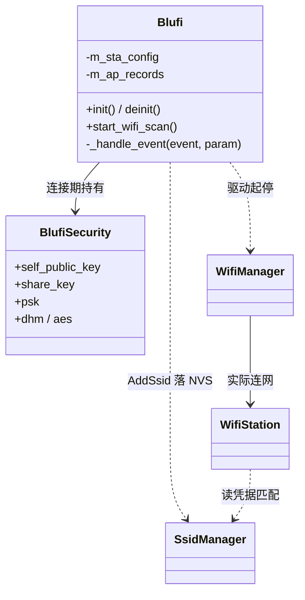
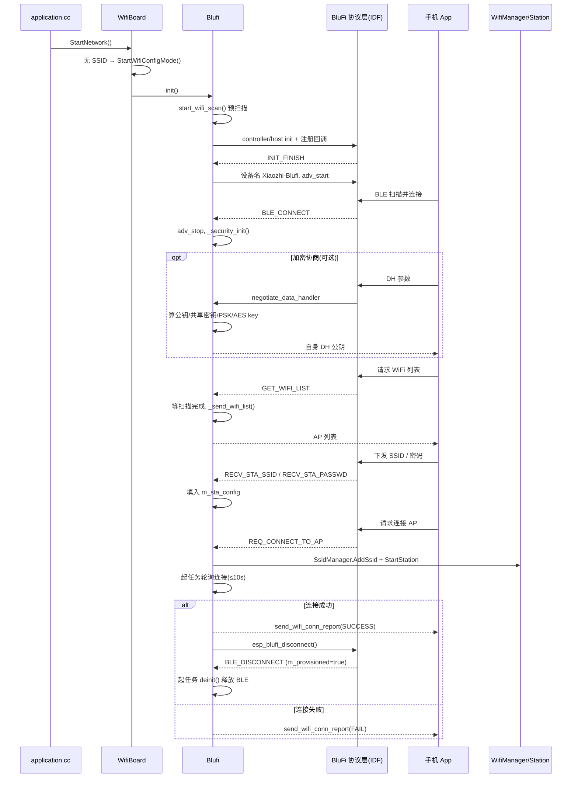
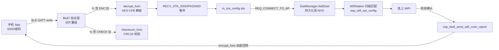

# BLE 配网(BluFi)设计与实现分析

## 1. 概述

功能职责:在设备没有 WiFi 凭据(或用户手动触发)时,通过 BLE 让手机 App 把目标 WiFi 的 SSID / 密码传给设备,设备据此连上 WiFi,并把配网进度回报给手机。底层走 Espressif 的 BluFi 协议(BLE GATT 之上的一套自定义配网帧)。

代码位置:
- 应用层封装:`main/boards/common/blufi.cpp` / `blufi.h`(本仓库自有,约 900 行)
- 触发与编排:`main/boards/common/wifi_board.cc`
- WiFi 连接 / 凭据存储:`managed_components/78__esp-wifi-connect/`(`WifiManager` / `WifiStation` / `SsidManager`)
- 协议层(帧解析、加解密分发、GATT service、分片重组):ESP-IDF 自带 `bt` 组件,不在本仓库
  - `components/bt/common/api/esp_blufi_api.c`
  - `components/bt/common/btc/profile/esp/blufi/{bluedroid_host,nimble_host}/esp_blufi.c`

入口点:`WifiBoard::StartNetwork()`(`wifi_board.cc:52`,由 `application.cc:159` 调用)在无凭据时进入配网;各 board 的按键回调调用 `WifiBoard::EnterWifiConfigMode()`(`wifi_board.cc:199`)手动进入。两条路最终都到 `StartWifiConfigMode()`(`wifi_board.cc:159`),在编译开关 `CONFIG_USE_ESP_BLUFI_WIFI_PROVISIONING` 下执行 `Blufi::GetInstance().init()`。

分析范围:覆盖从触发配网 → BLE 起广播 → 安全协商 → 收凭据 → 连 WiFi → 回报 → 释放 BLE 的完整链路,以及本仓库 `blufi.cpp` 的内部实现。BluFi 协议帧的逐字节解析在 ESP-IDF 内部,只做接口级说明,不展开。

## 2. 设计思路

从代码证据反推的几个关键决策:

配网方式编译期三选一,互斥。`StartWifiConfigMode()` 用 `#ifdef` 在 Hotspot(softAP + 网页)、BluFi、Acoustic(声波)之间择一(`wifi_board.cc:163-196`)。BluFi 路径仅在 `CONFIG_USE_ESP_BLUFI_WIFI_PROVISIONING` 下编译。`init()` 开头还显式拒绝与 Hotspot 共存(`blufi.cpp:113-121`):一旦检测到 WiFi 已处于 config(AP)模式就报错返回,因为二者都要抢占 WiFi 模式。

应用层只做"胶水",不碰协议细节。`blufi.cpp` 自己不解析 BluFi 帧,而是向 IDF 注册一组回调(`esp_blufi_callbacks_t`,`blufi.cpp:206-212` / `287-293`),把事件、密钥协商、加密、解密、校验五件事交给上层实现,协议层负责分片重组与帧分发。这是典型的"框架回调 + 应用补全"分工。

C 回调到 C++ 实例的桥接用 trampoline。BluFi 的 C 接口只接受函数指针,而实现要落在单例对象上。代码用一组 `static` 跳板函数(`_event_callback_trampoline` 等,`blufi.cpp:880-899`)统一转发到 `GetInstance()` 的成员方法。单例(`blufi.cpp:79`)是这个桥接得以成立的前提。

双 BLE host 抽象。同一套逻辑用 `#ifdef CONFIG_BT_BLUEDROID_ENABLED` / `CONFIG_BT_NIMBLE_ENABLED` 提供两份 host init/deinit 实现(`blufi.cpp:163-231` 与 `233-309`),controller 层共用(`blufi.cpp:311-346`)。Bluedroid 和 NimBLE 二选一,这也对应文档里"两者互斥"的约束。

复用 esp-wifi-connect,凭据落 NVS。BluFi 收到的 SSID/密码不直接喂给 `esp_wifi_set_config`,而是 `SsidManager::AddSsid()` 存进 NVS(`blufi.cpp:713`),再由 `WifiStation` 扫描匹配后写入(`wifi_station.cc:173-229`)。好处是配网凭据和正常启动连网走同一套持久化与重连逻辑,BluFi 只负责"录入"。

连接结果用轮询而非事件。`REQ_CONNECT_TO_AP` 起一个 FreeRTOS 任务,以 200ms 为粒度轮询 `wifi.IsConnected()`,最长等 10s(`blufi.cpp:744-755`)。这是为了在 BluFi 回调上下文里拿到"连成/连败"的确定结论再回报,牺牲了一点实时性换实现简单——属于 KISS 取舍,但和 `WifiBoard` 自身那套 60s 超时计时器是两条独立路径(见第 7 节)。

安全是可选的 DH + AES 通道。加密不是必须,由手机端决定是否协商。一旦协商,走 Diffie-Hellman 算共享密钥 → MD5 压成 16 字节 PSK → AES-128-CFB 加解密 + CRC16 校验(`blufi.cpp:384-521`)。密钥每次 BLE 连接重新生成(连上才 `_security_init`,断开即 `_security_deinit`)。

## 3. 核心数据结构

### Blufi(单例,应用层状态机)

```cpp
class Blufi {
    bool inited_;
    BlufiSecurity *m_sec;            // 安全上下文,仅在 BLE 连接期间存在

    wifi_config_t m_sta_config{};    // 暂存手机下发的 SSID/密码/BSSID
    bool m_ble_is_connected;         // BLE 链路状态
    bool m_sta_connected, m_sta_got_ip, m_provisioned;
    bool m_deinited;                 // 防重复 deinit
    uint8_t m_sta_bssid[6], m_sta_ssid[32];
    int m_sta_ssid_len;
    bool m_sta_is_connecting;
    esp_blufi_extra_info_t m_sta_conn_info{};  // 回报给手机的连接附加信息

    std::vector<wifi_ap_record_t> m_ap_records;  // 扫描结果缓存
    bool m_scan_in_progress, m_scan_should_save_ssid;
};
```

字段语义与不变量:
- `m_sta_config` 是"收件箱"——`RECV_STA_SSID/PASSWD/BSSID` 事件逐字段填它(`blufi.cpp:849-865`),`REQ_CONNECT_TO_AP` 时一次性读出(`blufi.cpp:710-711`)。
- `m_sec` 生命周期严格绑定 BLE 连接:`ESP_BLUFI_EVENT_BLE_CONNECT` 时 new,`BLE_DISCONNECT` 时 delete(`blufi.cpp:663` / `668`)。断开后再来的加解密请求会因 `m_sec == nullptr` 被拒(`blufi.cpp:386`、`478`)。
- `m_provisioned` 是终态标志:连成功后置 true(`blufi.cpp:764`),决定 BLE 断开时是"重启广播等下一次"还是"彻底 deinit"(`blufi.cpp:669-681`)。
- `m_scan_should_save_ssid`:配网开始后置 false(`blufi.cpp:714`),避免连接过程中的扫描覆盖掉给手机展示的 AP 列表。

### BlufiSecurity(加密上下文)

```cpp
struct BlufiSecurity {
    uint8_t self_public_key[128];   // DH 自身公钥
    uint8_t share_key[128];         // DH 协商出的共享密钥
    size_t  share_len;
    uint8_t psk[16];                // MD5(share_key) → AES-128 key
    uint8_t *dh_param; int dh_param_len;
    uint8_t iv[16];                 // AES-CFB 的 IV 基底
    mbedtls_dhm_context *dhm;
    esp_aes_context *aes;
};
```

不变量:`psk` 由 `share_key` 经 MD5 得到(`blufi.cpp:450`),再作为 AES key(`blufi.cpp:456`)。`iv` 全程置 0 基底,实际加密时把帧序号 `iv8` 写入 `iv[0]` 当作每帧不同的 IV(`blufi.cpp:486` / `508`)。

实体关系:



## 4. 对外接口契约

`Blufi` 对外暴露面很小,单例 + 三个方法:

`static Blufi& GetInstance()` —— 单例入口(`blufi.h:21`)。所有 static 跳板都靠它定位实例。

`esp_err_t init()`(`blufi.cpp:105`)
- 语义:启动整条 BluFi 配网链路——预扫描 WiFi、初始化 BT controller、初始化 host、注册回调、初始化 BluFi profile。
- 前置条件:WiFi 不能已处于 config(AP)模式,否则返回 `ESP_FAIL` 并打印互斥错误(`blufi.cpp:113-121`)。
- 后置条件:成功后 BluFi profile 起来,经 `INIT_FINISH` 事件设备名置为 `"Xiaozhi-Blufi"` 并开始 BLE 广播。
- 副作用:可能临时切换 WiFi 模式做扫描(`start_wifi_scan`);占用 BT controller。

`esp_err_t deinit()`(`blufi.cpp:141`)
- 语义:停 BluFi profile、关 BT host、关 controller,释放 BLE 资源。
- 幂等:用 `m_deinited` 守卫,重复调用直接返回 `ESP_OK`(`blufi.cpp:144-148`)。
- 调用时机:配网成功后由内部任务触发(`blufi.cpp:674-679`),以及 `WifiBoard::OnNetworkEvent` 收到 `Connected` 时兜底调用(`wifi_board.cc:113`)。

`void start_wifi_scan()`(`blufi.cpp:536`)—— 触发一次 WiFi 扫描;若当前是 AP 模式会先切 STA 再扫(`blufi.cpp:551-579`)。用 `m_scan_in_progress` 防重入。

向 IDF 注册的五个回调(经 trampoline,`blufi.cpp:206-212`):`event_cb` 事件分发、`negotiate_data_handler` DH 协商、`encrypt_func` / `decrypt_func` AES-CFB、`checksum_func` CRC16。它们由协议层在解析每一帧时按需调用,线程上下文是 BluFi/BTC 任务。

## 5. 核心执行流程

整体是一个由 BLE 事件驱动的状态机。`_handle_event`(`blufi.cpp:649`)是中枢。



关键分支与同步点:
- INIT_FINISH(`blufi.cpp:651`):置设备名并起广播,这是 BLE 可被发现的起点。
- BLE_CONNECT / DISCONNECT(`blufi.cpp:659` / `665`):连上停广播 + 初始化安全;断开释放安全。断开时按 `m_provisioned` 二分——未配网成功则重新广播等下一次,已成功则起独立任务做 deinit(不能在回调里同步 deinit,故用 `xTaskCreate`,`blufi.cpp:674`)。
- SET_WIFI_OPMODE(`blufi.cpp:683`):按手机要求切 STA/AP;APSTA 不支持,降级为只起 STA(`blufi.cpp:697-700`)。
- GET_WIFI_LIST(`blufi.cpp:866`):用 `while(m_scan_in_progress) vTaskDelay(500ms)` 阻塞等扫描完成再发——一个简单的忙等同步点。
- REQ_CONNECT_TO_AP(`blufi.cpp:708`):先停掉可能在跑的 AP/STA,延时 500ms,再 `StartStation`,然后起轮询任务判定结果。成功时主动 `esp_blufi_disconnect()` 断 BLE,借 BLE_DISCONNECT 流程顺势 deinit。

错误路径:DH 协商各步失败都会 `btc_blufi_report_error(...)` 把具体错误码回报协议层(`blufi.cpp:388/394/403/...`);AES 参数非法返回负错误码(`blufi.cpp:480` / `502`)。

## 6. 核心数据流程

WiFi 凭据这份核心数据的旅程:



各阶段数据形态:
- 进入:BluFi 帧 `type / fc / seq / data_len / data`(IDF `blufi_int.h`)。`fc`(frame control)的位决定这帧是否加密(`BLUFI_FC_ENC`)、是否带校验(`BLUFI_FC_CHECK`)、方向、是否分片(`BLUFI_FC_FRAG`)。协议层负责按 `seq` 重组分片、按 `fc` 调用本仓库的 decrypt/checksum 回调。
- 解密:`_aes_decrypt`(`blufi.cpp:498`)用 `iv[0]=帧序号` 的 IV 做 AES-128-CFB128 原地解密。
- 落库:SSID/密码先进 `m_sta_config.sta`(内存),`REQ_CONNECT_TO_AP` 时 `SsidManager::AddSsid` 写 NVS(`blufi.cpp:713`)。注意此处不直接调 `esp_wifi_set_config`。
- 应用:`WifiStation` 扫描周边 AP,在 `SsidManager` 列表里 `find_if` 匹配到对应凭据后才 `esp_wifi_set_config`(`wifi_station.cc:173-229`)。即"扫到了才连"。
- 回传:连接结论经 `esp_blufi_send_wifi_conn_report`(成功/失败/连接中三态,`blufi.cpp:783/798/840`)发回手机;若协商了加密,出向帧由 `encrypt_func` 加密。

AP 列表数据流(反方向):`start_wifi_scan` → `WIFI_EVENT_SCAN_DONE` → `_wifi_scan_event_handler` 把结果存进 `m_ap_records`(`blufi.cpp:634-636`)→ `GET_WIFI_LIST` 时 `_send_wifi_list` 转成 `esp_blufi_ap_record_t` 发出,只带 SSID 和 RSSI(`blufi.cpp:605-614`)。

## 7. 待核实 / 存疑

DH 公钥长度回写疑点。`negotiate_data_handler` 在 type=0x01 分支里 `*output_len = dhm_len`(`blufi.cpp:463`),而 `self_public_key` 是用 `mbedtls_dhm_make_public(..., dhm_len, ...)` 生成的(`blufi.cpp:435`)。两处都用 `dhm_len`,逻辑自洽;但公钥实际字节数是否恒等于 `dhm_len` 取决于 mbedtls 行为,未在本仓库验证,属协议层契约。

明文打印密码。`ESP_LOGI(BLUFI_TAG, "Recv STA PASSWORD : %s", ...)`(`blufi.cpp:864`)会把明文密码打到日志。这是观察到的事实,生产固件建议降级日志等级,但不属于功能 bug。

BSSID 下发后未参与连接。`RECV_STA_BSSID` 把 BSSID 写进 `m_sta_config.sta.bssid` 并置 `bssid_set=true`(`blufi.cpp:849-852`),但 `REQ_CONNECT_TO_AP` 只用 ssid/password 调 `AddSsid`(`blufi.cpp:710-713`),BSSID 没传给连接路径。`WifiStation` 靠扫描匹配选 AP,因此指定 BSSID 在当前实现里基本无效。需结合 `SsidManager`/`WifiStation` 进一步确认是否有意为之。

两套连接超时并存。BluFi 路径在事件里直接 `WifiManager::StartStation()` + 自带 10s 轮询任务(`blufi.cpp:744-755`),而 `WifiBoard` 还有一套 60s `connect_timer_` + `TryWifiConnect` 逻辑(`wifi_board.cc:89-104`)。BluFi 配网阶段是否会触发 `WifiBoard` 那条计时路径、二者如何交互,需要结合 `WifiManager` 事件回调实际运行时序确认,静态读代码不能完全断定。

协议帧逐字节解析、分片重组、ACK 机制均在 ESP-IDF `bt` 组件内(`btc/.../esp_blufi.c`),本报告只到接口级,未逐行核实其实现。

NimBLE 分支未实测。`CONFIG_BT_NIMBLE_ENABLED` 那套 host init/deinit(`blufi.cpp:233-309`)逻辑与 Bluedroid 不同(注册回调与 host init 顺序相反,`blufi.cpp:295-306`),本次以 Bluedroid 为主线分析,NimBLE 分支按代码推断,未在设备上验证。
