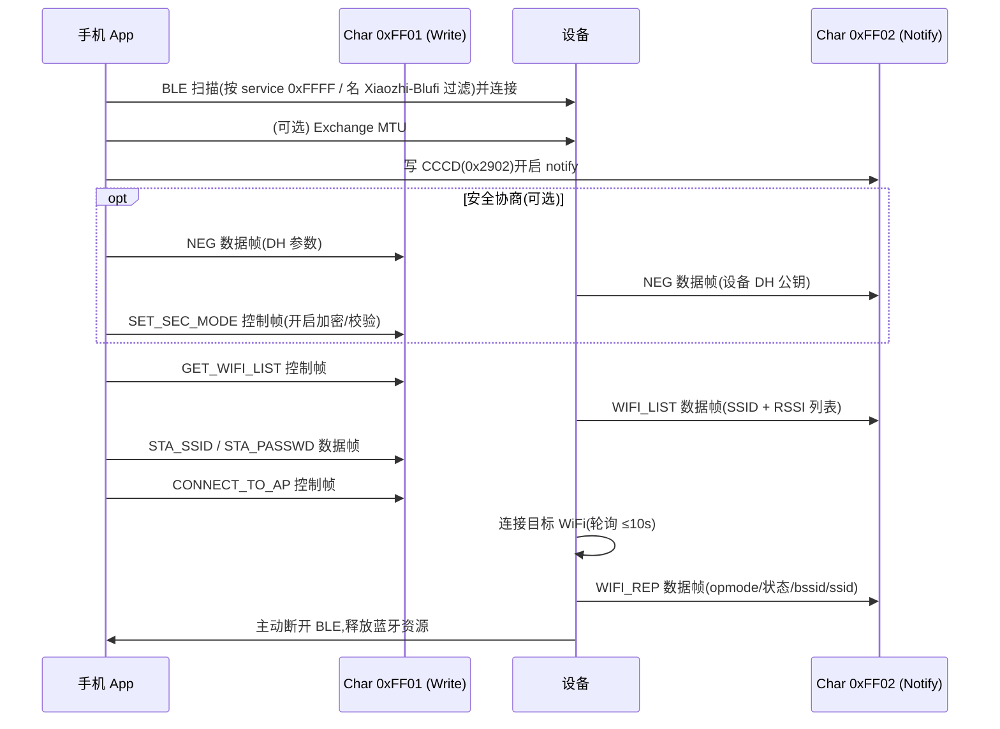

# BluFi 配网协议细节分析

承接 [blufi_analysis_zh.md](./blufi_analysis_zh.md)(应用层链路分析),本篇深入 BluFi 协议层,逐项回答:GATT 配置、MTU 协商与分片、绑定、扫描、加密、数据包结构、错误码、超时、与手机 App 的交互。

协议层代码不在本仓库,而在 ESP-IDF 的 `bt` 组件。下文凡标 `[IDF]` 的路径都相对 IDF 根(本机 `~/.espressif/esp-idf-554/`),其余为本仓库路径。本机 IDF 版本 5.5.4,BluFi 协议版本 `0x0103`(`[IDF] components/bt/common/btc/profile/esp/blufi/include/blufi_int.h:19-21`)。

提示:当前 `sdkconfig` 里 `CONFIG_USE_ESP_BLUFI_WIFI_PROVISIONING` 与 `CONFIG_BT_ENABLED` 都未开启,默认走 Hotspot 配网。BluFi 是 menuconfig 里需手动启用的可选项,以下分析针对启用后的行为。两个 BLE host(Bluedroid / NimBLE)注册的 UUID 与协议完全一致,GATT 细节以 Bluedroid host 为例。

## 1. Service UUID 与 Characteristic UUID 配置

全部用 16-bit UUID,定义在 `[IDF] components/bt/common/btc/profile/esp/include/btc_blufi_prf.h:34-44`:

| 角色 | UUID | 属性(Property) | 权限(Permission) | 方向 |
|------|------|------|------|------|
| Service | `0xFFFF` | — | — | — |
| Char P2E | `0xFF01` | Write | Write(开 SMP 则 Write+Enc+MITM) | 手机 → 设备 |
| Char E2P | `0xFF02` | Read + Notify | Read | 设备 → 手机 |
| Descriptor(E2P 的 CCCD) | `0x2902` | — | Read + Write | 手机开关 notify |

P2E(Phone-to-ESP)是手机下发命令/数据的写入口,E2P(ESP-to-Phone)是设备回报的通知出口。两个特征 + 一个 CCCD 描述符,服务句柄数 `BLUFI_HDL_NUM=6`。GATT service 的创建与特征挂载见 `[IDF] .../bluedroid_host/esp_blufi.c:231-449`:`BTA_GATTS_CreateService` → 加 P2E 特征(`:402`)→ 加 E2P 特征(`:416`)→ 加 CCCD(`:424`)→ `INIT_FINISH`。

设备收到对 P2E 的 GATT Write 后,在 `BTA_GATTS_WRITE_EVT` 里把数据交给 `btc_blufi_recv_handler`(`esp_blufi.c:365-368`);回报则通过 `esp_blufi_send_notify` 对 E2P 句柄做 `HandleValueIndication`(`esp_blufi.c:513-522`)。

广播配置(`esp_blufi.c:47-72`):`adv_data` 里 `include_name=true`、`include_txpower=true`、携带 16-bit service UUID `0xFFFF`;广播间隔 `adv_int_min/max=0x100`(256 × 0.625ms = 160ms),类型 `ADV_TYPE_IND`。设备名本项目改成了 `Xiaozhi-Blufi`(`main/boards/common/blufi.cpp:15`,在 `INIT_FINISH` 事件里 `esp_ble_gap_set_device_name` 设置,`blufi.cpp:653`),IDF 默认名是 `BLUFI_DEVICE`。

## 2. MTU 协商与是否支持大于 MTU 的分片

MTU 协商由手机端发起(GATT Exchange MTU)。设备侧在 `BTA_GATTS_MTU_EVT` 收到协商结果,据此更新分片大小(`esp_blufi.c:388-391`):

```c
blufi_env.frag_size = (mtu < BLUFI_MAX_DATA_LEN ? mtu : BLUFI_MAX_DATA_LEN) - BLUFI_MTU_RESERVED_SIZE;
```

其中 `BLUFI_MAX_DATA_LEN=255`,`BLUFI_MTU_RESERVED_SIZE = sizeof(blufi_hdr)(4) + 2(total_len) + 2(checksum) + 3(L2CAP) = 11`(`blufi_int.h:86,189`)。未协商前用默认 GATT MTU 23,即默认 `frag_size = 23 - 11 = 12` 字节(`BLUFI_FRAG_DATA_DEFAULT_LEN`,`blufi_int.h:190`)。协商到更大 MTU 后,单帧内容上限提到 `min(mtu,255) - 11`。

支持大于 MTU 的传输:支持,靠 BluFi 自己的应用层分片(见第 3 节)。单帧内容受 `frag_size` 限制,但一条逻辑消息可拆成多帧,总长由 16-bit `total_len` 表示(理论上限 65535)。这套分片独立于 BLE/L2CAP 层自身的分片,是 BluFi 协议在 GATT 之上叠的一层。

## 3. 分片协议

帧头固定 4 字节,分片帧在 data 区前面多 2 字节"剩余总长"(`blufi_int.h:56-73`):

```
普通帧:  | type | fc | seq | data_len |        data[data_len]        | [checksum(2)] |
分片帧:  | type | fc | seq | data_len | total_len(2) | frag_content | [checksum(2)] |
```

`fc` 的 FRAG 位(`BLUFI_FC_FRAG=0x10`)标记当前帧是否分片。

发送端 `btc_blufi_send_encap`(`[IDF] .../blufi_prf.c:214-294`):当 `remain_len > frag_size`,每片塞 `frag_size` 字节内容,并在 data 开头写 2 字节"剩余总长"`remain_len`,置 FRAG 位;循环递减直到最后一片不超过 `frag_size`,该片不带 FRAG。注意:checksum/加密都是逐帧、在分片之后做的。

接收端 `btc_blufi_recv_handler`(`blufi_prf.c:159-212`):
- 收到 FRAG 帧且 `offset==0`(首片):读 data 前 2 字节为 `total_len`,`osi_malloc(total_len)` 分配聚合缓冲 `aggr_buf`;之后每片把 `data+2`(跳过长度前缀)拷进 `aggr_buf`,推进 `offset`。
- 收到非 FRAG 帧且 `offset>0`(末片):校验 `offset + data_len == total_len`,拷入后调用 `btc_blufi_protocol_handler` 处理完整消息,释放 `aggr_buf`。
- 边界保护:首片时若 `aggr_buf` 非空 → `MSG_STATE_ERROR`;累计超过 `total_len` → `DATA_FORMAT_ERROR`。

`data_len` 是单字节,单帧 data 最大 255;跨帧总长用 `total_len`(uint16)。

## 4. 是否需要绑定(bonding)

默认不需要 BLE 配对/绑定。P2E 特征权限是明文 `GATT_PERM_WRITE`,只有在 `CONFIG_BT_BLUFI_BLE_SMP_ENABLE` 打开时才升级为 `GATT_PERM_WRITE_ENC_MITM`(要求加密+MITM 的链路,`esp_blufi.c:403-407`)。

本项目的 Kconfig(`main/Kconfig.projbuild:844-851`)在选 BluFi 时只 `select BT_ENABLED / BT_BLE_42_FEATURES_SUPPORTED / BT_BLE_BLUFI_ENABLE / MBEDTLS_DHM_C`,没有 select SMP,所以默认无 BLE 层绑定。NimBLE 分支虽然设了 `ble_hs_cfg.sm_io_cap=4`(NO_INPUT_NO_OUTPUT),但 `sm_bonding=1` 也只在 `CONFIG_EXAMPLE_BONDING` 下才置(`blufi.cpp:254-257`),本项目同样未开。

关键区分:BluFi 的"加密"是应用层自己的 DH+AES(第 6 节),和 BLE 链路层的 pairing/bonding 是两套独立机制。默认配置下,手机无需和设备配对即可写 P2E 完成配网,安全性由可选的应用层加密保证。

## 5. 是否支持主动扫描

要分两层看,"主动扫描"在 BLE 和 WiFi 语境下含义不同。

BLE 广播侧:设备用 `ADV_TYPE_IND`(可连接、可被扫描的非定向广播),filter policy 为 `ADV_FILTER_ALLOW_SCAN_ANY_CON_ANY`(允许任意 scan request 和连接请求)。手机做 active scan 能发现设备。但 `set_scan_rsp=false`(`esp_blufi.c:48`),没有配置 scan response 数据,所以主动扫描拿不到额外的 scan response 内容;设备名靠 `include_name=true` 直接放在广播包(ADV)里,被动扫描也能看到。结论:支持被主动扫描发现,但无独立 scan response 负载。

WiFi 扫描侧(配网语境下通常指这个):支持设备主动扫描周边 AP 并把列表回报手机。手机发 `GET_WIFI_LIST` 控制帧,设备回 `WIFI_LIST` 数据帧。应用层 `start_wifi_scan` / `_send_wifi_list`(`blufi.cpp:536/597`),协议层打包 `btc_blufi_send_wifi_list`(`blufi_prf.c:385-417`),每条记录格式 `len(1) | rssi(1) | ssid`。本项目还做了"预扫描":`init()` 阶段就先扫一遍把结果缓存,手机来要时直接发(`blufi.cpp:111-115`)。

## 6. 是否传输加密

可选,且是应用层加密,由手机决定是否开启。手机发 `SET_SEC_MODE` 控制帧(subtype 0x01)设置 `blufi_env.sec_mode`(`[IDF] .../blufi_protocol.c:36-38`)。`sec_mode` 的位定义(`blufi_int.h:82-85`):

| 位 | 含义 |
|----|------|
| `0x01` | DATA 帧带校验(checksum) |
| `0x02` | DATA 帧加密 |
| `0x10` | CTRL 帧带校验 |
| `0x20` | CTRL 帧加密(实际未启用,见下) |

加密算法链(本仓库实现,`blufi.cpp`):DH(Diffie-Hellman)协商共享密钥 → MD5 压成 16 字节 PSK → AES-128-CFB128 原地加解密(`_aes_encrypt/_aes_decrypt`,`blufi.cpp:477-517`);校验用 CRC16(`esp_crc16_be`,`blufi.cpp:519-521`)。每帧 IV 取固定 IV 基底但把帧序号写进 `iv[0]`(`blufi.cpp:486/508`)。

收方向顺序(`blufi_prf.c:132-153`):先按 `fc.ENC` 解密,再按 `fc.CHECK` 验 CRC16。校验覆盖范围是从 `seq` 起的 `data_len+2` 字节(即 seq + data_len + data,不含 type/fc),2 字节校验值附在 data 末尾(`blufi_prf.c:146-147`)。

发方向规则(`btc_blufi_send_encap`,`blufi_prf.c:254-281`):
- CTRL 帧:只按 CTRL_CHECK 位加校验,从不加密。
- DATA 帧(NEG 与 ERROR_INFO 除外):按 DATA_CHECK 加校验、按 DATA_ENC 加密。
- NEG(密钥协商)帧本身永不加密——此时密钥尚未建立。

所以"加密"只作用于 WiFi 凭据这类 DATA 帧;控制帧、协商帧、错误帧不加密。若手机不发 `SET_SEC_MODE`,则全程明文,仅靠 BLE 物理层的近场特性。

## 7. 传输协议详情

### 数据包结构

帧头 4 字节 + 可选 2 字节校验,`type` 字段再拆为大类(低 2 位)和子类型(高 6 位):

```
type:    [ subtype : 6 bits ][ type : 2 bits ]    // BLUFI_BUILD_TYPE / BLUFI_GET_TYPE
fc(bit): ENC 0x01 | CHECK 0x02 | DIR 0x04 | REQ_ACK 0x08 | FRAG 0x10
         DIR: 0=P2E(手机→设备) 1=E2P(设备→手机)
```

大类(`blufi_int.h:98,110`):`0x0` = CTRL 控制帧,`0x1` = DATA 数据帧。

控制帧子类型(`blufi_int.h:99-108`):

| subtype | 含义 | 触发事件 |
|---------|------|---------|
| 0x00 | ACK | — |
| 0x01 | SET_SEC_MODE | 设 sec_mode |
| 0x02 | SET_WIFI_OPMODE | `SET_WIFI_OPMODE` |
| 0x03 | CONNECT_TO_AP | `REQ_CONNECT_TO_AP` |
| 0x04 | DISCONNECT_FROM_AP | `REQ_DISCONNECT_FROM_AP` |
| 0x05 | GET_WIFI_STATUS | `GET_WIFI_STATUS` |
| 0x06 | DEAUTHENTICATE_STA | `DEAUTHENTICATE_STA` |
| 0x07 | GET_VERSION | 设备直接回版本帧 |
| 0x08 | DISCONNECT_BLE | `RECV_SLAVE_DISCONNECT_BLE` |
| 0x09 | GET_WIFI_LIST | `GET_WIFI_LIST` |

数据帧子类型(`blufi_int.h:111-133`,挑常用):`0x00 NEG`(密钥协商)、`0x01 STA_BSSID`、`0x02 STA_SSID`、`0x03 STA_PASSWD`、`0x0f WIFI_REP`(连接结果回报)、`0x10 REPLY_VERSION`、`0x11 WIFI_LIST`、`0x12 ERROR_INFO`、`0x13 CUSTOM_DATA`。还有 SoftAP/证书/私钥等一系列,本项目配网用不到。

控制帧/数据帧的分发逻辑在 `btc_blufi_protocol_handler`(`blufi_protocol.c:22-251`):CTRL 帧多数转成 `btc_msg` 投递给应用回调,GET_VERSION 直接在协议层回 `REPLY_VERSION`;DATA 的 NEG 帧调 `negotiate_data_handler` 并把返回的公钥回发,其余 DATA 帧带数据投递回调。

### 序号与 ACK

每帧有 1 字节 `seq`,发送端 `send_seq++` 自增(`blufi_prf.c:252`),接收端校验是否等于期望的 `recv_seq`,不连续即报 `SEQUENCE_ERROR`(`blufi_prf.c:124-130`)。BLE 连接建立/断开时双向 seq 清零(`esp_blufi.c:462,486`)。

ACK 是可选的:发送帧的 `fc.REQ_ACK` 置位时,接收端回一个 ACK 控制帧,data 为被确认的 seq(`blufi_prf.c:155-157` 与 `419-428`)。但接收 ACK 侧的序号核对是 TODO,没真正实现(`blufi_protocol.c:33-35`),即协议层不做重传,可靠性依赖 BLE 链路本身。

### 错误码

`esp_blufi_error_state_t`(`[IDF] components/bt/common/api/include/api/esp_blufi_api.h:68-82`),共 13 个:

```
0  SEQUENCE_ERROR        序号不连续
1  CHECKSUM_ERROR        CRC 校验失败
2  DECRYPT_ERROR         解密失败
3  ENCRYPT_ERROR         加密失败
4  INIT_SECURITY_ERROR   安全上下文未初始化
5  DH_MALLOC_ERROR       DH/聚合缓冲分配失败
6  DH_PARAM_ERROR        DH 参数未就绪
7  READ_PARAM_ERROR      DH 参数解析失败
8  MAKE_PUBLIC_ERROR     生成 DH 公钥失败
9  DATA_FORMAT_ERROR     帧长度/格式非法
10 CALC_MD5_ERROR        MD5 计算失败
11 WIFI_SCAN_FAIL        WiFi 扫描失败
12 MSG_STATE_ERROR       分片状态错乱
```

错误经 `btc_blufi_report_error` 触发应用回调,同时可由 `btc_blufi_send_error_info` 打包成 `ERROR_INFO` 数据帧(subtype 0x12,1 字节状态码)发回手机(`blufi_prf.c:85-94, 429-451`)。本仓库在 DH/AES 各失败点都调用了 `btc_blufi_report_error`(`blufi.cpp:388/394/...`)。

STA 连接状态码 `esp_blufi_sta_conn_state_t`(`esp_blufi_api.h:49-54`):`SUCCESS=0 / FAIL=1 / CONNECTING=2 / NO_IP=3`,作为 `WIFI_REP` 帧的一个字段回报。

### 超时定义

协议层本身无超时与重传机制(ACK 可选且未做重传)。超时都在上层:
- 应用层连接判定:`REQ_CONNECT_TO_AP` 后起任务以 200ms 粒度轮询,最长等 10s(`kConnectTimeoutMs`,`blufi.cpp:748`)。
- Board 层连接超时:`CONNECT_TIMEOUT_SEC = 60s`(`wifi_board.cc:27`),超时进配网模式。
- 发送拥塞退避:`esp_blufi_send_encap` 在没有可发包额度时每 10ms 重试(`esp_blufi.c:574-577`)。
- BLE 连接级 idle 超时本代码未显式设定,由 controller 默认参数管理。

## 8. 如何与手机 App 交互

官方客户端是 EspBlufi(Android / iOS,源码与下载见 Espressif 官方 BluFi 文档)。从协议帧层面看,一次完整配网的交互序列:



要点:手机所有下发(命令 + 凭据)都 GATT Write 到 P2E(0xFF01);设备所有回报都经 E2P(0xFF02)的 notify,因此手机必须先开 CCCD。命令是控制帧、凭据/列表/结果是数据帧。SSID 与密码作为独立的 STA_SSID / STA_PASSWD 数据帧分别下发,再用 CONNECT_TO_AP 控制帧触发连接。配网成功后设备侧主动断 BLE(`blufi.cpp:787-789` 的 `esp_blufi_disconnect`),借 `BLE_DISCONNECT` 流程顺势 `deinit` 释放蓝牙。

自写客户端需严格遵循上述帧格式(type/fc/seq/data_len、分片、可选加密与 CRC),并实现 DH 协商才能用加密通道;不开加密则可全程明文交互。

## 小结对照表

| 维度 | 结论 |
|------|------|
| Service / Char UUID | Service `0xFFFF`;P2E `0xFF01`(Write);E2P `0xFF02`(Read+Notify);CCCD `0x2902` |
| MTU 协商 | 手机发起,设备据此更新 frag_size = min(mtu,255) − 11;默认 MTU 23 → frag 12 |
| 大于 MTU 分片 | 支持,BluFi 应用层分片,total_len(uint16)最大 65535 |
| 绑定 bonding | 默认不需要;仅 `CONFIG_BT_BLUFI_BLE_SMP_ENABLE` 才要求加密链路,本项目未开 |
| 主动扫描 | BLE:可被 active scan 发现但无 scan response 负载;WiFi:支持设备主动扫描并回报列表 |
| 传输加密 | 可选,应用层 DH + AES-128-CFB + CRC16;仅 DATA 帧加密,控制/协商帧不加密 |
| 数据包结构 | type+fc+seq+data_len(+total_len)(+checksum);CTRL/DATA 两大类,子类型区分功能 |
| 错误码 | `esp_blufi_error_state_t` 13 种,经 ERROR_INFO 帧回报 |
| 超时 | 协议层无超时/重传;应用层连接轮询 10s,Board 层 60s |
| 与 App 交互 | EspBlufi App;P2E 写命令、E2P notify 回报,SSID/密码分帧下发后 CONNECT_TO_AP |
