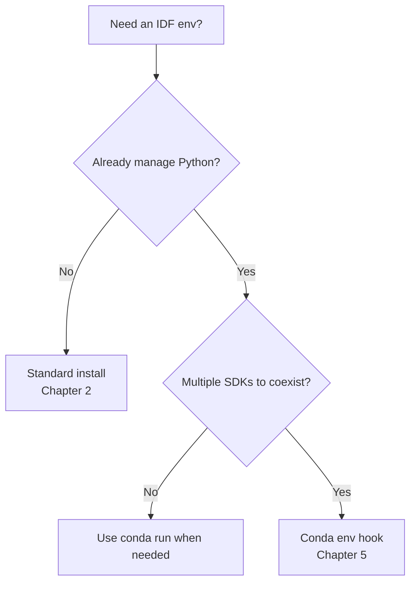
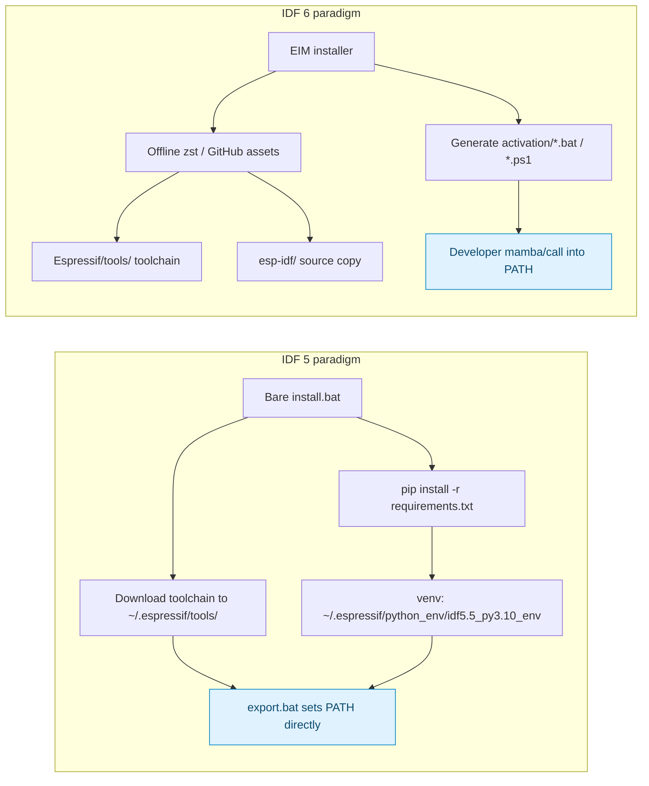
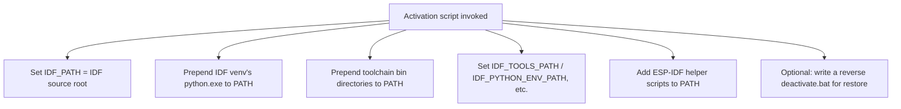
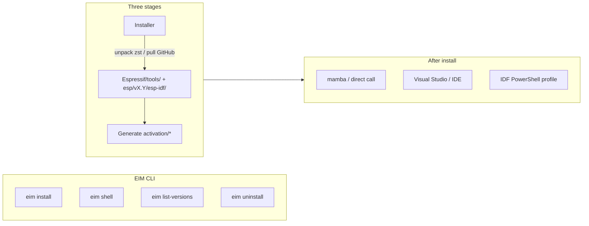
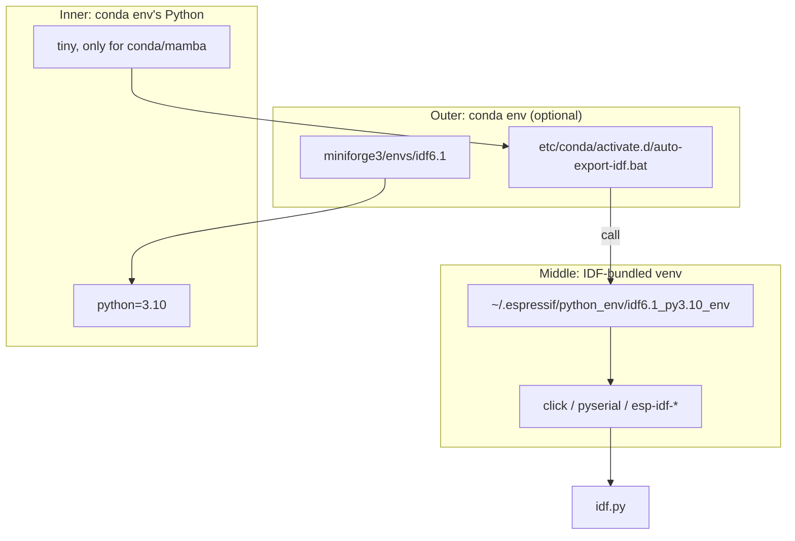
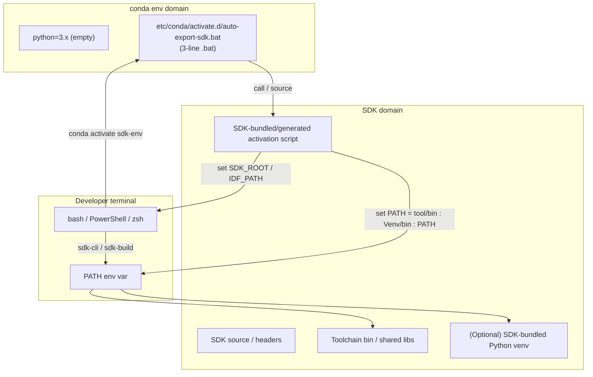

# ESP-IDF Environment Configuration — General Tutorial

> Audience: Developers new to ESP-IDF, or those moving to a new machine and recreating the toolchain; as well as people already on conda/miniforge/mamba who want to integrate IDF with their existing Python environment.
>
> After reading this, you should be able to:
> 1. Tell the architectural differences between IDF 5 and IDF 6 in environment management;
> 2. Use at least one of three deployment paths (standard install / offline archive / Conda integration);
> 3. Know where each path typically breaks and how to recover.

---

## 0. Reading Path

The article has **six layers**; skip ahead as needed:

| Section | Topic | When to read |
| --- | --- | --- |
| **Chapter 1** Overview | Three deployment paths and the decision | First read |
| **Chapter 2** Standard Install | IDF-bundled `install.bat` / `install.sh` flow | Just want it running |
| **Chapter 3** Offline Install | Third-party prebuilt toolchains / EIM archive | Offline machine / fleet provisioning |
| **Chapter 4** IDF 5 vs 6 Architecture | What changes between upgrades | Cross-version migration |
| **Chapter 5** Conda/Mamba Integration | Hooking IDF into a conda env | Python developers |
| **Chapter 6** Troubleshooting | Generic steps when stuck | When something breaks |

---

## 1. Overview: Three Deployment Layers

ESP-IDF is not an ordinary "pip install and run" library. Architecturally it is similar to Android NDK, ARM DS-5, or IAR EWARM — a complex SDK made of three coupled layers:

- **Python layer**: `idf_tools.py`, `esp_idf_monitor`, `idf.py`, `esp-cot-debug`, etc., depending on a fixed set of PyPI packages (`click`, `pyserial`, `uritemplate`, `pyelftools`, `cryptography`, ...).
- **Binary layer**: xtensa-esp-elf-gcc, riscv32-esp-elf-gcc, openocd, esptool, cmake, ninja, esp-clang, ...
- **Build layer**: `idf.py set-target` → generate `sdkconfig` → invoke CMake → invoke ninja → flash with esptool.

There are three ways to deploy this stack:

| Path | Audience | Connectivity | Reproducibility |
| --- | --- | --- | --- |
| **A. Standard install** (`install.bat` / `install.sh`) | Newcomers, online dev boxes | Required | Weak (each machine re-downloads) |
| **B. Offline archive** (EIM `.zst` / third-party `.zip`) | Air-gapped machines / CI / fleet provisioning | Optional | Strong |
| **C. Conda integration** (env hook → IDF activation) | Python developers with conda/mamba | Optional | Strong (env swap) |



---

## 2. Standard Install (works for IDF 5.x and IDF 6.x)

> The shortest path recommended by Espressif. **Suitable for online developers who install once and use for a while.**

### 2.1 Prerequisites

| Item | Windows | Linux / macOS |
| --- | --- | --- |
| OS | Windows 10/11 | Ubuntu 20.04+ / macOS 12+ |
| Python | 3.10+ (IDF 6 prefers 3.10; IDF 5 also supports 3.9) | Same |
| Git | Any | Same |
| Disk | ~10 GB (IDF + toolchain) | Same |
| Network | **Required** (~400 MB of toolchain) | Same |
| Compiler deps | MSVC or MinGW (optional; IDF ships its own gcc) | `apt install build-essential` / Xcode CLT |

### 2.2 Installation Steps

**Step 1: Get the IDF source**

```powershell
# Windows PowerShell
mkdir E:\Programs\esp-idf
cd E:\Programs\esp-idf
Invoke-WebRequest -Uri "https://github.com/espressif/esp-idf/releases/download/v6.1/esp-idf-v6.1.zip" -OutFile esp-idf-v6.1.zip
Expand-Archive esp-idf-v6.1.zip
```

```bash
# Linux / macOS
mkdir -p ~/esp
cd ~/esp
wget https://github.com/espressif/esp-idf/releases/download/v6.1/esp-idf-v6.1.zip
unzip esp-idf-v6.1.zip
```

**Step 2: Run the official installer**

```powershell
# Windows
E:\Programs\esp-idf\esp-idf-v6.1\install.bat
```

```bash
# Linux / macOS
./esp-idf-v6.1/install.sh
```

This will:
- Detect Python, create venv (`~/.espressif/python_env/idf6.1_py3.10_env/`)
- Download toolchain to `~/.espressif/tools/`
- Install all PyPI dependencies

> ⚠️ **IDF 6 requires `install.bat` to have been run.** Otherwise `export.bat` fails the venv check → you hit "venv not found" immediately.

**Step 3: Activate the environment**

```powershell
E:\Programs\esp-idf\esp-idf-v6.1\export.bat
```

After activation, PATH contains `idf.py`, `xtensa-esp32s3-elf-gcc`, `esptool.py`, etc. You can then run:

```powershell
idf.py --version
```

### 2.3 Install on a Non-System Drive (Optional)

By default `install.bat` writes the toolchain to `C:\Users\<user>\.espressif\`.

To relocate, two options:

**A. Use an env var to point the toolchain path** (supported in IDF 5/6)

```powershell
set IDF_TOOLS_PATH=D:\Tools\esp-idf-tools\.espressif
E:\Programs\esp-idf\esp-idf-v6.1\install.bat
```

**B. Use a junction to redirect the C: default to D:** (handy when new deps need to be installed later)

```powershell
# Move the default .espressif to D:
Move-Item 'C:\Users\songo\.espressif' 'D:\Tools\esp-idf-tools\.espressif'
# Create a junction at the C: original location
New-Item -ItemType Junction -Path 'C:\Users\songo\.espressif' -Target 'D:\Tools\esp-idf-tools\.espressif'
```

### 2.4 Uninstall

- **IDF source**: just `rm -rf` it or delete in Explorer.
- **Toolchain**: `rm -rf ~/.espressif` (Windows equivalent: `Remove-Item -Recurse ~\.espressif`).
- **C: junction**: remove it before uninstall (`Remove-Item -Recurse <junction>`); be careful with `-Force` content.

---

## 3. Offline Install (for air-gapped / fleet reproduction)

### 3.1 IDF 5 Era: Third-Party Prebuilt Toolchain Archives

> Common offline method widely used 2020–2024. Some domestic mirrors (dl.espressif.com, esp32cn, ...) ship "toolchain + IDF source" packages.

Download a complete zip (typically 5–10 GB), unzip into `D:\Program\esp-tool\v5.5.3\` or similar. **No `install.bat` needed** — just run the unpacked `export.bat`.

### 3.2 IDF 6 Era: EIM (ESP-IDF Installation Manager)

> The official-recommended offline method.

**Step 1: Download two files**

```powershell
# from https://dl.espressif.com/dl/eim/?tab=offline
Invoke-WebRequest -Uri "https://dl.espressif.com/dl/eim/archive_v6.1_windows-x64.zst" -OutFile D:\Programs\esp-idf\archive_v6.1_windows-x64.zst
Invoke-WebRequest -Uri "https://dl.espressif.com/dl/eim/eim-cli-windows-x64.exe" -OutFile D:\Programs\esp-idf\eim-cli-windows-x64.exe
```

> ⚠️ Verify the SHA256 against the official page before continuing.

**Step 2: Run EIM CLI**

```powershell
& 'D:\Programs\esp-idf\eim-cli-windows-x64.exe' install `
    --use-local-archive 'D:\Programs\esp-idf\archive_v6.1_windows-x64.zst' `
    --idf-features core `
    --target 'esp32,esp32s3' `
    --non-interactive true `
    --do-not-track true
```

**Step 3: Activate via the EIM-generated script**

```powershell
call "C:\Espressif\idf-6.1\activation\Microsoft.v6.1_profile.bat"
```

> On macOS / Linux, EIM installs IDF to `~/esp/<ver>`, and the activation script lives at `~/esp/<ver>/activation/`.

### 3.3 Relocating EIM's Default Location

EIM defaults to `C:\Espressif\` (Windows) or `~/esp/` (macOS/Linux). To relocate, **prefer patching the EIM-generated activation script** over using junctions:

```powershell
# Replace hard-coded C:\Espressif with D:\Tools\esp\Espressif in activation/*.bat
$files = Get-ChildItem 'C:\Espressif\idf-6.1\activation\*' -Include '*.bat', '*.ps1'
foreach ($f in $files) {
    (Get-Content $f -Raw) -replace 'C:\\Espressif', 'D:\\Tools\\esp\\Espressif' | Set-Content $f -NoNewline
}
```

---

## 4. IDF 5 vs IDF 6 — Architectural Differences

> This is about **principles**, not specific version numbers — any IDF 5.x and 6.x falls into the same comparison.

### 4.1 One-Sentence Summary

IDF 5's design philosophy is **"downloader + source + activation script"**; IDF 6 changes to **"offline archive + installer + auto-generated activation scripts"**.



### 4.2 Dimension-by-Dimension Comparison

| Dimension | IDF 5 | IDF 6 | Implication |
| --- | --- | --- | --- |
| Toolchain source | `install.bat` / `idf_tools.py install` downloads into `~/.espressif/tools/` | **Offline archive** `archive_<ver>_<plat>.zst` ships the toolchain (EIM online fallback) | 5 needs network; 6 can be air-gapped |
| Toolchain version | `esp-14.2.0_2024xxx` | `esp-15.2.0_2025xxx` | **GCC major version bump in 6** — deps may shift |
| venv path validation | `export.bat` reads but doesn't enforce | **Enforces** `~/.espressif/python_env/idf6.X_py3.10_env` or dies | 6 cannot skip the install step |
| Activation script | `export.bat` / `export.sh` (in repo) | **`Microsoft.v6.X_profile.bat`** + `*_deactivate.bat` + `.ps1` profiles (generated by EIM) | 6 scripts are **written by EIM on the fly** — no `git clone` shortcut |
| Install manager | `idf_tools.py` inside the package | **Independent EIM CLI / GUI** | 6 decouples "install" from "use" |
| `IDF_TOOLS_PATH` | Anything | Default `~/.espressif`, overridable | Same |
| Desktop entry | `IDF PowerShell.lnk` | Multiple `.lnk` (one per version) | 5 one-to-one; 6 better for multi-version |
| CMake | 3.x | **4.0.3** | 6 requires `cmake_minimum_required` ≥ 3.22 |
| Toolchain + static libs | xtensa-gcc + binutils | xtensa-gcc **+ optional esp-clang (LLVM)** | 6 adds an alternative toolchain entry |
| IDF copy | Single clone `D:\Programs\esp-idf\esp-idf-vX.Y\` | EIM copies to `<install-root>/esp/vX.Y/esp-idf/` (with `managed_components/`) | 6 copy is **self-contained**, offline-buildable |
| Component download | `idf-component-manager` resolves `idf_component.yml` at parse time | Same component-manager, but IDF 6 also uses SPM (KnownPackages) metadata | Stricter dependency resolution in 6 |

### 4.3 The Three Most Operationally-Impactful Upgrades

1. **EIM is detached from the IDF source** — In 5.x, "install + use" was one script; in 6 it splits into two: EIM handles install, IDF source just provides "things to use".
2. **The venv validation moves to the front** — 5's `export.bat` deferred the check ("trust the caller"); 6 enforces it as the very first line of `tools/activate.py --export`. **Anyone calling `export.bat` hits this gate immediately.**
3. **Toolchain becomes self-contained** — 5 pulls at runtime; 6 ships pre-baked inside the zst. **Air-gapped install + orders-of-magnitude faster setup.**

---

## 5. How Activation Scripts and EIM Work

Understanding this lets you migrate to any IDF version or similar SDK and make the right choices.

### 5.1 What Activation Scripts Do

Whether it's `export.bat` (IDF 5), `Microsoft.v6.X_profile.bat` (EIM), or `setup_env.sh`, they all do the same thing:



Three key things:
1. **PATH prepend** — `set PATH=%IDF_TOOLS%\xtensa-esp-elf\...bin;%PATH%` so system PATH versions are shadowed.
2. **venv wins** — `set PATH=%IDF_PYTHON_ENV_PATH%\Scripts;%PATH%` makes `python` resolve to IDF's Python first.
3. **Multi-version coexistence** — When multiple IDF versions are installed, switching the env triggers different scripts that overwrite each other's PATH.

### 5.2 EIM's Design



EIM's core innovation is **separating "install phase" from "use phase"**:
- **Install phase**: `eim install` unpacks zst / pulls GitHub, lands in fixed directories, writes activation scripts. One network hit; never needed again.
- **Use phase**: `eim shell` or `call activation/*.bat` injects IDF into PATH. No network at all.

This means **you can use anything that creates and runs a .bat/sh** (conda, poetry, direnv, asdf, pixi) to trigger the second phase, without modifying EIM itself.

### 5.3 The Two-Layer venv Structure

IDF's "Python environment" is actually two layers:



Why this design?
- **conda env** owns "the semantics of switching" — consistent across IDEs / shells.
- **IDF venv** owns "PyPI dependency encapsulation" — no conda pollution, avoids conda upgrades breaking IDF constraints.

**Never** `pip install click pyserial` into the `idf6.1` conda env directly — it conflicts with IDF's constraint files, and conda's own upgrades will purge them.

---

## 6. Conda/Mamba Integration

### 6.1 Decision Tree


Only worth using the conda-env-hook route if you already manage Python with conda, and you want multi-SDK coexistence / cross-IDE consistency. Otherwise Chapter 2's standard install is simpler.

### 6.2 Pattern Overview (Architectural View)

Any SDK that is "Python-driven + toolchain + activation script" (ESP-IDF, Android NDK, IAR Build, Trace32, Renode SDK, ARM DS-5, LLVM Toolchain, CUDA Toolkit, oneAPI, Xilinx Vivado, STM32CubeIDE) can use this integration pattern:



Three core points:
1. **conda env owns "environment-switching semantics"** — does NOT install SDK deps; just ships a Python that the hook can find.
2. **SDK domain owns "Python venv + toolchain + activation scripts"** — does not pollute conda.
3. **A 3-line .bat hook** wires them together.

### 6.3 Three-Step Method (Works for Any SDK)

1. **Create an empty conda env**: `mamba create -n <name> -y python=<ver>`. **Do not** install SDK dependencies into the conda env — leave that for the SDK's own venv.
2. **Install the SDK into a separate directory**: Use the SDK's recommended installer / offline package, landing at a fixed location (e.g. `D:\Tools\<sdk>-<ver>\`). Make sure the SDK's activation script ends up at a predictable sub-path.
3. **Write a 3-line .bat hook**: in `etc/conda/activate.d/auto-<sdk>.bat`, call `call "<sdk-root>/<activate-script>"`.

> In this pattern: **conda = the developer's entry**, **SDK domain = the actual runtime**. Decoupled, so switching SDKs is as easy as switching git branches.

### 6.4 Operational Template

```powershell
# Step 1: Create an empty env
mamba create -n <sdk-env> -y python=3.10

# Step 2a: EIM style
/path/to/eim-cli install --use-local-archive <archive>.zst --activation-script-path-override <sdk-root>/activation

# Step 2b: Extract a zip for some scripts
Expand-Archive -Path <sdk>.zip -DestinationPath <sdk-root>

# Step 2c: For unfriendly SDKs, junction the default C: install location to D:
New-Item -ItemType Junction -Path 'C:\default-sdk-location' -Target '<D:\SDK-path>'

# Step 3: Patch hard-coded paths (optional)
$files = Get-ChildItem '<sdk-root>/activation/*.bat', '<sdk-root>/activation/*.ps1'
foreach($f in $files){
  (Get-Content $f -Raw) -replace 'C:\\Default', 'D:\\Real' | Set-Content $f -NoNewline
}

# Step 4: Write the hook
# Save to <conda-root>/envs/<sdk-env>/etc/conda/activate.d/auto-<sdk>.bat
# Three lines:
#   @echo off
#   echo [Conda Auto Load] <SDK name>...
#   call "<sdk-root>/activation/<sdk>-profile.bat"

# Step 6: Verify
mamba run -n <sdk-env> <sdk-cli> --version
```

### 6.5 Advanced Tips

| Need | Solution |
| --- | --- |
| Install SDK off the system drive | Check if the SDK supports env-var paths; otherwise use **a junction** to redirect C: defaults to D: (`New-Item -ItemType Junction`), then decide whether to keep or remove it after install |
| Activation script hard-codes C: paths | **Patch the script** directly (cleaner); or keep the junction if you don't want to modify upstream |
| Coexist multiple SDK versions | One conda env per version, each env with one hook that calls its SDK's activation script — no interference |
| Prefer offline install | Always prefer official offline archives (EIM / `.zip` / Docker image) over `components-file` / GitHub mirrors |
| Windows Terminal / VS Code friendly | EIM auto-generates desktop shortcuts and PowerShell profiles; other SDKs typically only emit `.bat` — add a `.ps1` for Windows Terminal as needed |
| Linux equivalent | conda hook is a `.sh`; replace `call` with `source` |
| macOS equivalent | macOS IDF installs to `~/esp` instead of `~/.espressif`; the logic is unchanged |

### 6.6 When NOT to Use This

- The SDK toolchain **depends on system PATH** (e.g. `cmake`/`ninja` are OS-global tools) — installing into an isolated directory overwrites PATH and needs special handling.
- The SDK exposes no "activation script" (only `source xxx` works) — fall back to OS profile.
- CI reuse is needed — prefer Docker over conda-env-hooks.

---

## 7. Why This Is a Win (for Python Developers)

> If you already use Python daily — whether `pyenv` + `venv`, or `mamba` + `poetry` — your dev box already has Python environment management. The SDK toolchain is also "Python + a bunch of binaries", so you can **reuse existing environment machinery** rather than invent a new one.

### 7.1 Direct Benefits

1. **Unified environment switching**: `mamba activate idf6.1` / `mamba activate py311` / `mamba activate ml` — one command to swap a project's full dep set, **no manual PATH or env-var juggling**.
2. **Replicable across SDKs**: Once you have this for IDF 5/6, the same pattern applies to IDF v7 / Renode / STM32CubeIDE etc.
3. **Dependency isolation**: Each IDF version keeps its own `click`/`pyserial` in its own venv; IDE upgrades don't disturb version locks.
4. **Repo-friendly**: conda env lives in `<conda>/envs/`; SDK lives in its own directory — both decoupled from the git repo. `git status` stays clean; no `.gitignore` rules for toolchains.
5. **D:-friendly**: SD installers default to writing C: — using junctions and script edits lets all real data land on D:, leaving C: zero-trace. Same pattern works for any tool that wants to avoid the system drive.
6. **Offline reproducible**: Offline archives (`.zst`/`.zip`) are GB-scale self-contained — copy them to any machine and you're done; no need to redo `git clone` + `install.bat` + PyPI.
7. **Reuse the Python toolchain**: `pip` / `venv` / `mamba` already known — no new mechanism to learn.
8. **Containerizable**: This pattern is isomorphic with Dockerfile — `conda run` ↔ `RUN conda activate ... && command`. Move to GitHub Actions / Docker with one-line changes.

### 7.2 Indirect Benefits

1. **Version pinning**: mamba env is **declarative**; on activation everything is overwritten — no "stale half-old PATH residue".
2. **Auditable scripts**: `auto-export-idf.bat` is 3 lines; anyone reading it knows what to tweak. No spelunking through `~/.bashrc` / system PATH / registry.
3. **Reproducible failures**: `mamba env list` shows every SDK state at a glance; on failure, `mamba env remove -n <bad-env>` and rebuild.
4. **Cross-IDE friendly**: Trae / VSCode / Cursor / CLion / shell all auto-detect conda envs; after `activate <sdk-env>` the SDK CLI is immediately usable in any IDE terminal — no per-project IDE setup.
5. **Multi-SDK coexistence**: One conda can host N envs, each with its own SDK; switching projects is just env-swapping, no global PATH pollution.

---

## 8. Troubleshooting Flow

### 8.1 `idf.py` says "file not found" / "Python not found"

```
where python
where idf.py
where xtensa-esp32s3-elf-gcc
```

If all three are missing → activation script didn't take effect. Run it again manually.

### 8.2 First build says "Cannot establish a connection to the component registry"

`idf_component.yml` resolution needs to reach `components-file.espressif.com`. Set up a proxy or:

```bash
set IDF_COMPONENT_REGISTRY_URL=https://components-file.espressif.com  # default
```

### 8.3 venv error "Python not found" / "venv missing"

IDF 6's earlier venv check surfaces this first. Fix:

```powershell
# Re-run install
<idf-path>/install.bat

# Or confirm the venv dir exists
Test-Path "$HOME\.espressif\python_env\idf6.1_py3.10_env\Scripts\python.exe"
```

### 8.4 Toolchain missing / GCC not found

```powershell
# What IDF wants
idf.py --version

# What's actually being used
where xtensa-esp32s3-elf-gcc
```

Mismatch → `IDF_TOOLS_PATH` is pointing at the wrong directory.

### 8.5 Path conflicts (e.g. "cmake already exists")

Make sure IDF's PATH entries are **first** (that's exactly what the activation script does). If you've manually `set PATH=...` afterward, just rerun the activation script.

### 8.6 Stuck on "CMake 4.0.3 not found"

CMake 4.x requires ≥ 3.22. EIM ships 4.10.3; for manual installs, grab the latest from [cmake.org](https://cmake.org).

### 8.7 Windows: missing C++ build tools

Even though IDF bundles its own gcc, the ESP-IDF Tools Installer / Visual Studio CMake integration may still need MSVC. Install **Visual Studio Build Tools 2022** (with C++ build tools).

---

## 9. Lessons Learned (Architectural Pitfalls)

1. **Don't assume v5's habits transfer to v6**. v6 moves venv validation to the first step of the activation script — old flows get stuck there. **General rule**: on every SDK upgrade, read the new activation script to see what new preconditions it enforces.
2. **Don't run `install.bat` manually** unless you actually want the online path — it writes the toolchain/venv to the system drive. EIM / offline archive is the more robust entry point.
3. **Don't pip-install SDK deps into the conda env** (`pip install click pyserial` into the env) — let the SDK's own venv handle it; avoids conflicts with the SDK's constraint files.
4. **Default C: paths should be "actively moved" to D:**, not hidden behind junctions. Junctions are temporary; if a script later hard-codes `C:\...`, the junction stops being enough.
5. **Avoid hard-coded paths** — write scripts with relative paths or env vars (`%USERPROFILE%`, `%PORTFILE%`, `%SDK_ROOT%`); otherwise they break on a different machine.
6. **Verify offline archive integrity** — always SHA256 any offline archive (typically GB-scale, SHA256 listed on the official page). A partial file makes EIM fail with `failed to extract`.
7. **Watch out for desktop shortcuts** — EIM's `<SDK>_<ver>_Powershell.lnk` launches its own PowerShell profile (bypassing conda), which can confuse users. Prefer the conda hook route; delete the desktop shortcut.

---

## 10. References

- **ESP-IDF Installation Manager (EIM)**: [download distribution](https://dl.espressif.com/dl/eim/), [v0.8 blog (2026-03)](https://developer.espressif.com/blog/2026/03/esp-idf-installation-manager/), [CLI documentation](https://docs.espressif.com/projects/idf-im-ui/en/latest/cli_installation.html)
- **ESP-IDF 6.x**: [official site](https://docs.espressif.com/projects/esp-idf/en/v6.1/esp32/get-started/index.html)
- **GitHub Assets mirror**: `set IDF_GITHUB_ASSETS=dl.espressif.com/github_assets` (national-network acceleration)
- **conda/mamba hook mechanism**: Files under `etc/conda/activate.d/` (`*.bat` / `*.sh`) run on `conda activate <env>`; counterparts for deactivation live in `etc/conda/deactivate.d/`
- **This project's docs**: [AGENTS.md](../AGENTS.md), [custom-board.md](./custom-board.md), [mqtt-udp.md](./mqtt-udp.md)