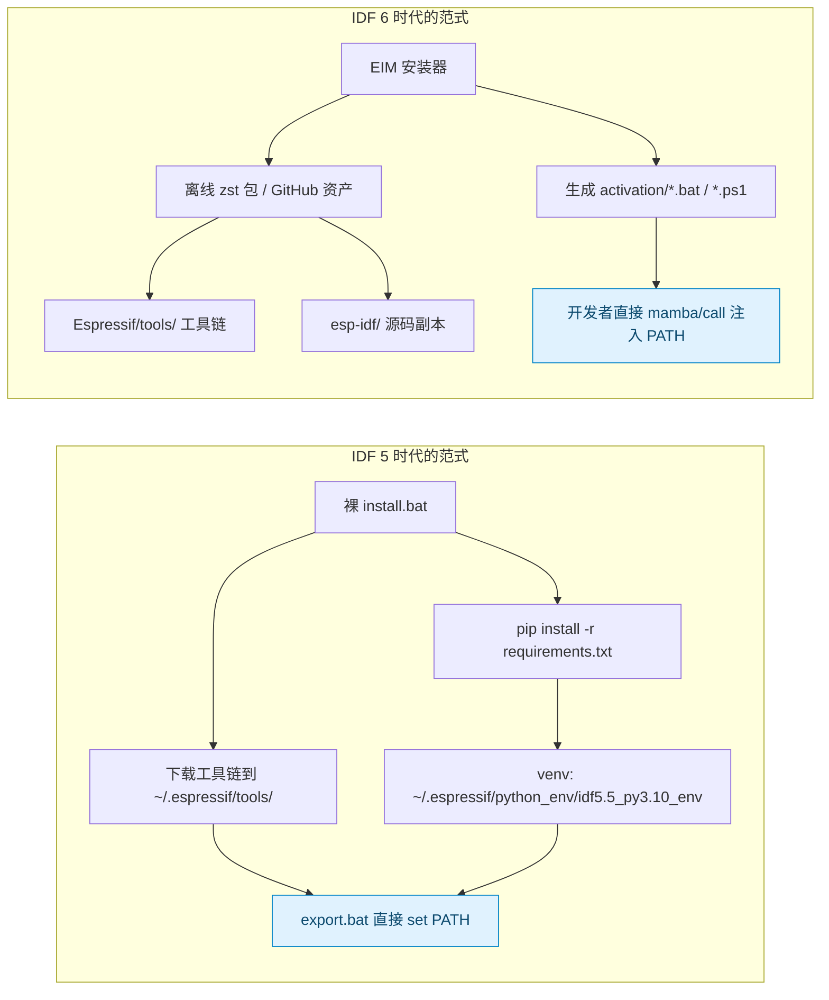
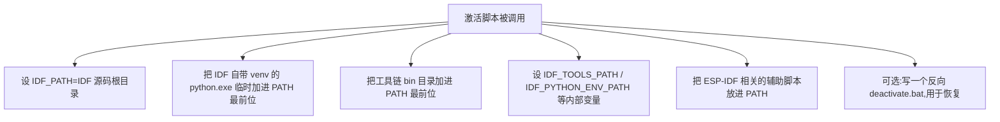
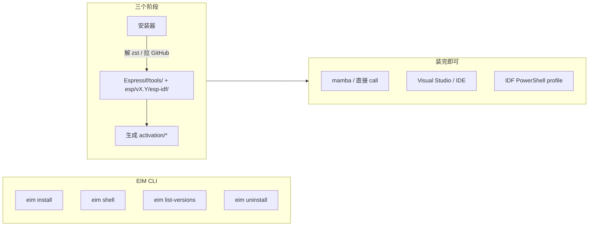
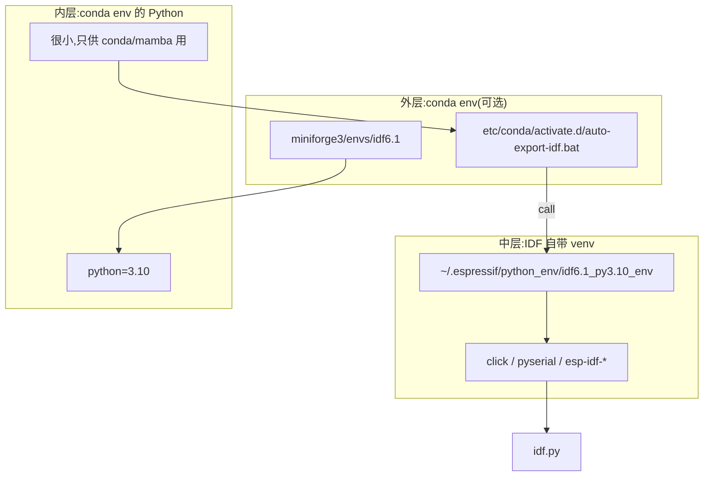
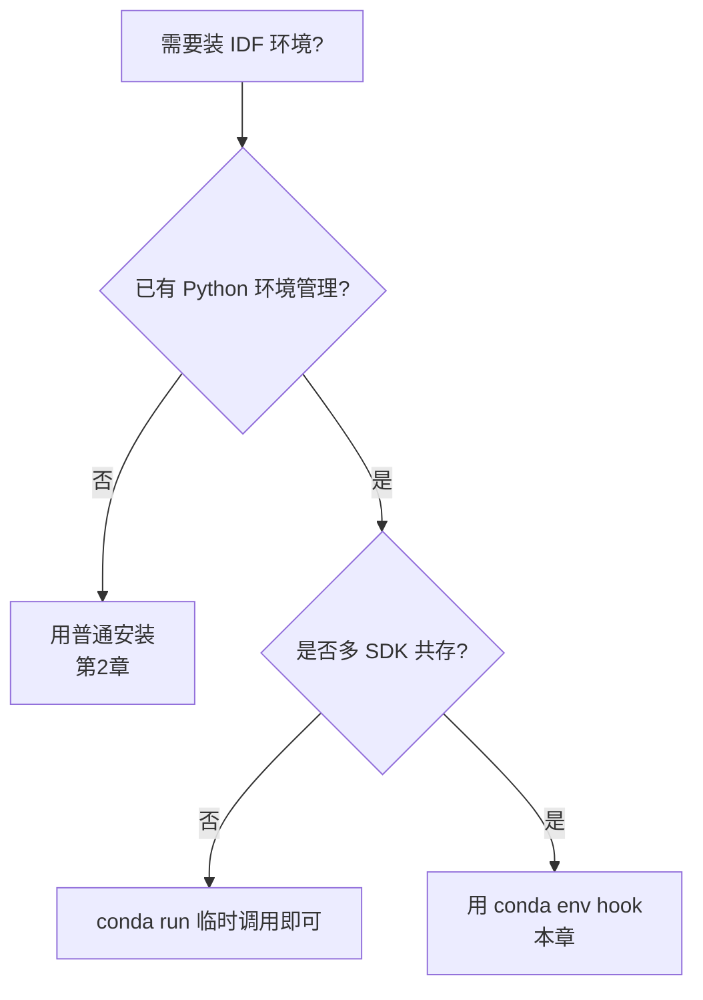
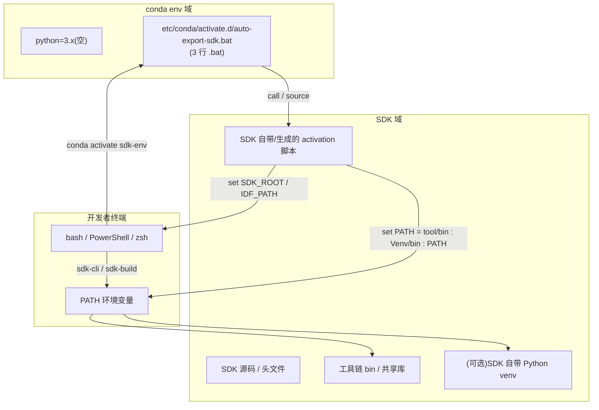

# ESP-IDF 环境配置通用教程

> 适用对象:第一次接触 ESP-IDF、或者要在新机器上复刻环境的开发者;同时已经在用 conda/miniforge/mamba、想了解如何把 IDF 和现有 Python 环境融合的人。
>
> 阅读完本文应能:
> 1. 知道 IDF 5 和 IDF 6 在环境管理上有什么区别;
> 2. 至少会三种部署路径中的一种(普通安装 / 离线工具链包 / Conda 融合);
> 3. 知道每种路径会卡在什么地方,如何修复。

---

## 0. 阅读路径

本文分**四个层次**,可按需跳读:

| 章节 | 主题 | 何时读 |
| --- | --- | --- |
| **第 1 章** 总览 | 三种部署路径一览与决策 | 第一次读 |
| **第 2 章** 普通安装 | IDF 自带 `install.bat` / `install.sh` 的标准流程 | 只想装一遍跑起来的人 |
| **第 3 章** 离线安装 | 第三方预装工具链 / EIM 离线包 | 离线机器 / 多设备复刻 |
| **第 4 章** IDF 5 vs 6 架构区别 | 升级时要知道的事 | 跨版本迁移时 |
| **第 5 章** Conda/Mamba 融合 | 把 IDF 装进 conda env 钩子链 | Python 程序员 |
| **第 6 章** 故障排除流程 | 卡住时的通用排查步骤 | 出问题时

---

## 2. 普通安装(标准流程,适用于 IDF 5.x 和 IDF 6.x)

> 这是 Espressif 官方推荐的最短路径。**适合联网的开发者,装一次用一段时间**。

### 2.1 准备条件

| 项 | Windows | Linux / macOS |
| --- | --- | --- |
| 操作系统 | Windows 10/11 | Ubuntu 20.04+ / macOS 12+ |
| Python | 3.10+(IDF 6 推荐 3.10,IDF 5 也支持 3.9) | 同上 |
| Git | 任意版本 | 同上 |
| 磁盘空间 | ~10 GB(IDF + 工具链) | 同上 |
| 网络 | **必须**(要下载 ~400 MB 工具链) | 同上 |
| 编译器依赖 | MSVC 或 MinGW(可选,默认走 IDF 自带 gcc) | `apt install build-essential` / Xcode CLT |

### 2.2 安装步骤

**Step 1:下载 IDF 源码**

```powershell
# Windows PowerShell
mkdir E:\Programs\esp-idf
cd E:\Programs\esp-idf
Invoke-WebRequest -Uri "https://github.com/espressif/esp-idf/releases/download/v6.1/esp-idf-v6.1.zip" -OutFile esp-idf-v6.1.zip
Expand-Archive esp-idf-v6.1.zip
```

```bash
# Linux / macOS
mkdir -p ~/esp
cd ~/esp
wget https://github.com/espressif/esp-idf/releases/download/v6.1/esp-idf-v6.1.zip
unzip esp-idf-v6.1.zip
```

**Step 2:跑官方安装器**

```powershell
# Windows
E:\Programs\esp-idf\esp-idf-v6.1\install.bat
```

```bash
# Linux / macOS
./esp-idf-v6.1/install.sh
```

这一步会:
- 检测 Python,创建 venv(`~/.espressif/python_env/idf6.1_py3.10_env/`)
- 下载工具链到 `~/.espressif/tools/`
- 安装所有 PyPI 依赖

> ⚠️ **IDF 6 必须跑 install.bat**。否则后续 `export.bat` 会校验失败 → 你会卡在"venv 不存在"那一关。

**Step 3:激活环境**

```powershell
E:\Programs\esp-idf\esp-idf-v6.1\export.bat
```

激活后 PATH 已包含 `idf.py` / `xtensa-esp32s3-elf-gcc` / `esptool.py` 等。可以直接:

```powershell
idf.py --version
```

### 2.4 装到非系统盘(可选)

默认情况下 `install.bat` 会把工具链写到 `C:\Users\<user>\.espressif\`。

要换盘,有两种做法:

**A. 用环境变量指 IDF 工具路径**(IDF 5/6 都支持)

```powershell
set IDF_TOOLS_PATH=D:\Tools\esp-idf-tools\.espressif
E:\Programs\esp-idf\esp-idf-v6.1\install.bat
```

**B. 用 junction 把 C 盘默认路径指到 D 盘**(适合必须安装新依赖时)

```powershell
# 移动默认 .espressif 到 D 盘
Move-Item 'C:\Users\songo\.espressif' 'D:\Tools\esp-idf-tools\.espressif'
# 在 C 盘原位置创建 junction
New-Item -ItemType Junction -Path 'C:\Users\songo\.espressif' -Target 'D:\Tools\esp-idf-tools\.espressif'
```

### 2.5 卸载

- **IDF 源码目录**:直接 `rm -rf` 或在资源管理器删除。
- **工具链**:`rm -rf ~/.espressif`(Windows 等价:`Remove-Item -Recurse ~\.espressif`)。
- **C 盘 junction**:卸载前先 `Remove-Item -Recurse <junction>`(注意 `-Force` 内容)。

---

## 3. 离线安装(适用于离线 / 多设备复刻)

### 3.1 IDF 5 时代:第三方预装工具链包

> 2020~2024 年广泛使用的离线方式。某些国内镜像站(如 dl.espressif.com、esp32cn)提供打包好的"工具链 + IDF 源码"。

下载一个完整 zip(典型大小 5–10 GB),解压到 `D:\Program\esp-tool\v5.5.3\` 之类位置。**不需要 install.bat**,直接调解压后的 `export.bat` 即可使用。

### 3.2 IDF 6 时代:EIM(ESP-IDF Installation Manager)

> **官方推荐**的离线安装方式。

**Step 1:下载两个文件**

```powershell
# 从 https://dl.espressif.com/dl/eim/?tab=offline 下载
Invoke-WebRequest -Uri "https://dl.espressif.com/dl/eim/archive_v6.1_windows-x64.zst" -OutFile D:\Programs\esp-idf\archive_v6.1_windows-x64.zst
Invoke-WebRequest -Uri "https://dl.espressif.com/dl/eim/eim-cli-windows-x64.exe" -OutFile D:\Programs\esp-idf\eim-cli-windows-x64.exe
```

> ⚠️ 下载后校验 SHA256,与官方页面一致再继续。

**Step 2:跑 EIM CLI**

```powershell
& 'D:\Programs\esp-idf\eim-cli-windows-x64.exe' install `
    --use-local-archive 'D:\Programs\esp-idf\archive_v6.1_windows-x64.zst' `
    --idf-features core `
    --target 'esp32,esp32s3' `
    --non-interactive true `
    --do-not-track true
```

**Step 3:激活(EIM 自动生成的脚本)**

```powershell
call "C:\Espressif\idf-6.1\activation\Microsoft.v6.1_profile.bat"
```

> macOS / Linux 上 EIM 把 IDF 装到 `~/esp/<ver>`,激活脚本在 `~/esp/<ver>/activation/`。

### 3.3 装到非默认位置

EIM 默认写到 `C:\Espressif\`(Windows)或 `~/esp/`(macOS/Linux)。要换盘,**推荐改 EIM 生成后的激活脚本**,而不是用 junction:

```powershell
# 把 activation/*.bat 里硬编的 C:\Espressif 替换为 D:\Tools\esp\Espressif
$files = Get-ChildItem 'C:\Espressif\idf-6.1\activation\*' -Include '*.bat', '*.ps1'
foreach ($f in $files) {
    (Get-Content $f -Raw) -replace 'C:\\Espressif', 'D:\\Tools\\esp\\Espressif' | Set-Content $f -NoNewline
}
```

---

## 4. IDF 5 vs IDF 6 架构层面的差别

> 这一节讲**原理上的差别**,不带具体版本号 — 任何 IDF 5.x 和 6.x 都会落入同一对比。

### 4.1 核心差异一句话

IDF 5 的设计哲学是**"下载器 + 源 + 激活脚本"**;IDF 6 改成了**"离线包 + 安装器 + 自动生成的激活脚本"**。



### 4.2 逐维度对比

| 维度 | IDF 5 | IDF 6 | 含义 |
| --- | --- | --- | --- |
| 工具链来源 | `install.bat` / `idf_tools.py install` 现场下载到 `~/.espressif/tools/` | **离线下载包** `archive_<ver>_<plat>.zst` 内置工具链(可选 EIM 联网拉) | 5 必须联网;6 可断网 |
| 工具链版本 | `esp-14.2.0_2024xxx` | `esp-15.2.0_2025xxx` | **6 的 GCC 主版本跳数**,依赖变化 |
| venv 路径校验 | `export.bat` 只读取不强制 | **强制** `~/.espressif/python_env/idf6.X_py3.10_env` 存在否则 `die` | 6 没法绕过"下载阶段" |
| 激活脚本 | `export.bat` / `export.sh`(自带) | **`Microsoft.v6.X_profile.bat`** + `*_deactivate.bat` + `.ps1` profile(EIM 生成) | 6 的脚本是**EIM 现场写的**,没法预先 git clone 出 |
| 安装管理入口 | 工具包里的 `idf_tools.py` | **独立的 EIM CLI / GUI** | 6 把"装"和"用"完全解耦 |
| `IDF_TOOLS_PATH` | 任意 | 默认 `~/.espressif`,但可改 | 不变 |
| 桌面对接 | `IDF PowerShell.lnk` | 多个 .lnk(每个版本一个) | 5 一对一;6 多版本共存更优 |
| CMake | 3.x | **4.0.3** | 6 要求 `cmake_minimum_required` 升到 3.22 |
| 工具链 + 静态库 | xtensa-gcc + 配套 binutils | xtensa-gcc **+ 可选 esp-clang(LLVM)** | 6 多了一个可选工具链入口 |
| IDF 副本 | 单一克隆 `D:\Programs\esp-idf\esp-idf-vX.Y\` | EIM 复制到 `<install-root>/esp/vX.Y/esp-idf/`(带 `managed_components/`) | 6 的"副本"是**自包含**的,离线可编 |
| 组件下载 | `idf-component-manager` 现场解析 `idf_component.yml` | 同样的 component-manager,但 IDF 6 改用 SPM(KnownPackages)元数据 | 6 的依赖解析更严 |

### 4.3 关键架构升级点(运维影响最大的变化)

IDF 6 引入了三个对运维有强影响的架构变化:

1. **EIM 从 IDF 源码里剥离** — 5.x 的"装 + 跑"是一套脚本,6 拆成两段:EIM 负责装,IDF 源码只负责"被用"。
2. **venv 校验前移** — 5 的 `export.bat` 是"信任 caller 已装好"的延迟校验,6 把校验写死在 `tools/activate.py --export` 第一行,**任何调用 `export.bat` 的人都先撞上这一关**。
3. **工具链自包含** — 5 是"idf_tools.py 现场拉",6 是"binary 出厂时把工具链打包到 zst"。**离线可装 + 安装速度数量级提升**。

---

## 5. IDF 激活脚本 / EIM 工作原理

理解原理能帮你**迁移到任意 IDF 版本或类似 SDK** 时做出正确选择。

### 5.1 激活脚本做了什么

不管是 `export.bat`(IDF 5)、`Microsoft.v6.X_profile.bat`(EIM)、还是 `setup_env.sh`,它们**干的事都一样**:



关键三件事:
1. **PATH 注入在前面**:`set PATH=%IDF_TOOLS%\xtensa-esp-elf\...bin;%PATH%`,这样系统 PATH 里的同名工具被屏蔽。
2. **venv 优先**:`set PATH=%IDF_PYTHON_ENV_PATH%\Scripts;%PATH%`,让 `python` 优先指向 IDF 的 Python。
3. **多 ID 可写性**:不同 IDF 版本同时安装时,切换 env 触发不同的激活脚本,各自覆盖对方的 PATH。

### 5.2 EIM(ESP-IDF Installation Manager)的设计



EIM 的核心创新是 **"装机阶段"和"使用阶段"分离**:
- **装机阶段**:`eim install` 解 zst / 拉 GitHub,落到固定目录,写激活脚本。这阶段联网一次,装完就再也不联网。
- **使用阶段**:`eim shell` 或 `call activation/*.bat`,把 IDF 注入 PATH。这阶段完全不联网。

这意味着**你可以用任何"创建并执行 .bat"的环境(conda、poetry、direnv、asdf、pixi)去触发第二阶段**,不需要去改 EIM 本身。

### 5.3 venv 的双层结构

IDF 的"Python 环境"其实是**双层**的:



为什么这么设计?
- **conda env** 负责"环境切换的语义" — 跨 IDE / 跨 shell 一致。
- **IDF venv** 负责"PyPI 依赖的封装" — 不污染 conda,避免 conda 升级破坏 IDF 约束。

**绝不要**把 `click` / `pyserial` 等 IDF 依赖直接 `pip install` 到 `idf6.1` 这个 conda env 里 — 那会破坏 IDF 的约束文件约束,且 conda 自身升级会把它们清理掉。

---

## 6. 与 Conda/Mamba 的融合

### 6.1 适用场景与决策树



只有当**已经用 conda 管理 Python**,且**希望多 SDK 共存 / 跨 IDE 一致**,才值得走 conda env hook 路线。否则第 2 章的普通安装更简单。

### 6.2 模式总览(架构视角)

任何"Python 驱动 + 工具链 + 激活脚本"的 SDK(ESP-IDF、Android NDK、IAR Build、Trace32、Renode SDK、ARM DS-5、LLVM Toolchain、CUDA Toolkit、oneAPI、Xilinx Vivado、STM32CubeIDE),都可以用如下融合模式:



核心三点:
1. **conda env 只管"环境切换语义"** — 不装 SDK 依赖,只装一个供钩子能找到的 Python。
2. **SDK 域自己管理"Python venv + 工具链 + 激活脚本"** — 不污染 conda。
3. **3 行 .bat 钩子**把两者粘起来。

### 6.3 三步法(适用于任何 SDK)

1. **建空 conda env**:`mamba create -n <name> -y python=<ver>`。**不要**把 SDK 依赖装进 conda env,留着给 SDK 自己的 venv 装。
2. **把 SDK 装到独立目录**:用 SDK 推荐的安装器 / 离线包,落到固定位置(如 `D:\Tools\<sdk>-<ver>\`)。让 SDK 自带的"激活脚本"放在固定子目录里。
3. **写 3 行 .bat 钩子**:`etc/conda/activate.d/auto-<sdk>.bat` 里调 `call "<sdk-root>/<activate-script>"`。

> 这套模式里:**conda = "开发者的入口",SDK 域 = "实际运行环境"**。两者解耦,所以切换 SDK 就像切换 git branch 一样轻量。

### 6.4 操作样板

```powershell
# Step 1: 建空 env
mamba create -n <sdk-env> -y python=3.10

# Step 2a: EIM 风格
/path/to/eim-cli install --use-local-archive <archive>.zst --activation-script-path-override <sdk-root>/activation

# Step 2b: 解压 zip 为某些脚本
Expand-Archive -Path <sdk>.zip -DestinationPath <sdk-root>

# Step 2c: 为不友好的 SDK 用 junction 蒙混过装机
New-Item -ItemType Junction -Path 'C:\default-sdk-location' -Target '<D:\SDK-path>'

# Step 3: 改写硬编路径(可选)
$files = Get-ChildItem '<sdk-root>/activation/*.bat', '<sdk-root>/activation/*.ps1'
foreach($f in $files){
  (Get-Content $f -Raw) -replace 'C:\\Default', 'D:\\Real' | Set-Content $f -NoNewline
}

# Step 4: 写钩子
# 写到 <conda-root>/envs/<sdk-env>/etc/conda/activate.d/auto-<sdk>.bat
# 内容 3 行:
#   @echo off
#   echo [Conda Auto Load] <SDK name>...
#   call "<sdk-root>/activation/<sdk>-profile.bat"

# Step 6: 验证
mamba run -n <sdk-env> <sdk-cli> --version
```

### 6.5 进阶技巧

| 需求 | 解法 |
| --- | --- |
| 让 SDK 装到非默认位置(不污染 C 盘) | 看 SDK 是否支持环境变量指定路径;不支持就用 **junction** 把 C 盘默认路径指到 D 盘(`New-Item -ItemType Junction`),装完之后再决定保留或拆掉 |
| 脚本里硬编了 C 盘路径 | **直接改脚本**,把所有 `C:\...` 替换成 `D:\...`,再删 C 盘 junction(更干净);或者保留 junction 适合不想改脚本的场合 |
| 让多个 SDK 版本共存 | 每个版本一个 conda env,每个 env 一个钩子,钩子里 `call` 各自 SDK 的激活脚本。互不干扰 |
| 离线安装优先 | 优先去 SDK 官方下载离线安装包(EIM / 离线 zip / Docker image),避免依赖 `components-file` / `github` 等外网镜像 |
| 让 Windows Terminal / VS Code 友好 | EIM 自动生成 desktop shortcut 与 PowerShell profile;其他 SDK 通常只生成 .bat,可以再加一个 `.ps1` 让 Windows Terminal 调用 |
| 在 Linux 上同理 | conda hook 脚本是 `.sh`,把 `call` 换成 `source` 即可 |
| 在 macOS 上同理 | macOS 上 IDF 安装到 `~/esp` 而不是 `~/.espressif`;逻辑不变 |

### 6.6 何时不该用这套

- SDK 工具链**依赖系统路径**(如 `cmake`、`ninja` 是 OS 全局工具)— 装到独立目录会让 PATH 被覆盖,需要单独处理
- SDK 没法暴露"激活脚本"(`source xxx` 才能用)— 那就只能在 OS profile 里手写
- 需要 CI 复用 — 用 Docker 而不是 conda env hook

---

## 7. 这套环境搭建的优势(对 Python 程序员)

> 假设你日常已经在用 Python,不管是 `pyenv` + `venv`,还是 `mamba` + `poetry`,你的开发机**本来就有 Python 环境管理工具**。SDK 工具链恰好也是"Python + 一堆二进制"的组合,所以可以**复用现成的环境机制**,而不是另起一套。

### 7.1 直接好处

1. **统一的环境切换**:`mamba activate idf6.1` / `mamba activate py311` / `mamba activate ml` — 一条命令切换项目全部依赖,**不需要手工记 PATH 和环境变量**。
2. **跨 SDK 可复制**:本机已经有 idf5.5.3、idf6.1 三个 env,未来装 IDF v7 / Renode / STM32CubeIDE 时,模式完全相同(空 env + 钩子)。
3. **依赖隔离**:每个 IDF 版本各自带自己的 `click`/`pyserial` 版本(由其自带 venv 控制),不会因为 IDE 升级把 `pyproject.toml` 里的版本锁搞乱。
4. **零侵入仓库**:`mamba env` 在 conda envs 目录下,IDF 在独立目录,**与 git 仓库解耦**。git status 干净,无需 `.gitignore` 排除工具链。
5. **D 盘友好**:SDK 装机程序默认会写 C 盘,通过 junction + 脚本改写,可以让所有真实数据落在 D 盘,C 盘零 SDK 痕迹 — 同样的套路适用于任何想"装到非系统盘"的工具。
6. **离线可复刻**:离线安装包(`.zst` / `.zip`)是 GB 级自包含(工具链 + venv + SDK),**离线环境也能复制** — 只要有 zst 和脚本就行,不需要再下一次 `git clone` + `install.bat` + 各种 PyPI。
7. **复用 Python 工具链**:你已经熟悉的 `pip` / `venv` / `mamba` 用来管理 SDK,不用再学一套新机制。
8. **便于容器化**:这套模式与 Dockerfile 完全同构 — `conda run` ↔ `RUN conda activate ... && command`,迁移到 GitHub Actions / Docker 时改写一行就行。

### 7.2 间接好处

1. **版本固定**:mamba env 是**声明式**的,激活时所有路径都被覆盖;不会出现"半新半旧 PATH 残影"。
2. **脚本可审计**:`auto-export-idf.bat` 3 行,谁看了都知道怎么改;不需要去 `~/.bashrc` / 系统 PATH / 注册表翻找。
3. **故障可复现**:`mamba env list` 一眼看清所有 SDK 状态;出问题直接 `mamba env remove -n <bad-env>` 重建。
4. **跨 IDE 友好**:Trae / VSCode / Cursor / CLion / 命令行都支持自动识别 conda env,激活 `<sdk-env>` 后 IDE 终端内 SDK CLI 立刻可用,**IDE 设置不需要为不同项目维护多份**。
5. **多 SDK 共存**:同一个 conda 可装 N 个 env,每个 env 挂不同 SDK;切项目只换 env,不污染全局 PATH。

---

## 8. 故障排除流程

### 8.1 `idf.py` 报"file not found" / "Python 命令未找到"

```
where python
where idf.py
where xtensa-esp32s3-elf-gcc
```

三个都找不到 → 激活脚本没生效。手动再 `call` 一次。

### 8.2 第一次构建报"Cannot establish a connection to the component registry"

`idf_component.yml` 解析要访问 `components-file.espressif.com`。挂代理或者设:

```powershell
set IDF_COMPONENT_REGISTRY_URL=https://components-file.espressif.com  # 默认
```

### 8.3 venv 报错"Python not found" / "venv missing"

IDF 6 的 venv 校验前移会让这种错误最先出现。修复:

```powershell
# 重新跑 install
<idf-path>/install.bat

# 或确认 venv 目录存在
Test-Path "$HOME\.espressif\python_env\idf6.1_py3.10_env\Scripts\python.exe"
```

### 8.4 工具链缺失 / GCC not found

```powershell
# 看 IDF 想用什么
idf.py --version

# 看实际在用
where xtensa-esp32s3-elf-gcc
```

不一致 = `IDF_TOOLS_PATH` 没指向正确目录。

### 8.5 路径冲突(其他"已存在 cmake"等)

确保 IDF 的 PATH 在**最前位**(激活脚本就是干这事的)。如果手动 `set PATH=...` 覆盖过,重新跑激活脚本即可。

### 8.6 卡在 CMake 4.0.3 找不到

CMake 4.x 必须 ≥ 3.22。EIM 自带 4.10.3;手动安装时去 [cmake.org](https://cmake.org) 下载最新版。

### 8.7 Windows 上 C++ 构建工具缺失

虽然 IDF 自带 gcc,但 ESP-IDF Tools Installer / Visual Studio CMake integration 仍可能需要 MSVC。装 **Visual Studio Build Tools 2022**(勾选 C++ build tools)即可。

---

## 9. 经验教训(架构层面的踩坑)

1. **不要假设 v5 的所有套路能直接套到 v6**。v6 把 venv 校验写死在激活脚本第一步,旧流程会卡在这一步。**通用做法**:每次升级 SDK,先看它的激活脚本源码里**新加了哪些前置校验**,不要默认沿用旧经验。
2. **不要手动跑 install.bat**(除非确实要联网拉),它会把工具链/venv 全写到 C 盘。EIM / 离线包 是更稳的入口。
3. **不要把 SDK 依赖装到 conda env**(`pip install click pyserial` 进 conda env)— 让 SDK 自带的 venv 接管,避免与 SDK 的约束文件冲突。
4. **C 盘默认路径要"主动搬到 D 盘"**,而不是用 junction 蒙混过关。junction 是临时手段,后续脚本一旦去硬编 `C:\...`,junction 失效就 break。
5. **避免硬编路径** — 写脚本时尽量用相对路径或环境变量(`%USERPROFILE%` / `%PROGRAMFILES%` / `%SDK_ROOT%`),否则换机器就要改脚本。
6. **离线包下载完整** — 任何离线安装包使用前都要校验 SHA256(`archive_<ver>_<plat>.zst` 通常 GB 级,与官方页面的 SHA256 对得上),不完整的话 EIM 会报 `failed to extract`。
7. **桌面快捷方式要被收掉** — EIM 装的 `<SDK>_<ver>_Powershell.lnk` 启动的是自己写的 PowerShell profile(不走 mamba),与 mamba 钩子互不干扰,但容易混淆。建议保留 mamba 链路,删除桌面快捷方式。

---

## 10. 参考资料

- **ESP-IDF Installation Manager (EIM)**:[下载分发页](https://dl.espressif.com/dl/eim/)、[v0.8 博客(2026-03)](https://developer.espressif.com/blog/2026/03/esp-idf-installation-manager/)、[CLI 文档](https://docs.espressif.com/projects/idf-im-ui/en/latest/cli_installation.html)
- **ESP-IDF 6.x**:[官网](https://docs.espressif.com/projects/esp-idf/en/v6.1/esp32/get-started/index.html)
- **GitHub Assets 镜像**:`set IDF_GITHUB_ASSETS=dl.espressif.com/github_assets`(全国内网加速)
- **conda/mamba hook 机制**:`etc/conda/activate.d/` 目录下的 `*.bat` / `*.sh` 在 `conda activate <env>` 时被自动调用,反向的退出脚本在 `etc/conda/deactivate.d/`
- **本项目指南**:[AGENTS.md](../AGENTS.md)、[custom-board.md](./custom-board.md) / [中文](./custom-board_zh.md)、[mqtt-udp.md](./mqtt-udp.md) / [中文](./mqtt-udp_zh.md)
