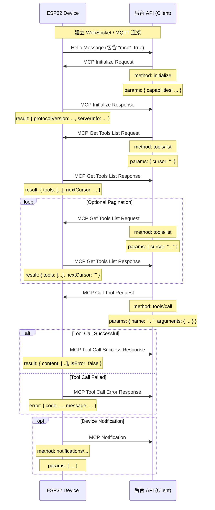

# MCP (Model Context Protocol) 交互流程

NOTICE: AI 辅助生成, 在实现后台服务时, 请参照代码确认细节!!

本项目中的 MCP 协议用于后台 API（MCP 客户端）与 ESP32 设备（MCP 服务器）之间的通信，以便后台能够发现和调用设备提供的功能（工具）。

## 协议格式

根据代码 (`main/protocols/protocol.cc`, `main/mcp_server.cc`)，MCP 消息是封装在基础通信协议（如 WebSocket 或 MQTT）的消息体中的。其内部结构遵循 [JSON-RPC 2.0](https://www.jsonrpc.org/specification) 规范。

整体消息结构示例：

```json
{
  "session_id": "...", // 会话 ID
  "type": "mcp",       // 消息类型，固定为 "mcp"
  "payload": {         // JSON-RPC 2.0 负载
    "jsonrpc": "2.0",
    "method": "...",   // 方法名 (如 "initialize", "tools/list", "tools/call")
    "params": { ... }, // 方法参数 (对于 request)
    "id": ...,         // 请求 ID (对于 request 和 response)
    "result": { ... }, // 方法执行结果 (对于 success response)
    "error": { ... }   // 错误信息 (对于 error response)
  }
}
```

其中，`payload` 部分是标准的 JSON-RPC 2.0 消息：

- `jsonrpc`: 固定的字符串 "2.0"。
- `method`: 要调用的方法名称 (对于 Request)。
- `params`: 方法的参数，一个结构化值，通常为对象 (对于 Request)。
- `id`: 请求的标识符，客户端发送请求时提供，服务器响应时原样返回。用于匹配请求和响应。
- `result`: 方法成功执行时的结果 (对于 Success Response)。
- `error`: 方法执行失败时的错误信息 (对于 Error Response)。

## 交互流程及发送时机

MCP 的交互主要围绕客户端（后台 API）发现和调用设备上的“工具”（Tool）进行。

1.  **连接建立与能力通告**

    - **时机：** 设备启动并成功连接到后台 API 后。
    - **发送方：** 设备。
    - **消息：** 设备发送基础协议的 "hello" 消息给后台 API，消息中包含设备支持的能力列表，例如通过支持 MCP 协议 (`"mcp": true`)。
    - **示例 (非 MCP 负载，而是基础协议消息):**
      ```json
      {
        "type": "hello",
        "version": ...,
        "features": {
          "mcp": true,
          ...
        },
        "transport": "websocket", // 或 "mqtt"
        "audio_params": { ... },
        "session_id": "..." // 设备收到服务器hello后可能设置
      }
      ```

2.  **初始化 MCP 会话**

    - **时机：** 后台 API 收到设备 "hello" 消息，确认设备支持 MCP 后，通常作为 MCP 会话的第一个请求发送。
    - **发送方：** 后台 API (客户端)。
    - **方法：** `initialize`
    - **消息 (MCP payload):**

      ```json
      {
        "jsonrpc": "2.0",
        "method": "initialize",
        "params": {
          "capabilities": {
            // 客户端能力，可选

            // 摄像头视觉相关
            "vision": {
              "url": "...", //摄像头: 图片处理地址(必须是http地址, 不是websocket地址)
              "token": "..." // url token
            }

            // ... 其他客户端能力
          }
        },
        "id": 1 // 请求 ID
      }
      ```

    - **设备响应时机：** 设备收到 `initialize` 请求并处理后。
    - **设备响应消息 (MCP payload):**
      ```json
      {
        "jsonrpc": "2.0",
        "id": 1, // 匹配请求 ID
        "result": {
          "protocolVersion": "2024-11-05",
          "capabilities": {
            "tools": {} // 这里的 tools 似乎不列出详细信息，需要 tools/list
          },
          "serverInfo": {
            "name": "...", // 设备名称 (BOARD_NAME)
            "version": "..." // 设备固件版本
          }
        }
      }
      ```

3.  **发现设备工具列表**

    - **时机：** 后台 API 需要获取设备当前支持的具体功能（工具）列表及其调用方式时。
    - **发送方：** 后台 API (客户端)。
    - **方法：** `tools/list`
    - **消息 (MCP payload):**
      ```json
      {
        "jsonrpc": "2.0",
        "method": "tools/list",
        "params": {
          "cursor": "" // 用于分页，首次请求为空字符串
        },
        "id": 2 // 请求 ID
      }
      ```
    - **设备响应时机：** 设备收到 `tools/list` 请求并生成工具列表后。
    - **设备响应消息 (MCP payload):**
      ```json
      {
        "jsonrpc": "2.0",
        "id": 2, // 匹配请求 ID
        "result": {
          "tools": [ // 工具对象列表
            {
              "name": "self.get_device_status",
              "description": "...",
              "inputSchema": { ... } // 参数 schema
            },
            {
              "name": "self.audio_speaker.set_volume",
              "description": "...",
              "inputSchema": { ... } // 参数 schema
            }
            // ... 更多工具
          ],
          "nextCursor": "..." // 如果列表很大需要分页，这里会包含下一个请求的 cursor 值
        }
      }
      ```
    - **分页处理：** 如果 `nextCursor` 字段非空，客户端需要再次发送 `tools/list` 请求，并在 `params` 中带上这个 `cursor` 值以获取下一页工具。

4.  **调用设备工具**

    - **时机：** 后台 API 需要执行设备上的某个具体功能时。
    - **发送方：** 后台 API (客户端)。
    - **方法：** `tools/call`
    - **消息 (MCP payload):**
      ```json
      {
        "jsonrpc": "2.0",
        "method": "tools/call",
        "params": {
          "name": "self.audio_speaker.set_volume", // 要调用的工具名称
          "arguments": {
            // 工具参数，对象格式
            "volume": 50 // 参数名及其值
          }
        },
        "id": 3 // 请求 ID
      }
      ```
    - **设备响应时机：** 设备收到 `tools/call` 请求，执行相应的工具函数后。
    - **设备成功响应消息 (MCP payload):**
      ```json
      {
        "jsonrpc": "2.0",
        "id": 3, // 匹配请求 ID
        "result": {
          "content": [
            // 工具执行结果内容
            { "type": "text", "text": "true" } // 示例：set_volume 返回 bool
          ],
          "isError": false // 表示成功
        }
      }
      ```
    - **设备失败响应消息 (MCP payload):**
      ```json
      {
        "jsonrpc": "2.0",
        "id": 3, // 匹配请求 ID
        "error": {
          "code": -32601, // JSON-RPC 错误码，例如 Method not found (-32601)
          "message": "Unknown tool: self.non_existent_tool" // 错误描述
        }
      }
      ```

5.  **设备主动发送消息 (Notifications)**
    - **时机：** 设备内部发生需要通知后台 API 的事件时（例如，状态变化，虽然代码示例中没有明确的工具发送此类消息，但 `Application::SendMcpMessage` 的存在暗示了设备可能主动发送 MCP 消息）。
    - **发送方：** 设备 (服务器)。
    - **方法：** 可能是以 `notifications/` 开头的方法名，或者其他自定义方法。
    - **消息 (MCP payload):** 遵循 JSON-RPC Notification 格式，没有 `id` 字段。
      ```json
      {
        "jsonrpc": "2.0",
        "method": "notifications/state_changed", // 示例方法名
        "params": {
          "newState": "idle",
          "oldState": "connecting"
        }
        // 没有 id 字段
      }
      ```
    - **后台 API 处理：** 接收到 Notification 后，后台 API 进行相应的处理，但不回复。

## 交互图

下面是一个简化的交互序列图，展示了主要的 MCP 消息流程：



这份文档概述了该项目中 MCP 协议的主要交互流程。具体的参数细节和工具功能需要参考 `main/mcp_server.cc` 中 `McpServer::AddCommonTools` 以及各个工具的实现。
