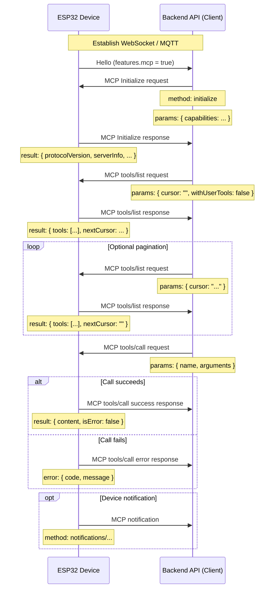

# MCP (Model Context Protocol) Interaction Flow

NOTICE: This document was AI-assisted; when implementing a backend, always cross-check the details against the code.

In this project, MCP is used between the backend API (MCP client) and the ESP32 device (MCP server) to let the backend discover and invoke the device's capabilities (tools).

## Message Format

From `main/protocols/protocol.cc` and `main/mcp_server.cc`, MCP messages are wrapped inside the underlying transport (WebSocket or MQTT). The inner payload follows the [JSON-RPC 2.0](https://www.jsonrpc.org/specification) specification.

Overall message layout:

```json
{
  "session_id": "...",   // session id
  "type": "mcp",         // fixed value "mcp"
  "payload": {           // JSON-RPC 2.0 payload
    "jsonrpc": "2.0",
    "method": "...",     // method name ("initialize", "tools/list", "tools/call", ...)
    "params": { ... },   // arguments (for requests)
    "id": ...,           // request id (for requests and responses)
    "result": { ... },   // success result (response)
    "error": { ... }     // error (response)
  }
}
```

The `payload` follows standard JSON-RPC 2.0:

- `jsonrpc`: always `"2.0"`.
- `method`: the method name (requests).
- `params`: structured parameters, usually an object (requests).
- `id`: request identifier; echoed back in responses.
- `result`: success value (responses).
- `error`: error information (responses).

## Interaction Flow

MCP interactions are driven by the client (backend) discovering and invoking tools on the device.

1. **Connection and capability announcement**

   - **When**: after the device boots and connects to the backend.
   - **Direction**: device -> backend.
   - **Message**: the device sends the transport hello, advertising supported capabilities. MCP support is signaled via `"mcp": true` in the `features` map.
   - **Example (transport hello, not an MCP payload):**
     ```json
     {
       "type": "hello",
       "version": 1,
       "features": {
         "mcp": true
       },
       "transport": "websocket",
       "audio_params": { ... },
       "session_id": "..."
     }
     ```

2. **Initialize the MCP session**

   - **When**: after the backend sees that the device supports MCP. Usually the first MCP request.
   - **Direction**: backend -> device.
   - **Method**: `initialize`
   - **Message (MCP payload):**
     ```json
     {
       "jsonrpc": "2.0",
       "method": "initialize",
       "params": {
         "capabilities": {
           // optional client capabilities
           "vision": {
             "url": "...",   // camera image upload endpoint (must be an http URL, not a websocket URL)
             "token": "..."  // token for the upload URL
           }
           // ... other client capabilities
         }
       },
       "id": 1
     }
     ```

   - **Device response:**
     ```json
     {
       "jsonrpc": "2.0",
       "id": 1,
       "result": {
         "protocolVersion": "2024-11-05",
         "capabilities": {
           "tools": {}
         },
         "serverInfo": {
           "name": "...",    // device name (BOARD_NAME)
           "version": "..."  // firmware version
         }
       }
     }
     ```

3. **Discover the tools**

   - **When**: whenever the backend needs the list of callable tools and their signatures.
   - **Direction**: backend -> device.
   - **Method**: `tools/list`
   - **Request parameters**:
     - `cursor` (string, optional): pagination cursor. Empty on the first request.
     - `withUserTools` (boolean, optional, default `false`): if `true`, the device also includes "user-only" tools (see "User-only tools" below) in the listing. This is typically used by a companion app that lets the user trigger privileged actions directly.
   - **Message (MCP payload):**
     ```json
     {
       "jsonrpc": "2.0",
       "method": "tools/list",
       "params": {
         "cursor": "",
         "withUserTools": false
       },
       "id": 2
     }
     ```
   - **Device response:**
     ```json
     {
       "jsonrpc": "2.0",
       "id": 2,
       "result": {
         "tools": [
           {
             "name": "self.get_device_status",
             "description": "...",
             "inputSchema": { ... }
           },
           {
             "name": "self.audio_speaker.set_volume",
             "description": "...",
             "inputSchema": { ... }
           }
           // ... more tools
         ],
         "nextCursor": "..."
       }
     }
     ```
   - **Pagination**: when `nextCursor` is non-empty, the backend must send another `tools/list` request with that cursor to fetch the next page.

4. **Call a tool**

   - **When**: the backend wants to execute a specific device function.
   - **Direction**: backend -> device.
   - **Method**: `tools/call`
   - **Message (MCP payload):**
     ```json
     {
       "jsonrpc": "2.0",
       "method": "tools/call",
       "params": {
         "name": "self.audio_speaker.set_volume",
         "arguments": {
           "volume": 50
         }
       },
       "id": 3
     }
     ```
   - **Successful response:**
     ```json
     {
       "jsonrpc": "2.0",
       "id": 3,
       "result": {
         "content": [
           { "type": "text", "text": "true" }
         ],
         "isError": false
       }
     }
     ```
   - **Error response:**
     ```json
     {
       "jsonrpc": "2.0",
       "id": 3,
       "error": {
         "code": -32601,
         "message": "Unknown tool: self.non_existent_tool"
       }
     }
     ```

5. **Device-initiated notifications**

   - **When**: the device wants to inform the backend of internal events (e.g. state transitions). `Application::SendMcpMessage` is the outbound entry point.
   - **Direction**: device -> backend.
   - **Method**: conventionally `notifications/...` or any custom method.
   - **Message (MCP payload)**: JSON-RPC notifications have no `id`.
     ```json
     {
       "jsonrpc": "2.0",
       "method": "notifications/state_changed",
       "params": {
         "newState": "idle",
         "oldState": "connecting"
       }
     }
     ```
   - **Backend handling**: process the notification without replying.

## User-only Tools

The MCP server on the device maintains two kinds of tools:

- **Regular tools** - registered via `McpServer::AddTool`. Exposed to the backend (and hence the AI model) by default.
- **User-only tools** - registered via `McpServer::AddUserOnlyTool`. These are hidden from standard `tools/list` results, because they are privileged or user-facing actions that should not be invoked autonomously by the AI. Examples include system reboot, firmware upgrade, and screen snapshot upload.

The backend opts in to user-only tools by sending `tools/list` with `params.withUserTools = true`. Typical usage: a companion app screen that exposes these actions to the end user.

See [MCP IoT control usage](./mcp-usage.md) for how to register either kind of tool on the device side.

## Sequence Diagram

A simplified diagram of the main MCP message flow:


```mermaid
sequenceDiagram
    participant Device as ESP32 Device
    participant BackendAPI as Backend API (Client)

    Note over Device, BackendAPI: Establish WebSocket / MQTT

    Device->>BackendAPI: Hello (features.mcp = true)

    BackendAPI->>Device: MCP Initialize request
    Note over BackendAPI: method: initialize
    Note over BackendAPI: params: { capabilities: ... }

    Device->>BackendAPI: MCP Initialize response
    Note over Device: result: { protocolVersion, serverInfo, ... }

    BackendAPI->>Device: MCP tools/list request
    Note over BackendAPI: params: { cursor: "", withUserTools: false }

    Device->>BackendAPI: MCP tools/list response
    Note over Device: result: { tools: [...], nextCursor: ... }

    loop Optional pagination
        BackendAPI->>Device: MCP tools/list request
        Note over BackendAPI: params: { cursor: "..." }
        Device->>BackendAPI: MCP tools/list response
        Note over Device: result: { tools: [...], nextCursor: "" }
    end

    BackendAPI->>Device: MCP tools/call request
    Note over BackendAPI: params: { name, arguments }

    alt Call succeeds
        Device->>BackendAPI: MCP tools/call success response
        Note over Device: result: { content, isError: false }
    else Call fails
        Device->>BackendAPI: MCP tools/call error response
        Note over Device: error: { code, message }
    end

    opt Device notification
        Device->>BackendAPI: MCP notification
        Note over Device: method: notifications/...
    end
```

This document summarizes the MCP interaction flow in this project. For exact parameter shapes, behavior, and available tools, refer to `McpServer::AddCommonTools` / `AddUserOnlyTools` in `main/mcp_server.cc` and the per-board `InitializeTools` implementations.
