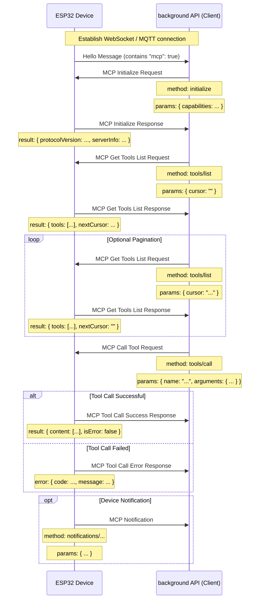

#MCP (Model Context Protocol) interaction process

NOTICE: AI-assisted generation, when implementing background services, please refer to the code to confirm the details!!

The MCP protocol in this project is used for communication between the backend API (MCP client) and the ESP32 device (MCP server) so that the backend can discover and call the functions (tools) provided by the device.

## Protocol format

According to the code (`main/protocols/protocol.cc`, `main/mcp_server.cc`), MCP messages are encapsulated in the message body of the underlying communication protocol (such as WebSocket or MQTT). Its internal structure follows the [JSON-RPC 2.0](https://www.jsonrpc.org/specification) specification.

Example of overall message structure:

```json
{
  "session_id": "...", // Session ID
  "type": "mcp", // Message type, fixed to "mcp"
  "payload": { // JSON-RPC 2.0 payload
    "jsonrpc": "2.0",
    "method": "...", // method name (such as "initialize", "tools/list", "tools/call")
    "params": { ... }, // method parameters (for request)
    "id": ..., // Request ID (for request and response)
    "result": { ... }, // Method execution result (for success response)
    "error": { ... } // Error message (for error response)
  }
}
```

Among them, the `payload` part is a standard JSON-RPC 2.0 message:

- `jsonrpc`: fixed string "2.0".
- `method`: The name of the method to be called (for Request).
- `params`: The parameters of the method, a structured value, usually an object (for Request).
- `id`: The identifier of the request, provided by the client when sending the request, and returned as is when the server responds. Used to match requests and responses.
- `result`: The result when the method executes successfully (for Success Response).
- `error`: Error message when method execution fails (for Error Response).

## Interaction process and sending time

The interaction of MCP mainly revolves around the client (backend API) discovering and calling the "tools" on the device.

1. **Connection establishment and capability notification**

    - **Timing:** After the device boots up and successfully connects to the backend API.
    - **Sender:** Device.
    - **Message:** The device sends a basic protocol "hello" message to the backend API, which contains a list of capabilities supported by the device, for example by supporting the MCP protocol (`"mcp": true`).
    - **Example (not MCP payload, but underlying protocol message):**
      ```json
      {
        "type": "hello",
        "version": ...,
        "features": {
          "mcp": true,
          ...
        },
        "transport": "websocket", // or "mqtt"
        "audio_params": { ... },
        "session_id": "..." // The device may be set after receiving hello from the server
      }
      ```

2. **Initialize MCP session**

    - **Timing:** After the background API receives the device "hello" message and confirms that the device supports MCP, it is usually sent as the first request of the MCP session.
    - **Sender:** Backend API (Client).
    - **Method:** `initialize`
    - **Message (MCP payload):**

      ```json
      {
        "jsonrpc": "2.0",
        "method": "initialize",
        "params": {
          "capabilities": {
            // Client capabilities, optional

            //Camera vision related
            "vision": {
              "url": "...", //Camera: Image processing address (must be an http address, not a websocket address)
              "token": "..." // url token
            }

            // ...other client capabilities
          }
        },
        "id": 1 // Request ID
      }
      ```

    - **Device response timing:** After the device receives and processes the `initialize` request.
    - **Device response message (MCP payload):**
      ```json
      {
        "jsonrpc": "2.0",
        "id": 1, // Match request ID
        "result": {
          "protocolVersion": "2024-11-05",
          "capabilities": {
            "tools": {} // The tools here don't seem to list detailed information, and tools/list is needed
          },
          "serverInfo": {
            "name": "...", // device name (BOARD_NAME)
            "version": "..." // Device firmware version
          }
        }
      }
      ```

3. **Discover device tool list**

    - **Timing:** When the background API needs to obtain a list of specific functions (tools) currently supported by the device and their calling methods.
    - **Sender:** Backend API (Client).
    - **Method:** `tools/list`
    - **Message (MCP payload):**
      ```json
      {
        "jsonrpc": "2.0",
        "method": "tools/list",
        "params": {
          "cursor": "" // Used for paging, the first request is an empty string
        },
        "id": 2 // Request ID
      }
      ```
    - **Device response timing:** After the device receives the `tools/list` request and generates the tool list.
    - **Device response message (MCP payload):**
      ```json
      {
        "jsonrpc": "2.0",
        "id": 2, // Match request ID
        "result": {
          "tools": [ // List of tool objects
            {
              "name": "self.get_device_status",
              "description": "...",
              "inputSchema": { ... } // parameter schema
            },
            {
              "name": "self.audio_speaker.set_volume",
              "description": "...",
              "inputSchema": { ... } // parameter schema
            }
            // ... more tools
          ],
          "nextCursor": "..." // If the list is large and needs paging, the cursor value of the next request will be included here.
        }
      }
      ```
    - **Paging processing:** If the `nextCursor` field is not empty, the client needs to send the `tools/list` request again and bring this `cursor` value in `params` to get the next page of tools.

4. **Calling device tools**

    - **Timing:** When the background API needs to perform a specific function on the device.
    - **Sender:** Backend API (Client).
    - **Method:** `tools/call`
    - **Message (MCP payload):**
      ```json
      {
        "jsonrpc": "2.0",
        "method": "tools/call",
        "params": {
          "name": "self.audio_speaker.set_volume", // The name of the tool to be called
          "arguments": {
            //Tool parameters, object format
            "volume": 50 // Parameter name and its value
          }
        },
        "id": 3 // Request ID
      }
      ```
    - **Device response timing:** After the device receives the `tools/call` request and executes the corresponding tool function.
    - **Device successful response message (MCP payload):**
      ```json
      {
        "jsonrpc": "2.0",
        "id": 3, // Match request ID
        "result": {
          "content": [
            // Tool execution result content
            { "type": "text", "text": "true" } // Example: set_volume returns bool
          ],
          "isError": false // indicates success
        }
      }
      ```
    - **Device failure response message (MCP payload):**
      ```json
      {
        "jsonrpc": "2.0",
        "id": 3, // Match request ID
        "error": {
          "code": -32601, // JSON-RPC error code, such as Method not found (-32601)
          "message": "Unknown tool: self.non_existent_tool" // Error description
        }
      }
      ```

5. **The device actively sends messages (Notifications)**
    - **Timing:** When an event occurs within the device that needs to be notified to the backend API (for example, a state change, although there is no explicit tool in the code sample to send such a message, the existence of `Application::SendMcpMessage` hints that the device may actively send MCP messages).
    - **Sender:** Device (Server).
    - **Method:** It may be a method name starting with `notifications/`, or other custom methods.
    - **Message (MCP payload):** Follows the JSON-RPC Notification format and has no `id` field.
      ```json
      {
        "jsonrpc": "2.0",
        "method": "notifications/state_changed", // Example method name
        "params": {
          "newState": "idle",
          "oldState": "connecting"
        }
        // No id field
      }
      ```
    - **Background API processing:** After receiving the Notification, the background API performs corresponding processing but does not reply.

## Interaction diagram

The following is a simplified interaction sequence diagram showing the main MCP message flow:



This document outlines the main interaction flows of the MCP protocol in this project. For specific parameter details and tool functions, please refer to `McpServer::AddCommonTools` in `main/mcp_server.cc` and the implementation of each tool.
