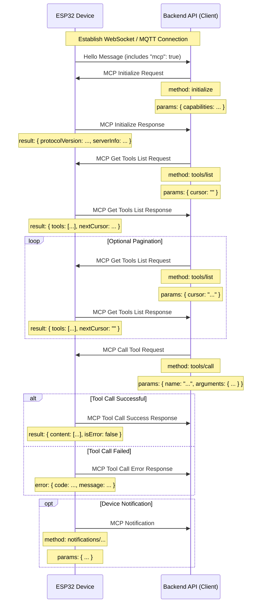

# MCP (Model Context Protocol) Interaction Flow

NOTICE: AI-assisted generation. When implementing backend services, please refer to the code to confirm details!!

The MCP protocol in this project is used for communication between the backend API (MCP client) and ESP32 device (MCP server), allowing the backend to discover and invoke functions (tools) provided by the device.

## Protocol Format

According to the code (`main/protocols/protocol.cc`, `main/mcp_server.cc`), MCP messages are encapsulated in the message body of the underlying communication protocol (such as WebSocket or MQTT). The internal structure follows the [JSON-RPC 2.0](https://www.jsonrpc.org/specification) specification.

Overall message structure example:

```json
{
  "session_id": "...", // Session ID
  "type": "mcp",       // Message type, fixed as "mcp"
  "payload": {         // JSON-RPC 2.0 payload
    "jsonrpc": "2.0",
    "method": "...",   // Method name (e.g. "initialize", "tools/list", "tools/call")
    "params": { ... }, // Method parameters (for request)
    "id": ...,         // Request ID (for request and response)
    "result": { ... }, // Method execution result (for success response)
    "error": { ... }   // Error information (for error response)
  }
}
```

The `payload` part is a standard JSON-RPC 2.0 message:

- `jsonrpc`: Fixed string "2.0".
- `method`: The name of the method to be called (for Request).
- `params`: Parameters of the method, a structured value, usually an object (for Request).
- `id`: Request identifier, provided by the client when sending the request, returned as-is by the server in response. Used to match requests and responses.
- `result`: Result when the method executes successfully (for Success Response).
- `error`: Error information when method execution fails (for Error Response).

## Interaction Flow and Timing

MCP interaction mainly revolves around the client (backend API) discovering and calling "tools" on the device.

1.  **Connection Establishment and Capability Announcement**

    - **Timing:** After the device starts up and successfully connects to the backend API.
    - **Sender:** Device.
    - **Message:** The device sends a basic protocol "hello" message to the backend API, containing a list of capabilities supported by the device, such as MCP protocol support (`"mcp": true`).
    - **Example (not MCP payload, but basic protocol message):**
      ```json
      {
        "type": "hello",
        "version": ...,
        "features": {
          "mcp": true,
          ...
        },
        "transport": "websocket", // or "mqtt"
        "audio_params": { ... },
        "session_id": "..." // May be set after device receives server hello
      }
      ```

2.  **Initialize MCP Session**

    - **Timing:** After the backend API receives the device "hello" message and confirms the device supports MCP, usually sent as the first request of the MCP session.
    - **Sender:** Backend API (client).
    - **Method:** `initialize`
    - **Message (MCP payload):**

      ```json
      {
        "jsonrpc": "2.0",
        "method": "initialize",
        "params": {
          "capabilities": {
            // Client capabilities, optional

            // Camera vision related
            "vision": {
              "url": "...", // Camera: image processing address (must be http address, not websocket address)
              "token": "..." // url token
            }

            // ... other client capabilities
          }
        },
        "id": 1 // Request ID
      }
      ```

    - **Device Response Timing:** After the device receives the `initialize` request and processes it.
    - **Device Response Message (MCP payload):**
      ```json
      {
        "jsonrpc": "2.0",
        "id": 1, // Matching request ID
        "result": {
          "protocolVersion": "2024-11-05",
          "capabilities": {
            "tools": {} // tools here doesn't list details, need tools/list
          },
          "serverInfo": {
            "name": "...", // Device name (BOARD_NAME)
            "version": "..." // Device firmware version
          }
        }
      }
      ```

3.  **Discover Device Tool List**

    - **Timing:** When the backend API needs to get the specific list of functions (tools) currently supported by the device and how to call them.
    - **Sender:** Backend API (client).
    - **Method:** `tools/list`
    - **Message (MCP payload):**
      ```json
      {
        "jsonrpc": "2.0",
        "method": "tools/list",
        "params": {
          "cursor": "" // For pagination, empty string for first request
        },
        "id": 2 // Request ID
      }
      ```
    - **Device Response Timing:** After the device receives the `tools/list` request and generates the tool list.
    - **Device Response Message (MCP payload):**
      ```json
      {
        "jsonrpc": "2.0",
        "id": 2, // Matching request ID
        "result": {
          "tools": [ // Tool object list
            {
              "name": "self.get_device_status",
              "description": "...",
              "inputSchema": { ... } // Parameter schema
            },
            {
              "name": "self.audio_speaker.set_volume",
              "description": "...",
              "inputSchema": { ... } // Parameter schema
            }
            // ... more tools
          ],
          "nextCursor": "..." // If the list is large and needs pagination, this will contain the cursor value for the next request
        }
      }
      ```
    - **Pagination Handling:** If the `nextCursor` field is not empty, the client needs to send another `tools/list` request with this `cursor` value in `params` to get the next page of tools.

4.  **Call Device Tool**

    - **Timing:** When the backend API needs to execute a specific function on the device.
    - **Sender:** Backend API (client).
    - **Method:** `tools/call`
    - **Message (MCP payload):**
      ```json
      {
        "jsonrpc": "2.0",
        "method": "tools/call",
        "params": {
          "name": "self.audio_speaker.set_volume", // Tool name to call
          "arguments": {
            // Tool parameters, object format
            "volume": 50 // Parameter name and value
          }
        },
        "id": 3 // Request ID
      }
      ```
    - **Device Response Timing:** After the device receives the `tools/call` request and executes the corresponding tool function.
    - **Device Success Response Message (MCP payload):**
      ```json
      {
        "jsonrpc": "2.0",
        "id": 3, // Matching request ID
        "result": {
          "content": [
            // Tool execution result content
            { "type": "text", "text": "true" } // Example: set_volume returns bool
          ],
          "isError": false // Indicates success
        }
      }
      ```
    - **Device Failure Response Message (MCP payload):**
      ```json
      {
        "jsonrpc": "2.0",
        "id": 3, // Matching request ID
        "error": {
          "code": -32601, // JSON-RPC error code, e.g. Method not found (-32601)
          "message": "Unknown tool: self.non_existent_tool" // Error description
        }
      }
      ```

5.  **Device Proactive Message Sending (Notifications)**
    - **Timing:** When an event occurs inside the device that needs to notify the backend API (e.g., state change, although the code example doesn't have explicit tools sending such messages, the existence of `Application::SendMcpMessage` suggests the device may proactively send MCP messages).
    - **Sender:** Device (server).
    - **Method:** Possibly method names starting with `notifications/`, or other custom methods.
    - **Message (MCP payload):** Follows JSON-RPC Notification format, without `id` field.
      ```json
      {
        "jsonrpc": "2.0",
        "method": "notifications/state_changed", // Example method name
        "params": {
          "newState": "idle",
          "oldState": "connecting"
        }
        // No id field
      }
      ```
    - **Backend API Processing:** After receiving a Notification, the backend API performs corresponding processing but does not reply.

## Interaction Diagram

Below is a simplified interaction sequence diagram showing the main MCP message flow:



This document outlines the main interaction flow of the MCP protocol in this project. Specific parameter details and tool functions need to refer to `McpServer::AddCommonTools` in `main/mcp_server.cc` and the implementation of each tool.
