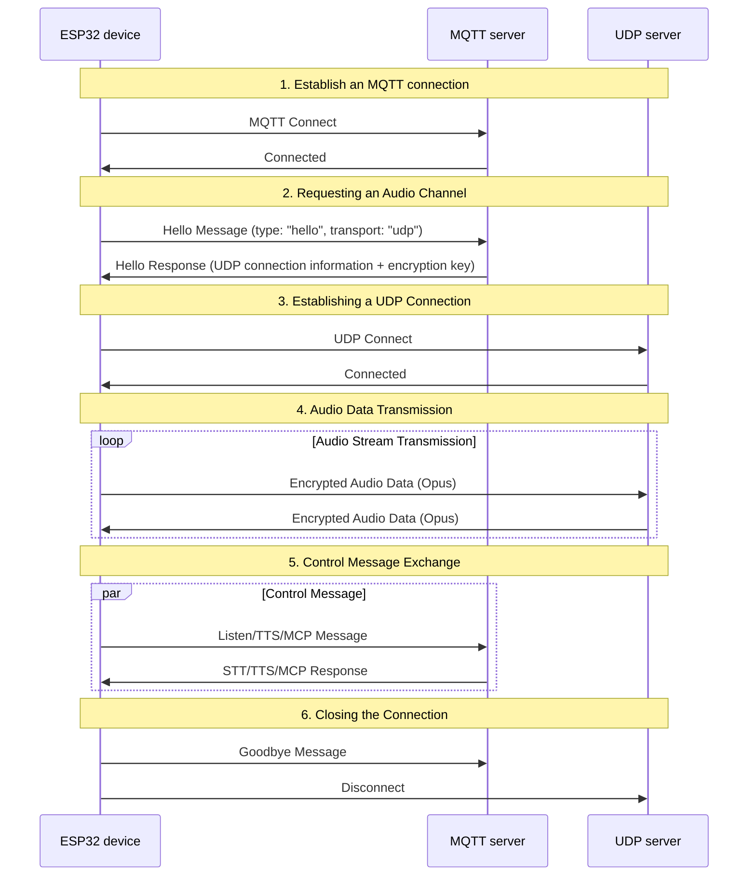
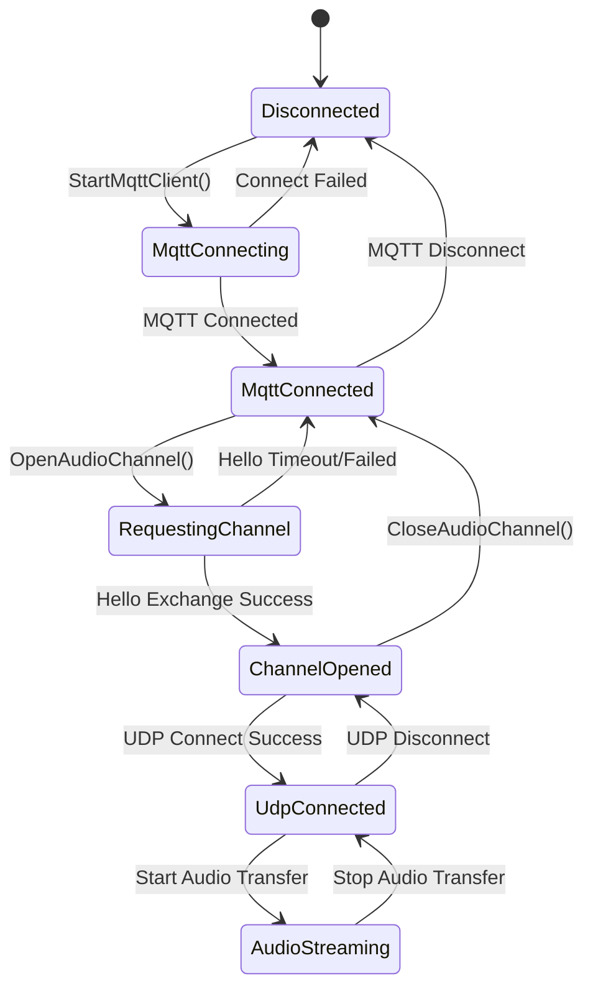

# MQTT + UDP Hybrid Communication Protocol Documentation

This document, based on code implementation, outlines the interaction between the device and server using MQTT for control message transmission and UDP for audio data transmission.

---

## 1. Protocol Overview

This protocol uses a hybrid transmission method:
- **MQTT**: For control messages, state synchronization, and JSON data exchange
- **UDP**: For real-time audio data transmission, supports encryption

### 1.1 Protocol Features

- **Dual-channel Design**: Separates control and data to ensure real-time performance
- **Encrypted Transmission**: UDP audio data is encrypted using AES-CTR
- **Sequence Number Protection**: Prevents packet replay and reordering
- **Auto-Reconnect**: Automatically reconnects when the MQTT connection is disconnected

---

## 2. Overall Process Overview



---

## 3. MQTT Control Channel

### 3.1 Connection Establishment

The device connects to the server via MQTT. Connection parameters include:
- **Endpoint**: MQTT server address and port
- **Client ID**: Unique device identifier
- **Username/Password**: Authentication credentials
- **Keep Alive**: Heartbeat interval (default 240 seconds)

### 3.2 Hello Message Exchange

#### 3.2.1 Device Sends Hello

```json
{
"type": "hello",
"version": 3,
"transport": "udp",
"features": {
"mcp": true
},
"audio_params": {
"format": "opus",
"sample_rate": 16000,
"channels": 1,
"frame_duration": 60
}
}
```

#### 3.2.2 Server Response Hello

```json
{
"type": "hello",
"transport": "udp",
"session_id": "xxx",
"audio_params": {
"format": "opus",
"sample_rate": 24000,
"channels": 1,
"frame_duration": 60
},
"udp": {
"server": "192.168.1.100",
"port": 8888,
"key": "0123456789ABCDEF0123456789ABCDEF",
"nonce": "0123456789ABCDEF0123456789ABCDEF"

}
}
```

**Field Description:**
- `udp.server`: UDP server address
- `udp.port`: UDP server port
- `udp.key`: AES encryption key (hexadecimal string)
- `udp.nonce`: AES encryption nonce (hexadecimal string)

### 3.3 JSON Message Type

#### 3.3.1 Device → Server

1. **Listen Message**
```json
{
"session_id": "xxx",
"type": "listen",
"state": "start",
"mode": "manual"
}
```

2. **Abort Message**
```json
{
"session_id": "xxx",
"type": "abort",
"reason": "wake_word_detected"
}
```

3. **MCP Message**
```json
{
"session_id": "xxx",
"type": "mcp",
"payload": {
"jsonrpc": "2.0",
"id": 1,
"result": {...}
}
}
```

4. **Goodbye Message**
```json
{
"session_id": "xxx",
"type": "goodbye"
}
```

#### 3.3.2 Server → Device

Supported message types are consistent with the WebSocket protocol, including:
- **STT**: Speech recognition results
- **TTS**: Speech synthesis control
- **LLM**: Emotional expression control
- **MCP**: IoT control
- **System**: System control
- **Custom**: Custom message (optional)

---

## 4. UDP Audio Channel

### 4.1 Connection Establishment

After receiving the MQTT Hello response, the device uses the UDP connection information to establish the audio channel:

1. Parse the UDP server address and port

2. Parse the encryption key and random number

3. Initialize AES-CTR Encryption Context
4. Establishing a UDP Connection

### 4.2 Audio Data Format

#### 4.2.1 Encrypted Audio Packet Structure

```
|type 1 byte|flags 1 byte|payload_len 2 bytes|ssrc 4 bytes|timestamp 4 bytes|sequence 4 bytes|
|payload payload_len bytes|
```

**Field Description:**
- `type`: Packet type, fixed to 0x01
- `flags`: Flags, currently unused
- `payload_len`: Payload length (network byte order)
- `ssrc`: Synchronization source identifier
- `timestamp`: Timestamp (network byte order)
- `sequence`: Sequence number (network byte order)
- `payload`: Encrypted Opus audio data

#### 4.2.2 Encryption Algorithm

Using **AES-CTR** Mode Encryption:
- **Key**: 128-bit, provided by the server
- **Nonce**: 128-bit, provided by the server
- **Counter**: Contains timestamp and sequence number information

### 4.3 Sequence Number Management

- **Sender**: `local_sequence_` (monotonically increasing)
- **Receiver**: `remote_sequence_` (confirms continuity)
- **Anti-Replay**: Reject packets with sequence numbers less than the expected value
- **Fault Tolerance**: Allows for minor sequence number jumps and logs a warning

### 4.4 Error Handling

1. **Decryption Failure**: Log an error and discard the packet
2. **Sequence Number Error**: Log a warning but still process the packet
3. **Packet Format Error**: Log an error and discard the packet

---

## 5. State Management

### 5.1 Connection State



### 5.2 Status Check

The device determines whether the audio channel is available based on the following conditions:
```cpp
bool IsAudioChannelOpened() const {
return udp_ != nullptr && !error_occurred_ && !IsTimeout();
}
```

---

## 6. Configuration Parameters

### 6.1 MQTT Configuration

Configuration items read from the settings:
- `endpoint`: MQTT server address
- `client_id`: Client identifier
- `username`: Username
- `password`: Password
- `keepalive`: Heartbeat interval (default 240 seconds)
- `publish_topic`: Publishing topic

### 6.2 Audio Parameters

- **Format**: Opus
- **Sampling Rate**: 16000 Hz (device) / 24000 Hz (server)
- **Number of channels**: 1 (mono)
- **Frame duration**: 60ms

---
## 7. Error handling and reconnection

### 7.1 MQTT reconnection mechanism

- Automatic retry upon connection failure
- Supports error reporting control
- Triggers cleanup process upon disconnection

### 7.2 UDP connection management

- Upon connection failure No automatic retry
- Relies on MQTT channel renegotiation
- Supports connection status query

### 7.3 Timeout Handling

The base class `Protocol` provides timeout detection:
- Default timeout: 120 seconds
- Calculated based on the last received time
- Automatically marked as unavailable upon timeout

---

## 8. Security Considerations

### 8.1 Transmission Encryption

- **MQTT**: Supports TLS/SSL encryption (port 8883)
- **UDP**: Uses AES-CTR to encrypt audio data

### 8.2 Authentication Mechanism

- **MQTT**: Username/Password authentication
- **UDP**: Key distribution via MQTT channel

### 8.3 Anti-replay Attack

- Monotonically increasing sequence number
- Reject expired packets
- Timestamp verification

---

## 9. Performance Optimization

### 9.1 Concurrency Control

Use a mutex to protect the UDP connection:
```cpp
std::lock_guard<std::mutex> lock(channel_mutex_);
```

### 9.2 Memory Management

- Dynamically creating/destroying network objects
- Managing audio packets with smart pointers
- Timely releasing the encryption context

### 9.3 Network Optimization

- UDP connection reuse
- Packet size optimization
- Sequence number continuity check

---

## 10. Comparison with the WebSocket Protocol

| Features | MQTT + UDP | WebSocket |
|------|------------|-----------|
| Control Channel | MQTT | WebSocket |
| Audio Channel | UDP (encrypted) | WebSocket (binary) |
| Real-time Performance | High (UDP) | Medium |
| Reliability | Medium | High |
| Complexity | High | Low |
| Encryption | AES-CTR | TLS |
| Firewall Friendliness | Low | High |

---

## 11. Deployment Recommendations

### 11.1 Network Environment

- Ensure UDP Port Accessibility
- Configure Firewall Rules
- Consider NAT Traversal

### 11.2 Server Configuration

- MQTT Broker Configuration
- UDP Server Deployment
- Key Management System

### 11.3 Monitoring Metrics

- Connection Success Rate
- Audio Transmission Latency
- Packet Loss Rate
- Decryption Failure Rate

---

## 12. Summary

The MQTT + UDP hybrid protocol achieves efficient audio and video communication through the following designs:

- **Separate Architecture**: Separate control and data channels, each performing its own functions
- **Encryption Protection**: AES-CTR ensures secure audio data transmission
- **Serialization Management**: Prevents replay attacks and data reordering
- **Auto-Recovery**: Supports automatic reconnection after a connection loss
- **Performance Optimization**: UDP transmission ensures real-time audio data

This protocol is suitable for voice interaction scenarios with high real-time requirements, but requires a trade-off between network complexity and transmission performance.
