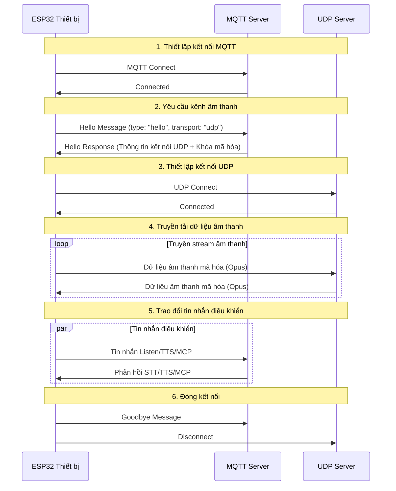
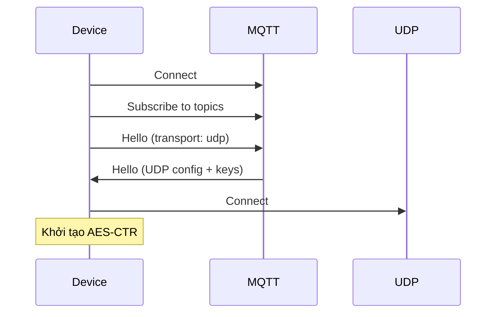
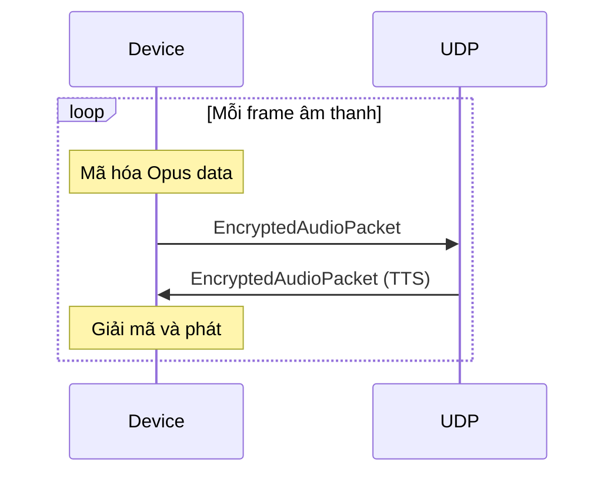
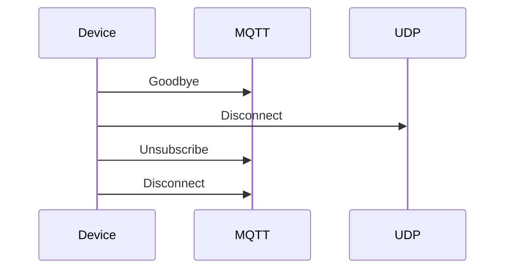

# Tài liệu giao thức truyền thông hỗn hợp MQTT + UDP

（Tiếng Việt | [中文](mqtt-udp_zh.md)）

Tài liệu giao thức truyền thông hỗn hợp MQTT + UDP được tổng hợp dựa trên triển khai mã nguồn, mô tả cách thiết bị và server tương tác thông qua MQTT để truyền tải tin nhắn điều khiển, thông qua UDP để truyền tải dữ liệu âm thanh.

---

## 1. Tổng quan giao thức

Giao thức này sử dụng phương thức truyền tải hỗn hợp:
- **MQTT**: Dùng cho tin nhắn điều khiển, đồng bộ trạng thái, trao đổi dữ liệu JSON
- **UDP**: Dùng cho truyền tải dữ liệu âm thanh thời gian thực, hỗ trợ mã hóa

### 1.1 Đặc điểm giao thức

- **Thiết kế hai kênh**: Tách biệt điều khiển và dữ liệu, đảm bảo tính thời gian thực
- **Truyền tải mã hóa**: Dữ liệu âm thanh UDP sử dụng mã hóa AES-CTR
- **Bảo vệ số thứ tự**: Ngăn chặn replay và data packet bị sai thứ tự
- **Tự động kết nối lại**: Tự động kết nối lại khi kết nối MQTT bị ngắt

---

## 2. Tổng quan quy trình chung



---

## 3. Kênh điều khiển MQTT

### 3.1 Thiết lập kết nối

Thiết bị kết nối đến server thông qua MQTT, tham số kết nối bao gồm:
- **Endpoint**: Địa chỉ và port của MQTT server
- **Client ID**: Định danh duy nhất của thiết bị
- **Username/Password**: Thông tin xác thực
- **Keep Alive**: Khoảng thời gian heartbeat (mặc định 240 giây)

### 3.2 Trao đổi tin nhắn Hello

#### 3.2.1 Thiết bị gửi Hello

```json
{
  "type": "hello",
  "version": 3,
  "transport": "udp",
  "features": {
    "mcp": true
  },
  "audio_params": {
    "format": "opus",
    "sample_rate": 16000,
    "channels": 1,
    "frame_duration": 60
  }
}
```

#### 3.2.2 Server phản hồi Hello

```json
{
  "type": "hello",
  "transport": "udp",
  "session_id": "xxx",
  "audio_params": {
    "format": "opus",
    "sample_rate": 16000,
    "channels": 1,
    "frame_duration": 60
  },
  "udp_config": {
    "host": "192.168.1.100",
    "port": 8080,
    "encryption": {
      "algorithm": "aes-ctr",
      "key": "base64_encoded_key",
      "iv": "base64_encoded_iv"
    }
  }
}
```

### 3.3 Các loại tin nhắn JSON

#### 3.3.1 Thiết bị → Server

**Tin nhắn trạng thái thiết bị**
```json
{
  "type": "device_status",
  "status": "idle", // "listening", "speaking", "thinking"
  "battery": 85,
  "volume": 50,
  "session_id": "xxx"
}
```

**Tin nhắn MCP**
```json
{
  "type": "mcp",
  "session_id": "xxx",
  "payload": {
    "jsonrpc": "2.0",
    "method": "tools/call",
    "params": {
      "name": "self.speaker.set_volume",
      "arguments": {"volume": 70}
    },
    "id": 1
  }
}
```

**Tin nhắn Listen**
```json
{
  "type": "listen",
  "session_id": "xxx"
}
```

#### 3.3.2 Server → Thiết bị

**Tin nhắn TTS**
```json
{
  "type": "tts",
  "text": "Xin chào, tôi có thể giúp gì cho bạn?",
  "session_id": "xxx"
}
```

**Kết quả STT**
```json
{
  "type": "stt_result",
  "text": "Thời tiết hôm nay như thế nào?",
  "session_id": "xxx"
}
```

---

## 4. Kênh âm thanh UDP

### 4.1 Thiết lập kết nối

Sau khi nhận thông tin UDP từ tin nhắn Hello, thiết bị:
1. Tạo socket UDP
2. Kết nối đến địa chỉ và port được chỉ định
3. Khởi tạo bộ mã hóa AES-CTR với key và IV

### 4.2 Định dạng dữ liệu âm thanh

#### 4.2.1 Cấu trúc gói âm thanh mã hóa

```c
struct EncryptedAudioPacket {
    uint32_t sequence;       // Số thứ tự gói
    uint32_t timestamp;      // Timestamp (milliseconds)
    uint16_t payload_size;   // Kích thước payload đã mã hóa
    uint8_t encrypted_data[]; // Dữ liệu Opus đã mã hóa
} __attribute__((packed));
```

#### 4.2.2 Thuật toán mã hóa

- **Thuật toán**: AES-CTR
- **Kích thước khóa**: 256-bit
- **IV**: 128-bit, được cung cấp trong tin nhắn Hello
- **Counter**: Bắt đầu từ 0, tăng dần cho mỗi gói

```c
// Mã hóa
encrypted_size = aes_ctr_encrypt(opus_data, opus_size, 
                                key, iv, counter, 
                                encrypted_data);

// Giải mã
opus_size = aes_ctr_decrypt(encrypted_data, encrypted_size,
                           key, iv, counter,
                           opus_data);
```

### 4.3 Xử lý sequence và timestamp

- **Sequence**: Số thứ tự gói, bắt đầu từ 1, tăng dần
- **Timestamp**: Thời gian gửi gói (milliseconds)
- **Chống replay**: Server từ chối gói có sequence cũ
- **Phát hiện mất gói**: Dựa vào khoảng trống trong sequence

---

## 5. Luồng hoạt động chi tiết

### 5.1 Khởi động phiên



### 5.2 Truyền tải âm thanh



### 5.3 Kết thúc phiên



---

## 6. Xử lý lỗi và phục hồi

### 6.1 Lỗi kết nối MQTT

- **Tự động kết nối lại**: Thử kết nối lại sau 5 giây
- **Exponential backoff**: Tăng dần thời gian chờ
- **Giới hạn thử lại**: Tối đa 10 lần

### 6.2 Lỗi UDP

- **Timeout**: 5 giây không nhận dữ liệu → ngắt kết nối
- **Lỗi giải mã**: Bỏ qua gói lỗi, tiếp tục xử lý
- **Mất gói**: Phát hiện và log, không cần retransmit

### 6.3 Lỗi đồng bộ

- **Session timeout**: 30 giây không hoạt động → đóng phiên
- **Sequence mismatch**: Reset counter và thông báo lỗi

---

## 7. Bảo mật

### 7.1 Mã hóa

- **MQTT**: TLS 1.2+ cho kênh điều khiển
- **UDP**: AES-CTR cho dữ liệu âm thanh
- **Key rotation**: Khóa mới cho mỗi phiên

### 7.2 Xác thực

- **MQTT**: Username/Password hoặc Certificate
- **UDP**: Session ID và sequence validation
- **Token**: JWT cho authorization

### 7.3 Phòng chống tấn công

- **Replay protection**: Sequence number validation
- **Rate limiting**: Giới hạn tần suất gói tin
- **Input validation**: Kiểm tra định dạng tin nhắn

---

## 8. Hiệu suất và tối ưu hóa

### 8.1 Độ trễ

- **MQTT**: ~50-100ms (điều khiển)
- **UDP**: ~10-30ms (âm thanh)
- **Tổng độ trễ**: ~60-130ms

### 8.2 Băng thông

- **Opus 16kHz**: ~24kbps
- **Protocol overhead**: ~5%
- **Tổng băng thông**: ~25kbps

### 8.3 Tối ưu hóa

- **Buffer size**: 3-5 frame để chống jitter
- **Compression**: Sử dụng Opus VBR mode
- **QoS**: MQTT QoS 1, UDP best effort

---

## 9. Monitoring và Debug

### 9.1 Metrics quan trọng

- **Connection success rate**: Tỷ lệ kết nối thành công
- **Audio latency**: Độ trễ âm thanh end-to-end
- **Packet loss rate**: Tỷ lệ mất gói UDP
- **Decryption failures**: Lỗi giải mã

### 9.2 Logging

```c
// Kết nối
ESP_LOGI(TAG, "MQTT connected to %s", broker_url);
ESP_LOGI(TAG, "UDP connected to %s:%d", host, port);

// Âm thanh
ESP_LOGD(TAG, "Audio TX: seq=%u, size=%u", sequence, size);
ESP_LOGD(TAG, "Audio RX: seq=%u, size=%u", sequence, size);

// Lỗi
ESP_LOGE(TAG, "Decryption failed: seq=%u", sequence);
ESP_LOGE(TAG, "Sequence gap detected: expected=%u, got=%u", expected, received);
```

---

## 10. So sánh với WebSocket

| Tiêu chí | MQTT+UDP | WebSocket |
|----------|----------|-----------|
| Kênh điều khiển | MQTT | WebSocket |
| Kênh âm thanh | UDP (mã hóa) | WebSocket (binary) |
| Tính thời gian thực | Cao (UDP) | Trung bình |
| Độ tin cậy | Trung bình | Cao |
| Độ phức tạp | Cao | Thấp |
| Mã hóa | AES-CTR | TLS |
| Thân thiện với firewall | Thấp | Cao |

---

## 11. Đề xuất triển khai

### 11.1 Môi trường mạng

- Đảm bảo port UDP có thể truy cập
- Cấu hình quy tắc firewall
- Cân nhắc NAT traversal

### 11.2 Cấu hình server

- Cấu hình MQTT Broker
- Triển khai UDP server
- Hệ thống quản lý khóa

### 11.3 Các chỉ số monitoring

- Tỷ lệ kết nối thành công
- Độ trễ truyền âm thanh
- Tỷ lệ mất gói dữ liệu
- Tỷ lệ lỗi giải mã

---

## 12. Tổng kết

Giao thức hỗn hợp MQTT + UDP thực hiện giao tiếp audio-video hiệu quả thông qua các thiết kế sau:

- **Kiến trúc tách biệt**: Tách riêng kênh điều khiển và dữ liệu, mỗi kênh có vai trò riêng
- **Bảo vệ mã hóa**: AES-CTR đảm bảo truyền tải dữ liệu âm thanh an toàn
- **Quản lý tuần tự**: Ngăn chặn tấn công replay và dữ liệu bị sai thứ tự
- **Tự động phục hồi**: Hỗ trợ tự động kết nối lại sau khi ngắt kết nối
- **Tối ưu hiệu suất**: Truyền UDP đảm bảo tính thời gian thực của dữ liệu âm thanh

Giao thức này phù hợp với các tình huống tương tác giọng nói có yêu cầu cao về tính thời gian thực, nhưng cần cân đối giữa độ phức tạp mạng và hiệu suất truyền tải.