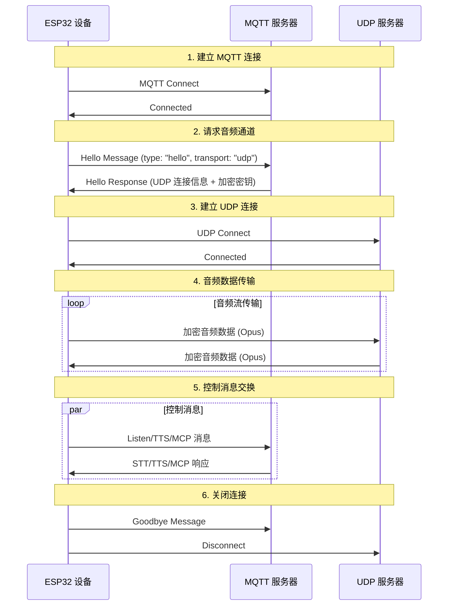
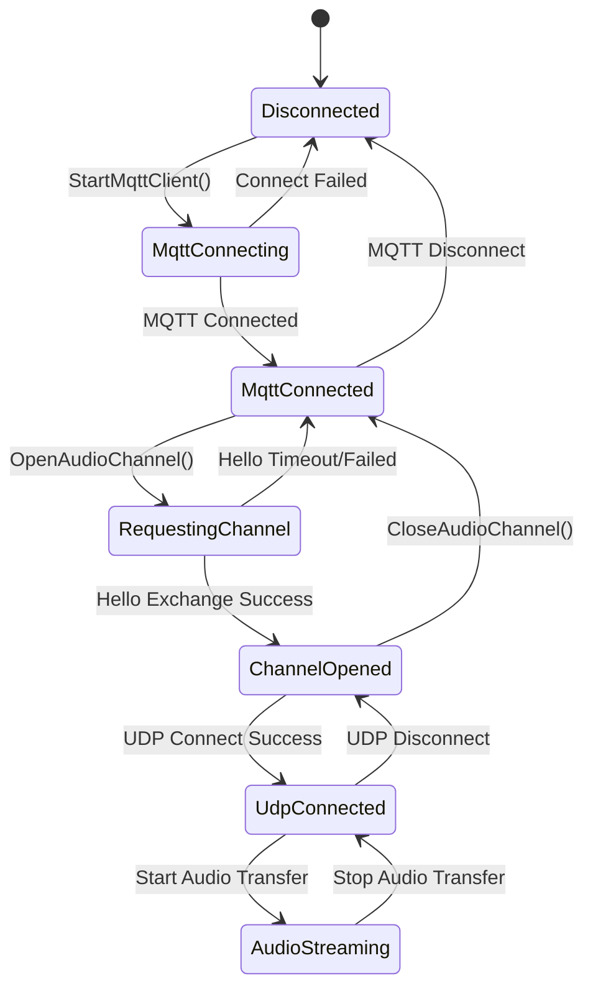

# MQTT + UDP 混合通信协议文档

基于代码实现整理的 MQTT + UDP 混合通信协议文档，概述设备端与服务器之间如何通过 MQTT 进行控制消息传输，通过 UDP 进行音频数据传输的交互方式。

---

## 1. 协议概览

本协议采用混合传输方式：
- **MQTT**：用于控制消息、状态同步、JSON 数据交换
- **UDP**：用于实时音频数据传输，支持加密

### 1.1 协议特点

- **双通道设计**：控制与数据分离，确保实时性
- **加密传输**：UDP 音频数据使用 AES-CTR 加密
- **序列号保护**：防止数据包重放和乱序
- **自动重连**：MQTT 连接断开时自动重连

---

## 2. 总体流程概览



---

## 3. MQTT 控制通道

### 3.1 连接建立

设备通过 MQTT 连接到服务器，连接参数包括：
- **Endpoint**：MQTT 服务器地址和端口
- **Client ID**：设备唯一标识符
- **Username/Password**：认证凭据
- **Keep Alive**：心跳间隔（默认240秒）

### 3.2 Hello 消息交换

#### 3.2.1 设备端发送 Hello

```json
{
  "type": "hello",
  "version": 3,
  "transport": "udp",
  "features": {
    "mcp": true
  },
  "audio_params": {
    "format": "opus",
    "sample_rate": 16000,
    "channels": 1,
    "frame_duration": 60
  }
}
```

#### 3.2.2 服务器响应 Hello

```json
{
  "type": "hello",
  "transport": "udp",
  "session_id": "xxx",
  "audio_params": {
    "format": "opus",
    "sample_rate": 24000,
    "channels": 1,
    "frame_duration": 60
  },
  "udp": {
    "server": "192.168.1.100",
    "port": 8888,
    "key": "0123456789ABCDEF0123456789ABCDEF",
    "nonce": "0123456789ABCDEF0123456789ABCDEF"
  }
}
```

**字段说明：**
- `udp.server`：UDP 服务器地址
- `udp.port`：UDP 服务器端口
- `udp.key`：AES 加密密钥（十六进制字符串）
- `udp.nonce`：AES 加密随机数（十六进制字符串）

### 3.3 JSON 消息类型

#### 3.3.1 设备端→服务器

1. **Listen 消息**
   ```json
   {
     "session_id": "xxx",
     "type": "listen",
     "state": "start",
     "mode": "manual"
   }
   ```

2. **Abort 消息**
   ```json
   {
     "session_id": "xxx",
     "type": "abort",
     "reason": "wake_word_detected"
   }
   ```

3. **MCP 消息**
   ```json
   {
     "session_id": "xxx",
     "type": "mcp",
     "payload": {
       "jsonrpc": "2.0",
       "id": 1,
       "result": {...}
     }
   }
   ```

4. **Goodbye 消息**
   ```json
   {
     "session_id": "xxx",
     "type": "goodbye"
   }
   ```

#### 3.3.2 服务器→设备端

支持的消息类型与 WebSocket 协议一致，包括：
- **STT**：语音识别结果
- **TTS**：语音合成控制
- **LLM**：情感表达控制
- **MCP**：物联网控制
- **System**：系统控制
- **Custom**：自定义消息（可选）

---

## 4. UDP 音频通道

### 4.1 连接建立

设备收到 MQTT Hello 响应后，使用其中的 UDP 连接信息建立音频通道：
1. 解析 UDP 服务器地址和端口
2. 解析加密密钥和随机数
3. 初始化 AES-CTR 加密上下文
4. 建立 UDP 连接

### 4.2 音频数据格式

#### 4.2.1 加密音频包结构

```
|type 1byte|flags 1byte|payload_len 2bytes|ssrc 4bytes|timestamp 4bytes|sequence 4bytes|
|payload payload_len bytes|
```

**字段说明：**
- `type`：数据包类型，固定为 0x01
- `flags`：标志位，当前未使用
- `payload_len`：负载长度（网络字节序）
- `ssrc`：同步源标识符
- `timestamp`：时间戳（网络字节序）
- `sequence`：序列号（网络字节序）
- `payload`：加密的 Opus 音频数据

#### 4.2.2 加密算法

使用 **AES-CTR** 模式加密：
- **密钥**：128位，由服务器提供
- **随机数**：128位，由服务器提供
- **计数器**：包含时间戳和序列号信息

### 4.3 序列号管理

- **发送端**：`local_sequence_` 单调递增
- **接收端**：`remote_sequence_` 验证连续性
- **防重放**：拒绝序列号小于期望值的数据包
- **容错处理**：允许轻微的序列号跳跃，记录警告

### 4.4 错误处理

1. **解密失败**：记录错误，丢弃数据包
2. **序列号异常**：记录警告，但仍处理数据包
3. **数据包格式错误**：记录错误，丢弃数据包

---

## 5. 状态管理

### 5.1 连接状态



### 5.2 状态检查

设备通过以下条件判断音频通道是否可用：
```cpp
bool IsAudioChannelOpened() const {
    return udp_ != nullptr && !error_occurred_ && !IsTimeout();
}
```

---

## 6. 配置参数

### 6.1 MQTT 配置

从设置中读取的配置项：
- `endpoint`：MQTT 服务器地址
- `client_id`：客户端标识符
- `username`：用户名
- `password`：密码
- `keepalive`：心跳间隔（默认240秒）
- `publish_topic`：发布主题

### 6.2 音频参数

- **格式**：Opus
- **采样率**：16000 Hz（设备端）/ 24000 Hz（服务器端）
- **声道数**：1（单声道）
- **帧时长**：60ms

---

## 7. 错误处理与重连

### 7.1 MQTT 重连机制

- 连接失败时自动重试
- 支持错误上报控制
- 断线时触发清理流程

### 7.2 UDP 连接管理

- 连接失败时不自动重试
- 依赖 MQTT 通道重新协商
- 支持连接状态查询

### 7.3 超时处理

基类 `Protocol` 提供超时检测：
- 默认超时时间：120 秒
- 基于最后接收时间计算
- 超时时自动标记为不可用

---

## 8. 安全考虑

### 8.1 传输加密

- **MQTT**：支持 TLS/SSL 加密（端口8883）
- **UDP**：使用 AES-CTR 加密音频数据

### 8.2 认证机制

- **MQTT**：用户名/密码认证
- **UDP**：通过 MQTT 通道分发密钥

### 8.3 防重放攻击

- 序列号单调递增
- 拒绝过期数据包
- 时间戳验证

---

## 9. 性能优化

### 9.1 并发控制

使用互斥锁保护 UDP 连接：
```cpp
std::lock_guard<std::mutex> lock(channel_mutex_);
```

### 9.2 内存管理

- 动态创建/销毁网络对象
- 智能指针管理音频数据包
- 及时释放加密上下文

### 9.3 网络优化

- UDP 连接复用
- 数据包大小优化
- 序列号连续性检查

---

## 10. 与 WebSocket 协议的比较

| 特性 | MQTT + UDP | WebSocket |
|------|------------|-----------|
| 控制通道 | MQTT | WebSocket |
| 音频通道 | UDP (加密) | WebSocket (二进制) |
| 实时性 | 高 (UDP) | 中等 |
| 可靠性 | 中等 | 高 |
| 复杂度 | 高 | 低 |
| 加密 | AES-CTR | TLS |
| 防火墙友好度 | 低 | 高 |

---

## 11. 部署建议

### 11.1 网络环境

- 确保 UDP 端口可达
- 配置防火墙规则
- 考虑 NAT 穿透

### 11.2 服务器配置

- MQTT Broker 配置
- UDP 服务器部署
- 密钥管理系统

### 11.3 监控指标

- 连接成功率
- 音频传输延迟
- 数据包丢失率
- 解密失败率

---

## 12. 总结

MQTT + UDP 混合协议通过以下设计实现高效的音视频通信：

- **分离式架构**：控制与数据通道分离，各司其职
- **加密保护**：AES-CTR 确保音频数据安全传输
- **序列化管理**：防止重放攻击和数据乱序
- **自动恢复**：支持连接断开后的自动重连
- **性能优化**：UDP 传输保证音频数据的实时性

该协议适用于对实时性要求较高的语音交互场景，但需要在网络复杂度和传输性能之间做出权衡。 