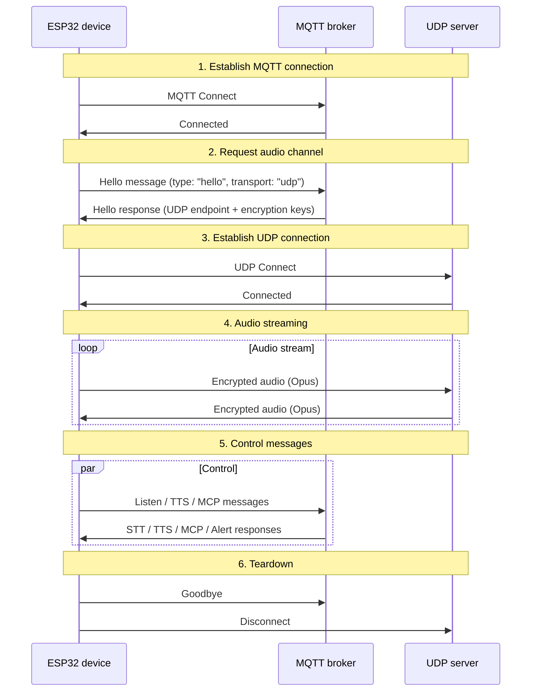
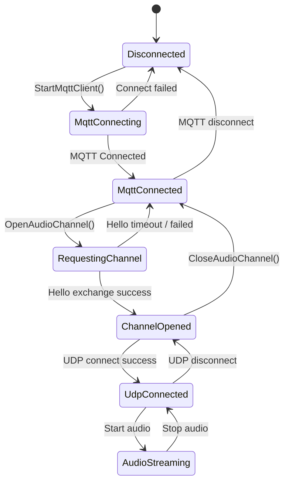

# MQTT + UDP Hybrid Communication Protocol

This document describes the MQTT + UDP hybrid protocol used between the device and the server, based on the current implementation: MQTT carries control messages, UDP carries real-time audio.

---

## 1. Overview

The protocol uses two channels:

- **MQTT** - control messages, state synchronization, JSON payloads.
- **UDP** - real-time audio, encrypted.

### 1.1 Key characteristics

- **Dual channel design** - control is separated from data so audio has low latency.
- **Encrypted transport** - UDP audio is encrypted with AES-CTR.
- **Sequence numbers** - guard against replay and reordering.
- **Automatic reconnect** - MQTT reconnects on disconnect.

---

## 2. End-to-end Flow


```mermaid
sequenceDiagram
    participant Device as ESP32 device
    participant MQTT as MQTT broker
    participant UDP as UDP server

    Note over Device, UDP: 1. Establish MQTT connection
    Device->>MQTT: MQTT Connect
    MQTT->>Device: Connected

    Note over Device, UDP: 2. Request audio channel
    Device->>MQTT: Hello message (type: "hello", transport: "udp")
    MQTT->>Device: Hello response (UDP endpoint + encryption keys)

    Note over Device, UDP: 3. Establish UDP connection
    Device->>UDP: UDP Connect
    UDP->>Device: Connected

    Note over Device, UDP: 4. Audio streaming
    loop Audio stream
        Device->>UDP: Encrypted audio (Opus)
        UDP->>Device: Encrypted audio (Opus)
    end

    Note over Device, UDP: 5. Control messages
    par Control
        Device->>MQTT: Listen / TTS / MCP messages
        MQTT->>Device: STT / TTS / MCP / Alert responses
    end

    Note over Device, UDP: 6. Teardown
    Device->>MQTT: Goodbye
    Device->>UDP: Disconnect
```

---

## 3. MQTT Control Channel

### 3.1 Connection

The device connects to the broker using:
- **Endpoint** - broker host and port.
- **Client ID** - device identifier.
- **Username / Password** - credentials.
- **Keep Alive** - heartbeat interval (default 240 s).

### 3.2 Hello exchange

#### 3.2.1 Device -> Server

```json
{
  "type": "hello",
  "version": 3,
  "transport": "udp",
  "features": {
    "mcp": true,
    "aec": true
  },
  "audio_params": {
    "format": "opus",
    "sample_rate": 16000,
    "channels": 1,
    "frame_duration": 60
  }
}
```

`features.mcp` is always set; `features.aec` is set when `CONFIG_USE_SERVER_AEC` is enabled.

#### 3.2.2 Server -> Device

```json
{
  "type": "hello",
  "transport": "udp",
  "session_id": "xxx",
  "audio_params": {
    "format": "opus",
    "sample_rate": 24000,
    "channels": 1,
    "frame_duration": 60
  },
  "udp": {
    "server": "192.168.1.100",
    "port": 8888,
    "key": "0123456789ABCDEF0123456789ABCDEF",
    "nonce": "0123456789ABCDEF0123456789ABCDEF"
  }
}
```

Field reference:
- `udp.server` - UDP server address.
- `udp.port` - UDP server port.
- `udp.key` - AES key, hex-encoded.
- `udp.nonce` - AES nonce, hex-encoded.

### 3.3 JSON message types

#### 3.3.1 Device -> Server

1. **Listen**
   ```json
   {
     "session_id": "xxx",
     "type": "listen",
     "state": "start",
     "mode": "manual"
   }
   ```

2. **Abort**
   ```json
   {
     "session_id": "xxx",
     "type": "abort",
     "reason": "wake_word_detected"
   }
   ```

3. **MCP**
   ```json
   {
     "session_id": "xxx",
     "type": "mcp",
     "payload": {
       "jsonrpc": "2.0",
       "id": 1,
       "result": {}
     }
   }
   ```

4. **Goodbye**
   ```json
   {
     "session_id": "xxx",
     "type": "goodbye"
   }
   ```

#### 3.3.2 Server -> Device

Semantics match the WebSocket protocol. Supported types:
- **STT** - speech recognition result.
- **TTS** - TTS lifecycle (`start`, `stop`, `sentence_start`).
- **LLM** - emotion update for the UI.
- **MCP** - IoT control.
- **System** - system control, e.g. `"command": "reboot"`.
- **Alert** - show an alert on the UI; fields: `status`, `message`, `emotion`.
- **Goodbye** - server-initiated shutdown of the audio session. The device responds by closing the UDP channel without sending its own goodbye.
- **Custom** (optional, enabled via `CONFIG_RECEIVE_CUSTOM_MESSAGE`).

Example alert:
```json
{
  "session_id": "xxx",
  "type": "alert",
  "status": "Warning",
  "message": "Battery low",
  "emotion": "sad"
}
```

---

## 4. UDP Audio Channel

### 4.1 Establishing the channel

After the device receives the MQTT hello response, it:
1. Parses the UDP host and port.
2. Parses the AES key and nonce.
3. Initializes the AES-CTR context.
4. Opens the UDP socket.

### 4.2 Audio packet format

#### 4.2.1 Encrypted audio packet

```
|type 1B|flags 1B|payload_len 2B|ssrc 4B|timestamp 4B|sequence 4B|
|payload payload_len bytes|
```

Field reference:
- `type`: packet type, always `0x01`.
- `flags`: flags, currently unused.
- `payload_len`: payload length (network byte order).
- `ssrc`: synchronization source identifier.
- `timestamp`: timestamp (network byte order).
- `sequence`: sequence number (network byte order).
- `payload`: encrypted Opus audio data.

#### 4.2.2 Encryption

Uses **AES-CTR** with:
- **Key**: 128-bit, provided by the server.
- **Nonce**: 128-bit, provided by the server.
- **Counter**: built from the timestamp and sequence number.

### 4.3 Sequence number management

- **Sender**: `local_sequence_` is incremented monotonically.
- **Receiver**: `remote_sequence_` validates continuity.
- **Anti-replay**: packets with sequence numbers below the expected value are dropped.
- **Tolerance**: small gaps are logged as warnings but still accepted.

### 4.4 Error handling

1. **Decryption failure** - log an error and drop the packet.
2. **Sequence gap** - log a warning, continue processing the packet.
3. **Malformed packet** - log an error and drop.

---

## 5. State Management

### 5.1 Connection state


```mermaid
stateDiagram
    direction TB
    [*] --> Disconnected
    Disconnected --> MqttConnecting: StartMqttClient()
    MqttConnecting --> MqttConnected: MQTT Connected
    MqttConnecting --> Disconnected: Connect failed
    MqttConnected --> RequestingChannel: OpenAudioChannel()
    RequestingChannel --> ChannelOpened: Hello exchange success
    RequestingChannel --> MqttConnected: Hello timeout / failed
    ChannelOpened --> UdpConnected: UDP connect success
    UdpConnected --> AudioStreaming: Start audio
    AudioStreaming --> UdpConnected: Stop audio
    UdpConnected --> ChannelOpened: UDP disconnect
    ChannelOpened --> MqttConnected: CloseAudioChannel()
    MqttConnected --> Disconnected: MQTT disconnect
```

### 5.2 State check

The device determines whether the audio channel is available with:
```cpp
bool IsAudioChannelOpened() const {
    return udp_ != nullptr && !error_occurred_ && !IsTimeout();
}
```

---

## 6. Configuration Parameters

### 6.1 MQTT settings

Read from storage:
- `endpoint` - broker address.
- `client_id` - client identifier.
- `username` - user name.
- `password` - password.
- `keepalive` - keep-alive interval (default 240 s).
- `publish_topic` - publish topic.

### 6.2 Audio parameters

- **Format**: Opus
- **Sample rate**: 16 kHz device / 24 kHz server
- **Channels**: 1 (mono)
- **Frame duration**: 60 ms

---

## 7. Error Handling and Reconnection

### 7.1 MQTT reconnect

- Automatic retry on connect failure.
- Optional error reporting.
- Clean-up runs on disconnect.

### 7.2 UDP connection

- No automatic retry; depends on re-negotiation via MQTT.
- Status can be queried at any time.

### 7.3 Timeouts

The base `Protocol` class provides timeout detection:
- Default timeout: 120 s.
- Based on the time since the last incoming packet.
- After a timeout the channel is marked unavailable.

---

## 8. Security

### 8.1 Transport encryption

- **MQTT**: supports TLS/SSL (port 8883).
- **UDP**: AES-CTR on audio payloads.

### 8.2 Authentication

- **MQTT**: user name / password.
- **UDP**: keys are distributed via the MQTT channel.

### 8.3 Anti-replay

- Monotonically increasing sequence numbers.
- Stale packets are dropped.
- Timestamps are validated.

---

## 9. Performance Notes

### 9.1 Concurrency

A mutex protects the UDP connection:
```cpp
std::lock_guard<std::mutex> lock(channel_mutex_);
```

### 9.2 Memory management

- Network objects are created and destroyed dynamically.
- Audio packets are managed with smart pointers.
- Encryption contexts are released promptly.

### 9.3 Network optimizations

- UDP connection reuse.
- Reasonable packet sizes.
- Sequence continuity checks.

---

## 10. Comparison with WebSocket

| Feature | MQTT + UDP | WebSocket |
|---------|------------|-----------|
| Control channel | MQTT | WebSocket |
| Audio channel | UDP (encrypted) | WebSocket (binary) |
| Latency | Low (UDP) | Medium |
| Reliability | Medium | High |
| Complexity | High | Low |
| Encryption | AES-CTR | TLS |
| Firewall friendliness | Low | High |

---

## 11. Deployment Notes

### 11.1 Network

- Ensure UDP ports are reachable.
- Configure firewall rules accordingly.
- Plan for NAT traversal if needed.

### 11.2 Server infrastructure

- MQTT broker configuration.
- UDP server deployment.
- Key management.

### 11.3 Monitoring

- Connection success rate.
- Audio transmission latency.
- Packet loss.
- Decryption failures.

---

## 12. Summary

The MQTT + UDP hybrid protocol achieves efficient audio communication through:

- **Split architecture** - separate control and data channels with clear responsibilities.
- **Encryption** - AES-CTR protects audio payloads.
- **Sequence management** - prevents replay and reordering.
- **Automatic recovery** - MQTT reconnects on failure.
- **Performance** - UDP keeps audio latency low.

The protocol is a good fit for low-latency voice interaction, at the cost of higher network complexity than pure WebSocket.
