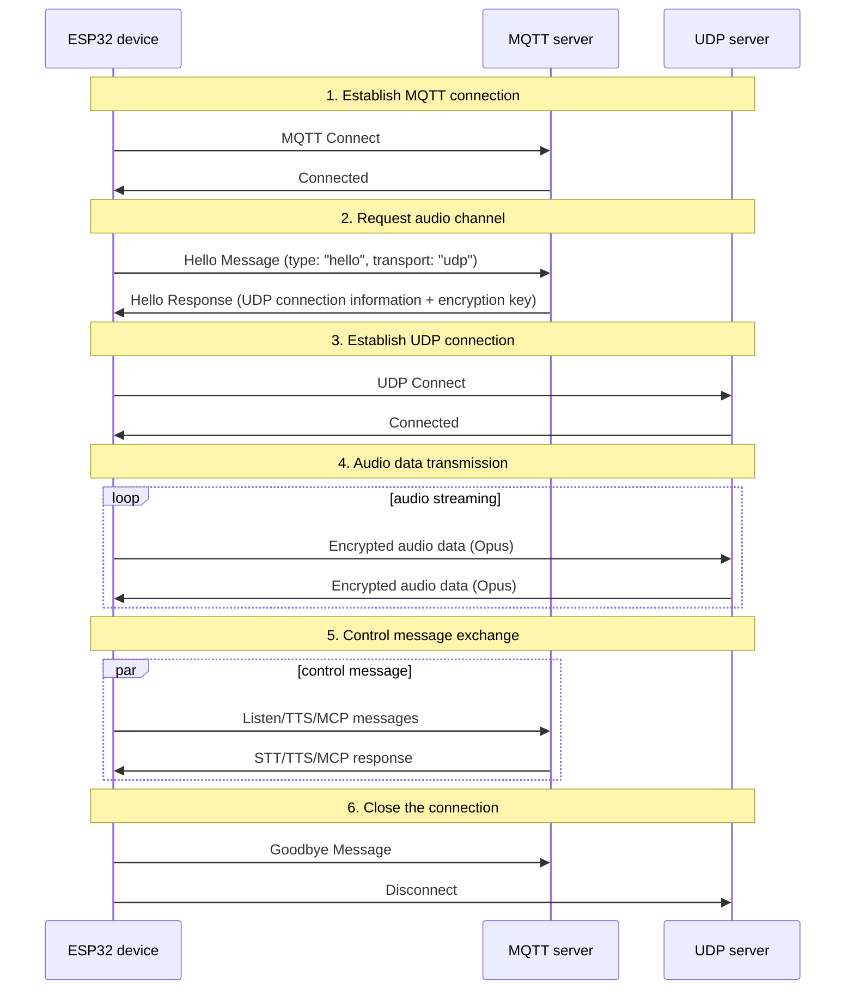
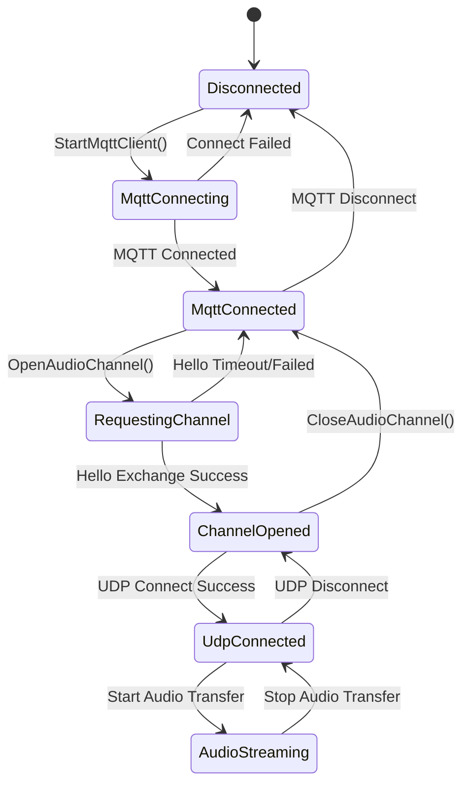

# MQTT + UDP hybrid communication protocol documentation

MQTT + UDP hybrid communication protocol document compiled based on code implementation, outlining the interaction between the device and the server on how to transmit control messages through MQTT and transmit audio data through UDP.

---

## 1. Protocol Overview

This agreement uses a mixed transmission method:
- **MQTT**: used to control messages, status synchronization, and JSON data exchange
- **UDP**: used for real-time audio data transmission, supports encryption

### 1.1 Protocol Features

- **Dual-channel design**: separation of control and data to ensure real-time performance
- **Encrypted transmission**: UDP audio data is encrypted using AES-CTR
- **Sequence Number Protection**: Prevent packet replay and reordering
- **Automatic reconnect**: Automatically reconnect when MQTT connection is disconnected

---

## 2. Overall process overview



---

## 3. MQTT control channel

### 3.1 Connection establishment

The device connects to the server via MQTT, and the connection parameters include:
- **Endpoint**: MQTT server address and port
- **Client ID**: Device unique identifier
- **Username/Password**: Authentication credentials
- **Keep Alive**: heartbeat interval (default 240 seconds)

### 3.2 Hello message exchange

#### 3.2.1 The device sends Hello

```json
{
  "type": "hello",
  "version": 3,
  "transport": "udp",
  "features": {
    "mcp": true
  },
  "audio_params": {
    "format": "opus",
    "sample_rate": 16000,
    "channels": 1,
    "frame_duration": 60
  }
}
```

#### 3.2.2 Server responds Hello

```json
{
  "type": "hello",
  "transport": "udp",
  "session_id": "xxx",
  "audio_params": {
    "format": "opus",
    "sample_rate": 24000,
    "channels": 1,
    "frame_duration": 60
  },
  "udp": {
    "server": "192.168.1.100",
    "port": 8888,
    "key": "0123456789ABCDEF0123456789ABCDEF",
    "nonce": "0123456789ABCDEF0123456789ABCDEF"
  }
}
```

**Field description:**
- `udp.server`: UDP server address
- `udp.port`: UDP server port
- `udp.key`: AES encryption key (hex string)
- `udp.nonce`: AES encrypted nonce (hex string)

### 3.3 JSON message type

#### 3.3.1 Device → Server

1. **Listen message**
   ```json
   {
     "session_id": "xxx",
     "type": "listen",
     "state": "start",
     "mode": "manual"
   }
   ```

2. **Abort message**
   ```json
   {
     "session_id": "xxx",
     "type": "abort",
     "reason": "wake_word_detected"
   }
   ```

3. **MCP Message**
   ```json
   {
     "session_id": "xxx",
     "type": "mcp",
     "payload": {
       "jsonrpc": "2.0",
       "id": 1,
       "result": {...}
     }
   }
   ```

4. **Goodbye Message**
   ```json
   {
     "session_id": "xxx",
     "type": "goodbye"
   }
   ```

#### 3.3.2 Server→Device

The supported message types are consistent with the WebSocket protocol, including:
- **STT**: Speech recognition results
- **TTS**: speech synthesis control
- **LLM**: Emotional Expression Control
- **MCP**: IoT Control
- **System**: System control
- **Custom**: Custom message (optional)

---

## 4. UDP audio channel

### 4.1 Connection establishment

After the device receives the MQTT Hello response, it uses the UDP connection information in it to establish an audio channel:
1. Resolve UDP server address and port
2. Parse encryption keys and random numbers
3. Initialize AES-CTR encryption context
4. Establish UDP connection

### 4.2 Audio data format

#### 4.2.1 Encrypted audio packet structure

```
|type 1byte|flags 1byte|payload_len 2bytes|ssrc 4bytes|timestamp 4bytes|sequence 4bytes|
|payload payload_len bytes|
```

**Field description:**
- `type`: packet type, fixed to 0x01
- `flags`: flag bit, currently unused
- `payload_len`: payload length (network byte order)
- `ssrc`: synchronization source identifier
- `timestamp`: timestamp (network byte order)
- `sequence`: sequence number (network byte order)
- `payload`: encrypted Opus audio data

#### 4.2.2 Encryption algorithm

Encrypt using **AES-CTR** mode:
- **Key**: 128 bits, provided by the server
- **Random number**: 128 bits, provided by the server
- **Counter**: Contains timestamp and sequence number information

### 4.3 Serial number management

- **Sender**: `local_sequence_` monotonically increasing
- **Receiver**: `remote_sequence_` Verify continuity
- **Anti-replay**: Reject packets with sequence numbers smaller than the expected value
- **Fault Tolerance**: Allow minor sequence number jumps, log warnings

### 4.4 Error handling

1. **Decryption failed**: error logged, packet discarded
2. **Sequence number exception**: Log warning, but still process packet
3. **Data packet format error**: record error and discard the data packet

---

## 5. Status management

### 5.1 Connection status



### 5.2 Status Check

The device determines whether the audio channel is available through the following conditions:
```cpp
bool IsAudioChannelOpened() const {
    return udp_ != nullptr && !error_occurred_ && !IsTimeout();
}
```

---

## 6. Configuration parameters

### 6.1 MQTT configuration

Configuration items read from settings:
- `endpoint`: MQTT server address
- `client_id`: client identifier
- `username`: username
- `password`: password
- `keepalive`: heartbeat interval (default 240 seconds)
- `publish_topic`: Publish topic

### 6.2 Audio parameters

- **Format**: Opus
- **Sampling rate**: 16000 Hz (device side) / 24000 Hz (server side)
- **Number of channels**: 1 (mono)
- **Frame duration**: 60ms

---

## 7. Error handling and reconnection

### 7.1 MQTT reconnection mechanism

- Automatically retry when connection fails
- Support error reporting control
- Trigger the cleanup process when disconnected

### 7.2 UDP connection management

- Does not automatically retry when connection fails
- Rely on MQTT channel renegotiation
-Support connection status query

### 7.3 Timeout processing

The base class `Protocol` provides timeout detection:
- Default timeout: 120 seconds
- Calculated based on last reception time
- Automatically marked as unavailable upon timeout

---

## 8. Security considerations

### 8.1 Transmission encryption

- **MQTT**: Supports TLS/SSL encryption (port 8883)
- **UDP**: Encrypt audio data using AES-CTR

### 8.2 Authentication mechanism

- **MQTT**: username/password authentication
- **UDP**: Distribute keys via MQTT channel

### 8.3 Anti-replay attacks

- Serial numbers increase monotonically
- Reject expired packets
- Timestamp verification

---

## 9. Performance optimization

### 9.1 Concurrency control

Use a mutex to protect a UDP connection:
```cpp
std::lock_guard<std::mutex> lock(channel_mutex_);
```

### 9.2 Memory Management

- Dynamically create/destroy network objects
- Smart pointer to manage audio packets
- Release encryption context promptly

### 9.3 Network optimization

- UDP connection multiplexing
- Packet size optimization
- Serial number continuity check

---

## 10. Comparison with WebSocket protocol

| Features | MQTT + UDP | WebSocket |
|------|------------|-----------|
| Control Channel | MQTT | WebSocket |
| Audio channel | UDP (encrypted) | WebSocket (binary) |
| Real-time | High (UDP) | Medium |
| Reliability | Medium | High |
| Complexity | High | Low |
| Encryption | AES-CTR | TLS |
| Firewall friendliness | Low | High |

---

## 11. Deployment recommendations

### 11.1 Network environment

- Make sure the UDP port is reachable
- Configure firewall rules
- Consider NAT penetration

### 11.2 Server configuration

- MQTT Broker configuration
- UDP server deployment
- Key management system

### 11.3 Monitoring indicators

- Connection success rate
- Audio transmission delay
- Packet loss rate
- Decryption failure rate

---

## 12. Summary

The MQTT + UDP hybrid protocol achieves efficient audio and video communication through the following design:

- **Separated Architecture**: Control and data channels are separated and each performs its own duties
- **Encryption Protection**: AES-CTR ensures secure transmission of audio data
- **Serialization Management**: Prevent replay attacks and data disorder
- **Automatic Recovery**: Supports automatic reconnection after disconnection
- **Performance Optimization**: UDP transmission ensures the real-time nature of audio data

This protocol is suitable for voice interaction scenarios that require high real-time performance, but requires a trade-off between network complexity and transmission performance.