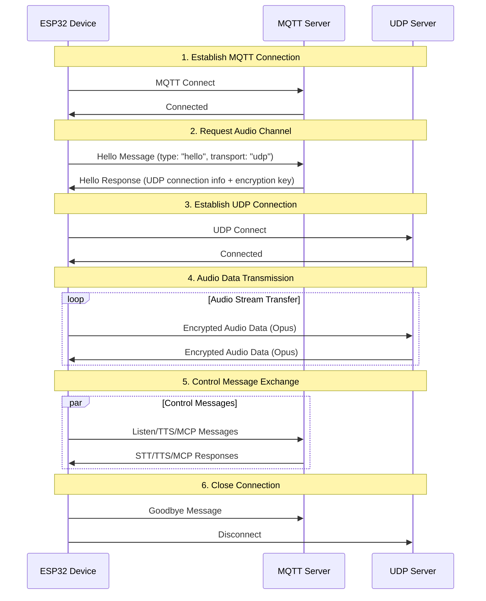

# MQTT + UDP Hybrid Communication Protocol Documentation

Documentation of the MQTT + UDP hybrid communication protocol based on code implementation, outlining how devices and servers interact through MQTT for control message transmission and UDP for audio data transmission.

---

## 1. Protocol Overview

This protocol adopts a hybrid transmission approach:
- **MQTT**: Used for control messages, status synchronization, JSON data exchange
- **UDP**: Used for real-time audio data transmission, supports encryption

### 1.1 Protocol Features

- **Dual-channel design**: Separation of control and data ensures real-time performance
- **Encrypted transmission**: UDP audio data uses AES-CTR encryption
- **Sequence number protection**: Prevents packet replay and out-of-order issues
- **Automatic reconnection**: Automatic reconnection when MQTT connection drops

---

## 2. Overall Flow Overview



---

## 3. MQTT Control Channel

### 3.1 Connection Establishment

The device connects to the server via MQTT, connection parameters include:
- **Endpoint**: MQTT server address and port
- **Client ID**: Device unique identifier
- **Username/Password**: Authentication credentials
- **Keep Alive**: Heartbeat interval (default 240 seconds)

### 3.2 Hello Message Exchange

#### 3.2.1 Device Sends Hello

```json
{
  "type": "hello",
  "version": 3,
  "transport": "udp",
  "features": {
    "mcp": true
  },
  "audio_params": {
    "format": "opus",
    "sample_rate": 16000,
    "channels": 1,
    "frame_duration": 60
  }
}
```

#### 3.2.2 Server Responds Hello

```json
{
  "type": "hello",
  "transport": "udp",
  "session_id": "xxx",
  "audio_params": {
    "format": "opus",
    "sample_rate": 24000,
    "channels": 1,
    "frame_duration": 60
  },
  "udp": {
    "server": "192.168.1.100",
    "port": 8888,
    "key": "0123456789ABCDEF0123456789ABCDEF",
    "nonce": "0123456789ABCDEF0123456789ABCDEF"
  }
}
```

**Field Description:**
- `udp.server`: UDP server address
- `udp.port`: UDP server port
- `udp.key`: AES encryption key (hexadecimal string)
- `udp.nonce`: AES encryption nonce (hexadecimal string)

### 3.3 JSON Message Types

#### 3.3.1 Device → Server

1. **Listen Message**
   ```json
   {
     "session_id": "xxx",
     "type": "listen",
     "state": "start",
     "mode": "manual"
   }
   ```

2. **Abort Message**
   ```json
   {
     "session_id": "xxx",
     "type": "abort",
     "reason": "wake_word_detected"
   }
   ```

3. **MCP Message**
   ```json
   {
     "session_id": "xxx",
     "type": "mcp",
     "payload": {
       "jsonrpc": "2.0",
       "id": 1,
       "result": {...}
     }
   }
   ```

4. **Goodbye Message**
   ```json
   {
     "session_id": "xxx",
     "type": "goodbye"
   }
   ```

#### 3.3.2 Server → Device

Supported message types are consistent with WebSocket protocol, including:
- **STT**: Speech recognition results
- **TTS**: Text-to-speech control
- **LLM**: Emotion expression control
- **MCP**: IoT control
- **System**: System control
- **Custom**: Custom messages (optional)

---

## 4. UDP Audio Channel

### 4.1 Connection Establishment

After receiving the MQTT Hello response, the device establishes an audio channel using the UDP connection information:
1. Parse UDP server address and port
2. Parse encryption key and nonce
3. Initialize AES-CTR encryption context
4. Establish UDP connection

### 4.2 Audio Data Format

#### 4.2.1 Encrypted Audio Packet Structure

```
|type 1byte|flags 1byte|payload_len 2bytes|ssrc 4bytes|timestamp 4bytes|sequence 4bytes|
|payload payload_len bytes|
```

**Field Description:**
- `type`: Packet type, fixed as 0x01
- `flags`: Flag bits, currently unused
- `payload_len`: Payload length (network byte order)
- `ssrc`: Synchronization source identifier
- `timestamp`: Timestamp (network byte order)
- `sequence`: Sequence number (network byte order)
- `payload`: Encrypted Opus audio data

#### 4.2.2 Encryption Algorithm

Uses **AES-CTR** mode encryption:
- **Key**: 128-bit, provided by server
- **Nonce**: 128-bit, provided by server
- **Counter**: Contains timestamp and sequence number information

### 4.3 Sequence Number Management

- **Sender**: `local_sequence_` monotonically increases
- **Receiver**: `remote_sequence_` validates continuity
- **Replay protection**: Rejects packets with sequence numbers less than expected value
- **Fault tolerance**: Allows slight sequence number jumps, logs warnings

### 4.4 Error Handling

1. **Decryption failure**: Log error, discard packet
2. **Sequence number anomaly**: Log warning, but still process packet
3. **Packet format error**: Log error, discard packet

---

## 5. State Management

### 5.1 Connection States


### 5.2 State Check

The device determines if the audio channel is available through the following condition:
```cpp
bool IsAudioChannelOpened() const {
    return udp_ != nullptr && !error_occurred_ && !IsTimeout();
}
```

---

## 6. Configuration Parameters

### 6.1 MQTT Configuration

Configuration items read from settings:
- `endpoint`: MQTT server address
- `client_id`: Client identifier
- `username`: Username
- `password`: Password
- `keepalive`: Heartbeat interval (default 240 seconds)
- `publish_topic`: Publish topic

### 6.2 Audio Parameters

- **Format**: Opus
- **Sample Rate**: 16000 Hz (device side) / 24000 Hz (server side)
- **Channels**: 1 (mono)
- **Frame Duration**: 60ms

---

## 7. Error Handling and Reconnection

### 7.1 MQTT Reconnection Mechanism

- Automatic retry on connection failure
- Supports error reporting control
- Triggers cleanup process on disconnection

### 7.2 UDP Connection Management

- No automatic retry on connection failure
- Depends on MQTT channel renegotiation
- Supports connection status query

### 7.3 Timeout Handling

Base class `Protocol` provides timeout detection:
- Default timeout: 120 seconds
- Calculated based on last receive time
- Automatically marked as unavailable on timeout

---

## 8. Security Considerations

### 8.1 Transport Encryption

- **MQTT**: Supports TLS/SSL encryption (port 8883)
- **UDP**: Uses AES-CTR encryption for audio data

### 8.2 Authentication Mechanism

- **MQTT**: Username/password authentication
- **UDP**: Key distribution through MQTT channel

### 8.3 Replay Attack Prevention

- Sequence number monotonically increases
- Rejects expired packets
- Timestamp validation

---

## 9. Performance Optimization

### 9.1 Concurrency Control

Uses mutex to protect UDP connection:
```cpp
std::lock_guard<std::mutex> lock(channel_mutex_);
```

### 9.2 Memory Management

- Dynamic creation/destruction of network objects
- Smart pointers manage audio data packets
- Timely release of encryption context

### 9.3 Network Optimization

- UDP connection reuse
- Packet size optimization
- Sequence number continuity check

---

## 10. Comparison with WebSocket Protocol

| Feature | MQTT + UDP | WebSocket |
|---------|------------|-----------|
| Control Channel | MQTT | WebSocket |
| Audio Channel | UDP (encrypted) | WebSocket (binary) |
| Real-time Performance | High (UDP) | Medium |
| Reliability | Medium | High |
| Complexity | High | Low |
| Encryption | AES-CTR | TLS |
| Firewall Friendly | Low | High |

---

## 11. Deployment Recommendations

### 11.1 Network Environment

- Ensure UDP port is reachable
- Configure firewall rules
- Consider NAT traversal

### 11.2 Server Configuration

- MQTT Broker configuration
- UDP server deployment
- Key management system

### 11.3 Monitoring Metrics

- Connection success rate
- Audio transmission latency
- Packet loss rate
- Decryption failure rate

---

## 12. Summary

The MQTT + UDP hybrid protocol achieves efficient audio/video communication through the following design:

- **Separated Architecture**: Control and data channels separated, each with its own responsibility
- **Encryption Protection**: AES-CTR ensures secure audio data transmission
- **Serialization Management**: Prevents replay attacks and data out-of-order
- **Automatic Recovery**: Supports automatic reconnection after disconnection
- **Performance Optimization**: UDP transmission ensures real-time audio data

This protocol is suitable for voice interaction scenarios with high real-time requirements, but requires trade-offs between network complexity and transmission performance.
