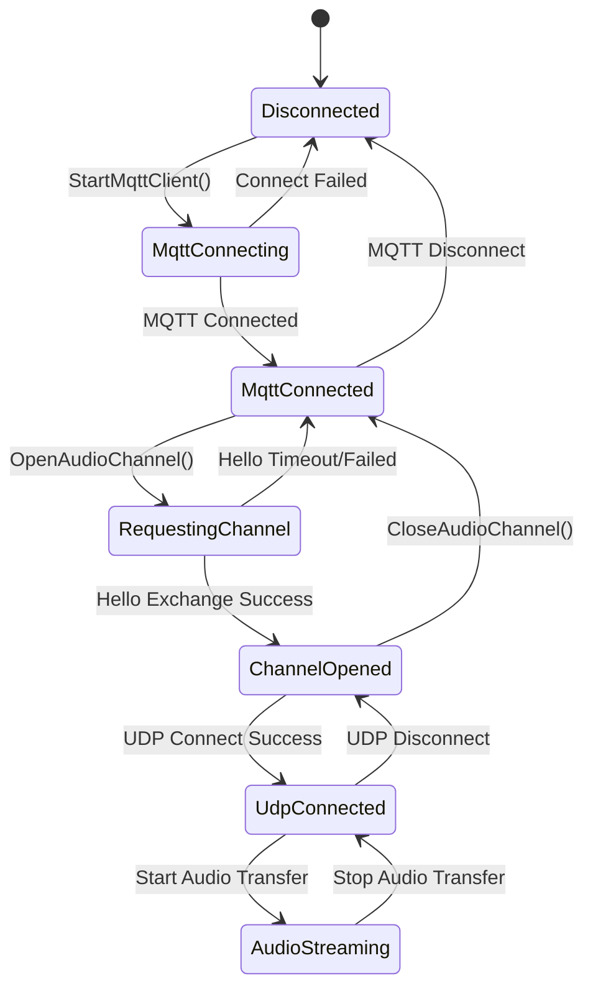

# Documentação do protocolo de comunicação híbrida MQTT + UDP

Documento do protocolo de comunicação híbrida MQTT + UDP compilado com base na implementação de código, descrevendo a interação entre o dispositivo e o servidor sobre como transmitir mensagens de controle por meio de MQTT e transmitir dados de áudio por meio de UDP.

---

## 1. Visão geral do protocolo

Este acordo utiliza um método de transmissão misto:
- **MQTT**: usado para controlar mensagens, sincronização de status e troca de dados JSON
- **UDP**: usado para transmissão de dados de áudio em tempo real, suporta criptografia

### 1.1 Recursos do protocolo

- **Design de canal duplo**: separação de controle e dados para garantir desempenho em tempo real
- **Transmissão criptografada**: os dados de áudio UDP são criptografados usando AES-CTR
- **Proteção de número de sequência**: evita a repetição e reordenação de pacotes
- **Reconexão automática**: Reconecte automaticamente quando a conexão MQTT for desconectada

---

## 2. Visão geral do processo

```mermaid
sequenceDiagram
    Dispositivo participante como dispositivo ESP32
    participante MQTT como servidor MQTT
    participante UDP como servidor UDP

    Nota sobre dispositivo, UDP: 1. Estabeleça conexão MQTT
    Device->>MQTT: MQTT Connect
    MQTT->>Device: Connected

    Nota sobre dispositivo, UDP: 2. Solicitar canal de áudio
    Device->>MQTT: Hello Message (type: "hello", transport: "udp")
    MQTT->>Dispositivo: Hello Response (informações de conexão UDP + chave de criptografia)

    Nota sobre dispositivo, UDP: 3. Estabeleça conexão UDP
    Device->>UDP: UDP Connect
    UDP->>Device: Connected

    Nota sobre dispositivo, UDP: 4. Transmissão de dados de áudio
    streaming de áudio em loop
        Dispositivo->>UDP: Dados de áudio criptografados (Opus)
        UDP->>Dispositivo: Dados de áudio criptografados (Opus)
    end

    Nota sobre dispositivo, UDP: 5. Controle a troca de mensagens
    mensagem de controle par
        Dispositivo->>MQTT: Mensagens de escuta/TTS/MCP
        MQTT->>Dispositivo: resposta STT/TTS/MCP
    end

    Nota sobre dispositivo, UDP: 6. Feche a conexão
    Device->>MQTT: Goodbye Message
    Device->>UDP: Disconnect
```

---

## 3. Canal de controle MQTT

### 3.1 Estabelecimento de conexão

O dispositivo se conecta ao servidor via MQTT e os parâmetros de conexão incluem:
- **Endpoint**: endereço e porta do servidor MQTT
- **ID do cliente**: identificador exclusivo do dispositivo
- **Nome de usuário/senha**: credenciais de autenticação
- **Keep Alive**: intervalo de pulsação (padrão 240 segundos)

### 3.2 Olá troca de mensagens

#### 3.2.1 O dispositivo envia Olá

```json
{
  "type": "hello",
  "version": 3,
  "transport": "udp",
  "features": {
    "mcp": true
  },
  "audio_params": {
    "format": "opus",
    "sample_rate": 16000,
    "channels": 1,
    "frame_duration": 60
  }
}
```

#### 3.2.2 Servidor responde Olá

```json
{
  "type": "hello",
  "transport": "udp",
  "session_id": "xxx",
  "audio_params": {
    "format": "opus",
    "sample_rate": 24000,
    "channels": 1,
    "frame_duration": 60
  },
  "udp": {
    "server": "192.168.1.100",
    "port": 8888,
    "key": "0123456789ABCDEF0123456789ABCDEF",
    "nonce": "0123456789ABCDEF0123456789ABCDEF"
  }
}
```

**Descrição do campo:**
- `udp.server`: endereço do servidor UDP
- `udp.port`: porta do servidor UDP
- `udp.key`: chave de criptografia AES (string hexadecimal)
- `udp.nonce`: nonce criptografado AES (string hexadecimal)

### 3.3 Tipo de mensagem JSON

#### 3.3.1 Dispositivo → Servidor

1. **Ouça a mensagem**
   ```json
   {
     "session_id": "xxx",
     "type": "listen",
     "state": "start",
     "mode": "manual"
   }
   ```

2. **Abortar mensagem**
   ```json
   {
     "session_id": "xxx",
     "type": "abort",
     "reason": "wake_word_detected"
   }
   ```

3. **Mensagem MCP**
   ```json
   {
     "session_id": "xxx",
     "type": "mcp",
     "payload": {
       "jsonrpc": "2.0",
       "id": 1,
       "result": {...}
     }
   }
   ```

4. **Mensagem de adeus**
   ```json
   {
     "session_id": "xxx",
     "type": "goodbye"
   }
   ```

#### 3.3.2 Servidor→Dispositivo

Os tipos de mensagens suportados são consistentes com o protocolo WebSocket, incluindo:
- **STT**: resultados de reconhecimento de fala
- **TTS**: controle de síntese de fala
- **LLM**: Controle de Expressão Emocional
- **MCP**: Controle de IoT
- **Sistema**: Controle do sistema
- **Personalizado**: mensagem personalizada (opcional)

---

## 4. Canal de áudio UDP

### 4.1 Estabelecimento de conexão

Depois que o dispositivo recebe a resposta MQTT Hello, ele usa as informações de conexão UDP contidas nela para estabelecer um canal de áudio:
1. Resolva o endereço e a porta do servidor UDP
2. Analise chaves de criptografia e números aleatórios
3. Inicialize o contexto de criptografia AES-CTR
4. Estabeleça conexão UDP

### 4.2 Formato de dados de áudio

#### 4.2.1 Estrutura de pacote de áudio criptografado

```
|type 1byte|flags 1byte|payload_len 2bytes|ssrc 4bytes|timestamp 4bytes|sequence 4bytes|
|payload payload_len bytes|
```

**Descrição do campo:**
- `type`: tipo de pacote, fixado em 0x01
- `flags`: bit de flag, atualmente não utilizado
- `payload_len`: comprimento da carga útil (ordem de bytes da rede)
- `ssrc`: identificador da fonte de sincronização
- `timestamp`: timestamp (ordem de bytes da rede)
- `sequence`: número de sequência (ordem de bytes da rede)
- `payload`: dados de áudio criptografados do Opus

#### 4.2.2 Algoritmo de criptografia

Criptografe usando o modo **AES-CTR**:
- **Chave**: 128 bits, fornecida pelo servidor
- **Número aleatório**: 128 bits, fornecido pelo servidor
- **Contador**: contém informações de carimbo de data/hora e número de sequência

### 4.3 Gerenciamento de número de série

- **Remetente**: `local_sequence_` aumentando monotonicamente
- **Receptor**: `remote_sequence_` Verifique a continuidade
- **Anti-replay**: rejeita pacotes com números de sequência menores que o valor esperado
- **Tolerância a falhas**: permite saltos menores de números de sequência, avisos de registro

### 4.4 Tratamento de erros

1. **Falha na descriptografia**: erro registrado, pacote descartado
2. **Exceção de número de sequência**: Registra aviso, mas ainda processa pacote
3. **Erro de formato do pacote de dados**: registre o erro e descarte o pacote de dados

---

## 5. Gerenciamento de status

### 5.1 Status da conexão



### 5.2 Verificação de status

O dispositivo determina se o canal de áudio está disponível através das seguintes condições:
```cpp
bool IsAudioChannelOpened() const {
    return udp_ != nullptr && !error_occurred_ && !IsTimeout();
}
```

---

## 6. Parâmetros de configuração

### 6.1 Configuração MQTT

Itens de configuração lidos nas configurações:
- `endpoint`: endereço do servidor MQTT
- `client_id`: identificador do cliente
- `nome de usuário`: nome de usuário
- `senha`: senha
- `keepalive`: intervalo de pulsação (padrão 240 segundos)
- `publish_topic`: Publicar tópico

### 6.2 Parâmetros de áudio

- **Formato**: Opus
**Taxa de amostragem**: 16.000 Hz (lado do dispositivo) / 24.000 Hz (lado do servidor)
- **Número de canais**: 1 (mono)
- **Duração do quadro**: 60ms

---

## 7. Tratamento de erros e reconexão

### 7.1 Mecanismo de reconexão MQTT

- Tentar novamente automaticamente quando a conexão falhar
- Suporte ao controle de relatórios de erros
- Acione o processo de limpeza quando desconectado

### 7.2 Gerenciamento de conexão UDP

- Não tenta novamente automaticamente quando a conexão falha
- Confie na renegociação do canal MQTT
-Suporte para consulta de status de conexão

### 7.3 Processamento de tempo limite

A classe base `Protocol` fornece detecção de tempo limite:
- Tempo limite padrão: 120 segundos
- Calculado com base no horário da última recepção
- Marcado automaticamente como indisponível após o tempo limite

---

## 8. Considerações de segurança

### 8.1 Criptografia de transmissão

- **MQTT**: Suporta criptografia TLS/SSL (porta 8883)
- **UDP**: criptografe dados de áudio usando AES-CTR

### 8.2 Mecanismo de autenticação

- **MQTT**: autenticação de nome de usuário/senha
- **UDP**: Distribuir chaves via canal MQTT

### 8.3 Ataques anti-repetição

- Os números de série aumentam monotonicamente
- Rejeitar pacotes expirados
- Verificação de carimbo de data/hora

---

## 9. Otimização de desempenho

### 9.1 Controle de simultaneidade

Use um mutex para proteger uma conexão UDP:
```cpp
std::lock_guard<std::mutex> lock(channel_mutex_);
```

### 9.2 Gerenciamento de memória

- Criar/destruir objetos de rede dinamicamente
- Ponteiro inteligente para gerenciar pacotes de áudio
- Libere o contexto de criptografia imediatamente

### 9.3 Otimização de rede

- Multiplexação de conexão UDP
- Otimização do tamanho do pacote
- Verificação de continuidade do número de série

---

## 10. Comparação com protocolo WebSocket

| Recursos | MQTT + UDP | WebSocket |
|------|------------|-----------|
| Canal de Controle | MQTT | WebSocket |
| Canal de áudio | UDP (criptografado) | WebSocket (binário) |
| Em tempo real | Alto (UDP) | Médio |
| Confiabilidade | Médio | Alto |
| Complexidade | Alto | Baixo |
| Criptografia | AES-CTR | TLS |
| Facilidade de firewall | Baixo | Alto |

---

## 11. Recomendações de implantação

### 11.1 Ambiente de rede

- Certifique-se de que a porta UDP esteja acessível
- Configurar regras de firewall
- Considere a penetração do NAT

### 11.2 Configuração do servidor

- Configuração do corretor MQTT
- Implantação de servidor UDP
- Sistema de gerenciamento de chaves

### 11.3 Indicadores de monitoramento

- Taxa de sucesso de conexão
- Atraso na transmissão de áudio
- Taxa de perda de pacotes
- Taxa de falha de descriptografia

---

## 12. Resumo

O protocolo híbrido MQTT + UDP alcança comunicação eficiente de áudio e vídeo por meio do seguinte design:

- **Arquitetura Separada**: Os canais de controle e de dados são separados e cada um executa suas próprias funções
**Proteção de criptografia**: AES CTR garante transmissão segura de dados de áudio
- **Gerenciamento de serialização**: evita ataques de repetição e desordem de dados
- **Recuperação Automática**: Suporta reconexão automática após desconexão
- **Otimização de desempenho**: a transmissão UDP garante a natureza em tempo real dos dados de áudio

Este protocolo é adequado para cenários de interação de voz que exigem alto desempenho em tempo real, mas exige um compromisso entre complexidade da rede e desempenho de transmissão.