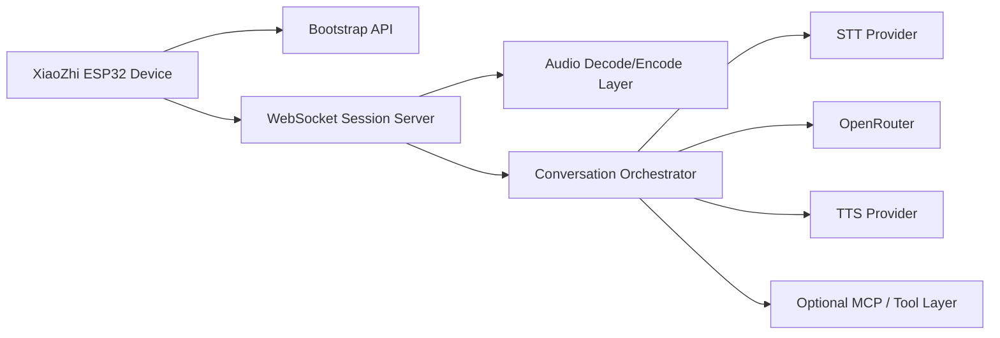

# OpenRouter Backend Architecture For XiaoZhi ESP32

## Goal

This document describes a practical backend architecture for running `xiaozhi-esp32` devices against our own server, while using OpenRouter as the LLM provider.

Target flow:

`device -> our backend -> OpenRouter`

The main idea is simple:

- do not rewrite the firmware transport layer;
- keep the device talking its native protocol;
- translate device traffic into the APIs exposed by OpenRouter and related speech services.

This is the lowest-risk path to a working system.

---

## Short Answer

OpenRouter can be used as the model layer, but it should sit behind a custom backend.

The backend is responsible for:

- device bootstrap configuration;
- session management;
- audio ingestion from the device;
- speech-to-text;
- requests to OpenRouter;
- text-to-speech;
- conversion back into XiaoZhi protocol messages and audio frames.

In other words, OpenRouter replaces the cloud model provider, not the entire XiaoZhi backend.

---

## Why A Backend Is Still Needed

Even if the model can accept and return audio, the device firmware in this repository is built around its own protocol contract:

- bootstrap over OTA-style HTTP config;
- runtime session over WebSocket or MQTT+UDP;
- custom JSON message types such as `hello`, `stt`, `tts`, `llm`, `mcp`, `system`, `alert`;
- binary audio frames sent in the format expected by the firmware.

OpenRouter is not a drop-in implementation of that contract.

So the backend is not only a proxy. It is also a protocol adapter.

---

## Recommended Scope

For the first version, use only the WebSocket transport.

Reasons:

- simpler than MQTT+UDP;
- fewer moving parts;
- easier to debug;
- easier to record and replay traffic;
- enough for an MVP.

I do not recommend implementing MQTT+UDP first unless there is a very specific latency or compatibility requirement.

---

## High-Level Architecture



### Components

1. `Bootstrap API`
- returns minimal config to the device;
- tells the device where the WebSocket server is;
- can optionally return firmware info and server time.

2. `WebSocket Session Server`
- accepts device connections;
- authenticates device token if desired;
- handles `hello`;
- receives device Opus audio frames;
- sends JSON events and audio back to the device.

3. `Audio Decode/Encode Layer`
- decodes incoming Opus from device into PCM;
- prepares audio for STT or audio-capable model input;
- encodes TTS PCM back into Opus for the device.

4. `Conversation Orchestrator`
- owns the session state;
- decides when user speech is complete;
- calls STT;
- sends text to OpenRouter;
- calls TTS;
- streams partial and final events back to the device.

5. `STT Provider`
- converts user speech into text.

6. `OpenRouter`
- provides the LLM response;
- can be text-first or audio-capable depending on the implementation path.

7. `TTS Provider`
- converts assistant text into speech suitable for the device.

8. `Optional MCP / Tool Layer`
- later extension if we want tool use, home automation, custom actions, or app integrations.

---

## Recommended MVP Design

For MVP, I recommend this exact pipeline:

1. Device sends Opus audio over WebSocket.
2. Backend decodes Opus to PCM.
3. Backend performs STT using a dedicated speech service.
4. Backend sends transcribed text to OpenRouter.
5. Backend receives assistant text from OpenRouter.
6. Backend sends `llm` and `tts` JSON events to device.
7. Backend performs TTS using a dedicated TTS service.
8. Backend encodes assistant audio to Opus.
9. Backend streams Opus frames back to device.

This is better than using OpenRouter audio end-to-end for the first version because:

- device protocol is already text/event oriented;
- STT and TTS providers are easier to swap independently;
- debugging is much simpler;
- latency problems are easier to isolate;
- we can get a working prototype faster.

---

## Alternative Design

An alternative is:

1. decode device audio;
2. send audio input directly to an audio-capable OpenRouter model;
3. receive audio output from OpenRouter;
4. transcode and stream back to device.

This may reduce the number of external providers, but it is riskier because:

- OpenRouter request/response format still does not match XiaoZhi protocol;
- audio streaming semantics may not align cleanly with device expectations;
- it is harder to inject `stt` and `tts` state messages expected by the firmware UX;
- observability is worse;
- debugging failures in one big multimodal call is harder.

My recommendation is to keep STT and TTS explicit in backend v1, even if OpenRouter has audio-capable models.

---

## What The Device Expects From The Backend

### 1. Bootstrap Endpoint

The firmware checks an OTA/bootstrap URL and can accept a response containing:

- `websocket`
- `mqtt`
- `server_time`
- `firmware`
- `activation`

For a self-hosted WebSocket MVP, we only need a minimal subset:

```json
{
  "websocket": {
    "url": "wss://your-server.example/ws",
    "token": "your-token",
    "version": 1
  },
  "server_time": {
    "timestamp": 1760000000000,
    "timezone_offset": 300
  }
}
```

Notes:

- `token` can be empty if we decide not to enforce auth initially;
- `version = 1` is the simplest protocol mode;
- `firmware` can be omitted for MVP;
- `activation` can be omitted if we do not want the official activation flow.

### 2. WebSocket Handshake

The device will:

- connect to the configured WebSocket URL;
- send headers such as `Authorization`, `Protocol-Version`, `Device-Id`, `Client-Id`;
- send a JSON `hello` message;
- wait for a server `hello`.

Minimal valid server response:

```json
{
  "type": "hello",
  "transport": "websocket",
  "session_id": "session-123",
  "audio_params": {
    "format": "opus",
    "sample_rate": 24000,
    "channels": 1,
    "frame_duration": 60
  }
}
```

Notes:

- the firmware can work without much extra metadata;
- `session_id` is useful and should be included;
- sample rate should match what we want to return to device;
- 24000 is already expected well by the firmware path.

### 3. Runtime Messages

The firmware reacts to these server-side JSON event types:

- `stt`
- `tts`
- `llm`
- `mcp`
- `system`
- `alert`

The most important for MVP are:

- `stt`
  - used to show recognized user text on screen.
- `tts`
  - `start`
  - `sentence_start`
  - `stop`
- `llm`
  - can carry emotion metadata for the UI.

Minimal practical flow:

1. backend detects end of user utterance;
2. backend sends:
```json
{ "type": "stt", "text": "recognized text" }
```
3. backend starts assistant response:
```json
{ "type": "tts", "state": "start" }
```
4. backend sends first assistant sentence:
```json
{ "type": "tts", "state": "sentence_start", "text": "assistant text" }
```
5. backend optionally sends:
```json
{ "type": "llm", "emotion": "neutral" }
```
6. backend streams binary Opus audio frames;
7. backend finishes with:
```json
{ "type": "tts", "state": "stop" }
```

This should be enough for a good first user experience.

---

## Proposed Backend Modules

### Module 1. `bootstrap-service`

Responsibilities:

- respond to the device OTA/bootstrap request;
- return WebSocket config;
- optionally return server time;
- later optionally return firmware metadata.

Suggested routes:

- `POST /xiaozhi/ota/`
- `GET /xiaozhi/ota/`

Optional activation route:

- `POST /xiaozhi/ota/activate`

For MVP, activation can be disabled by simply never returning activation challenge data.

### Module 2. `ws-gateway`

Responsibilities:

- accept WebSocket device connections;
- validate token if enabled;
- parse device `hello`;
- maintain per-device session state;
- route binary audio to audio pipeline;
- route JSON commands to orchestrator.

Per-session state should include:

- `session_id`
- `device_id`
- `client_id`
- `protocol_version`
- `audio format metadata`
- `conversation history`
- `current turn status`
- `pending cancel / abort state`

### Module 3. `audio-pipeline`

Responsibilities:

- decode incoming device Opus to PCM;
- chunk PCM for STT input;
- encode outgoing PCM to Opus for device playback.

This module should be isolated because it is where most media bugs usually live.

### Module 4. `speech-service`

Responsibilities:

- STT transcription;
- TTS generation.

Recommended design:

- define internal interfaces like `transcribeAudio()` and `synthesizeSpeech()`;
- keep provider-specific code behind adapters.

This makes it easy to swap providers later.

### Module 5. `conversation-service`

Responsibilities:

- accumulate user speech per turn;
- call STT;
- build prompt/history;
- call OpenRouter;
- stream assistant text;
- trigger TTS;
- send events to device in correct order.

This is the main application brain on the backend.

### Module 6. `openrouter-adapter`

Responsibilities:

- send requests to OpenRouter;
- support model selection by config;
- support streaming responses;
- normalize provider-specific response formats into internal events.

Important recommendation:

- model selection should be backend config, not hardcoded in protocol handlers;
- support per-device or per-user model override later.

---

## Message Orchestration Strategy

The device UX will feel best if we separate internal stages clearly.

### Suggested turn lifecycle

1. Device opens audio channel.
2. Device streams user speech.
3. Backend detects end of speech.
4. Backend runs STT.
5. Backend sends `stt` event to device.
6. Backend sends `tts start`.
7. Backend starts OpenRouter generation.
8. Backend optionally emits partial sentence text to device via `tts sentence_start`.
9. Backend synthesizes TTS.
10. Backend streams assistant Opus audio.
11. Backend sends `tts stop`.

This lets the device UI behave naturally without requiring firmware changes.

---

## OpenRouter Integration Strategy

### Recommended v1

Use OpenRouter for text generation only.

Inputs:

- system prompt;
- recognized user text;
- optional conversation history;
- optional metadata such as device language and capability hints.

Outputs:

- assistant text;
- optional structured metadata if we decide to use tool-like responses later.

Benefits:

- simplest integration;
- most controllable;
- easiest to observe and cache;
- easiest to test against multiple models.

### Recommended v2

Experiment with audio-capable OpenRouter models only after text-first flow is stable.

Possible future use:

- audio input straight into the LLM pipeline;
- audio output from the model instead of separate TTS;
- lower orchestration complexity in some cases.

But I would treat this as an optimization phase, not the initial implementation.

---

## Suggested Tech Stack

I recommend one of these:

### Option A. Node.js / TypeScript

Best if we want:

- quick WebSocket development;
- good ecosystem for streaming APIs;
- easy JSON protocol handling;
- fast MVP.

Suggested libraries:

- `fastify` or `express` for HTTP;
- `ws` or Fastify WebSocket support;
- `zod` for runtime validation;
- `pino` for logs;
- `prism-media` or native bindings for media work if needed.

### Option B. Python

Best if we want:

- fast experimentation;
- easy ML/audio tooling;
- easy provider integration.

Suggested libraries:

- `fastapi`;
- `uvicorn`;
- `websockets`;
- `pydantic`;
- `ffmpeg` bindings or subprocess integration for media transcoding.

### My recommendation

If the goal is a robust integration service and API gateway, use TypeScript.

If the goal is fastest experimentation with speech and model providers, use Python.

Because the hard part here is media + orchestration rather than frontend or static APIs, Python is a very reasonable first choice.

---

## Storage And Config

The backend should not hardcode environment-specific settings.

Suggested config:

- `OPENROUTER_API_KEY`
- `OPENROUTER_MODEL`
- `WS_PUBLIC_URL`
- `DEVICE_WS_TOKEN`
- `STT_PROVIDER`
- `STT_API_KEY`
- `TTS_PROVIDER`
- `TTS_API_KEY`
- `BOOTSTRAP_TIMEZONE_OFFSET`
- `LOG_LEVEL`

Optional later:

- per-device config table;
- per-user model mapping;
- prompt presets;
- feature flags.

---

## Authentication

For MVP, keep auth simple.

Suggested approach:

- bootstrap endpoint returns a static token;
- device presents it in the WebSocket `Authorization` header;
- backend validates it before accepting the session.

This is enough to prevent casual misuse during development.

Later improvements:

- per-device tokens;
- signed bootstrap responses;
- device registry;
- revocation support.

---

## Observability

This system will be much easier to debug if observability is planned from day one.

At minimum, log:

- device connection start and end;
- handshake success or failure;
- audio duration received;
- STT result;
- OpenRouter model used;
- OpenRouter latency;
- TTS latency;
- total turn latency;
- session errors.

Store trace IDs per turn so one user interaction can be followed across all services.

---

## Risks

### 1. Audio format mismatch

The backend must correctly decode and encode Opus in the shape expected by the firmware.

Mitigation:

- start with WebSocket protocol version 1;
- write golden-path integration tests with recorded device traffic;
- verify sample rates carefully.

### 2. Turn boundary detection

The device streams audio, but backend still needs a sensible strategy for deciding when to send STT/LLM requests.

Mitigation:

- start with simple silence timeout;
- later improve with VAD-aware orchestration.

### 3. Latency

The total path is:

`device upload -> backend decode -> STT -> OpenRouter -> TTS -> backend encode -> device playback`

Mitigation:

- use streaming where possible;
- keep prompts compact;
- choose low-latency STT/TTS providers;
- avoid unnecessary transcoding steps.

### 4. Vendor coupling

If STT, TTS, and LLM are tightly coupled to one provider, replacing pieces later becomes painful.

Mitigation:

- use internal provider interfaces from the beginning.

### 5. Firmware UX assumptions

The device UI assumes certain event orderings.

Mitigation:

- mirror existing server semantics closely;
- keep event ordering stable;
- do not invent new message types in MVP.

---

## What I Would Build First

### Phase 1. Device handshake MVP

- bootstrap endpoint;
- WebSocket `hello` exchange;
- send fake `stt` and `tts` messages;
- stream prerecorded assistant audio.

Goal:

- prove the protocol and playback path work.

### Phase 2. Real speech pipeline

- Opus decode;
- STT integration;
- send recognized text back to device;
- TTS integration;
- Opus encode back to device.

Goal:

- complete working voice turn without OpenRouter.

### Phase 3. OpenRouter integration

- connect conversation-service to OpenRouter;
- support one configured model;
- stream assistant text;
- synthesize speech.

Goal:

- complete real end-to-end conversation.

### Phase 4. Production hardening

- auth improvements;
- metrics;
- retries;
- per-device configuration;
- prompt management;
- MCP/tool support.

---

## Suggested First Implementation Contract

To keep v1 small, I would define the backend contract like this:

### Bootstrap response

```json
{
  "websocket": {
    "url": "wss://backend.example/ws",
    "token": "dev-token",
    "version": 1
  },
  "server_time": {
    "timestamp": 1760000000000,
    "timezone_offset": 300
  }
}
```

### Server hello

```json
{
  "type": "hello",
  "transport": "websocket",
  "session_id": "abc123",
  "audio_params": {
    "format": "opus",
    "sample_rate": 24000,
    "channels": 1,
    "frame_duration": 60
  }
}
```

### Runtime events

```json
{ "type": "stt", "text": "what is the weather" }
{ "type": "tts", "state": "start" }
{ "type": "tts", "state": "sentence_start", "text": "The weather is sunny." }
{ "type": "llm", "emotion": "neutral" }
{ "type": "tts", "state": "stop" }
```

This is enough to make the device feel alive while keeping implementation scope under control.

---

## Final Recommendation

If we decide to build this, I recommend:

- WebSocket only;
- text-first OpenRouter integration;
- separate STT and TTS providers;
- minimal bootstrap endpoint;
- strict protocol compatibility with existing firmware;
- no firmware rewrite in v1.

This path gives the highest chance of getting a stable working prototype quickly.

After that, we can decide whether it is worth:

- adding MQTT+UDP;
- using OpenRouter audio input/output directly;
- patching firmware for more direct local configuration;
- adding MCP tools and richer device-side capabilities.

---

## If I Continue This Work

My next step would be to create:

1. a concrete backend project skeleton;
2. exact request/response schemas for each message type;
3. an MVP implementation plan by module;
4. a list of unknowns to verify on a real device.

