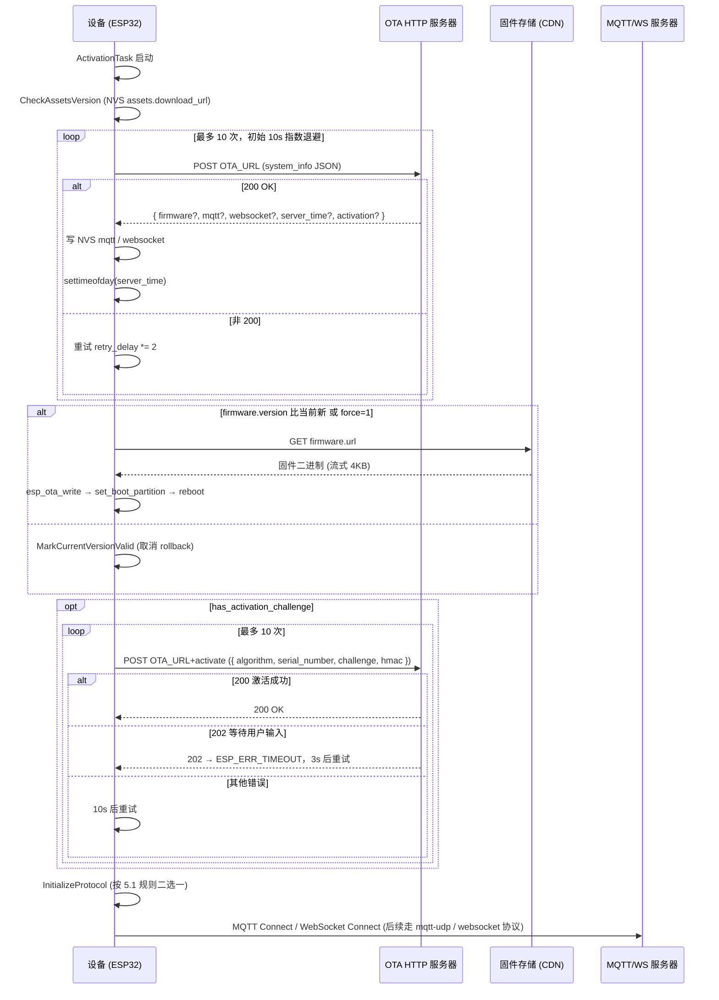

# OTA 引导协议文档

基于代码实现整理的 OTA HTTP 引导协议文档，描述设备端如何通过单一的 `OTA_URL` 完成版本检查、固件升级、激活、以及音频会话协议（MQTT / WebSocket）地址下发的全流程。

> 该文档基于 `main/ota.cc`、`main/ota.h`、`main/application.cc`、`main/Kconfig.projbuild` 整理。"OTA" 在本协议里同时承担三种职责：固件升级、设备激活、运行时服务器配置下发。

---

## 1. 协议概览

设备出厂时只需写入一个地址 —— `OTA_URL`，所有后续服务器配置都通过它在每次启动时拉取。

### 1.1 设计要点

- **单一引导入口**：MQTT broker、WebSocket URL、固件升级 URL、服务器时间、激活码 —— 全部通过同一个 OTA HTTP 接口下发
- **配置缓存**：服务器下发的 mqtt / websocket 配置写入 NVS，断网时使用上一次的配置
- **协议二选一**：根据响应中是否带 `mqtt` / `websocket` 字段决定本次启动走哪条音频会话通道
- **激活闭环**：未激活设备会展示激活码，并基于 efuse 序列号 + HMAC 完成激活握手

### 1.2 在系统中的角色

```
设备上电
   │
   ▼
┌──────────────────────────────────────────────┐
│ ActivationTask  (application.cc:323)         │
│   1. CheckAssetsVersion                      │
│   2. CheckNewVersion ─► Ota::CheckVersion()  │ ◄─── 本文档主体
│   3. InitializeProtocol                      │
└──────────────────────────────────────────────┘
                                │
                                ▼
              ┌─────────────────────────────────┐
              │ OTA HTTP 服务器                 │
              │ 默认: api.tenclass.net/...      │
              └────────────────┬────────────────┘
                               │ JSON 响应
                ┌──────────────┼──────────────┬──────────────┐
                ▼              ▼              ▼              ▼
          firmware       mqtt / ws      server_time     activation
          (固件升级)     (音频通道)      (校时)         (设备激活)
```

---

## 2. 配置入口与优先级

`Ota::GetCheckVersionUrl()`（`ota.cc:46-53`）按以下优先级解析：

```
1. NVS 命名空间 "wifi"，键 "ota_url"        （运行时可改，无需重烧固件）
2. CONFIG_OTA_URL                          （编译期常量，Kconfig 默认值）
```

```c
config OTA_URL
    string "Default OTA URL"
    default "https://api.tenclass.net/xiaozhi/ota/"
```

校验规则：
- URL 必须 `>= 10` 字符，否则 `CheckVersion()` 直接返回 `ESP_ERR_INVALID_ARG`（`ota.cc:86`）
- URL 末尾建议以 `/` 结尾。激活接口会在末尾拼 `activate`，不带 `/` 时会被拼成 `/activate`，带 `/` 时拼成 `activate`（`ota.cc:464-469`）

---

## 3. 设备 → 服务器：版本检查请求

### 3.1 请求方法

| 条件                                 | Method |
|--------------------------------------|--------|
| `Board::GetSystemInfoJson()` 非空    | POST   |
| `Board::GetSystemInfoJson()` 为空    | GET    |

`ota.cc:93-95`。绝大多数 board 实现都返回非空 JSON，因此实际部署中按 **POST** 处理。

### 3.2 请求头

| Header                  | 值来源                                 | 说明                              |
|-------------------------|----------------------------------------|-----------------------------------|
| `Activation-Version`    | `"2"`（有 SN）/ `"1"`（无 SN）         | efuse `USER_DATA` 首字节非 0 即认为有 SN |
| `Device-Id`             | `SystemInfo::GetMacAddress()`          | 形如 `aa:bb:cc:dd:ee:ff`           |
| `Client-Id`             | `Board::GetUuid()`                     | 设备首次启动生成的 UUID            |
| `Serial-Number`         | efuse 中读取的 32 字节序列号             | 仅当 `has_serial_number_=true` 时下发 |
| `User-Agent`            | `<BOARD_NAME>/<app_version>`           | 例如 `bread-compact-wifi/2.2.6`    |
| `Accept-Language`       | `Lang::CODE`                           | 取决于编译期 `LANGUAGE_*` 选项     |
| `Content-Type`          | `application/json`                     | 固定值                             |

实现见 `Ota::SetupHttp()` (`ota.cc:55-72`)。

### 3.3 请求体

POST body 由 `Board::GetSystemInfoJson()` 返回，各 board 实现略有差异，常见字段（来自 `wifi_board.cc` / `ml307_board.cc`）：

```json
{
  "version": 2,
  "flash_size": 16777216,
  "minimum_free_heap_size": 123456,
  "mac_address": "aa:bb:cc:dd:ee:ff",
  "uuid": "01ABCDEF-...",
  "chip_model_name": "esp32s3",
  "chip_info": { "model": 9, "cores": 2, "revision": 0, "features": 50 },
  "application": { "name": "xiaozhi", "version": "2.2.6", "compile_time": "...", "idf_version": "v5.4" },
  "partition_table": [ { "label": "...", "type": 0, "subtype": 16, "address": 65536, "size": 1048576 } ],
  "ota": { "label": "ota_0" },
  "board": { "type": "bread-compact-wifi", "name": "...", "ssid": "...", "rssi": -50, "channel": 6, "ip": "192.168.x.x", "mac": "..." }
}
```

服务器可据此分发差异化的固件 / 协议地址。

---

## 4. 服务器 → 设备：响应 JSON Schema

`Ota::CheckVersion()` 期望 `application/json` 响应，状态码必须是 **200**，其他状态码会被作为 `esp_err_t` 直接返回（`ota.cc:104-107`）。

完整可识别字段如下，**全部为可选**，缺哪个就跳过哪个分支处理：

```json
{
  "firmware":   { "version": "...", "url": "...", "force": 0 },
  "mqtt":       { "endpoint": "host:port", "client_id": "...", "username": "...", "password": "...", "keepalive": 240, "publish_topic": "..." },
  "websocket":  { "url": "ws://...", "token": "...", "version": 1 },
  "server_time":{ "timestamp": 1735689600000, "timezone_offset": 480 },
  "activation": { "code": "...", "message": "...", "challenge": "...", "timeout_ms": 30000 }
}
```

### 4.1 `firmware` — 固件升级

| 字段     | 类型   | 含义                                                      |
|----------|--------|-----------------------------------------------------------|
| `version`| string | 服务端最新固件版本号，按 `1.2.3` 形式逐段比较              |
| `url`    | string | 固件二进制 URL，设备会 GET 拉取并写入 OTA 分区             |
| `force`  | number | `1` 表示无视版本号比较强制升级（`ota.cc:234-237`）         |

升级行为：`Upgrade()` 以 4KB 为单位流式写入 `esp_ota_write`，每秒回调一次进度（`ota.cc:267-387`）。升级成功后由调用方决定何时 `esp_restart`。

### 4.2 `mqtt` — MQTT 配置下发

服务器把整个 `mqtt` 对象**逐字段**写入 NVS 命名空间 `"mqtt"`（`ota.cc:147-165`）：

- 字符串值 → `Settings::SetString`
- 数值 → `Settings::SetInt`

设备侧 `MqttProtocol::StartMqttClient()` 从该命名空间读取（`mqtt_protocol.cc:65-71`）。常用键：

| 键              | 类型   | 默认 / 说明                                              |
|-----------------|--------|----------------------------------------------------------|
| `endpoint`      | string | `host` 或 `host:port`，缺省端口 **8883（mqtts/TLS）**     |
| `client_id`     | string | MQTT 客户端 ID                                           |
| `username`      | string | MQTT 用户名                                              |
| `password`      | string | MQTT 密码                                                |
| `keepalive`     | int    | 心跳秒数，未设置时使用代码默认 240                        |
| `publish_topic` | string | 设备发布消息 topic（订阅 topic 由 hello 响应下发）        |

UDP 音频通道地址不在此处下发，由 MQTT `hello` 响应给出，详见 `docs/mqtt-udp_zh.md`。

### 4.3 `websocket` — WebSocket 配置下发

同样**逐字段**写入 NVS 命名空间 `"websocket"`（`ota.cc:167-186`）：

| 键        | 类型   | 说明                                                          |
|-----------|--------|---------------------------------------------------------------|
| `url`     | string | `ws://...` 或 `wss://...`，含路径                              |
| `token`   | string | 鉴权 token；不含空格时设备会自动加 `Bearer ` 前缀（`websocket_protocol.cc:101-106`） |
| `version` | int    | 二进制帧协议版本，`2` / `3` 不同帧头格式                        |

### 4.4 `server_time` — 服务器校时

```json
"server_time": { "timestamp": <ms>, "timezone_offset": <minutes> }
```

设备会调 `settimeofday(timestamp + timezone_offset*60_000 → tv)`（`ota.cc:188-211`）。
**注意**：代码中 `tv.tv_sec = ts/1000; tv.tv_usec = (ts%1000)*1000`，单位是毫秒。
若设备没拿到 `server_time`，TLS 证书校验可能因时间错误而失败 —— 这是 HTTPS / mqtts 启动失败的常见原因。

### 4.5 `activation` — 激活信息

| 字段          | 类型   | 含义                                                    |
|---------------|--------|---------------------------------------------------------|
| `code`        | string | 展示给用户的激活码                                      |
| `message`     | string | 激活提示文案（与 code 一起展示）                        |
| `challenge`   | string | 服务器下发的随机串，设备需基于 efuse HMAC 计算签名      |
| `timeout_ms`  | number | 激活轮询超时（默认 30000）                              |

激活流程详见第 6 节。

---

## 5. 设备侧处理流程

### 5.1 协议选择规则（`application.cc:480-487`）

```c
if (ota_->HasMqttConfig()) {
    protocol_ = std::make_unique<MqttProtocol>();
} else if (ota_->HasWebsocketConfig()) {
    protocol_ = std::make_unique<WebsocketProtocol>();
} else {
    ESP_LOGW(TAG, "No protocol specified in the OTA config, using MQTT");
    protocol_ = std::make_unique<MqttProtocol>();
}
```

**MQTT 优先于 WebSocket**。即使响应同时返回 `mqtt` 和 `websocket` 两段，设备也只会用 MQTT。
若两者都不返回，设备会尝试 MQTT 协议但读不到 endpoint，进入失败路径。

> 想强制走 WebSocket：服务器响应中**不要包含** `mqtt` 字段。

### 5.2 完整时序（`application.cc:323-471`）



### 5.3 重试策略

- **CheckVersion**：最多 10 次（`application.cc:399`），初始 10s，每次失败 `retry_delay *= 2`
- **Activate**：最多 10 次（`application.cc:456`）；状态码 202（待用户输入激活码）→ 间隔 3s，其它错误 → 间隔 10s
- 任意一次成功则重置计数

---

## 6. 激活流程

### 6.1 触发条件

`CheckVersion()` 响应中包含 `activation.challenge` 时，`HasActivationChallenge()` 为真，主流程进入激活循环。
若同时有 `activation.code`，会调 `ShowActivationCode()` 把激活码 + 文案显示在屏幕 / 用语音播放出来等待用户输入。

### 6.2 激活请求

URL：`<OTA_URL>activate`（末尾不是 `/` 时为 `<OTA_URL>/activate`）
Method：POST
Headers：与 5.2 一致（`SetupHttp()`）
Body（`Ota::GetActivationPayload()` `ota.cc:421-456`）：

```json
{
  "algorithm": "hmac-sha256",
  "serial_number": "<32 字节字符串>",
  "challenge": "<服务器 challenge>",
  "hmac": "<challenge 用 efuse HMAC_KEY0 算出的 SHA-256，hex>"
}
```

- 设备如果**没有 SN**（efuse 未烧录或首字节为 0），`GetActivationPayload()` 直接返回 `"{}"`（`ota.cc:422-424`）
- HMAC 计算依赖 SoC 的 HMAC 外设（`SOC_HMAC_SUPPORTED`），见 `ota.cc:427-442`

### 6.3 响应语义

| HTTP 状态码 | 设备返回值          | 处理动作                |
|-------------|---------------------|-------------------------|
| 200         | `ESP_OK`            | 激活完成，跳出循环      |
| 202         | `ESP_ERR_TIMEOUT`   | 用户尚未输入激活码，3 秒后重试 |
| 其他        | `ESP_FAIL`          | 10 秒后重试             |

---

## 7. 本地局域网部署最小响应

为本地服务器实现 OTA 接口的最小可用 JSON（走 WebSocket，免去 MQTT broker 与 UDP）：

```json
{
  "server_time": { "timestamp": 1735689600000, "timezone_offset": 480 },
  "websocket": {
    "url": "ws://192.168.1.100:8000/xiaozhi/v1/",
    "token": "lan-test",
    "version": 1
  }
}
```

- 不带 `firmware` → 设备跳过升级
- 不带 `mqtt` → 设备走 WebSocket 分支
- 不带 `activation` → 设备跳过激活直接进入正常会话
- `server_time` 强烈建议提供，否则后续 TLS 链路（如固件 CDN）会因时间错误失败

把 `CONFIG_OTA_URL` 改为 `http://<本机 IP>:8002/xiaozhi/ota/` 即可生效。详见 `main/Kconfig.projbuild:3`。

---

## 8. 字段对照速查

| OTA 响应字段     | 落地位置 / 行为                                            | 后续读取者                              |
|------------------|------------------------------------------------------------|-----------------------------------------|
| `firmware.url`   | `Ota::firmware_url_`（内存）                               | `Ota::StartUpgrade()` GET 拉取          |
| `mqtt.*`         | NVS 命名空间 `"mqtt"`                                       | `MqttProtocol::StartMqttClient()`       |
| `websocket.*`    | NVS 命名空间 `"websocket"`                                  | `WebsocketProtocol::OpenAudioChannel()` |
| `server_time.*`  | `settimeofday()` 系统时间                                    | 全局（TLS 链路、日志）                  |
| `activation.*`   | `Ota::activation_*_`（内存）                                | `Ota::Activate()`、`ShowActivationCode` |

NVS 中已存在的旧值在新响应缺失对应字段时**不会**被清除（`ota.cc:151-161` 仅写不删），需要重置时使用 `idf.py erase-flash` 或在控制台调用 NVS API。
