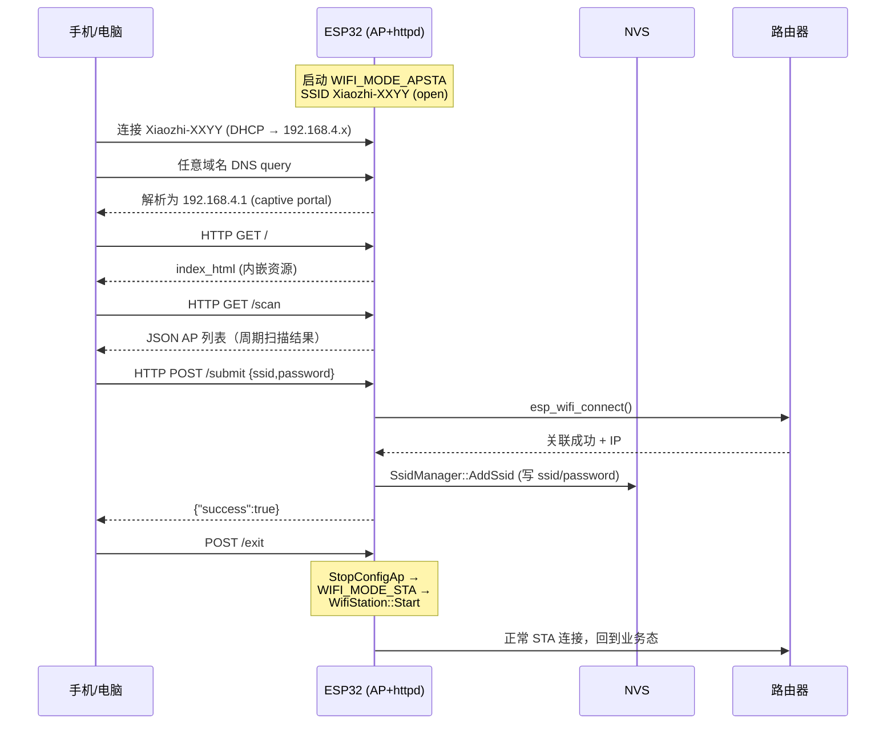
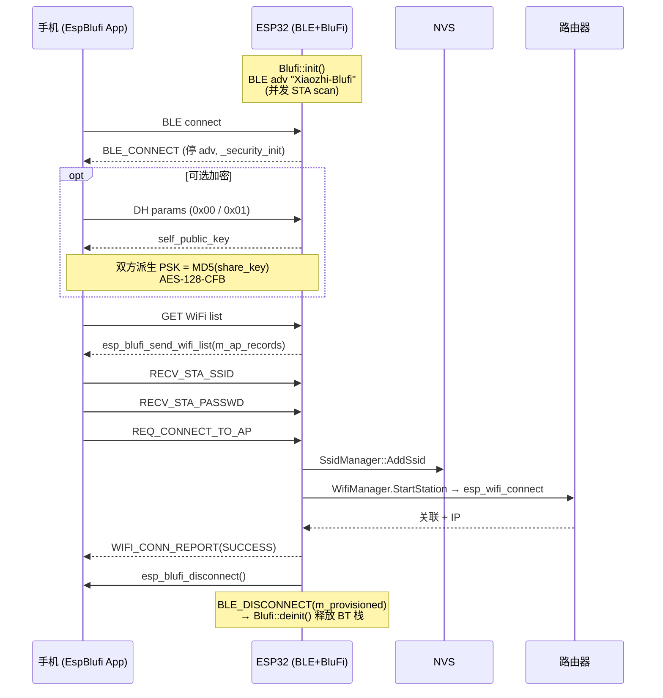

# Xiaozhi 配网流程分析（Hotspot vs BluFi）

本文梳理 xiaozhi-esp32 固件在 WiFi 板子上的两种主要配网（provisioning）方式：
**Hotspot（AP + Web）配网** 与 **BluFi（BLE）蓝牙配网**。两种方式共用同一个状态机入口和同一份凭据存储（NVS `wifi` 命名空间），仅在"如何把 SSID/密码从手机传给设备"这一段不同。

> 文件路径基准：仓库根目录 `/Users/shujun/mcu/xiaozhi-esp32`。

---

## 1. 配网模式选择（Kconfig）

`main/Kconfig.projbuild:831-852` 提供 menu **"WiFi Configuration Method"**，三选一/可叠加：

| Kconfig | 默认 | 触发协议 |
|---|---|---|
| `CONFIG_USE_HOTSPOT_WIFI_PROVISIONING` | `y` | HTTP / Captive Portal |
| `CONFIG_USE_ESP_BLUFI_WIFI_PROVISIONING` | `n` | BLE GATT + BluFi 帧 |
| `CONFIG_USE_ACOUSTIC_WIFI_PROVISIONING` | `n` | 声波（AFSK 解调，超出本文范围） |

当前 `sdkconfig` 默认启用 Hotspot，BluFi 关闭。BluFi 会顺带 `select BT_ENABLED / BT_BLE_BLUFI_ENABLE / MBEDTLS_DHM_C`。

> ⚠️ Hotspot 与 BluFi **不能同时使用**：`Blufi::init()`（`main/boards/common/blufi.cpp:117`）会拒绝在 `WifiManager::IsConfigMode()` 时初始化。

---

## 2. 配网触发与状态机（公共部分）

```
app_main → Application::Start()
        → board.SetNetworkEventCallback(...)
        → board.StartNetwork()           // application.cc:159
              ↓ (WifiBoard 实现)
        WifiBoard::StartNetwork()        // wifi_board.cc:52
            ├── WifiManager.Initialize(ssid_prefix="Xiaozhi")
            ├── SetEventCallback → OnNetworkEvent
            └── TryWifiConnect()         // wifi_board.cc:89
                 ├── NVS 中有 SSID → 启 60s 定时器 + StartStation
                 └── NVS 为空        → StartWifiConfigMode
```

进入配网的 3 个时机：

1. **冷启动无凭据**：`SsidManager::GetSsidList()` 为空时直接进入。
2. **连接超时**：`CONNECT_TIMEOUT_SEC = 60s`（`wifi_board.cc:27`）。到时由 `OnWifiConnectTimeout` 回调 `StartWifiConfigMode`。
3. **用户主动**：板子的按键长按 / 触屏手势调用 `WifiBoard::EnterWifiConfigMode()`（`wifi_board.cc:199`）。各板子在 `main/boards/<board>/*.cc` 自行绑定。

`StartWifiConfigMode()`（`wifi_board.cc:159`）做三件事：

1. `Application::SetDeviceState(kDeviceStateWifiConfiguring)`（`device_state.h:7`）—— 主状态机切到配网态。
2. 按 Kconfig 分支启动 `WifiManager.StartConfigAp()` **或** `Blufi::init()`。
3. （Acoustic 模式额外起一个声波解调 task。）

凭据落盘位置一致：NVS 命名空间 `"wifi"`，键 `ssid` / `ssid1`…`ssid9` 与 `password` / `password1`…`password9`，最多 10 条，由 `SsidManager`（`managed_components/78__esp-wifi-connect/ssid_manager.cc:8-9`）维护。

---

## 3. Hotspot（AP + Web）配网流程

实现位于 `managed_components/78__esp-wifi-connect/`：
- `wifi_manager.cc` —— 总入口与生命周期
- `wifi_configuration_ap.cc` —— AP + httpd + DNS server（核心）
- `ssid_manager.cc` —— NVS 凭据存取
- `dns_server.cc` —— DNS 劫持
- `wifi_station.cc` —— 配网完成后接管的 STA 模式

### 3.1 启动 Soft-AP

`WifiConfigurationAp::StartAccessPoint()`（`wifi_configuration_ap.cc:131`）：

- 模式 `WIFI_MODE_APSTA`（同时启 AP 与 STA，STA 用于扫描周围 WiFi）。
- SSID `Xiaozhi-XXYY`（取 MAC 后 2 字节，`GetSsid()`，`wifi_configuration_ap.cc:111`）。
- 鉴权 `WIFI_AUTH_OPEN`（不设密码，方便用户连上）。
- AP IP `192.168.4.1`，掩码 `255.255.255.0`，开 DHCPS。
- 启动 `DnsServer`，把所有 DNS 查询都解析到 `192.168.4.1`（实现 captive portal）。
- 读 NVS `wifi` 命名空间中的 `ota_url` / `max_tx_power` / `remember_bssid` / `sleep_mode` 加载高级配置。

### 3.2 Captive Portal & HTTP API

`StartWebServer()`（`wifi_configuration_ap.cc:219`）注册的 URI：

| Method | URI | 用途 |
|---|---|---|
| GET | `/` | 返回内嵌的 `wifi_configuration.html`（资源 `_binary_wifi_configuration_html_start`） |
| GET | `/scan` | 返回当前扫描到的 AP 列表 `{support_5g, aps:[{ssid,rssi,authmode}]}` |
| GET | `/saved/list` | 已保存 SSID 列表 |
| GET | `/saved/set_default?index=` | 把第 N 条置顶为默认 |
| GET | `/saved/delete?index=` | 删除第 N 条 |
| POST | `/submit` | 提交 `{ssid, password}` JSON，触发连接 |
| POST | `/exit` | 退出配网模式（页面 done.html 上的"完成"按钮） |
| GET | `/done.html` | 内嵌的成功页 |
| GET/POST | `/advanced/config` `/advanced/submit` | OTA URL / 发射功率 / BSSID 记忆 / 睡眠模式 |
| GET | `/hotspot-detect.html` `/generate_204*` `/ncsi.txt` … | Apple/Android/Windows/Firefox 的 captive portal 探测路径，统一 302 跳到 `/?lang=…` |

定期扫描：`Start()` 里建了 10 s 周期的 `scan_timer_`（`wifi_configuration_ap.cc:96`），扫描结果在 `WifiEventHandler` 的 `WIFI_EVENT_SCAN_DONE` 中存入 `ap_records_`。

### 3.3 提交凭据 → 试连 → 落盘

`/submit` 处理器（`wifi_configuration_ap.cc:352`）流程：

```
解析 JSON → SSID/Password 长度校验
        → ConnectToWifi(ssid, password)       // 行 670
              ├── WIFI_IF_STA esp_wifi_set_config
              ├── esp_wifi_connect()
              └── xEventGroupWaitBits(10s / 25s for 5G)
        → 成功:
            Save(ssid, password) → SsidManager::AddSsid → NVS
            返回 {"success":true}
        → 失败: 返回 {"success":false, "error":...}
```

注意 `ConnectToWifi` 成功后会立刻 `esp_wifi_disconnect()` —— 它只是验证凭据可用，**真正的 STA 连接由后续 `WifiManager.StartStation()` 接管**。

### 3.4 退出配网 & 接管 STA

页面调用 `POST /exit`：

```
exit_config handler                            // wifi_configuration_ap.cc:438
   └── 起 task 等 200ms 让 HTTP 响应发出
         └── on_exit_requested_()              // WifiManager 注入的回调
              └── WifiManager::StopConfigAp()  // wifi_manager.cc:263
                    ├── config_ap_->Stop()    // 停 httpd / DNS / netif / 注销事件
                    └── NotifyEvent(ConfigModeExit)
                         └── WifiBoard::OnNetworkEvent → TryWifiConnect → StartStation
```

`WifiStation::Start()`（`wifi_station.cc:114`）切到 `WIFI_MODE_STA`，启动后周期扫描，扫到匹配 NVS 的 SSID 即 `StartConnect`，拿到 IP 后回调 `on_connected_(ssid)` → `NetworkEvent::Connected` → `Application` 走"已联网"分支。

### 3.5 时序图（Hotspot）



---

## 4. BluFi（BLE）蓝牙配网流程

实现位于 `main/boards/common/blufi.cpp` 与 `blufi.h`，单例 `Blufi::GetInstance()`，依赖 ESP-IDF 自带的 `esp_blufi` 协议层（封装在 IDF 的 `esp_blufi_api.h` 中）。同时兼容 Bluedroid 与 NimBLE 两套主机栈（互斥宏）。

### 4.1 启动栈

`Blufi::init()`（`blufi.cpp:105`）：

1. 拒绝与 Hotspot 共存：`WifiManager::IsConfigMode()` 为 true 则直接返回。
2. `start_wifi_scan()`（`blufi.cpp:536`）—— 在 BLE 起来之前先发起一次 STA 模式 WiFi 扫描，结果存入 `m_ap_records`，给手机端 `GET WiFi LIST` 用。
3. `_controller_init()` —— `esp_bt_controller_init/enable(ESP_BT_MODE_BLE)`。
4. `_host_and_cb_init()` ——
   - Bluedroid 分支：`esp_bluedroid_init/enable` → 注册 BluFi callbacks → `esp_ble_gap_register_callback(esp_blufi_gap_event_handler)` → `esp_blufi_profile_init()`。
   - NimBLE 分支：`esp_blufi_gatt_svr_init` + `esp_nimble_enable` + 自定义 sync/reset 回调。
5. 注册的 5 个 BluFi 回调（`blufi.cpp:206-212`）通过静态 trampoline 转发到单例方法：
   - `event_cb` → `_handle_event`
   - `negotiate_data_handler` → `_dh_negotiate_data_handler`（DH 握手）
   - `encrypt_func` / `decrypt_func` → `_aes_encrypt` / `_aes_decrypt`（AES-128-CFB）
   - `checksum_func` → `_crc_checksum`（CRC16-BE）

`ESP_BLUFI_EVENT_INIT_FINISH` 到达后（`blufi.cpp:651`）：
```cpp
esp_ble_gap_set_device_name("Xiaozhi-Blufi");
esp_blufi_adv_start();
```
设备开始 BLE 广播，名字 **`Xiaozhi-Blufi`**（`BLUFI_DEVICE_NAME`，`blufi.cpp:15`）。

> 历史信息：IDF 5.5.2 起 BluFi 接口变化，旧版（5.5.1）默认名是 `BLUFI_DEVICE`（参见 `docs/blufi_zh.md`）。

### 4.2 BLE 连接 + 安全协商

手机端（EspBlufi App 或自研 BLE 客户端）连接设备 → `ESP_BLUFI_EVENT_BLE_CONNECT`：
- 停广播 `esp_blufi_adv_stop()`。
- `_security_init()` 创建 `mbedtls_dhm_context` + `mbedtls_aes_context`，IV 清零。

**DH 握手**（`_dh_negotiate_data_handler`，`blufi.cpp:384`）：

```
帧类型 0x00 (DH_PARAM_LEN):  data[1..2] = 长度大端 → 分配 dh_param 缓冲
帧类型 0x01 (DH_PARAM_DATA): 完整 DH parameters (p, g, GX)
    ├── mbedtls_dhm_read_params
    ├── mbedtls_dhm_make_public  → self_public_key (128B)
    ├── mbedtls_dhm_calc_secret → share_key
    ├── mbedtls_md5(share_key)  → psk (16B)
    ├── mbedtls_aes_setkey_enc(psk, 128)
    └── output: self_public_key → 回给手机
```

之后的 BluFi 数据帧若设置加密位：解密用 `_aes_decrypt`（CFB128，IV = base_iv 的第 0 字节替换为帧序号 `iv8`）；CRC 用 `esp_crc16_be`。

> 安全协商是 **可选** 的：BluFi 协议允许明文。是否加密由手机端决定。

### 4.3 接收 SSID/密码

手机依次下发：

| BluFi Event | 字段 | 落入 |
|---|---|---|
| `ESP_BLUFI_EVENT_RECV_STA_SSID` | param->sta_ssid | `m_sta_config.sta.ssid` |
| `ESP_BLUFI_EVENT_RECV_STA_PASSWD` | param->sta_passwd | `m_sta_config.sta.password` |
| `ESP_BLUFI_EVENT_RECV_STA_BSSID` (可选) | param->sta_bssid | `m_sta_config.sta.bssid` |
| `ESP_BLUFI_EVENT_GET_WIFI_LIST` | —— | `_send_wifi_list()` 把扫描结果发回手机 |
| `ESP_BLUFI_EVENT_GET_WIFI_STATUS` | —— | 回 `esp_blufi_send_wifi_conn_report` |
| `ESP_BLUFI_EVENT_SET_WIFI_OPMODE` | sta/ap/apsta | 切 `WifiManager` 模式 |

### 4.4 触发连接

`ESP_BLUFI_EVENT_REQ_CONNECT_TO_AP`（`blufi.cpp:708`）—— 关键路径：

```
1. SsidManager::AddSsid(ssid, password)   // 立刻落 NVS
2. WifiManager.StopConfigAp() + StopStation()
3. WifiManager.Initialize() (如未初始化)
4. vTaskDelay(500ms)
5. WifiManager.StartStation()
6. 起 blufi_wifi_conn task：
     轮询 wifi.IsConnected() 最长 10s (200ms 一次)
     ├── 成功:
     │     m_provisioned = true
     │     esp_blufi_send_wifi_conn_report(STA_CONN_SUCCESS, info)
     │     esp_blufi_disconnect()           // 主动踢掉 BLE 连接
     └── 失败:
           esp_blufi_send_wifi_conn_report(STA_CONN_FAIL, info)
```

### 4.5 释放 BLE 栈

`ESP_BLUFI_EVENT_BLE_DISCONNECT`（`blufi.cpp:665`）：
- 已配网 (`m_provisioned == true`)：起一个一次性 task 调 `Blufi::deinit()` —— 关 BluFi profile、关 Bluedroid/NimBLE host、关 BT controller，**整个蓝牙栈下电**释放内存。
- 未配网：重新 `esp_blufi_adv_start()`，等待下一次连接。

另外 `WifiBoard::OnNetworkEvent` 在收到 `NetworkEvent::Connected` 时也会兜底再调一次 `Blufi::GetInstance().deinit()`（`wifi_board.cc:111-114`），保证 BLE 资源一定被释放。

### 4.6 时序图（BluFi）



---

## 5. 两种方式的对比

| 维度 | Hotspot 配网 | BluFi 蓝牙配网 |
|---|---|---|
| 协议层 | HTTP + Captive Portal | BLE GATT + BluFi 帧 |
| 客户端 | 任意浏览器（手机/PC） | EspBlufi App / 自研 BLE 客户端 |
| 设备名 | SSID `Xiaozhi-XXYY` | BLE name `Xiaozhi-Blufi` |
| 加密 | 无（AP open + HTTP 明文） | 可选 DH-2048 + AES-128-CFB + CRC16 |
| 扫描列表传输 | `GET /scan` JSON | `esp_blufi_send_wifi_list` |
| 触发存储 | `POST /submit` 后 `SsidManager::AddSsid` | `REQ_CONNECT_TO_AP` 即刻 `SsidManager::AddSsid` |
| 试连验证 | AP 阶段就 `ConnectToWifi`（10s/25s timeout） | 直接 `StartStation` + 10s 轮询 |
| 退出方式 | `POST /exit` → 切 STA | 配网成功后设备主动断 BLE → `deinit` |
| 资源占用 | WiFi APSTA + httpd + DNS（无 BLE） | BLE controller + host（配网后释放） |
| 默认开启 | 是 | 否（需 menuconfig 切换） |
| 共存 | —— | **不能与 Hotspot 同开**（`Blufi::init` 主动拒绝） |
| 适用场景 | 大屏 / 多模 / 常规用户 | 无屏 / 极小内存外设 / iOS 用户体验更佳 |

---

## 6. 关键源码索引

- 模式选择：`main/Kconfig.projbuild:831-852`
- 状态机入口：`main/application.cc:159`、`main/device_state.h:7`
- WiFi 板子调度：`main/boards/common/wifi_board.cc:52-238`
- WiFi 管理器：`managed_components/78__esp-wifi-connect/wifi_manager.cc`
- Hotspot AP / Web：`managed_components/78__esp-wifi-connect/wifi_configuration_ap.cc`
- DNS 劫持：`managed_components/78__esp-wifi-connect/dns_server.cc`
- STA 接管：`managed_components/78__esp-wifi-connect/wifi_station.cc`
- 凭据存储：`managed_components/78__esp-wifi-connect/ssid_manager.cc`
- BluFi 入口：`main/boards/common/blufi.cpp`、`main/boards/common/blufi.h`
- BluFi 配套文档（用户视角）：`docs/blufi_zh.md`
