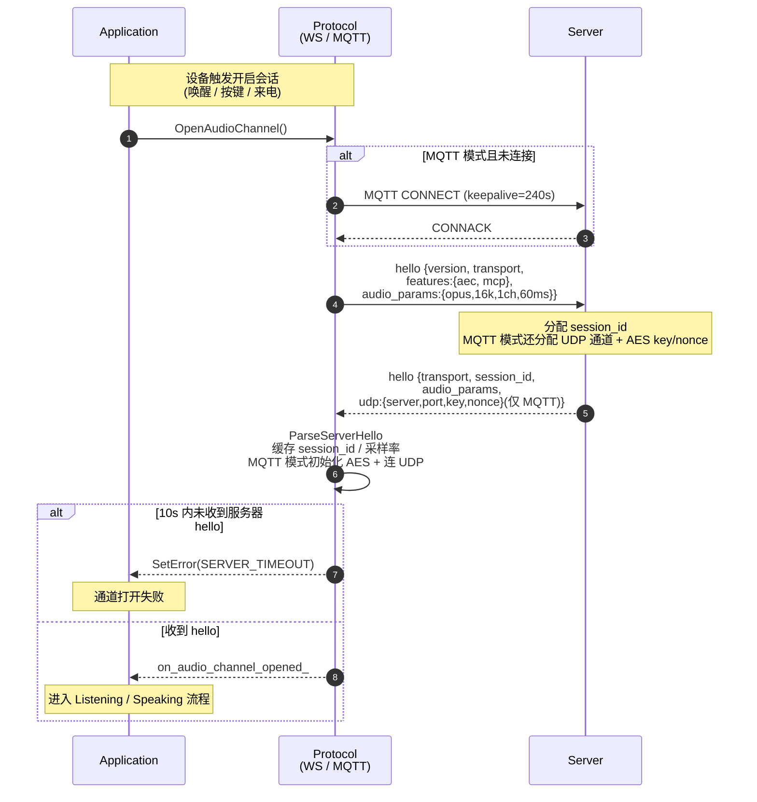
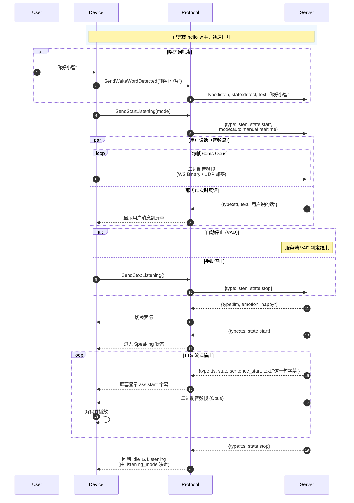
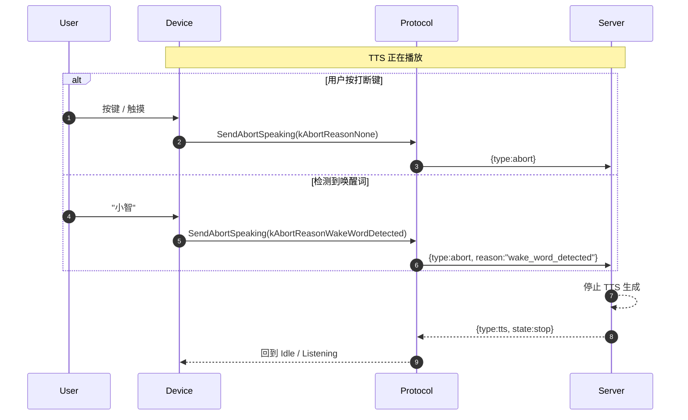
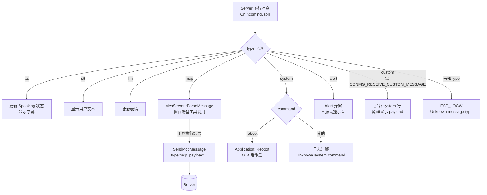
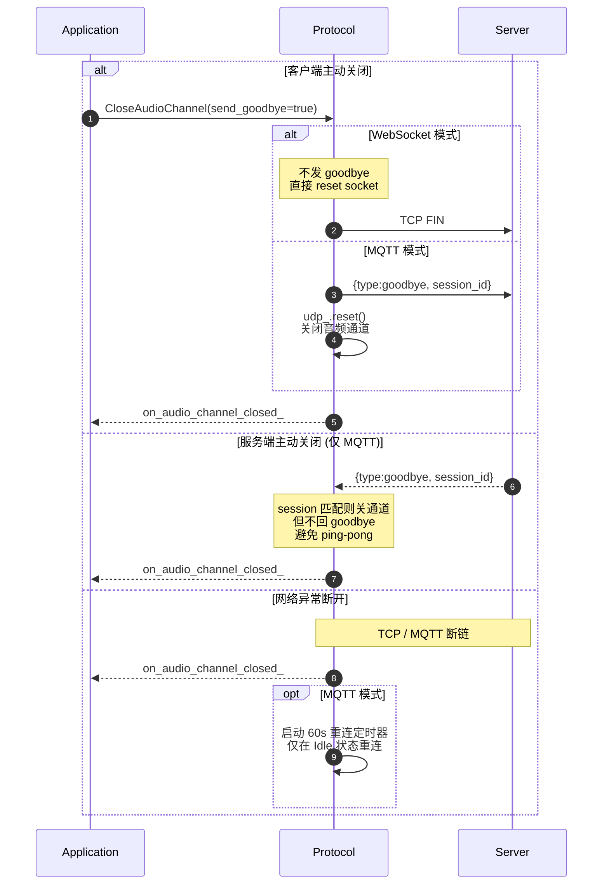
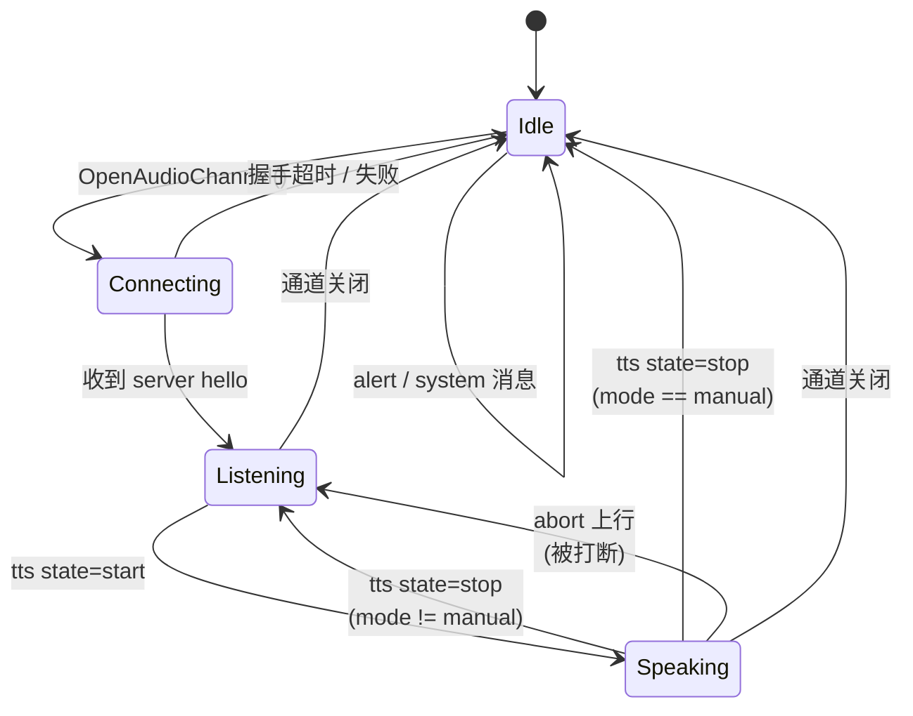

# 小智信令交互流程图

本文档梳理 xiaozhi-esp32 端与服务器之间 **信令通道** 的完整交互流程。信令在 WebSocket 模式下与音频流复用同一连接（JSON 文本帧 vs 二进制帧），在 MQTT 模式下独占 MQTT 通道，音频走另一条 UDP+AES-CTR。所有消息体格式与传输无关。

代码参考：
- `main/protocols/protocol.cc` / `protocol.h`
- `main/protocols/websocket_protocol.cc`
- `main/protocols/mqtt_protocol.cc`
- `main/application.cc`（下行消息分发）

---

## 1. 握手阶段（OpenAudioChannel）

---

## 2. 一次完整会话（Listen → STT → LLM → TTS）

---

## 3. 打断流程（Abort）

---

## 4. 服务端推送类消息（system / alert / mcp / custom）

---

## 5. 通道关闭（Goodbye）

---

## 6. 设备状态机（与信令耦合的部分）

---

## 7. 信令消息一览表

### 上行（Client → Server）

| type | 子字段 | 触发点 | 说明 |
|---|---|---|---|
| `hello` | version, features, audio_params, transport | 握手 | 协议版本与能力协商，10s 内未应答则失败 |
| `listen` | state=detect, text | 本地唤醒 | 上报唤醒词，触发服务端进入会话 |
| `listen` | state=start, mode | 开始拾音 | mode: auto(VAD) / manual / realtime(需 AEC) |
| `listen` | state=stop | 用户结束说话 | 仅 manual / realtime 显式发送 |
| `abort` | 可选 reason | 打断 TTS | reason="wake_word_detected" 表示被唤醒词打断 |
| `mcp` | payload | MCP 工具调用回执 | 设备端 MCP server 的响应/通知 |
| `goodbye` | session_id | MQTT 通道关闭 | WS 模式不发，直接断开 socket |

### 下行（Server → Client）

| type | 子字段 | 处理 | 说明 |
|---|---|---|---|
| `hello` | session_id, audio_params, udp(MQTT) | 协议层 | 握手回包，分配会话 ID |
| `tts` | state=start/stop/sentence_start, text | 状态机 + UI | TTS 生命周期与字幕 |
| `stt` | text | UI | ASR 识别结果 |
| `llm` | emotion | UI | 模型情绪标签 |
| `mcp` | payload | McpServer | 服务端调用设备工具 |
| `system` | command | 系统 | 目前仅 `reboot`（OTA 后用） |
| `alert` | status, message, emotion | UI + 提示音 | 告警弹窗 |
| `custom` | payload | UI（可选编译） | 业务自定义透传 |
| `goodbye` | session_id | 协议层 | 服务端主动关闭会话 |

---

## 8. 关键约束

- **必须先收到服务器 `hello` 才能开始任何业务消息**，否则 10s 超时（`OpenAudioChannel`）。
- **`session_id` 由服务器分配**，所有上行消息都会带上。
- **MQTT 模式下信令与音频分离**：信令走 MQTT topic，音频走独立 UDP，hello 阶段下发 UDP 地址与 AES-CTR key/nonce。
- **服务端发的 `goodbye` 客户端不回**，避免 ping-pong。
- **应用层超时**：`Protocol::IsTimeout()` 判定 `last_incoming_time_` 超过 120s 视为通道失效。
- **WebSocket 模式无应用层心跳**（底层 `WebSocket::Ping()` 未被调用）；**MQTT 模式靠协议 keepalive（默认 240s）**。
