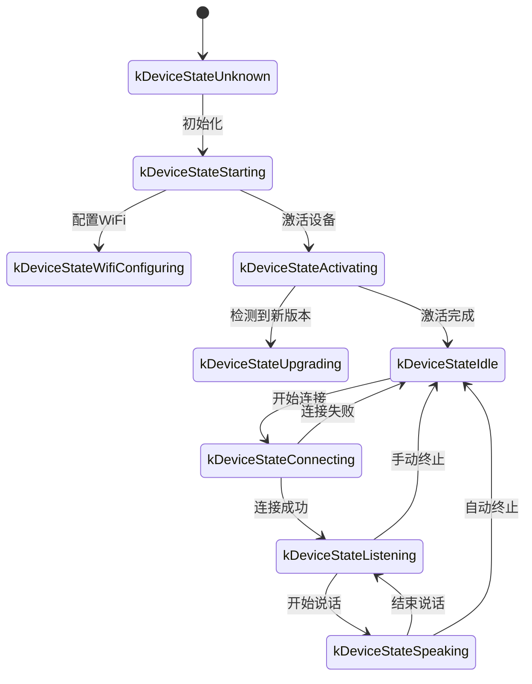
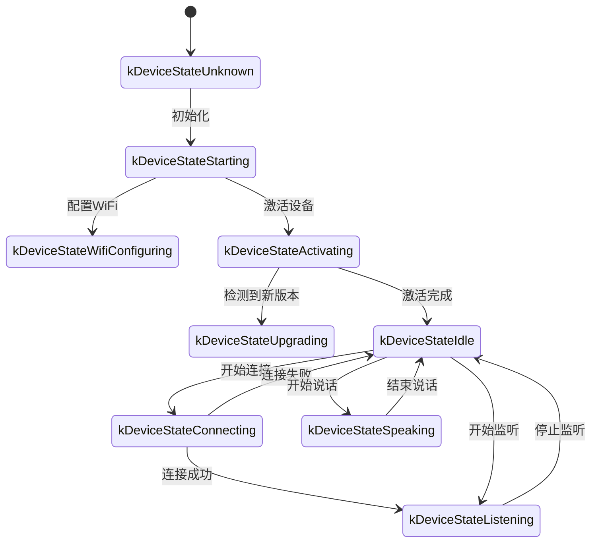

以下是一份基于代码实现整理的 WebSocket 通信协议文档，概述设备端与服务器之间如何通过 WebSocket 进行交互。

该文档仅基于所提供的代码推断，实际部署时可能需要结合服务器端实现进行进一步确认或补充。

---

## 1. 总体流程概览

1. **设备端初始化**  
   - 设备上电、初始化 `Application`：  
     - 初始化音频编解码器、显示屏、LED 等  
     - 连接网络  
     - 创建并初始化实现 `Protocol` 接口的 WebSocket 协议实例（`WebsocketProtocol`）  
   - 进入主循环等待事件（音频输入、音频输出、调度任务等）。

2. **建立 WebSocket 连接**  
   - 当设备需要开始语音会话时（例如用户唤醒、手动按键触发等），调用 `OpenAudioChannel()`：  
     - 根据配置获取 WebSocket URL
     - 设置若干请求头（`Authorization`, `Protocol-Version`, `Device-Id`, `Client-Id`）  
     - 调用 `Connect()` 与服务器建立 WebSocket 连接  

3. **设备端发送 "hello" 消息**  
   - 连接成功后，设备会发送一条 JSON 消息，示例结构如下：  
   ```json
   {
     "type": "hello",
     "version": 1,
     "features": {
       "mcp": true
     },
     "transport": "websocket",
     "audio_params": {
       "format": "opus",
       "sample_rate": 16000,
       "channels": 1,
       "frame_duration": 60
     }
   }
   ```
   - 其中 `features` 字段为可选，内容根据设备编译配置自动生成。例如：`"mcp": true` 表示支持 MCP 协议。
   - `frame_duration` 的值对应 `OPUS_FRAME_DURATION_MS`（例如 60ms）。

4. **服务器回复 "hello"**  
   - 设备等待服务器返回一条包含 `"type": "hello"` 的 JSON 消息，并检查 `"transport": "websocket"` 是否匹配。  
   - 服务器可选下发 `session_id` 字段，设备端收到后会自动记录。  
   - 示例：
   ```json
   {
     "type": "hello",
     "transport": "websocket",
     "session_id": "xxx",
     "audio_params": {
       "format": "opus",
       "sample_rate": 24000,
       "channels": 1,
       "frame_duration": 60
     }
   }
   ```
   - 如果匹配，则认为服务器已就绪，标记音频通道打开成功。  
   - 如果在超时时间（默认 10 秒）内未收到正确回复，认为连接失败并触发网络错误回调。

5. **后续消息交互**  
   - 设备端和服务器端之间可发送两种主要类型的数据：  
     1. **二进制音频数据**（Opus 编码）  
     2. **文本 JSON 消息**（用于传输聊天状态、TTS/STT 事件、MCP 协议消息等）  

   - 在代码里，接收回调主要分为：  
     - `OnData(...)`:  
       - 当 `binary` 为 `true` 时，认为是音频帧；设备会将其当作 Opus 数据进行解码。  
       - 当 `binary` 为 `false` 时，认为是 JSON 文本，需要在设备端用 cJSON 进行解析并做相应业务逻辑处理（如聊天、TTS、MCP 协议消息等）。  

   - 当服务器或网络出现断连，回调 `OnDisconnected()` 被触发：  
     - 设备会调用 `on_audio_channel_closed_()`，并最终回到空闲状态。

6. **关闭 WebSocket 连接**  
   - 设备在需要结束语音会话时，会调用 `CloseAudioChannel()` 主动断开连接，并回到空闲状态。  
   - 或者如果服务器端主动断开，也会引发同样的回调流程。

---

## 2. 通用请求头

在建立 WebSocket 连接时，代码示例中设置了以下请求头：

- `Authorization`: 用于存放访问令牌，形如 `"Bearer <token>"`  
- `Protocol-Version`: 协议版本号，与 hello 消息体内的 `version` 字段保持一致  
- `Device-Id`: 设备物理网卡 MAC 地址
- `Client-Id`: 软件生成的 UUID（擦除 NVS 或重新烧录完整固件会重置）

这些头会随着 WebSocket 握手一起发送到服务器，服务器可根据需求进行校验、认证等。

---

## 3. 二进制协议版本

设备支持多种二进制协议版本，通过配置中的 `version` 字段指定：

### 3.1 版本1（默认）
直接发送 Opus 音频数据，无额外元数据。Websocket 协议会区分 text 与 binary。

### 3.2 版本2
使用 `BinaryProtocol2` 结构：
```c
struct BinaryProtocol2 {
    uint16_t version;        // 协议版本
    uint16_t type;           // 消息类型 (0: OPUS, 1: JSON)
    uint32_t reserved;       // 保留字段
    uint32_t timestamp;      // 时间戳（毫秒，用于服务器端AEC）
    uint32_t payload_size;   // 负载大小（字节）
    uint8_t payload[];       // 负载数据
} __attribute__((packed));
```

### 3.3 版本3
使用 `BinaryProtocol3` 结构：
```c
struct BinaryProtocol3 {
    uint8_t type;            // 消息类型
    uint8_t reserved;        // 保留字段
    uint16_t payload_size;   // 负载大小
    uint8_t payload[];       // 负载数据
} __attribute__((packed));
```

---

## 4. JSON 消息结构

WebSocket 文本帧以 JSON 方式传输，以下为常见的 `"type"` 字段及其对应业务逻辑。若消息里包含未列出的字段，可能为可选或特定实现细节。

### 4.1 设备端→服务器

1. **Hello**  
   - 连接成功后，由设备端发送，告知服务器基本参数。  
   - 例：
     ```json
     {
       "type": "hello",
       "version": 1,
       "features": {
         "mcp": true
       },
       "transport": "websocket",
       "audio_params": {
         "format": "opus",
         "sample_rate": 16000,
         "channels": 1,
         "frame_duration": 60
       }
     }
     ```

2. **Listen**  
   - 表示设备端开始或停止录音监听。  
   - 常见字段：  
     - `"session_id"`：会话标识  
     - `"type": "listen"`  
     - `"state"`：`"start"`, `"stop"`, `"detect"`（唤醒检测已触发）  
     - `"mode"`：`"auto"`, `"manual"` 或 `"realtime"`，表示识别模式。  
   - 例：开始监听  
     ```json
     {
       "session_id": "xxx",
       "type": "listen",
       "state": "start",
       "mode": "manual"
     }
     ```

3. **Abort**  
   - 终止当前说话（TTS 播放）或语音通道。  
   - 例：
     ```json
     {
       "session_id": "xxx",
       "type": "abort",
       "reason": "wake_word_detected"
     }
     ```
   - `reason` 值可为 `"wake_word_detected"` 或其他。

4. **Wake Word Detected**  
   - 用于设备端向服务器告知检测到唤醒词。
   - 在发送该消息之前，可提前发送唤醒词的 Opus 音频数据，用于服务器进行声纹检测。  
   - 例：
     ```json
     {
       "session_id": "xxx",
       "type": "listen",
       "state": "detect",
       "text": "你好小明"
     }
     ```

5. **MCP**
   - 推荐用于物联网控制的新一代协议。所有设备能力发现、工具调用等均通过 type: "mcp" 的消息进行，payload 内部为标准 JSON-RPC 2.0（详见 [MCP 协议文档](./mcp-protocol.md)）。
   
   - **设备端到服务器发送 result 的例子：**
     ```json
     {
       "session_id": "xxx",
       "type": "mcp",
       "payload": {
         "jsonrpc": "2.0",
         "id": 1,
         "result": {
           "content": [
             { "type": "text", "text": "true" }
           ],
           "isError": false
         }
       }
     }
     ```

---

### 4.2 服务器→设备端

1. **Hello**  
   - 服务器端返回的握手确认消息。  
   - 必须包含 `"type": "hello"` 和 `"transport": "websocket"`。  
   - 可能会带有 `audio_params`，表示服务器期望的音频参数，或与设备端对齐的配置。   
   - 服务器可选下发 `session_id` 字段，设备端收到后会自动记录。  
   - 成功接收后设备端会设置事件标志，表示 WebSocket 通道就绪。

2. **STT**  
   - `{"session_id": "xxx", "type": "stt", "text": "..."}`
   - 表示服务器端识别到了用户语音。（例如语音转文本结果）  
   - 设备可能将此文本显示到屏幕上，后续再进入回答等流程。

3. **LLM**  
   - `{"session_id": "xxx", "type": "llm", "emotion": "happy", "text": "😀"}`
   - 服务器指示设备调整表情动画 / UI 表达。  

4. **TTS**  
   - `{"session_id": "xxx", "type": "tts", "state": "start"}`：服务器准备下发 TTS 音频，设备端进入 "speaking" 播放状态。  
   - `{"session_id": "xxx", "type": "tts", "state": "stop"}`：表示本次 TTS 结束。  
   - `{"session_id": "xxx", "type": "tts", "state": "sentence_start", "text": "..."}`
     - 让设备在界面上显示当前要播放或朗读的文本片段（例如用于显示给用户）。  

5. **MCP**
   - 服务器通过 type: "mcp" 的消息下发物联网相关的控制指令或返回调用结果，payload 结构同上。
   
   - **服务器到设备端发送 tools/call 的例子：**
     ```json
     {
       "session_id": "xxx",
       "type": "mcp",
       "payload": {
         "jsonrpc": "2.0",
         "method": "tools/call",
         "params": {
           "name": "self.light.set_rgb",
           "arguments": { "r": 255, "g": 0, "b": 0 }
         },
         "id": 1
       }
     }
     ```

6. **System**
   - 系统控制命令，常用于远程升级更新。
   - 例：
     ```json
     {
       "session_id": "xxx",
       "type": "system",
       "command": "reboot"
     }
     ```
   - 支持的命令：
     - `"reboot"`：重启设备

7. **Custom**（可选）
   - 自定义消息，当 `CONFIG_RECEIVE_CUSTOM_MESSAGE` 启用时支持。
   - 例：
     ```json
     {
       "session_id": "xxx",
       "type": "custom",
       "payload": {
         "message": "自定义内容"
       }
     }
     ```

8. **音频数据：二进制帧**  
   - 当服务器发送音频二进制帧（Opus 编码）时，设备端解码并播放。  
   - 若设备端正在处于 "listening" （录音）状态，收到的音频帧会被忽略或清空以防冲突。

---

## 5. 音频编解码

1. **设备端发送录音数据**  
   - 音频输入经过可能的回声消除、降噪或音量增益后，通过 Opus 编码打包为二进制帧发送给服务器。  
   - 根据协议版本，可能直接发送 Opus 数据（版本1）或使用带元数据的二进制协议（版本2/3）。

2. **设备端播放收到的音频**  
   - 收到服务器的二进制帧时，同样认定是 Opus 数据。  
   - 设备端会进行解码，然后交由音频输出接口播放。  
   - 如果服务器的音频采样率与设备不一致，会在解码后再进行重采样。

---

## 6. 常见状态流转

以下为常见设备端关键状态流转，与 WebSocket 消息对应：

1. **Idle** → **Connecting**  
   - 用户触发或唤醒后，设备调用 `OpenAudioChannel()` → 建立 WebSocket 连接 → 发送 `"type":"hello"`。  

2. **Connecting** → **Listening**  
   - 成功建立连接后，若继续执行 `SendStartListening(...)`，则进入录音状态。此时设备会持续编码麦克风数据并发送到服务器。  

3. **Listening** → **Speaking**  
   - 收到服务器 TTS Start 消息 (`{"type":"tts","state":"start"}`) → 停止录音并播放接收到的音频。  

4. **Speaking** → **Idle**  
   - 服务器 TTS Stop (`{"type":"tts","state":"stop"}`) → 音频播放结束。若未继续进入自动监听，则返回 Idle；如果配置了自动循环，则再度进入 Listening。  

5. **Listening** / **Speaking** → **Idle**（遇到异常或主动中断）  
   - 调用 `SendAbortSpeaking(...)` 或 `CloseAudioChannel()` → 中断会话 → 关闭 WebSocket → 状态回到 Idle。  

### 自动模式状态流转图



### 手动模式状态流转图



---

## 7. 错误处理

1. **连接失败**  
   - 如果 `Connect(url)` 返回失败或在等待服务器 "hello" 消息时超时，触发 `on_network_error_()` 回调。设备会提示"无法连接到服务"或类似错误信息。

2. **服务器断开**  
   - 如果 WebSocket 异常断开，回调 `OnDisconnected()`：  
     - 设备回调 `on_audio_channel_closed_()`  
     - 切换到 Idle 或其他重试逻辑。

---

## 8. 其它注意事项

1. **鉴权**  
   - 设备通过设置 `Authorization: Bearer <token>` 提供鉴权，服务器端需验证是否有效。  
   - 如果令牌过期或无效，服务器可拒绝握手或在后续断开。

2. **会话控制**  
   - 代码中部分消息包含 `session_id`，用于区分独立的对话或操作。服务端可根据需要对不同会话做分离处理。

3. **音频负载**  
   - 代码里默认使用 Opus 格式，并设置 `sample_rate = 16000`，单声道。帧时长由 `OPUS_FRAME_DURATION_MS` 控制，一般为 60ms。可根据带宽或性能做适当调整。为了获得更好的音乐播放效果，服务器下行音频可能使用 24000 采样率。

4. **协议版本配置**  
   - 通过设置中的 `version` 字段配置二进制协议版本（1、2 或 3）
   - 版本1：直接发送 Opus 数据
   - 版本2：使用带时间戳的二进制协议，适用于服务器端 AEC
   - 版本3：使用简化的二进制协议

5. **物联网控制推荐 MCP 协议**  
   - 设备与服务器之间的物联网能力发现、状态同步、控制指令等，建议全部通过 MCP 协议（type: "mcp"）实现。原有的 type: "iot" 方案已废弃。
   - MCP 协议可在 WebSocket、MQTT 等多种底层协议上传输，具备更好的扩展性和标准化能力。
   - 详细用法请参考 [MCP 协议文档](./mcp-protocol.md) 及 [MCP 物联网控制用法](./mcp-usage.md)。

6. **错误或异常 JSON**  
   - 当 JSON 中缺少必要字段，例如 `{"type": ...}`，设备端会记录错误日志（`ESP_LOGE(TAG, "Missing message type, data: %s", data);`），不会执行任何业务。

---

## 9. 消息示例

下面给出一个典型的双向消息示例（流程简化示意）：

1. **设备端 → 服务器**（握手）
   ```json
   {
     "type": "hello",
     "version": 1,
     "features": {
       "mcp": true
     },
     "transport": "websocket",
     "audio_params": {
       "format": "opus",
       "sample_rate": 16000,
       "channels": 1,
       "frame_duration": 60
     }
   }
   ```

2. **服务器 → 设备端**（握手应答）
   ```json
   {
     "type": "hello",
     "transport": "websocket",
     "session_id": "xxx",
     "audio_params": {
       "format": "opus",
       "sample_rate": 16000
     }
   }
   ```

3. **设备端 → 服务器**（开始监听）
   ```json
   {
     "session_id": "xxx",
     "type": "listen",
     "state": "start",
     "mode": "auto"
   }
   ```
   同时设备端开始发送二进制帧（Opus 数据）。

4. **服务器 → 设备端**（ASR 结果）
   ```json
   {
     "session_id": "xxx",
     "type": "stt",
     "text": "用户说的话"
   }
   ```

5. **服务器 → 设备端**（TTS开始）
   ```json
   {
     "session_id": "xxx",
     "type": "tts",
     "state": "start"
   }
   ```
   接着服务器发送二进制音频帧给设备端播放。

6. **服务器 → 设备端**（TTS结束）
   ```json
   {
     "session_id": "xxx",
     "type": "tts",
     "state": "stop"
   }
   ```
   设备端停止播放音频，若无更多指令，则回到空闲状态。

---

## 10. 总结

本协议通过在 WebSocket 上层传输 JSON 文本与二进制音频帧，完成功能包括音频流上传、TTS 音频播放、语音识别与状态管理、MCP 指令下发等。其核心特征：

- **握手阶段**：发送 `"type":"hello"`，等待服务器返回。  
- **音频通道**：采用 Opus 编码的二进制帧双向传输语音流，支持多种协议版本。  
- **JSON 消息**：使用 `"type"` 为核心字段标识不同业务逻辑，包括 TTS、STT、MCP、WakeWord、System、Custom 等。  
- **扩展性**：可根据实际需求在 JSON 消息中添加字段，或在 headers 里进行额外鉴权。

服务器与设备端需提前约定各类消息的字段含义、时序逻辑以及错误处理规则，方能保证通信顺畅。上述信息可作为基础文档，便于后续对接、开发或扩展。
