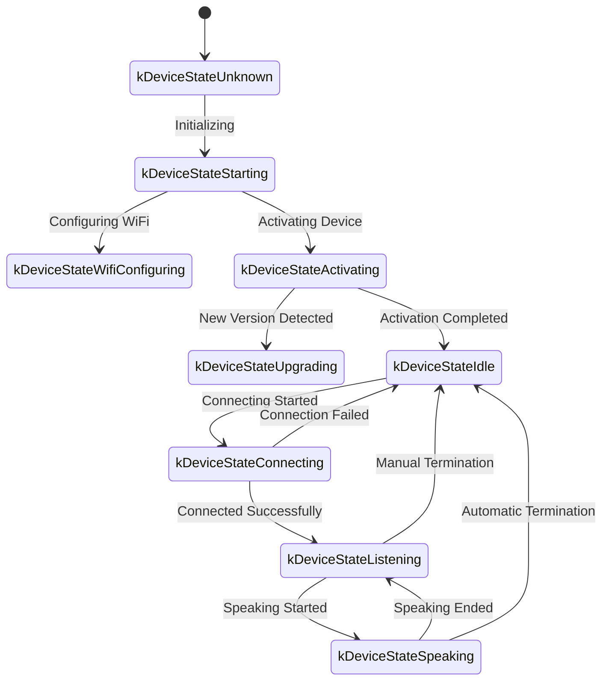
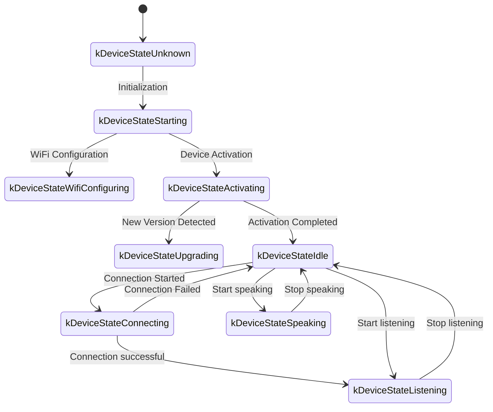

The following is a WebSocket communication protocol document, organized based on code implementation, outlining how devices and servers interact over WebSocket.

This document is based solely on the provided code; actual deployment may require further confirmation or supplementation based on the server-side implementation.

---

## 1. Overall Process Overview

1. **Device Initialization**

- Power on the device and initialize the `Application`:

- Initialize the audio codec, display, LEDs, etc.

- Connect to the network

- Create and initialize a WebSocket protocol instance (`WebsocketProtocol`) that implements the `Protocol` interface

- Enter the main loop and wait for events (audio input, audio output, scheduled tasks, etc.).

2. **Establishing a WebSocket Connection**
- When the device needs to start a voice conversation (e.g., user wakeup, manual key press, etc.), call `OpenAudioChannel()`:
- Obtain the WebSocket URL according to the configuration
- Set several request headers (`Authorization`, `Protocol-Version`, `Device-Id`, `Client-Id`)
- Call `Connect()` to establish a WebSocket connection with the server

3. **The device sends a "hello" message**
- After the connection is successful, the device sends a JSON message with the following example structure:
```json
{
"type": "hello",
"version": 1,
"features": {
"mcp": true
},
"transport": "websocket",
"audio_params": {
"format": "opus",
"sample_rate": 16000,
"channels": 1,
"frame_duration": 60
}
}
```
- The `features` field is optional and its content is automatically generated based on the device's build configuration. For example, `"mcp": true` indicates support for the MCP protocol.
- The `frame_duration` value corresponds to `OPUS_FRAME_DURATION_MS` (e.g., 60ms).

4. **Server Reply "hello"**
- The device waits for the server to return a JSON message containing `"type": "hello"` and checks if `"transport": "websocket"` matches.
- The server may optionally send the `session_id` field, which the device automatically records upon receipt.
- Example:
```json
{
"type": "hello",
"transport": "websocket",
"session_id": "xxx",
"audio_params": {
"format": "opus",
"sample_rate": 24000,
"channels": 1,
"frame_duration": 60
}
}
```
- If a match is found, the server is considered ready and the audio channel is successfully opened.
- If no correct response is received within the timeout (default 10 seconds), the connection is considered failed and the network error callback is triggered.

5. **Subsequent Message Interaction**
- Two main types of data can be sent between the device and server:

1. **Binary audio data** (Opus encoding)

2. **Text JSON messages** (used to transmit chat status, TTS/STT events, MCP protocol messages, etc.)

- In the code, the receiving callbacks are mainly divided into:

- `OnData(...)`:

- When `binary` is `true`, it is considered an audio frame; the device will decode it as Opus data.

- When `binary` is `false`, it is considered JSON text and needs to be parsed using cJSON on the device and processed accordingly (such as chat, TTS, MCP protocol messages, etc.).

- When the server or network is disconnected, the `OnDisconnected()` callback is triggered:
- The device will call `on_audio_channel_closed_()` and eventually return to the idle state.

6. **Closing the WebSocket Connection**
- When the device needs to end the audio session, it calls `CloseAudioChannel()` to actively disconnect and return to the idle state.
- Alternatively, if the server actively disconnects, the same callback process will be triggered.

---

## 2. Common Request Headers

When establishing a WebSocket connection, the following request headers are set in the code example:

- `Authorization`: Used to store the access token, in the form of `"Bearer <token>"`
- `Protocol-Version`: The protocol version number, which should be consistent with the `version` field in the hello message body
- `Device-Id`: The device's physical network card MAC address
- `Client-Id`: A software-generated UUID (reset by erasing the NVS or reflashing the full firmware)

These headers are sent to the server along with the WebSocket handshake, and the server can perform verification and authentication as needed.

---

## 3. Binary Protocol Versions

The device supports multiple binary protocol versions, specified via the `version` field in the configuration:

### 3.1 Version 1 (Default)
Sends Opus audio data directly without additional metadata. The WebSocket protocol distinguishes between text and binary.

### 3.2 Version 2
Using the `BinaryProtocol2` structure:
```c
struct BinaryProtocol2 {
uint16_t version; // Protocol version
uint16_t type; // Message type (0: OPUS, 1: JSON)
uint32_t reserved; // Reserved field
uint32_t timestamp; // Timestamp (milliseconds, used for server-side AEC)
uint32_t payload_size; // Payload size (bytes)
uint8_t payload[]; // Payload data
} __attribute__((packed));
```

### 3.3 Version 3
Using the `BinaryProtocol3` structure:
```c
struct BinaryProtocol3 {
uint8_t type; // Message type
uint8_t reserved; // Reserved field
uint16_t payload_size; // Payload size
uint8_t payload[]; // Payload data
} __attribute__((packed));
```
---

## 4. JSON Message Structure

WebSocket text frames are transmitted in JSON format. The following lists common `"type" fields and their corresponding business logic. Messages containing unlisted fields may be optional or implementation-specific.

### 4.1 Device → Server

1. **Hello**
- Sent by the device after a successful connection, informing the server of basic parameters.
- Example:
```json
{
"type": "hello",
"version": 1,
"features": {
"mcp": true
},
"transport": "websocket",
"audio_params": {
"format": "opus",
"sample_rate": 16000,
"channels": 1,
"frame_duration": 60
}
}
```

2. **Listen**
- Indicates whether the device starts or stops recording monitoring.
- Common fields:
- `"session_id"`: Session ID
- `"type": "listen"`
- `"state"`: `"start"`, `"stop"`, `"detect"` (wake-up detection has been triggered)
- `"mode"`: `"auto"`, `"manual"`, or `"realtime"`, indicating the detection mode.
- Example: Start listening
```json
{
"session_id": "xxx",
"type": "listen",
"state": "start",
"mode": "manual"
}
```

3. **Abort**
- Terminates the current speech (TTS playback) or voice channel.
- Example:
```json
{
"session_id": "xxx",
"type": "abort",
"reason": "wake_word_detected"
}
```
- The `reason` value can be `"wake_word_detected"` or other.

4. **Wake Word Detected**
- Used by the device to notify the server that a wake word has been detected.
- Before sending this message, Opus audio data for the wake word can be sent in advance for the server to perform voiceprint detection.
Example:
```json
{
"session_id": "xxx",
"type": "listen",
"state": "detect",
"text": "Hello Xiaoming"
}
```

5. **MCP**
- A next-generation protocol recommended for IoT control. All device capability discovery, tool invocation, etc. are performed via messages with type: "mcp", with the payload containing standard JSON-RPC 2.0 (see [MCP Protocol Documentation](./mcp-protocol.md) for details).

- **Example of sending a result from the device to the server:**
```json
{
"session_id": "xxx",
"type": "mcp",
"payload": {
"jsonrpc": "2.0",
"id": 1,
"result": {
"content": [
{ "type": "text", "text": "true" }
],
"isError": false
}
}
}
```

---

### 4.2 Server → Device

1. **Hello**
- Handshake confirmation message returned by the server.
- Must include `"type": "hello"`
and `"transport": "websocket"`.
- May contain `audio_params`, indicating the server's expected audio parameters or configuration alignment with the device.
- The server may optionally send the `session_id` field, which the device automatically records upon receipt.
- Upon successful reception, the device sets an event flag, indicating that the WebSocket channel is ready.

2. **STT**
- `{"session_id": "xxx", "type": "stt", "text": "..."}`
- Indicates that the server has recognized the user's speech (e.g., speech-to-text results).
- The device may display this text on the screen and then proceed with the response process.

3. **LLM**
- `{"session_id": "xxx", "type": "llm", "emotion": "happy", "text": "😀"}`
- The server instructs the device to adjust the emoji animation/UI expression.

4. **TTS**
- `{"session_id": "xxx", "type": "tts", "state": "start"}`: The server is preparing to send TTS audio, and the device enters the "speaking" playback state.
- `{"session_id": "xxx", "type": "tts", "state": "stop"}`: Indicates the end of this TTS session.
- `{"session_id": "xxx", "type": "tts", "state": "sentence_start", "text": "..."}`
- Instructs the device to display the text segment currently being played or spoken on the interface (for example, for displaying to the user).

5. **MCP**
- The server sends IoT-related control commands or returns call results via messages with type: "mcp". The payload structure is the same as above.

- **Example of sending tools/call from the server to the device:**
```json
{
"session_id": "xxx",
"type": "mcp",
"payload": {
"jsonrpc": "2.0",
"method": "tools/call",
"params": {
"name": "self.light.set_rgb",
"arguments": { "r": 255, "g": 0, "b": 0 }
},
"id": 1
}
}
```

6. **System**
- System control commands, commonly used for remote upgrades and updates.
- Example:
```json
{
"session_id": "xxx",
"type": "system",
"command": "reboot"
}
```
- Supported commands:
- `"reboot"`: Reboot the device

7. **Custom** (optional)
- Custom message, supported when `CONFIG_RECEIVE_CUSTOM_MESSAGE` is enabled.
- Example:
```json
{
"session_id": "xxx",
"type": "custom",
"payload": {
"message": "Custom content"
}
}
```

8. **Audio Data: Binary Frames**
- When the server sends audio binary frames (Opus encoding), the device decodes and plays them.
- If the device is in the "listening" (recording) state, received audio frames will be ignored or cleared to prevent conflicts.

---

## 5. Audio Codec

1. **Device Sends Recording Data**
- After possible echo cancellation, noise reduction, or volume gain, the audio input is packaged into binary frames using Opus encoding and sent to the server.
- Depending on the protocol version, Opus data may be sent directly (version 1) or using a binary protocol with metadata (versions 2/3).

2. **Device Plays Received Audio**
- Upon receiving binary frames from the server, it is also identified as Opus data.
- The device decodes the frames and then plays them through the audio output interface.
- If the server's audio sampling rate is different from the device's, resampling is performed after decoding.

---

## 6. Common State Transitions

The following is a common key state transition on the device side, corresponding to WebSocket messages:

1. **Idle** → **Connecting**
- After being triggered or woken up by the user, the device calls `OpenAudioChannel()` → establishes a WebSocket connection → sends `"type":"hello"`.

2. **Connecting** → **Listening**
- After a successful connection is established, if `SendStartListening(...)` is executed, the device enters the recording state. During this time, the device continuously encodes microphone data and sends it to the server.

3. **Listening** → **Speaking**
- Upon receiving a TTS Start message from the server (`{"type":"tts","state":"start"}`) → recording stops and the received audio plays.

4. **Speaking** → **Idle**
- Upon receiving a TTS Stop message from the server (`{"type":"tts","state":"stop"}`) → audio playback ends. If automatic listening is not resumed, the state returns to Idle; if automatic looping is configured, the state re-enters Listening.

5. **Listening** / **Speaking** → **Idle** (encountering an exception or active interruption)
- Call `SendAbortSpeaking(...)` or `CloseAudioChannel()` → terminate the session → close the WebSocket → return to Idle.

### Automatic Mode State Flow Diagram



### Manual Mode State Flow Diagram



---

## 7. Error Handling

1. **Connection Failure**
- If `Connect(url)` fails or times out while waiting for the server's "hello" message, the `on_network_error_()` callback is triggered. The device will display an error message such as "Unable to connect to service."

2. **Server Disconnect**
- If the WebSocket is abnormally disconnected, `OnDisconnected()` is called:
- The device calls `on_audio_channel_closed_()`
- Switches to the Idle state or uses other retry logic.

---

## 8. Other Notes

1. **Authentication**
- The device provides authentication by setting `Authorization: Bearer <token>`, and the server must verify its validity.
- If the token is expired or invalid, the server can reject the handshake or subsequently disconnect.

2. **Session Control**
- Some messages in the code contain `session_id` to distinguish independent conversations or operations. The server can separate different sessions as needed.

3. **Audio Payload**
- The code uses the Opus format by default, with `sample_rate = 16000` set to mono. The frame duration is controlled by `OPUS_FRAME_DURATION_MS` and is generally 60ms. This can be adjusted based on bandwidth or performance. For better music playback quality, the server may use a 24000 sampling rate for downlink audio.

4. **Protocol Version Configuration**
- Configure the binary protocol version (1, 2, or 3) using the `version` field in the settings.
- Version 1: Sends Opus data directly.
- Version 2: Uses a timestamped binary protocol, suitable for server-side AEC.
- Version 3: Uses a simplified binary protocol.

5. **MCP Protocol Recommended for IoT Control**
- It is recommended that IoT capability discovery, status synchronization, and control commands between devices and servers be implemented using the MCP protocol (type: "mcp"). The original type: "iot" solution has been deprecated.
-The MCP protocol can be transmitted over multiple underlying protocols such as WebSocket and MQTT, offering enhanced scalability and standardization.
- For detailed usage, please refer to the [MCP Protocol Documentation](./mcp-protocol.md) and [MCP IoT Control Usage](./mcp-usage.md).

6. **Errors or Abnormal JSON**
- If required fields are missing in the JSON, such as `{"type": ...}`, the device will log an error (`ESP_LOGE(TAG, "Missing message type, data: %s", data);`) and will not execute any operations.

---

## 9. Message Example

Here is a typical two-way message example (simplified flow):

1. **Device → Server** (handshake)
```json
{
"type": "hello",
"version": 1,
"features": {
"mcp": true
},
"transport": "websocket",
"audio_params": {
"format": "opus",
"sample_rate": 16000,
"channels": 1,
"frame_duration": 60
}
}
```

2. **Server → Device** (handshake response)
```json
{
"type": "hello",
"transport": "websocket",
"session_id": "xxx",
"audio_params": {
"format": "opus",
"sample_rate": 16000
}
}
```

3. **Device → Server (start listening)
```json
{
"session_id": "xxx",
"type": "listen",
"state": "start",
"mode": "auto"
}
```
Simultaneously, the device starts sending binary frames (Opus data).

4. **Server → Device** (ASR results)
```json
{
"session_id": "xxx",
"type": "stt",
"text": "user's words"
}
```

5. **Server → Device** (TTS starts)
```json
{
"session_id": "xxx",
"type": "tts",
"state": "start"
}
```
The server then sends binary audio frames to the device for playback.

6. **Server → Device** (TTS Ends)
```json
{
"session_id": "xxx",
"type": "tts",
"state": "stop"
}
```
The device stops playing audio and returns to idle state if no further commands are received.

---

## 10. Summary

This protocol transmits JSON text and binary audio frames over WebSocket to implement functions including audio stream upload, TTS audio playback, speech recognition and state management, and MCP command issuance. Its core features are:

- **Handshake Phase**: Send `"type":"hello"` and wait for the server to respond.
- **Audio Channel**: Uses Opus-encoded binary frames for bidirectional audio stream transmission, supporting multiple protocol versions.
- **JSON Message**: Uses `"type` as a core field to identify different business logic, including TTS, STT, MCP, WakeWord, System, and Custom.
- **Extensibility**: You can add fields to JSON messages or perform additional authentication in headers based on actual needs.

The server and device must agree in advance on the meaning of various message fields, timing logic, and error handling rules to ensure smooth communication. This information serves as a foundational document for subsequent integration, development, or expansion.
