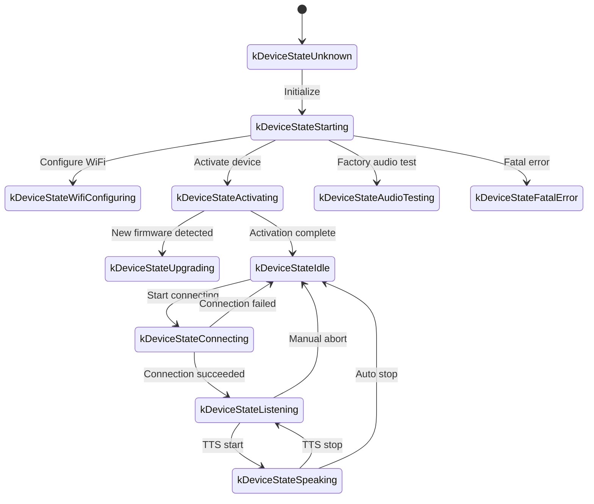
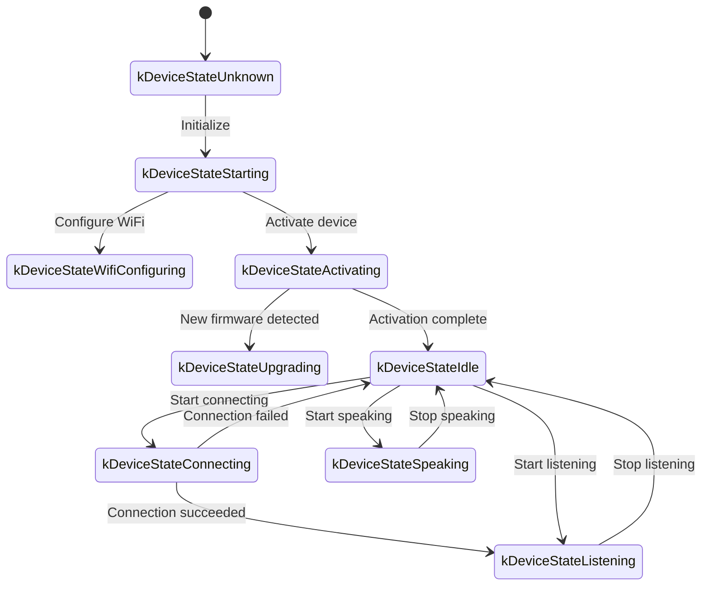

# WebSocket Communication Protocol

This document describes the WebSocket communication protocol between the device and the server, based on the current code. When implementing a server, please cross-check with the actual implementation.

---

## 1. Overall Flow

1. **Device initialization**
   - The device boots and initializes `Application`:
     - Initializes the audio codec, display, LEDs, etc.
     - Connects to the network.
     - Creates a WebSocket protocol instance (`WebsocketProtocol`) that implements the `Protocol` interface.
   - Enters the main loop and waits for events (audio input, audio output, scheduled tasks, etc.).

2. **Opening the WebSocket connection**
   - When the device needs to start a voice session (wake-up, button press, etc.), it calls `OpenAudioChannel()`:
     - Reads the WebSocket URL from settings.
     - Sets the request headers (`Authorization`, `Protocol-Version`, `Device-Id`, `Client-Id`).
     - Calls `Connect()` to establish the WebSocket connection.

3. **Device sends a "hello" message**
   - Once connected, the device sends a JSON message. Example:
   ```json
   {
     "type": "hello",
     "version": 1,
     "features": {
       "mcp": true,
       "aec": true
     },
     "transport": "websocket",
     "audio_params": {
       "format": "opus",
       "sample_rate": 16000,
       "channels": 1,
       "frame_duration": 60
     }
   }
   ```
   - `features` is optional and generated from compile-time configuration. For example, `"mcp": true` means the device supports MCP, and `"aec": true` is emitted when `CONFIG_USE_SERVER_AEC` is enabled.
   - `frame_duration` matches `OPUS_FRAME_DURATION_MS` (typically 60 ms).

4. **Server replies with "hello"**
   - The device waits for a JSON message whose `"type"` is `"hello"` and whose `"transport"` is `"websocket"`.
   - The server may include a `session_id`; the device will store it.
   - Example:
   ```json
   {
     "type": "hello",
     "transport": "websocket",
     "session_id": "xxx",
     "audio_params": {
       "format": "opus",
       "sample_rate": 24000,
       "channels": 1,
       "frame_duration": 60
     }
   }
   ```
   - If `transport` matches, the device marks the audio channel as opened.
   - If no valid hello arrives within the timeout (default 10 seconds), the connection is considered failed and the network error callback is fired.

5. **Subsequent exchanges**
   - Two kinds of data are sent in either direction:
     1. **Binary audio data** (Opus encoded)
     2. **Text JSON messages** (chat state, TTS/STT events, MCP messages, etc.)

   - In the code, the receive callback splits traffic as follows:
     - `OnData(...)`:
       - If `binary` is `true`, the payload is treated as an Opus frame and decoded.
       - If `binary` is `false`, the payload is parsed as JSON and dispatched by `type`.

   - When the server or network drops, `OnDisconnected()` fires:
     - The device invokes `on_audio_channel_closed_()` and eventually returns to the idle state.

6. **Closing the WebSocket connection**
   - When the device wants to end the session, it calls `CloseAudioChannel()` to tear down the socket and returns to idle.
   - The same callback chain runs if the server closes the socket first.

---

## 2. Common Request Headers

When establishing the WebSocket connection, the device sets the following headers:

- `Authorization`: access token, usually formatted as `"Bearer <token>"`.
- `Protocol-Version`: the protocol version number, matching the `version` field in the hello message.
- `Device-Id`: the physical MAC address of the device.
- `Client-Id`: a software-generated UUID (reset when NVS is erased or the full firmware is re-flashed).

These headers are sent with the WebSocket handshake; the server can use them for authentication or bookkeeping.

---

## 3. Binary Protocol Versions

The device supports several binary protocol versions, selected by the `version` field in settings:

### 3.1 Version 1 (default)
Raw Opus frames with no extra metadata. The WebSocket layer already distinguishes text and binary frames.

### 3.2 Version 2
Uses the `BinaryProtocol2` structure:
```c
struct BinaryProtocol2 {
    uint16_t version;        // protocol version
    uint16_t type;           // message type (0: OPUS, 1: JSON)
    uint32_t reserved;       // reserved
    uint32_t timestamp;      // timestamp in milliseconds (useful for server-side AEC)
    uint32_t payload_size;   // payload size in bytes
    uint8_t payload[];       // payload
} __attribute__((packed));
```

### 3.3 Version 3
Uses the `BinaryProtocol3` structure:
```c
struct BinaryProtocol3 {
    uint8_t type;            // message type
    uint8_t reserved;        // reserved
    uint16_t payload_size;   // payload size
    uint8_t payload[];       // payload
} __attribute__((packed));
```

---

## 4. JSON Message Structure

WebSocket text frames carry JSON. The most common `"type"` values and their semantics are listed below. Fields that are not listed may be implementation-specific or optional.

### 4.1 Device -> Server

1. **Hello**
   - Sent once the connection is established; announces the device parameters.
   - Example:
     ```json
     {
       "type": "hello",
       "version": 1,
       "features": {
         "mcp": true,
         "aec": true
       },
       "transport": "websocket",
       "audio_params": {
         "format": "opus",
         "sample_rate": 16000,
         "channels": 1,
         "frame_duration": 60
       }
     }
     ```

2. **Listen**
   - Tells the server that the device is starting or stopping microphone capture.
   - Common fields:
     - `"session_id"`: session identifier.
     - `"type": "listen"`
     - `"state"`: `"start"`, `"stop"`, or `"detect"` (wake word detected).
     - `"mode"`: `"auto"`, `"manual"`, or `"realtime"`.
   - Example (start listening):
     ```json
     {
       "session_id": "xxx",
       "type": "listen",
       "state": "start",
       "mode": "manual"
     }
     ```

3. **Abort**
   - Aborts the current TTS playback or the voice channel.
   - Example:
     ```json
     {
       "session_id": "xxx",
       "type": "abort",
       "reason": "wake_word_detected"
     }
     ```
   - `reason` may be `"wake_word_detected"` or other implementation-defined values.

4. **Wake Word Detected**
   - Sent by the device when the local wake word detector fires.
   - Opus audio containing the wake word may be streamed before this message to let the server run voice-print verification.
   - Example:
     ```json
     {
       "session_id": "xxx",
       "type": "listen",
       "state": "detect",
       "text": "Hi XiaoZhi"
     }
     ```

5. **MCP**
   - The recommended channel for IoT control. Device capability discovery and tool invocation all flow through `type: "mcp"` messages whose `payload` is JSON-RPC 2.0 (see [MCP protocol document](./mcp-protocol.md)).
   - Device-to-server response example:
     ```json
     {
       "session_id": "xxx",
       "type": "mcp",
       "payload": {
         "jsonrpc": "2.0",
         "id": 1,
         "result": {
           "content": [
             { "type": "text", "text": "true" }
           ],
           "isError": false
         }
       }
     }
     ```

---

### 4.2 Server -> Device

1. **Hello**
   - The handshake acknowledgement.
   - Must include `"type": "hello"` and `"transport": "websocket"`.
   - May include `audio_params`, meaning the audio parameters the server expects / the canonical set agreed with the device.
   - May include a `session_id` which the device records.
   - Once received, the device sets the "audio channel open" event.

2. **STT**
   - `{"session_id": "xxx", "type": "stt", "text": "..."}`
   - The speech-to-text result for the user utterance. Typically shown on the display before moving to the response.

3. **LLM**
   - `{"session_id": "xxx", "type": "llm", "emotion": "happy", "text": "😀"}`
   - Tells the device to update the emotion / facial expression on the UI.

4. **TTS**
   - `{"session_id": "xxx", "type": "tts", "state": "start"}`: the server is about to stream TTS audio. The device transitions to the speaking state.
   - `{"session_id": "xxx", "type": "tts", "state": "stop"}`: the TTS segment is finished.
   - `{"session_id": "xxx", "type": "tts", "state": "sentence_start", "text": "..."}`: show the current sentence on the UI (for example, subtitle display).

5. **MCP**
   - The server sends IoT-related commands or receives tool-call results. The `payload` structure follows JSON-RPC 2.0.
   - Server-to-device `tools/call` example:
     ```json
     {
       "session_id": "xxx",
       "type": "mcp",
       "payload": {
         "jsonrpc": "2.0",
         "method": "tools/call",
         "params": {
           "name": "self.light.set_rgb",
           "arguments": { "r": 255, "g": 0, "b": 0 }
         },
         "id": 1
       }
     }
     ```

6. **System**
   - System-level control, often used for remote upgrades / management.
   - Example:
     ```json
     {
       "session_id": "xxx",
       "type": "system",
       "command": "reboot"
     }
     ```
   - Supported commands:
     - `"reboot"`: reboot the device.

7. **Alert**
   - Instructs the device to show an alert and play a vibration sound. Handled in `Application::OnIncomingJson`.
   - Example:
     ```json
     {
       "session_id": "xxx",
       "type": "alert",
       "status": "Warning",
       "message": "Battery low",
       "emotion": "sad"
     }
     ```
   - Fields:
     - `status`: short title displayed on screen.
     - `message`: detailed message.
     - `emotion`: emotion shown while alerting (e.g. `"sad"`, `"neutral"`).

8. **Custom** (optional)
   - Available when `CONFIG_RECEIVE_CUSTOM_MESSAGE` is enabled.
   - Example:
     ```json
     {
       "session_id": "xxx",
       "type": "custom",
       "payload": {
         "message": "anything you want"
       }
     }
     ```

9. **Binary audio frames**
   - When the server pushes Opus-encoded audio as binary frames, the device decodes and plays them.
   - Frames received while the device is in the `listening` state are dropped to avoid conflicts with the microphone stream.

---

## 5. Audio Codec

1. **Device uploads microphone audio**
   - After optional AEC / NR / AGC processing, the audio is Opus-encoded and sent as binary frames.
   - Depending on the protocol version, the frames may be raw Opus (v1) or wrapped in the metadata structures (v2/v3).

2. **Device plays server audio**
   - Incoming binary frames are also treated as Opus.
   - The device decodes and sends them to the audio output.
   - If the sample rate differs from the device's output, it is resampled after decoding.

---

## 6. Device States

### 6.1 Main states

The device state machine is defined in [`main/device_state.h`](../main/device_state.h) and includes:

- `kDeviceStateUnknown`
- `kDeviceStateStarting`
- `kDeviceStateWifiConfiguring`
- `kDeviceStateIdle`
- `kDeviceStateConnecting`
- `kDeviceStateListening`
- `kDeviceStateSpeaking`
- `kDeviceStateUpgrading`
- `kDeviceStateActivating`
- `kDeviceStateAudioTesting`    (factory / bring-up audio testing)
- `kDeviceStateFatalError`      (non-recoverable error requiring user action)

### 6.2 Typical transitions

1. **Idle -> Connecting**
   - Triggered by wake word or button press. The device calls `OpenAudioChannel()`, sets up the WebSocket, and sends `"type":"hello"`.

2. **Connecting -> Listening**
   - Once connected, `SendStartListening(...)` is called and microphone streaming begins.

3. **Listening -> Speaking**
   - Server sends `{"type":"tts","state":"start"}`; the device stops sending mic audio and plays incoming TTS.

4. **Speaking -> Idle**
   - Server sends `{"type":"tts","state":"stop"}`. When auto-continue is enabled the device transitions back to Listening; otherwise it returns to Idle.

5. **Listening / Speaking -> Idle** (abort)
   - `SendAbortSpeaking(...)` or `CloseAudioChannel()` interrupts the session and closes the WebSocket.

### 6.3 Auto-mode state diagram


```mermaid
stateDiagram
  direction TB
  [*] --> kDeviceStateUnknown
  kDeviceStateUnknown --> kDeviceStateStarting: Initialize
  kDeviceStateStarting --> kDeviceStateWifiConfiguring: Configure WiFi
  kDeviceStateStarting --> kDeviceStateActivating: Activate device
  kDeviceStateActivating --> kDeviceStateUpgrading: New firmware detected
  kDeviceStateActivating --> kDeviceStateIdle: Activation complete
  kDeviceStateIdle --> kDeviceStateConnecting: Start connecting
  kDeviceStateConnecting --> kDeviceStateIdle: Connection failed
  kDeviceStateConnecting --> kDeviceStateListening: Connection succeeded
  kDeviceStateListening --> kDeviceStateSpeaking: TTS start
  kDeviceStateSpeaking --> kDeviceStateListening: TTS stop
  kDeviceStateListening --> kDeviceStateIdle: Manual abort
  kDeviceStateSpeaking --> kDeviceStateIdle: Auto stop
  kDeviceStateStarting --> kDeviceStateAudioTesting: Factory audio test
  kDeviceStateStarting --> kDeviceStateFatalError: Fatal error
```

### 6.4 Manual-mode state diagram


```mermaid
stateDiagram
  direction TB
  [*] --> kDeviceStateUnknown
  kDeviceStateUnknown --> kDeviceStateStarting: Initialize
  kDeviceStateStarting --> kDeviceStateWifiConfiguring: Configure WiFi
  kDeviceStateStarting --> kDeviceStateActivating: Activate device
  kDeviceStateActivating --> kDeviceStateUpgrading: New firmware detected
  kDeviceStateActivating --> kDeviceStateIdle: Activation complete
  kDeviceStateIdle --> kDeviceStateConnecting: Start connecting
  kDeviceStateConnecting --> kDeviceStateIdle: Connection failed
  kDeviceStateConnecting --> kDeviceStateListening: Connection succeeded
  kDeviceStateIdle --> kDeviceStateListening: Start listening
  kDeviceStateListening --> kDeviceStateIdle: Stop listening
  kDeviceStateIdle --> kDeviceStateSpeaking: Start speaking
  kDeviceStateSpeaking --> kDeviceStateIdle: Stop speaking
```

---

## 7. Error Handling

1. **Connection failure**
   - If `Connect(url)` fails or the server hello is not received before the timeout, `on_network_error_()` is invoked and the device shows a "cannot connect" alert.

2. **Server disconnect**
   - If the WebSocket drops unexpectedly, `OnDisconnected()` is called:
     - `on_audio_channel_closed_()` runs.
     - The device returns to Idle (or retries, depending on policy).

---

## 8. Other Notes

1. **Authentication**
   - The device supplies `Authorization: Bearer <token>`; the server must validate it.
   - If the token is missing or invalid the server may reject the handshake or terminate the session later.

2. **Session scope**
   - Many messages carry a `session_id`, useful when the server serves multiple concurrent interactions.

3. **Audio payload**
   - Default audio format is Opus at 16 kHz, mono. The frame duration is controlled by `OPUS_FRAME_DURATION_MS` (typically 60 ms). The server may use 24 kHz on the downlink for better music playback.

4. **Binary protocol version selection**
   - Configured through the `version` setting:
     - v1: raw Opus
     - v2: metadata + timestamp (useful for server-side AEC)
     - v3: lightweight header
   - The value is echoed back in the `Protocol-Version` header and the hello message.

5. **IoT control via MCP**
   - All IoT capability discovery and control flows through MCP (`type: "mcp"`). The legacy `type: "iot"` protocol is deprecated.
   - MCP works over both WebSocket and MQTT, giving better standardization and extensibility.
   - See [MCP protocol document](./mcp-protocol.md) and [MCP IoT control usage](./mcp-usage.md) for details.

6. **Malformed JSON**
   - When a required field such as `type` is missing, the device logs `ESP_LOGE(TAG, "Missing message type, data: %s", data);` and ignores the message.

---

## 9. Example Message Flow

A simplified two-way exchange:

1. **Device -> Server** (handshake)
   ```json
   {
     "type": "hello",
     "version": 1,
     "features": {
       "mcp": true,
       "aec": true
     },
     "transport": "websocket",
     "audio_params": {
       "format": "opus",
       "sample_rate": 16000,
       "channels": 1,
       "frame_duration": 60
     }
   }
   ```

2. **Server -> Device** (handshake ack)
   ```json
   {
     "type": "hello",
     "transport": "websocket",
     "session_id": "xxx",
     "audio_params": {
       "format": "opus",
       "sample_rate": 16000
     }
   }
   ```

3. **Device -> Server** (start listening)
   ```json
   {
     "session_id": "xxx",
     "type": "listen",
     "state": "start",
     "mode": "auto"
   }
   ```
   The device begins streaming binary Opus frames.

4. **Server -> Device** (ASR result)
   ```json
   {
     "session_id": "xxx",
     "type": "stt",
     "text": "what the user said"
   }
   ```

5. **Server -> Device** (TTS start)
   ```json
   {
     "session_id": "xxx",
     "type": "tts",
     "state": "start"
   }
   ```
   The server follows up with binary Opus frames for the device to play.

6. **Server -> Device** (TTS stop)
   ```json
   {
     "session_id": "xxx",
     "type": "tts",
     "state": "stop"
   }
   ```
   The device stops playback and, if no further instructions arrive, returns to idle.

---

## 10. Summary

This protocol carries JSON text and binary Opus frames over a WebSocket connection to implement audio streaming, TTS playback, speech recognition, device state management, MCP dispatch, and more. Key traits:

- **Handshake**: send `"type":"hello"` and wait for the server reply.
- **Audio channel**: bidirectional Opus streaming, with three binary framing variants.
- **JSON messages**: dispatched by `"type"` (TTS, STT, MCP, WakeWord, System, Alert, Custom, ...).
- **Extensibility**: extra fields in JSON, additional headers for authentication.

Server and device must agree on the meaning, timing, and error handling of each message type so the session runs smoothly. The text above provides the baseline for integration, debugging, and extension.
