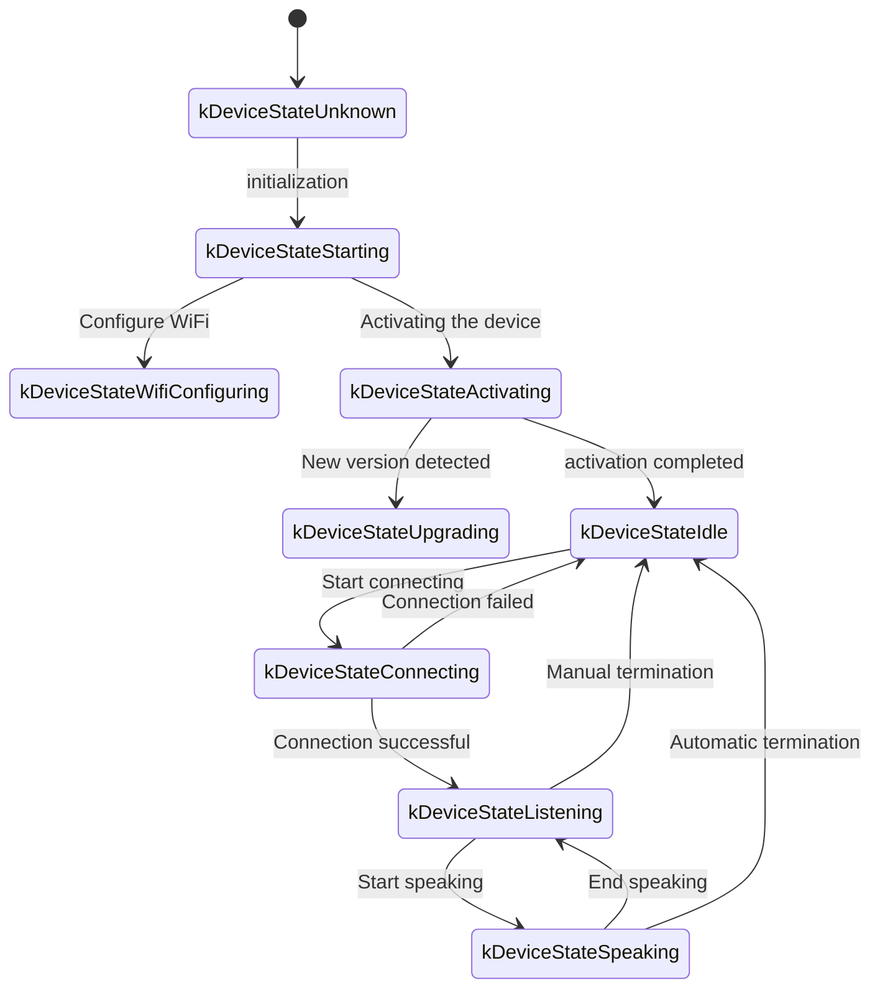
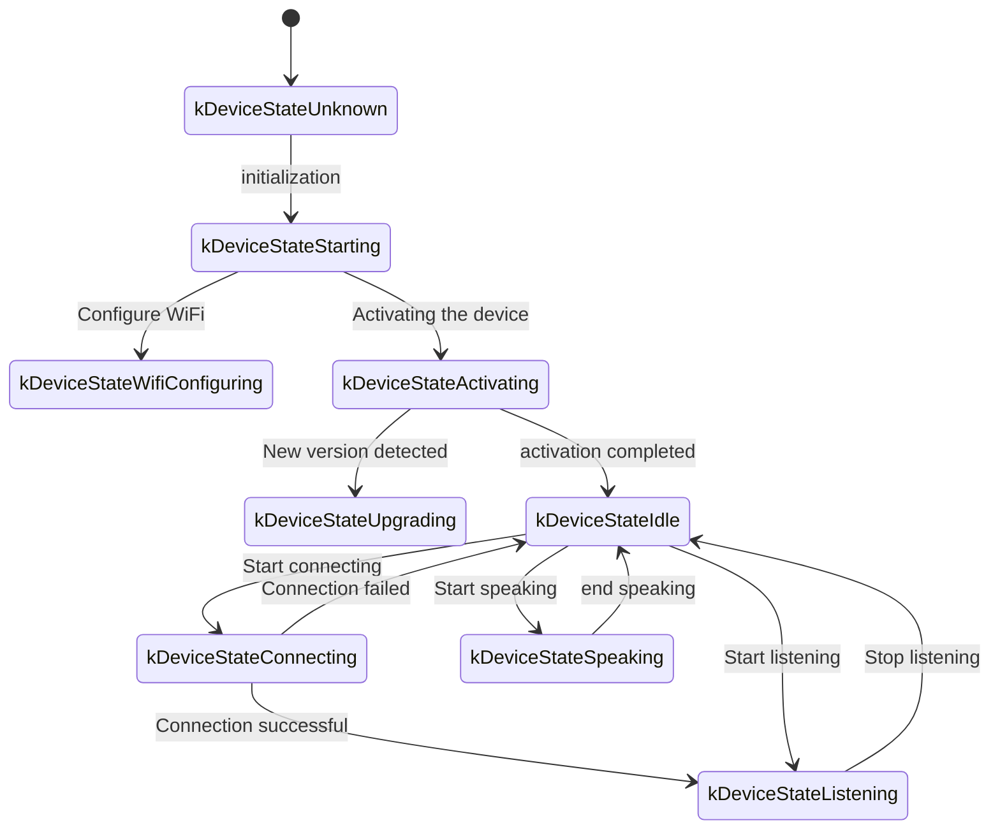

The following is a WebSocket communication protocol document based on code implementation, outlining how the device and server interact through WebSocket.

This document is only inferred based on the code provided. Actual deployment may require further confirmation or supplementation in conjunction with server-side implementation.

---

## 1. Overall process overview

1. **Device-side initialization**
   - Power on the device and initialize `Application`:
     - Initialize audio codecs, displays, LEDs, etc.
     - Connect to the Internet
     - Create and initialize a WebSocket protocol instance (`WebsocketProtocol`) that implements the `Protocol` interface
   - Enter the main loop to wait for events (audio input, audio output, scheduled tasks, etc.).

2. **Establish WebSocket connection**
   - When the device needs to start a voice session (such as user wake-up, manual key trigger, etc.), call `OpenAudioChannel()`:
     - Get WebSocket URL based on configuration
     - Set several request headers (`Authorization`, `Protocol-Version`, `Device-Id`, `Client-Id`)
     - Call `Connect()` to establish a WebSocket connection with the server

3. **The device sends a "hello" message**
   - After the connection is successful, the device will send a JSON message. The sample structure is as follows:
   ```json
   {
     "type": "hello",
     "version": 1,
     "features": {
       "mcp": true
     },
     "transport": "websocket",
     "audio_params": {
       "format": "opus",
       "sample_rate": 16000,
       "channels": 1,
       "frame_duration": 60
     }
   }
   ```
   - The `features` field is optional, and the content is automatically generated based on the device compilation configuration. For example: `"mcp": true` indicates support for MCP protocol.
   - The value of `frame_duration` corresponds to `OPUS_FRAME_DURATION_MS` (e.g. 60ms).

4. **The server replies "hello"**
   - The device waits for the server to return a JSON message containing `"type": "hello"` and checks if `"transport": "websocket"` matches.
   - The server can optionally send the `session_id` field, and the device will automatically record it after receiving it.
   - Example:
   ```json
   {
     "type": "hello",
     "transport": "websocket",
     "session_id": "xxx",
     "audio_params": {
       "format": "opus",
       "sample_rate": 24000,
       "channels": 1,
       "frame_duration": 60
     }
   }
   ```
   - If there is a match, the server is considered ready and the audio channel is marked as opened successfully.
   - If a correct reply is not received within the timeout (default 10 seconds), the connection is considered failed and a network error callback is triggered.

5. **Follow-up message interaction**
   - There are two main types of data that can be sent between the device and server:
     1. **Binary audio data** (Opus encoding)
     2. **Text JSON message** (used to transmit chat status, TTS/STT events, MCP protocol messages, etc.)

   - In the code, receiving callbacks is mainly divided into:
     - `OnData(...)`:  
       - When `binary` is `true`, it is considered an audio frame; the device will decode it as Opus data.
       - When `binary` is `false`, it is considered to be JSON text, which needs to be parsed with cJSON on the device side and processed with corresponding business logic (such as chat, TTS, MCP protocol messages, etc.).

   - When the server or network is disconnected, the callback `OnDisconnected()` is triggered:
     - The device will call `on_audio_channel_closed_()` and eventually return to the idle state.

6. **Close WebSocket connection**
   - When the device needs to end the voice session, it will call `CloseAudioChannel()` to actively disconnect and return to the idle state.
   - Or if the server actively disconnects, the same callback process will also be triggered.

---

## 2. Common request header

When establishing a WebSocket connection, the following request headers are set in the code example:

- `Authorization`: used to store access tokens, in the form of `"Bearer <token>"`
- `Protocol-Version`: protocol version number, consistent with the `version` field in the hello message body
- `Device-Id`: device physical network card MAC address
- `Client-Id`: software-generated UUID (reset by erasing NVS or re-burning full firmware)

These headers will be sent to the server along with the WebSocket handshake, and the server can perform verification, authentication, etc. as needed.

---

## 3. Binary protocol version

The device supports multiple binary protocol versions, specified through the `version` field in the configuration:

### 3.1 version 1 (default)
Send Opus audio data directly with no additional metadata. The Websocket protocol distinguishes between text and binary.

### 3.2 version 2
Using the `BinaryProtocol2` structure:
```c
struct BinaryProtocol2 {
    uint16_t version; // protocol version
    uint16_t type; // Message type (0: OPUS, 1: JSON)
    uint32_t reserved; // reserved field
    uint32_t timestamp; // Timestamp (milliseconds, used for server-side AEC)
    uint32_t payload_size; // Payload size (bytes)
    uint8_t payload[]; // payload data
} __attribute__((packed));
```

### 3.3 version 3
Using the `BinaryProtocol3` structure:
```c
struct BinaryProtocol3 {
    uint8_t type; // message type
    uint8_t reserved; // reserved field
    uint16_t payload_size; // payload size
    uint8_t payload[]; // payload data
} __attribute__((packed));
```

---

## 4. JSON message structure

WebSocket text frames are transmitted in JSON mode. The following are common `"type"` fields and their corresponding business logic. If the message contains fields not listed, they may be optional or implementation-specific.

### 4.1 Device → Server

1. **Hello**  
   - After the connection is successful, it will be sent by the device to inform the server of the basic parameters.
   - Example:
     ```json
     {
       "type": "hello",
       "version": 1,
       "features": {
         "mcp": true
       },
       "transport": "websocket",
       "audio_params": {
         "format": "opus",
         "sample_rate": 16000,
         "channels": 1,
         "frame_duration": 60
       }
     }
     ```

2. **Listen**  
   - Indicates that the device starts or stops recording monitoring.
   - Common fields:
     - `"session_id"`: Session ID
     - `"type": "listen"`  
     - `"state"`: `"start"`, `"stop"`, `"detect"` (wakeup detection has been triggered)
     - `"mode"`: `"auto"`, `"manual"` or `"realtime"`, indicating the recognition mode.
   - Example: Start monitoring
     ```json
     {
       "session_id": "xxx",
       "type": "listen",
       "state": "start",
       "mode": "manual"
     }
     ```

3. **Abort**  
   - Terminate the current talk (TTS playback) or voice channel.
   - Example:
     ```json
     {
       "session_id": "xxx",
       "type": "abort",
       "reason": "wake_word_detected"
     }
     ```
   - `reason` value can be `"wake_word_detected"` or other.

4. **Wake Word Detected**  
   - Used by the device to notify the server that the wake word has been detected.
   - Before sending the message, the Opus audio data of the wake word can be sent in advance for the server to perform voiceprint detection.
   - Example:
     ```json
     {
       "session_id": "xxx",
       "type": "listen",
       "state": "detect",
       "text": "Hello Xiao Ming"
     }
     ```

5. **MCP**
   - Recommended new generation protocol for IoT control. All device capability discovery, tool invocation, etc. are performed through messages of type: "mcp", and the payload is internally standard JSON-RPC 2.0 (see [MCP Protocol Document](./mcp-protocol.md) for details).
   
   - **Example of device sending result to server:**
     ```json
     {
       "session_id": "xxx",
       "type": "mcp",
       "payload": {
         "jsonrpc": "2.0",
         "id": 1,
         "result": {
           "content": [
             { "type": "text", "text": "true" }
           ],
           "isError": false
         }
       }
     }
     ```

---

### 4.2 Server→Device

1. **Hello**  
   - The handshake confirmation message returned by the server.
   - Must contain `"type": "hello"` and `"transport": "websocket"`.
   - May be accompanied by `audio_params`, indicating the audio parameters expected by the server, or configuration aligned with the device side.
   - The server can optionally send the `session_id` field, and the device will automatically record it after receiving it.
   - After successful reception, the device will set the event flag to indicate that the WebSocket channel is ready.

2. **STT**  
   - `{"session_id": "xxx", "type": "stt", "text": "..."}`
   - Indicates that the server has recognized the user's voice. (e.g. speech-to-text results)
   - The device may display this text on the screen, and then enter the process of answering.

3. **LLM**  
   - `{"session_id": "xxx", "type": "llm", "emotion": "happy", "text": "😀"}`
   - The server instructs the device to adjust emote animations/UI expressions.

4. **TTS**  
   - `{"session_id": "xxx", "type": "tts", "state": "start"}`: The server is ready to deliver TTS audio, and the device enters the "speaking" playback state.
   - `{"session_id": "xxx", "type": "tts", "state": "stop"}`: Indicates the end of this TTS.
   - `{"session_id": "xxx", "type": "tts", "state": "sentence_start", "text": "..."}`
     - Have the device display the currently played or spoken text segment on the interface (e.g. for display to the user).

5. **MCP**
   - The server issues IoT-related control instructions or returns the call results through messages of type: "mcp". The payload structure is the same as above.
   
   - **Example of sending tools/call from server to device:**
     ```json
     {
       "session_id": "xxx",
       "type": "mcp",
       "payload": {
         "jsonrpc": "2.0",
         "method": "tools/call",
         "params": {
           "name": "self.light.set_rgb",
           "arguments": { "r": 255, "g": 0, "b": 0 }
         },
         "id": 1
       }
     }
     ```

6. **System**
   - System control commands, often used for remote upgrades and updates.
   - Example:
     ```json
     {
       "session_id": "xxx",
       "type": "system",
       "command": "reboot"
     }
     ```
   - Supported commands:
     - `"reboot"`: Restart the device

7. **Custom** (optional)
   - Custom messages, supported when `CONFIG_RECEIVE_CUSTOM_MESSAGE` is enabled.
   - Example:
     ```json
     {
       "session_id": "xxx",
       "type": "custom",
       "payload": {
         "message": "custom content"
       }
     }
     ```

8. **Audio Data: Binary Frame**
   - When the server sends audio binary frames (Opus encoded), the device decodes and plays them.
   - If the device is in "listening" (recording) state, the received audio frames will be ignored or cleared to prevent conflicts.

---

## 5. Audio codec

1. **The device sends recording data**
   - After the audio input has undergone possible echo cancellation, noise reduction or volume gain, it is packaged into binary frames and sent to the server through Opus encoding.
   - Depending on the protocol version, it is possible to send Opus data directly (version 1) or use the binary protocol with metadata (version 2/3).

2. **Play the received audio on the device**
   - When a binary frame is received from the server, it is also considered to be Opus data.
   - The device will decode it and then play it through the audio output interface.
   - If the audio sampling rate of the server is inconsistent with the device, resampling will be performed after decoding.

---

## 6. Common status transitions

The following are common device-side key status flows, corresponding to WebSocket messages:

1. **Idle** → **Connecting**  
   - After the user triggers or wakes up, the device calls `OpenAudioChannel()` → establishes a WebSocket connection → sends `"type":"hello"`.

2. **Connecting** → **Listening**  
   - After successfully establishing the connection, if you continue to execute `SendStartListening(...)`, it will enter the recording state. At this time, the device will continue to encode the microphone data and send it to the server.

3. **Listening** → **Speaking**  
   - Server TTS Start message received (`{"type":"tts","state":"start"}`) → Stop recording and play the received audio.

4. **Speaking** → **Idle**  
   - Server TTS Stop (`{"type":"tts","state":"stop"}`) → Audio playback ends. If it does not continue to enter automatic listening, it will return to Idle; if an automatic loop is configured, it will enter Listening again.

5. **Listening** / **Speaking** → **Idle** (encountering exception or active interruption)
   - Call `SendAbortSpeaking(...)` or `CloseAudioChannel()` → interrupt the session → close WebSocket → return to Idle state.

### Automatic mode status flow chart



### Manual mode status flow chart



---

## 7. Error handling

1. **Connection failed**
   - Trigger the `on_network_error_()` callback if `Connect(url)` returns failure or times out while waiting for the server "hello" message. The device will prompt "Unable to connect to service" or similar error message.

2. **Server disconnected**
   - If WebSocket is disconnected abnormally, callback `OnDisconnected()`:
     - Device callback `on_audio_channel_closed_()`
     - Switch to Idle or other retry logic.

---

## 8. Other matters needing attention

1. **Authentication**
   - The device provides authentication by setting `Authorization: Bearer <token>`, and the server needs to verify whether it is valid.
   - If the token expires or is invalid, the server can reject the handshake or disconnect subsequently.

2. **Session Control**
   - Some messages in the code contain `session_id` to distinguish independent conversations or operations. The server can separate different sessions as needed.

3. **Audio Load**
   - The code uses Opus format by default, and sets `sample_rate = 16000`, mono. The frame duration is controlled by `OPUS_FRAME_DURATION_MS`, generally 60ms. Adjustments can be made appropriately based on bandwidth or performance. For better music playback, the server downstream audio may use a 24000 sample rate.

4. **Protocol version configuration**
   - Configure the binary protocol version (1, 2 or 3) via the `version` field in settings
   - Version 1: Send Opus data directly
   - Version 2: Uses timestamped binary protocol, suitable for server-side AEC
   - Version 3: Uses simplified binary protocol

5. **Recommended MCP protocol for IoT control**
   - It is recommended that IoT capability discovery, status synchronization, control instructions, etc. between devices and servers are all implemented through the MCP protocol (type: "mcp"). The original type: "iot" solution has been deprecated.
   - The MCP protocol can be transmitted on multiple underlying protocols such as WebSocket and MQTT, and has better scalability and standardization capabilities.
   - For detailed usage, please refer to [MCP Protocol Document](./mcp-protocol.md) and [MCP IoT Control Usage](./mcp-usage.md).

6. **Error or Exception JSON**
   - When necessary fields are missing from the JSON, such as `{"type": ...}`, the device will record an error log (`ESP_LOGE(TAG, "Missing message type, data: %s", data);`) and will not perform any business.

---

## 9. Message example

A typical two-way message example is given below (simplified process):

1. **Device → Server** (handshake)
   ```json
   {
     "type": "hello",
     "version": 1,
     "features": {
       "mcp": true
     },
     "transport": "websocket",
     "audio_params": {
       "format": "opus",
       "sample_rate": 16000,
       "channels": 1,
       "frame_duration": 60
     }
   }
   ```

2. **Server → Device** (handshake response)
   ```json
   {
     "type": "hello",
     "transport": "websocket",
     "session_id": "xxx",
     "audio_params": {
       "format": "opus",
       "sample_rate": 16000
     }
   }
   ```

3. **Device → Server** (start monitoring)
   ```json
   {
     "session_id": "xxx",
     "type": "listen",
     "state": "start",
     "mode": "auto"
   }
   ```
   At the same time, the device starts sending binary frames (Opus data).

4. **Server → Device** (ASR result)
   ```json
   {
     "session_id": "xxx",
     "type": "stt",
     "text": "What the user said"
   }
   ```

5. **Server → Device** (TTS starts)
   ```json
   {
     "session_id": "xxx",
     "type": "tts",
     "state": "start"
   }
   ```
   Then the server sends binary audio frames to the device for playback.

6. **Server → Device** (TTS ends)
   ```json
   {
     "session_id": "xxx",
     "type": "tts",
     "state": "stop"
   }
   ```
   The device stops playing audio and returns to the idle state if there are no more instructions.

---

## 10. Summary

This protocol transmits JSON text and binary audio frames on the upper layer of WebSocket, and completes functions including audio stream upload, TTS audio playback, speech recognition and status management, MCP command issuance, etc. Its core features:

- **Handshake phase**: Send `"type":"hello"` and wait for the server to return.
- **Audio Channel**: Uses Opus-encoded binary frames to transmit voice streams in both directions, supporting multiple protocol versions.
- **JSON message**: Use `"type"` to identify different business logic for core fields, including TTS, STT, MCP, WakeWord, System, Custom, etc.
- **Extensibility**: Fields can be added to the JSON message according to actual needs, or additional authentication can be performed in headers.

The server and the device need to agree in advance on the field meanings, timing logic, and error handling rules of various messages to ensure smooth communication. The above information can be used as basic documents to facilitate subsequent docking, development or expansion.
