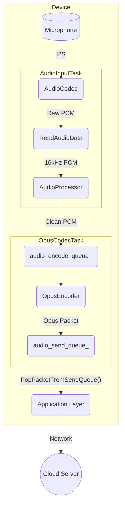
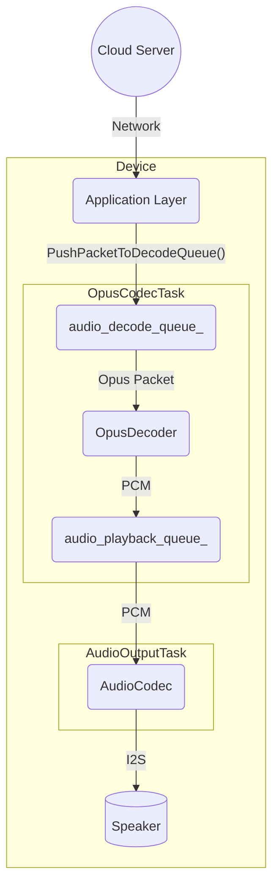

# Audio Service Architecture

The audio service is a core component responsible for managing all audio-related functionalities, including capturing audio from the microphone, processing it, encoding/decoding, and playing back audio through the speaker. It is designed to be modular and efficient, running its main operations in dedicated FreeRTOS tasks to ensure real-time performance.

## Key Components

-   **`AudioService`**: The central orchestrator. It initializes and manages all other audio components, tasks, and data queues.
-   **`AudioCodec`**: A hardware abstraction layer (HAL) for the physical audio codec chip. It handles the raw I2S communication for audio input and output.
-   **`AudioProcessor`**: Performs real-time audio processing on the microphone input stream. This typically includes Acoustic Echo Cancellation (AEC), noise suppression, and Voice Activity Detection (VAD). `AfeAudioProcessor` is the default implementation, utilizing the ESP-ADF Audio Front-End.
-   **`WakeWord`**: Detects keywords (e.g., "你好，小智", "Hi, ESP") from the audio stream. It runs independently from the main audio processor until a wake word is detected.
-   **`OpusEncoderWrapper` / `OpusDecoderWrapper`**: Manages the encoding of PCM audio to the Opus format and decoding Opus packets back to PCM. Opus is used for its high compression and low latency, making it ideal for voice streaming.
-   **`OpusResampler`**: A utility to convert audio streams between different sample rates (e.g., resampling from the codec's native sample rate to the required 16kHz for processing).

## Threading Model

The service operates on three primary tasks to handle the different stages of the audio pipeline concurrently:

1.  **`AudioInputTask`**: Solely responsible for reading raw PCM data from the `AudioCodec`. It then feeds this data to either the `WakeWord` engine or the `AudioProcessor` based on the current state.
2.  **`AudioOutputTask`**: Responsible for playing audio. It retrieves decoded PCM data from the `audio_playback_queue_` and sends it to the `AudioCodec` to be played on the speaker.
3.  **`OpusCodecTask`**: A worker task that handles both encoding and decoding. It fetches raw audio from `audio_encode_queue_`, encodes it into Opus packets, and places them in the `audio_send_queue_`. Concurrently, it fetches Opus packets from `audio_decode_queue_`, decodes them into PCM, and places the result in the `audio_playback_queue_`.

## Data Flow

There are two primary data flows: audio input (uplink) and audio output (downlink).

### 1. Audio Input (Uplink) Flow

This flow captures audio from the microphone, processes it, encodes it, and prepares it for sending to a server.

-   The `AudioInputTask` continuously reads raw PCM data from the `AudioCodec`.
-   This data is fed into an `AudioProcessor` for cleaning (AEC, VAD).
-   The processed PCM data is pushed into the `audio_encode_queue_`.
-   The `OpusCodecTask` picks up the PCM data, encodes it into Opus format, and pushes the resulting packet to the `audio_send_queue_`.
-   The application can then retrieve these Opus packets and send them over the network.

### 2. Audio Output (Downlink) Flow

This flow receives encoded audio data, decodes it, and plays it on the speaker.

-   The application receives Opus packets from the network and pushes them into the `audio_decode_queue_`.
-   The `OpusCodecTask` retrieves these packets, decodes them back into PCM data, and pushes the data to the `audio_playback_queue_`.
-   The `AudioOutputTask` takes the PCM data from the queue and sends it to the `AudioCodec` for playback.

## Power Management

To conserve energy, the audio codec's input (ADC) and output (DAC) channels are automatically disabled after a period of inactivity (`AUDIO_POWER_TIMEOUT_MS`). A timer (`audio_power_timer_`) periodically checks for activity and manages the power state. The channels are automatically re-enabled when new audio needs to be captured or played. 