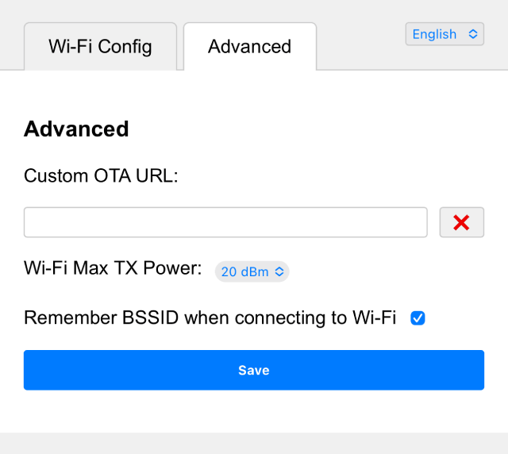

# ESP32 Wi-Fi Connect

This component helps with Wi-Fi connection for the device.

It first tries to connect to a Wi-Fi network using the credentials stored in the flash. If this fails, it starts an access point and a web server to allow the user to connect to a Wi-Fi network.

The URL to access the web server is `http://192.168.4.1`.

### Screenshot: Wi-Fi Configuration


### Screenshot: Advanced Options



## Changelog: v2.4.0

- Add ja / zh-TW languages.
- Add advanced tab.
- Add "Connection: close" headers to save open sockets.

## Changelog: v2.3.0

- Add support for language request.

## Changelog: v2.2.0

- Add support for ESP32 SmartConfig(ESPTouch v2)

## Changelog: v2.1.0

- Improve Wi-Fi connection logic.

## Changelog: v2.0.0

- Add support for multiple Wi-Fi SSID management.
- Auto switch to the best Wi-Fi network.
- Captive portal for Wi-Fi configuration.
- Support for multiple languages (English, Chinese).

## Configuration

The Wi-Fi credentials are stored in the flash under the "wifi" namespace.

The keys are "ssid", "ssid1", "ssid2" ... "ssid9", "password", "password1", "password2" ... "password9".

## Usage

```cpp
// Initialize the default event loop
ESP_ERROR_CHECK(esp_event_loop_create_default());

// Initialize NVS flash for Wi-Fi configuration
esp_err_t ret = nvs_flash_init();
if (ret == ESP_ERR_NVS_NO_FREE_PAGES || ret == ESP_ERR_NVS_NEW_VERSION_FOUND) {
    ESP_ERROR_CHECK(nvs_flash_erase());
    ret = nvs_flash_init();
}
ESP_ERROR_CHECK(ret);

// Get the Wi-Fi configuration
auto& ssid_list = SsidManager::GetInstance().GetSsidList();
if (ssid_list.empty()) {
    // Start the Wi-Fi configuration AP
    auto& ap = WifiConfigurationAp::GetInstance();
    ap.SetSsidPrefix("ESP32");
    ap.Start();
    return;
}

// Otherwise, connect to the Wi-Fi network
WifiStation::GetInstance().Start();
```

