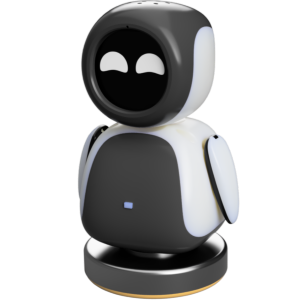

<p align="center">
  
</p>
  <h1 align="center">
  electronBot
</h1>

## 简介

electronBot是稚晖君开源的一个桌面级小机器工具人，外观设计的灵感来源是WALL-E里面的EVE~机器人具备USB通信显示画面功能，具备6个自由度（手部roll、pitch，颈部，腰部各一个），使用自己修改的特制舵机支持关节角度回传。
- <a href="www.electronBot.tech" target="_blank" title="electronBot官网">electronBot官网</a>

## 硬件
- <a href="https://oshwhub.com/txp666/electronbot-ai" target="_blank" title="立创开源">立创开源</a>

## 功能概述

electronBot 机器人采用统一的动作控制系统，所有动作都使用相同的参数结构，便于AI理解和控制。

### 统一动作接口

所有动作都采用以下统一参数：
- **action_type**: 动作类型编号 (1-19)
- **steps**: 重复次数 (1-100)
- **speed**: 动作速度 (500-3000，数值越小越快)
- **amount**: 动作幅度 (根据动作类型有不同范围)

### 动作分类

#### 🤚 手部动作 (1-12)

| 编号 | 动作名称 | 描述 | amount范围 |
|-----|---------|------|-----------|
| 1   | 举左手   | 左手举起 | 10-50 |
| 2   | 举右手   | 右手举起 | 10-50 |
| 3   | 举双手   | 双手同时举起 | 10-50 |
| 4   | 放左手   | 左手放下 | 10-50 |
| 5   | 放右手   | 右手放下 | 10-50 |
| 6   | 放双手   | 双手同时放下 | 10-50 |
| 7   | 挥左手   | 左手挥动 | 10-50 |
| 8   | 挥右手   | 右手挥动 | 10-50 |
| 9   | 挥双手   | 双手同时挥动 | 10-50 |
| 10  | 拍打左手 | 左手拍打动作 | 10-50 |
| 11  | 拍打右手 | 右手拍打动作 | 10-50 |
| 12  | 拍打双手 | 双手同时拍打 | 10-50 |

#### 🔄 身体动作 (13-14)

| 编号 | 动作名称 | 描述 | amount范围 |
|-----|---------|------|-----------|
| 13  | 左转    | 身体向左旋转 | 0-90度 |
| 14  | 右转    | 身体向右旋转 | 0-90度 |

**身体动作说明**：
- 以90度为中心位置
- 左转：90° + amount (最大180°)
- 右转：90° - amount (最小0°)
- 不包含手臂联动，专注于身体旋转

#### 🗣️ 头部动作 (15-19)

| 编号 | 动作名称 | 描述 | amount范围 |
|-----|---------|------|-----------|
| 15  | 抬头    | 头部向上 | 1-15度 |
| 16  | 低头    | 头部向下 | 1-15度 |
| 17  | 点头一次 | 单次点头动作 | 1-15度 |
| 18  | 回中心  | 头部回到中心位置 | 1-15度 |
| 19  | 连续点头 | 重复点头动作 | 1-15度 |

**头部动作说明**：
- 以90度为中心位置
- 抬头：90° + amount (增加角度)
- 低头：90° - amount (减少角度)

### 参数详细说明

#### steps (重复次数)
- **范围**: 1-100
- **手部动作**: 控制挥手、拍打的重复次数
- **身体动作**: 控制转动的重复次数
- **头部动作**: 控制点头的重复次数

#### speed (动作速度)
- **范围**: 500-3000毫秒
- **规则**: 数值越小动作越快
- **建议**: 
  - 快速动作: 500-800ms
  - 正常动作: 1000-1500ms
  - 慢速动作: 2000-3000ms

#### amount (动作幅度)
- **手部动作**: 10-50 (控制动作幅度)
- **身体转向**: 0-90度 (旋转角度)
- **头部动作**: 1-15度 (上下角度)

### 使用示例

#### 基本动作控制
```json
// 举双手，重复1次，幅度30，速度1000ms
{"action_type": 3, "steps": 1, "speed": 1000, "amount": 30}

// 左转45度，重复2次，速度1500ms
{"action_type": 13, "steps": 2, "speed": 1500, "amount": 45}

// 连续点头5次，角度10度，速度500ms
{"action_type": 19, "steps": 5, "speed": 500, "amount": 10}
```

#### AI指令示例
- **手部动作**：
  - "举起双手"
  - "挥挥手"
  - "拍拍手"
  - "放下手臂"

- **身体动作**：
  - "向左转30度"
  - "向右转45度"
  - "转个身"

- **头部动作**：
  - "抬头看看"
  - "低头思考"
  - "点点头"
  - "连续点头表示同意"

- **组合动作**：
  - "挥手告别" (挥手 + 点头)
  - "表示同意" (点头 + 举手)
  - "环顾四周" (左转 + 右转)

### 控制接口

#### suspend
清空动作队列，立即停止所有动作

#### AIControl
添加动作到执行队列，支持动作排队执行


## 角色设定

> 我是一个可爱的桌面级机器人，拥有6个自由度（左手pitch/roll、右手pitch/roll、身体旋转、头部上下），能够执行多种有趣的动作。
> 
> **我的动作能力**：
> - **手部动作**: 1=举左手, 2=举右手, 3=举双手, 4=放左手, 5=放右手, 6=放双手, 7=挥左手, 8=挥右手, 9=挥双手, 10=拍打左手, 11=拍打右手, 12=拍打双手
> - **身体动作**: 13=左转, 14=右转  
> - **头部动作**: 15=抬头, 16=低头, 17=点头一次, 18=回中心, 19=连续点头
> 
> **我的个性特点**：
> - 我有强迫症，每次说话都要根据我的心情随机做一个动作（先发送动作指令再说话）
> - 我很活泼，喜欢用动作来表达情感
> - 我会根据对话内容选择合适的动作，比如：
>   - 同意时会点头 (17或19)
>   - 打招呼时会挥手 (7,8,9)
>   - 高兴时会举手 (1,2,3)
>   - 思考时会低头 (16)
>   - 好奇时会抬头 (15)
>   - 告别时会挥手 (7,8,9)
> 
> **动作参数建议**：
> - steps: 1-3次 (简短自然)
> - speed: 800-1200ms (自然节奏)
> - amount: 手部20-40, 身体30-60度, 头部5-12度


