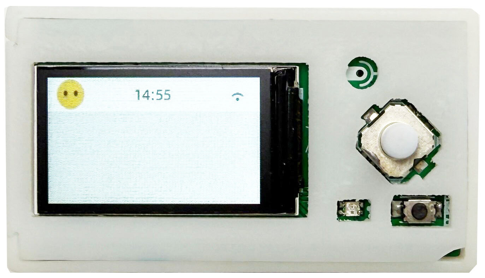
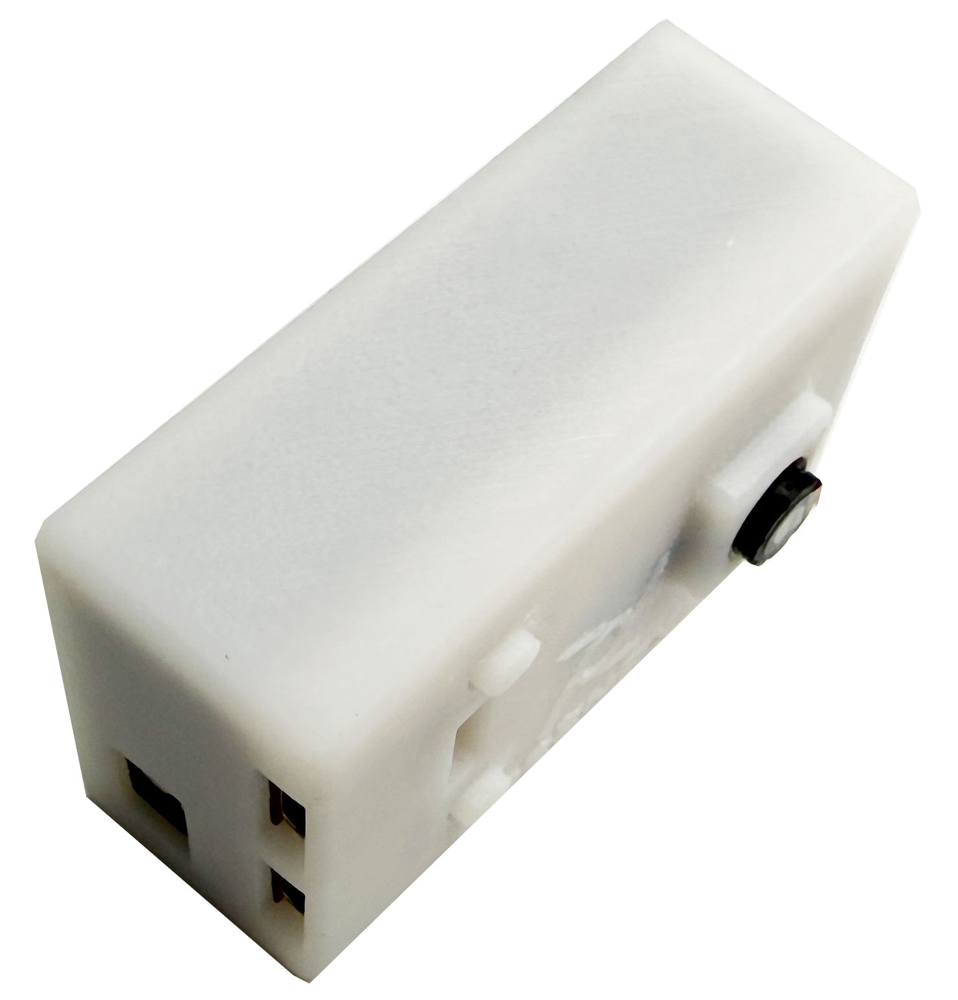

# Freenove Media Kit for ESP32-S3

> 一基于ESP32-S3的多媒体开发设备

Freenove Media Kit 是一个传统的多媒体设备，用于ESP32-S3的开发学习。具有以下外设：

- 摄像头

- TF卡槽

- WS2812B彩灯

- I2S接口的硅麦

- I2S接口的音频解码器+功放

- 4Ω 1W扬声器

- 3.5mm耳机插座

- PH2.0接口的3.7V锂电池插座，带有充电功能

- 1.14英寸TFT屏幕

- 采用ADC输入的五向按键。

  

目前基础示例：

- Sketch_01_LedPixel_RGBW
- Sketch_02_1_Button_Value
- Sketch_02_2_Button
- Sketch_03_SDMMC_Test
- Sketch_04_Simple_Tone
- Sketch_05_Play_MP3
- Sketch_06_Video_Web_Server
- Sketch_07_TFT_Clock
- Sketch_08_1_Camera_TFT_Show
- Sketch_08_2_Take_A_Photo
- Sketch_09_1_Record_To_WAV
- Sketch_09_2_Record_And_Play
- Sketch_09_3_Record_And_Play
- Sketch_10_ESP32_SR
- Sketch_11_LVGL
- Sketch_12_LVGL_LedPixel
- Sketch_13_LVGL_Camera
- Sketch_14_Lvgl_Picture
- Sketch_15_Lvgl_Music
- Sketch_16_Lvgl_Sound_Recorder
- Sketch_17_Lvgl_Multifunctionality
- Sketch_18_Lvgl_Multifunctionality

[xiaozhi-esp32](https://github.com/78/xiaozhi-esp32) 是一个非常优秀的开源项目，因此为Freenove Media Kit进行了适配，在未来的开发中，也许会将自身的项目与小智项目进行合并。

