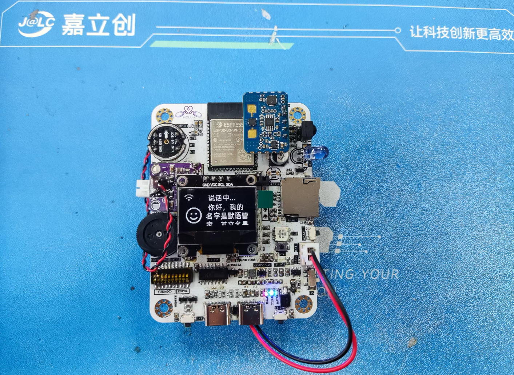
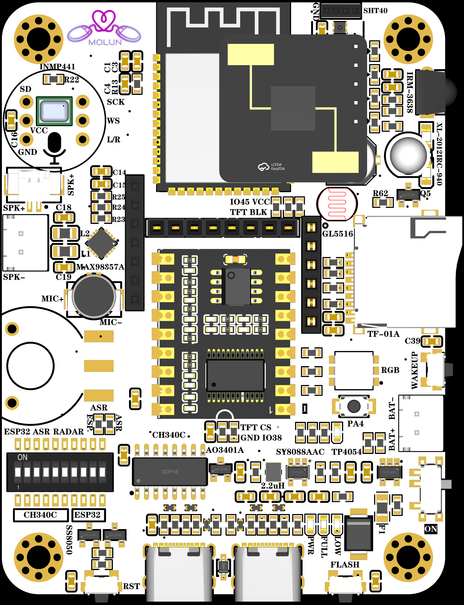
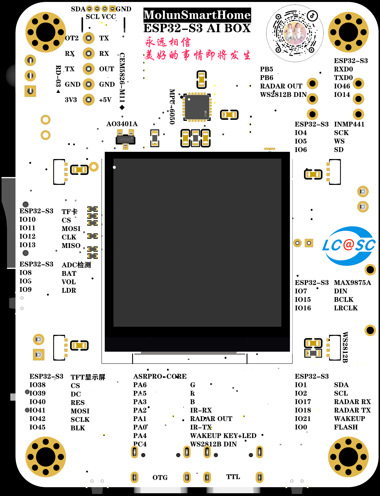
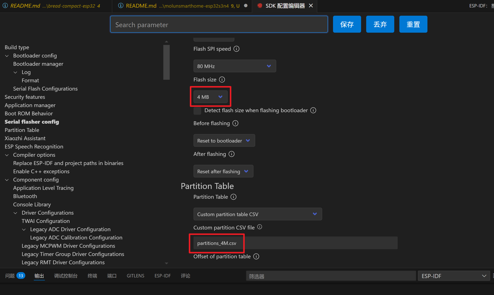
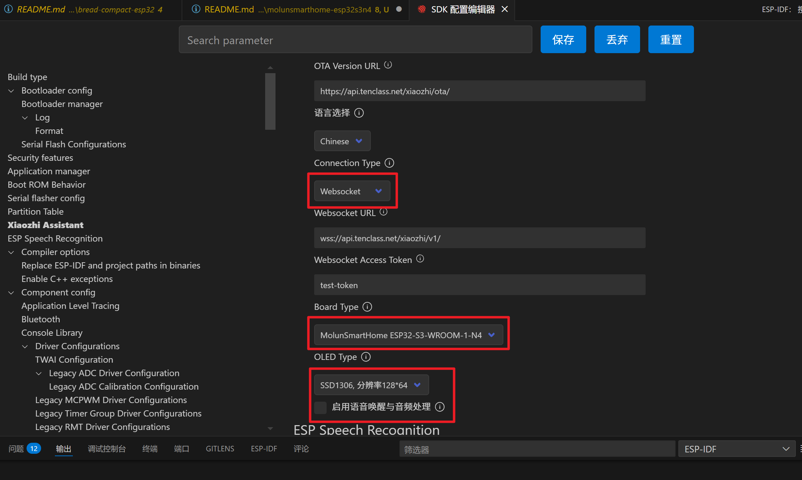
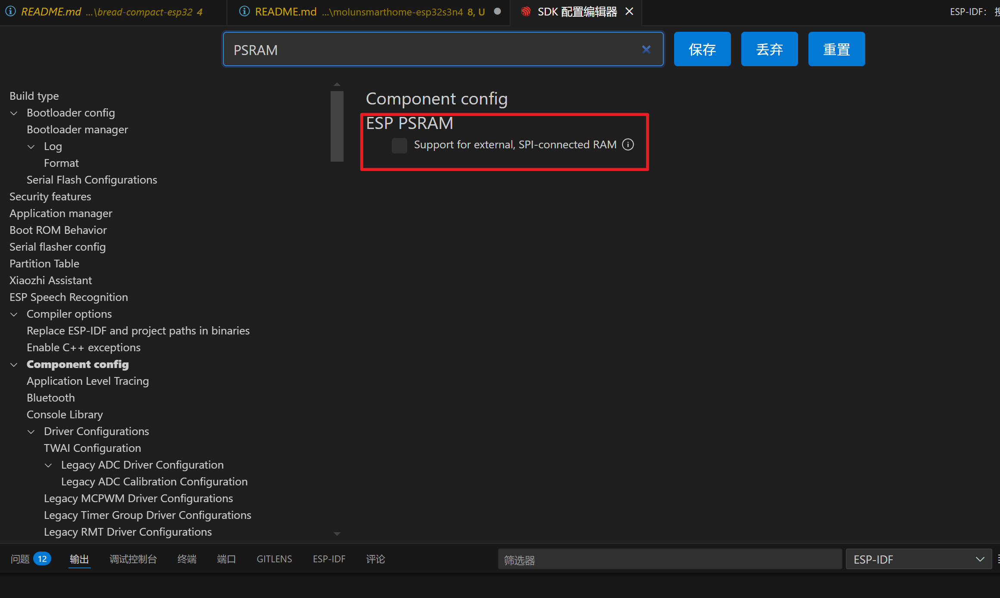

# 开发板开源地址

[默语小智管家](https://oshwhub.com/molun/intelligent-housekeeper)：https://oshwhub.com/molun/intelligent-housekeeper







# 开发板资源介绍

1. 主控芯片：ESP32-S3-WROOM-1-N4
2. 音频输入：麦克风INMP441（可插模块可焊接）
3. 音频输出：扬声器MAX98357A（可插模块可焊接）
4. 卡槽：支持TF卡（可插模块可焊接）
5. 屏幕：正面0.96'OLED屏幕（4、7、8PIN插接）、背面1.54TFT屏幕（ST7789V）
6. 按键：BOOT、RST、自定义按钮、天问唤醒按钮
7. 离线语音唤醒：天问ASR-PRO核心板
8. 温湿度传感器：SHT40-AD1B-R2
9. 红外接收：红外接收头IRM-3638
10. 红外发射：红外发射头IR333-A、XL-2012IRC-940
11. 充电电路：TP4054
12. LED显示：电源指示灯1颗、TP4054充电指示灯2颗、侧发光WS2812B灯珠4颗（背面）、RGB三色灯珠1颗
13. 雷达模块：安信可RD-03、萤火工场CEM5826-M11
14. 姿态传感器：MPU6050
15. 下载电路：CH340C自动下载电路、JTAG下载电路
16. 其他资源：串口切换、音量旋钮、电池电量检测、光敏电阻GL5516

4M Flash版本的ESP32-S3已经测试通过，通过下列编译命令即可编译可用的固件。如果焊接ESP32-S3-WROOM-1-N16R8模组就可以体验完全体的小智，实现语音唤醒。
天问ASR-PRO核心板与ESP32-S3通过串口连接，稍加改造可以实现离线语音开发板唤醒触发小智唤醒对话，使用S3N4模组即可。

---

# 编译配置命令

**配置编译目标为 ESP32S3：**

```bash
idf.py set-target esp32s3
```

**打开 menuconfig：**

```bash
idf.py menuconfig
```

**选择板子：**

```
Xiaozhi Assistant -> Board Type -> MolunSmartHome ESP32-S3-WROOM-1-N4
```

**修改 flash 大小：**

```
Serial flasher config -> Flash size -> 4 MB
```

**修改分区表：**

```
Partition Table -> Custom partition CSV file -> partitions_4M.csv
```

**修改通信协议为Websocket（效果会好些）：**

```
Xiaozhi Assistant -> Connection Type -> WebSocket
```

**关闭语音唤醒与音频处理：**

```
Xiaozhi Assistant -> USE_AUDIO_PROCESSING -> No
```

**关闭PSRAM：**

```
Component config -> ESP PSRAM -> Support for external, SPI-connected RAM -> No
```

**编译：**

```bash
idf.py build
```

---

# 编译配置截图




