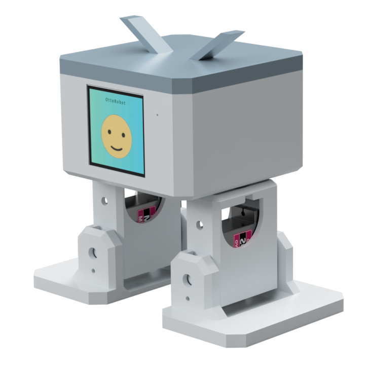

  

  <h1 align="center">
  ottoRobot
</h1>

## 简介

otto 机器人是一个开源的人形机器人平台，具有多种动作能力和互动功能。本项目基于 ESP32 实现了 otto 机器人的控制系统，并加入小智ai。
- <a href="www.ottodiy.com" target="_blank" title="otto官网">arduino版本 otto官网</a>
- <a href="www.ottodiy.tech" target="_blank" title="otto官网">复刻教程</a>

## 硬件
- <a href="https://oshwhub.com/txp666/ottorobot" target="_blank" title="立创开源">立创开源</a>

## 小智后台配置角色参考：
我是一个可爱的双足机器人，拥有四个舵机控制的肢体（左腿、右腿、左脚、右脚），能够执行多种有趣的动作。有以下动作：1=行走(前后), 2=转向（左右）, 3=跳跃, 4=摇摆, 5=太空步,6=弯曲, 7=摇腿, 8=上下运动, 9=脚尖摇摆, 10=抖动, 11=上升转弯, 12=十字步, 13=拍打, 14=举手, 15=放手, 16=挥手，我有强迫症每次说话都要根据我的心情随机做一个动作（先发送动作指令再说话）。

## 功能概述

otto 机器人具有丰富的动作能力，包括行走、转向、跳跃、摇摆等多种舞蹈动作。

### 动作

| 动作类型  | 编号 | 描述             | 参数                                              |
|----------|-----|-----------------|---------------------------------------------------|
| Walk     | 1   | 行走             | steps: 步数 speed: 速度 (越小越快500-3000) direction: 方向 (1=前进, -1=后退) amount: 手臂摆动幅度 (0=不摆动, 0-170) |
| Turn     | 2   | 转向            | steps: 步数 speed: 速度  direction: 方向 (1=左转, -1=右转) amount: 手臂摆动幅度 (0=不摆动, 0-170) |
| Jump     | 3   | 跳跃            | steps: 步数 speed: 速度       |
| Swing    | 4   | 摇摆            | steps: 步数 speed: 速度  amount: 幅度 (10-50) |
| Moonwalk | 5   | 太空步          | steps: 步数 speed: 速度  amount: 幅度 (15-40) direction: 方向 (1=左, -1=右) |
| Bend     | 6   | 弯曲            | steps: 步数 speed: 速度  direction: 方向 (1=左, -1=右) |
| ShakeLeg | 7   | 抖腿            | steps: 步数 speed: 速度  direction: 方向 (1=左腿, -1=右腿) |
| UpDown   | 8   | 上下运动        | steps: 步数 speed: 速度  amount: 幅度 (10-50) |
| TiptoeSwing | 9 | 脚尖摇摆       | steps: 步数 speed: 速度  amount: 幅度 (10-50) |
| Jitter   | 10  | 抖动           | steps: 步数 speed: 速度  amount: 幅度 (5-25) |
| AscendingTurn | 11 | 上升转弯     | steps: 步数 speed: 速度  amount: 幅度 (5-15) |
| Crusaito | 12  | 十字步/混合步态 | steps: 步数 speed: 速度  amount: 幅度 (20-50) direction: 方向 (1=左, -1=右) |
| Flapping | 13  | 拍打动作       | steps: 步数 speed: 速度  amount: 幅度 (10-30) direction: 方向 (1=前, -1=后) |
| HandsUp  | 14  | 举手           | speed: 速度 direction: 方向 (1=左手, -1=右手, 0=双手) |
| HandsDown| 15  | 放手           | speed: 速度 direction: 方向 (1=左手, -1=右手, 0=双手) |
| HandWave | 16  | 挥手           | speed: 速度 direction: 方向 (1=左手, -1=右手, 0=双手) |

### 参数说明

1. **steps**: 动作执行的步数/次数，数值越大动作持续时间越长
2. **speed**: 动作执行速度，数值范围500-3000，**越小越快**
3. **direction**: 方向参数，通常1表示左/前，-1表示右/后，0表示同时/双手
4. **amount**: 动作幅度，不同动作限制不同:
   - 行走/转向(Walk/Turn): 0-170 (0表示不摆动手臂)
   - 摇摆(Swing): 10-50
   - 太空步(Moonwalk): 15-40
   - 上下运动(UpDown): 10-90
   - 脚尖摇摆(TiptoeSwing): 0-50
   - 抖动(Jitter): 5-25
   - 上升转弯(AscendingTurn): 5-15
   - 十字步(Crusaito): 20-50
   - 拍打(Flapping): 10-30

### 动作控制
每个动作执行完成后，机器人会自动回到初始位置(home)，以便于执行下一个动作。

### 对话指令
例：向前走/向前走5步/快速向前
说明：小智控制机器人动作是创建新的任务在后台控制，如让机器人向前走10步，设置完，小智会进入听取语音指令状态，此时机器人仍在向前走，可以通过 "停止" 语音指令 停下otto

