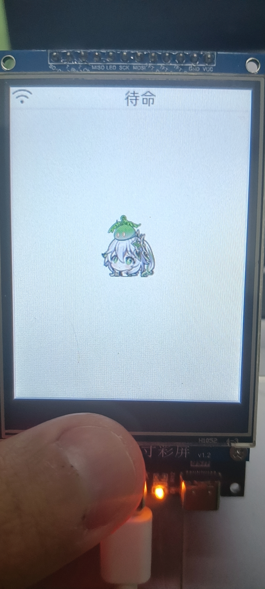
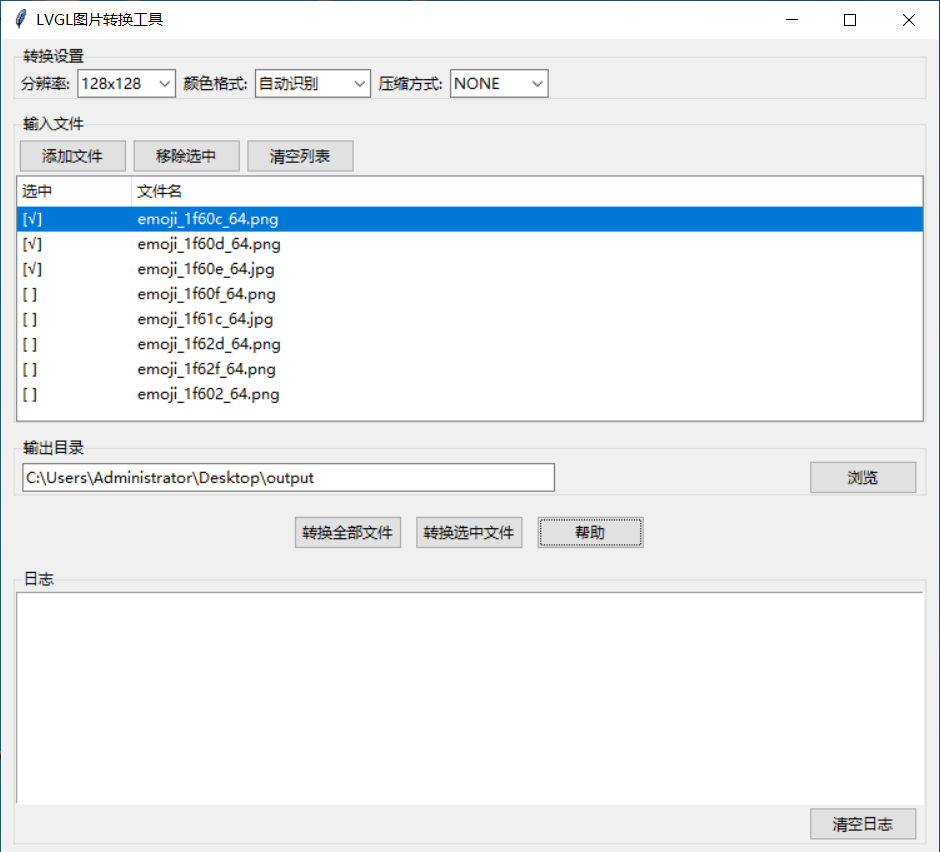
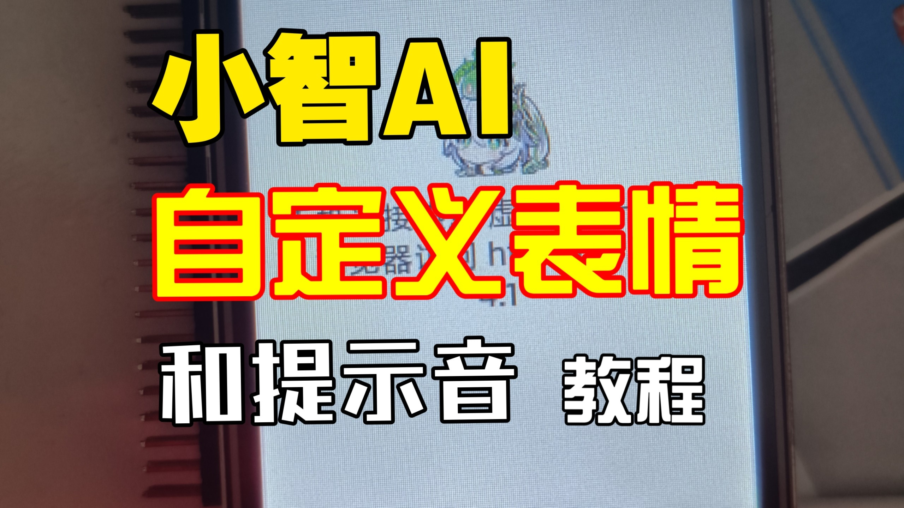

# LVGL图片转换工具  

这个目录包含两个用于处理和转换图片为LVGL格式的Python脚本：

## 1. LVGLImage (LVGLImage.py)

引用自LVGL[官方repo](https://github.com/lvgl/lvgl)的转换脚本[LVGLImage.py](https://github.com/lvgl/lvgl/blob/master/scripts/LVGLImage.py)  

## 2. LVGL图片转换工具 (lvgl_tools_gui.py)

调用`LVGLImage.py`，将图片批量转换为LVGL图片格式  
可用于修改小智的默认表情，具体修改教程[在这里](https://www.bilibili.com/video/BV12FQkYeEJ3/)

<table style="width: 100%; border-collapse: collapse;">
  <tr>
    <td style="width: 33%; text-align: center; padding: 10px;">
    <p style="margin: 0 0 10px 0; font-weight: bold; color: #333;">效果展示</p>
      
    </td>
    <td style="width: 33%; text-align: center; padding: 10px;">
    <p style="margin: 0 0 10px 0; font-weight: bold; color: #333;">操作界面预览</p>
      
    </td>
    <td style="width: 33%; text-align: center; padding: 10px;">
      <a href="https://www.bilibili.com/video/BV12FQkYeEJ3/" target="_blank">
        <p style="margin: 0 0 10px 0; font-weight: bold; color: #333;">视频教程</p>
        
      </a>
    </td>
  </tr>
</table>

### 特性

- 图形化操作，界面更友好
- 支持批量转换图片
- 自动识别图片格式并选择最佳的颜色格式转换
- 多分辨率支持

### 使用方法

安装Pillow

```bash
pip install Pillow # 处理图像需要
```

运行转换工具

```bash
python lvgl_tools_gui.py
```
