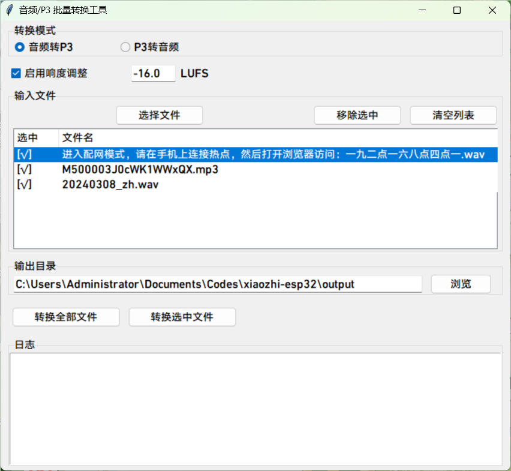

# P3音频格式转换与播放工具

这个目录包含两个用于处理P3格式音频文件的Python脚本：

## 1. 音频转换工具 (convert_audio_to_p3.py)

将普通音频文件转换为P3格式（4字节header + Opus数据包的流式结构）并进行响度标准化。

### 使用方法

```bash
python convert_audio_to_p3.py <输入音频文件> <输出P3文件> [-l LUFS] [-d]
```

其中，可选选项 `-l` 用于指定响度标准化的目标响度，默认为 -16 LUFS；可选选项 `-d` 可以禁用响度标准化。

如果输入的音频文件符合下面的任一条件，建议使用 `-d` 禁用响度标准化：
- 音频过短
- 音频已经调整过响度
- 音频来自默认 TTS （小智当前使用的 TTS 的默认响度已是 -16 LUFS）

例如：
```bash
python convert_audio_to_p3.py input.mp3 output.p3
```

## 2. P3音频播放工具 (play_p3.py)

播放P3格式的音频文件。

### 特性

- 解码并播放P3格式的音频文件
- 在播放结束或用户中断时应用淡出效果，避免破音
- 支持通过命令行参数指定要播放的文件

### 使用方法

```bash
python play_p3.py <P3文件路径>
```

例如：
```bash
python play_p3.py output.p3
```

## 3. 音频转回工具 (convert_p3_to_audio.py)

将P3格式转换回普通音频文件。

### 使用方法

```bash
python convert_p3_to_audio.py <输入P3文件> <输出音频文件>
```

输出音频文件需要有扩展名。

例如：
```bash
python convert_p3_to_audio.py input.p3 output.wav
```
## 4. 音频/P3批量转换工具

一个图形化的工具，支持批量转换音频到P3，P3到音频



### 使用方法：
```bash
python batch_convert_gui.py
```

## 依赖安装

在使用这些脚本前，请确保安装了所需的Python库：

```bash
pip install librosa opuslib numpy tqdm sounddevice pyloudnorm soundfile
```

或者使用提供的requirements.txt文件：

```bash
pip install -r requirements.txt
```

## P3格式说明

P3格式是一种简单的流式音频格式，结构如下：
- 每个音频帧由一个4字节的头部和一个Opus编码的数据包组成
- 头部格式：[1字节类型, 1字节保留, 2字节长度]
- 采样率固定为16000Hz，单声道
- 每帧时长为60ms 